import ThirdPartyDisclaimer from '@site/sources/_partials/_third-party-integration.mdx';

[Claude Code CLI](https://code.claude.com/docs/en/overview) is Anthropic's agentic coding tool that runs in your terminal. It reads and edits your codebase, runs commands, and completes multi-step development tasks.

The [Apify plugin for Claude Code](https://github.com/apify/apify-claude-code-plugin) connects Claude Code to Apify's library of [Actors](https://apify.com/store) and bundles:

- The [Apify MCP server](/platform/integrations/mcp) for searching the Store, running Actors, and retrieving datasets through the [Model Context Protocol (MCP)](https://modelcontextprotocol.io/docs/getting-started/intro).
- An `apify` routing agent that picks the right tool or skill from a natural-language request.
- Five built-in skills for common workflows (see [Bundled skills](#bundled-skills) below).

:::info CLI only

This guide covers installation in the Claude Code CLI. Support for the Claude Code app is still in development.

:::

## Prerequisites

- [An Apify account](https://console.apify.com/sign-up) - sign up for free if you don't have one.
- [Claude Code CLI](https://code.claude.com/docs/en/overview) - installed and authenticated locally.

## Install the plugin

1. In Claude Code, run `/plugins` to open the plugin manager.

    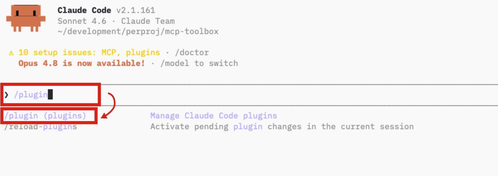

1. Open the **Marketplaces** tab and select **+ Add Marketplace**.

    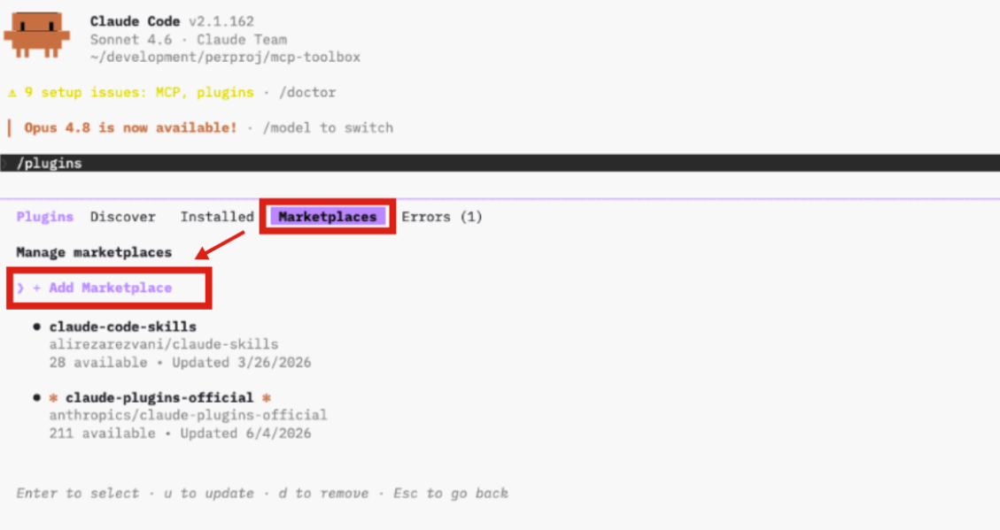

1. Paste the Apify plugin repository URL and press Enter:

    ```text
    https://github.com/apify/apify-claude-code-plugin
    ```

    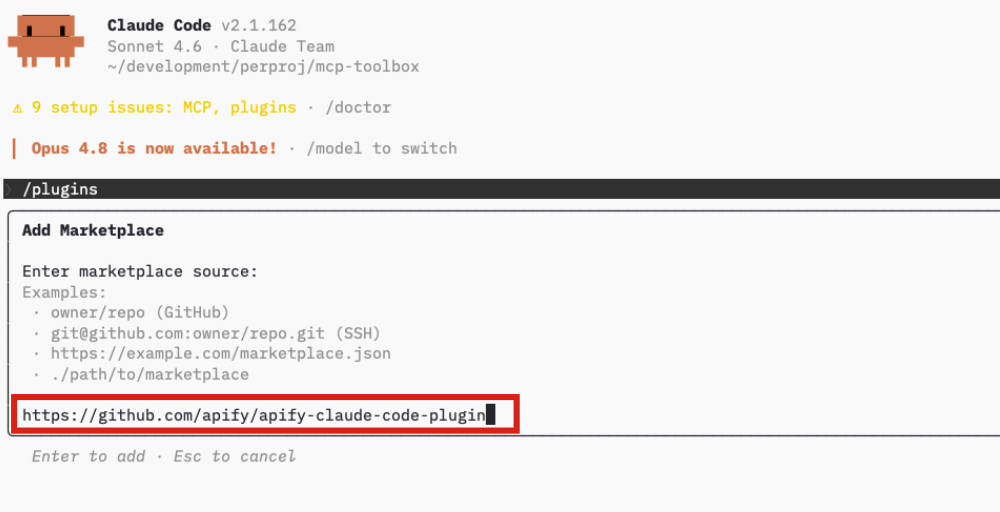

1. Open the **Discover** tab. The `apify` plugin appears under **Install Plugins**. Press Enter to view its details.

    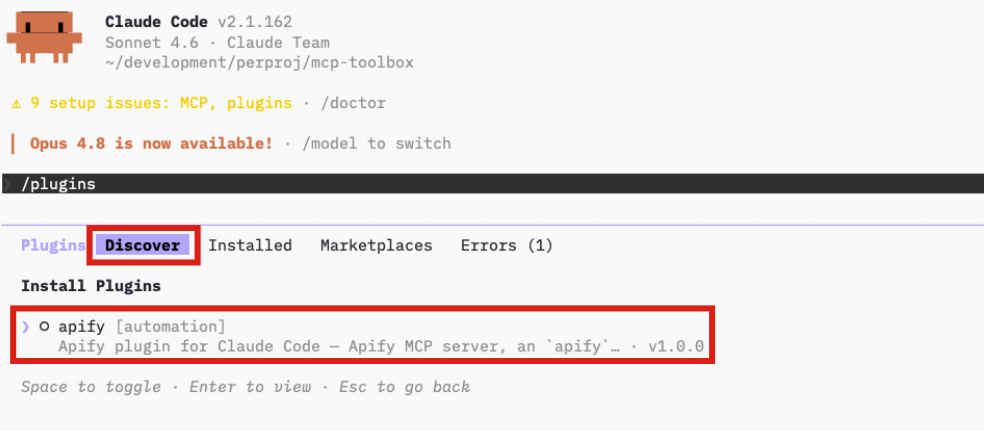

1. Review the plugin details, choose an install scope (**Install for you (user scope)** is the typical choice), and press Enter.

    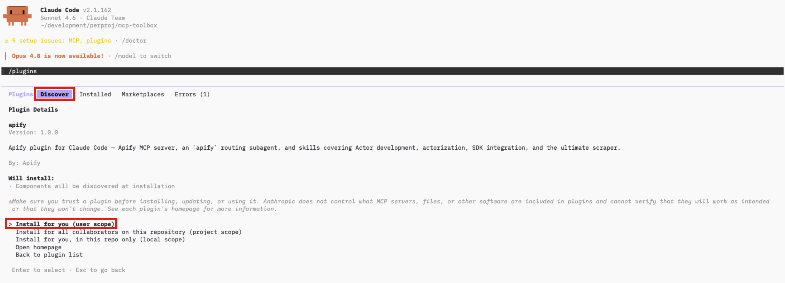

1. Run `/reload-plugins` to activate the plugin in the current session.

    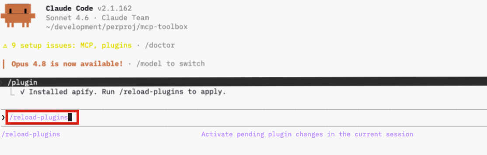

1. Open the **Installed** tab to confirm the `apify` plugin is listed as enabled.

    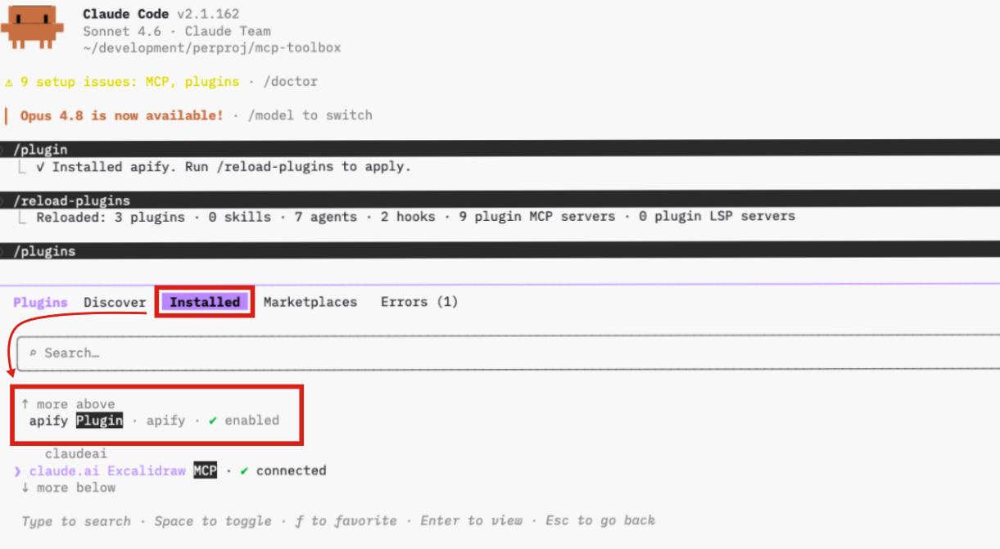

## Authenticate to Apify

The plugin bundles the Apify MCP server. Read-only tools like searching the Store and fetching Actor details work without signing in, but you need to authenticate to run Actors and access your account data.

1. Run `/mcp` to open the MCP server manager.

1. Find **plugin:apify:apify** in the list - it shows **disabled** - and press Enter to open it.

    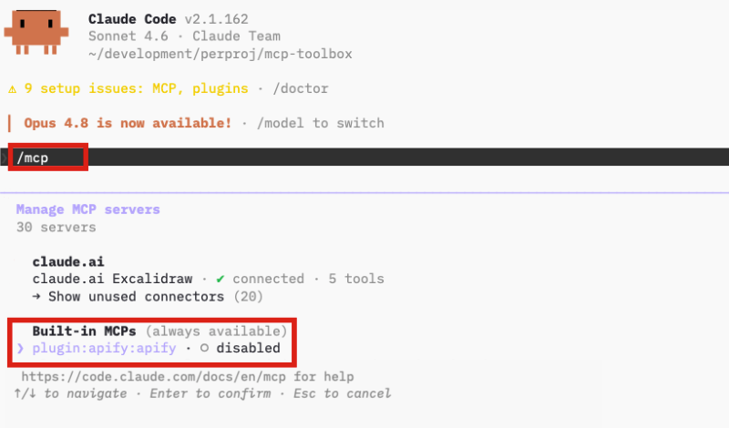

1. Select **Enable**. Claude Code enables the server and returns you to the `/mcp` list.

    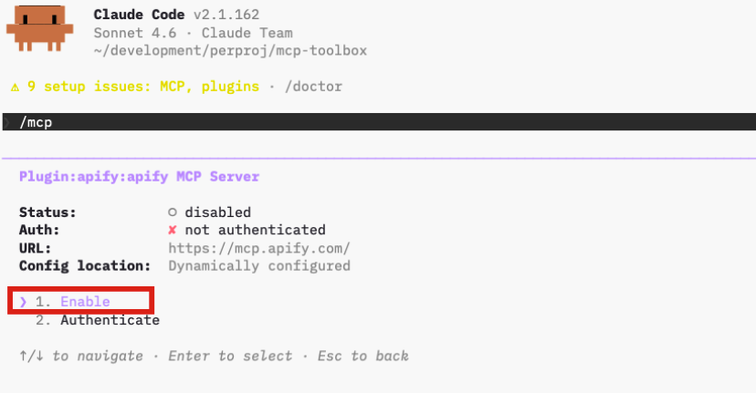

1. Find **plugin:apify:apify** again and press Enter to reopen it, then select **Authenticate**. Claude Code opens a browser tab for the Apify OAuth flow.

    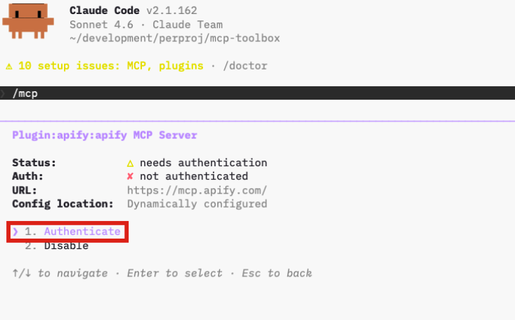

1. Review the permissions and click **Allow access**.

    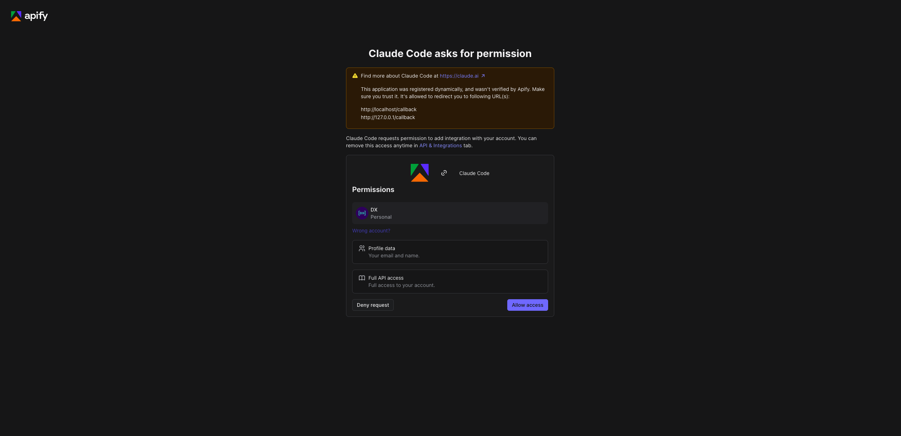

    :::caution Dynamic registration warning

    The OAuth page shows a warning that the application was registered dynamically and wasn't verified by Apify. This is expected for the current plugin release - the plugin uses dynamic OAuth client registration. Make sure you trust this installation before allowing access.

    :::

1. Back in the terminal, you'll see `Authentication successful. Connected to plugin:apify:apify`.

    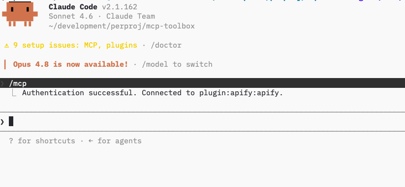

:::tip Session persistence

The connection stays authenticated for future sessions. You can revoke access at any time in [Apify Console > Settings > Integrations](https://console.apify.com/settings/integrations).

:::

## Run your first prompt

Describe what you want in natural language. The `apify` agent routes the request to the right tool or skill, so you don't need to name tools yourself.

> "Use Apify to find a good Actor for scraping Google Maps places. Show me the best option, its input requirements, pricing model, and what kind of dataset output it returns. Do not run the actor yet."

The agent searches Apify Store, fetches the top Actor's details through `plugin:apify:apify`, and summarizes its inputs, pricing, and output - all without running the Actor.

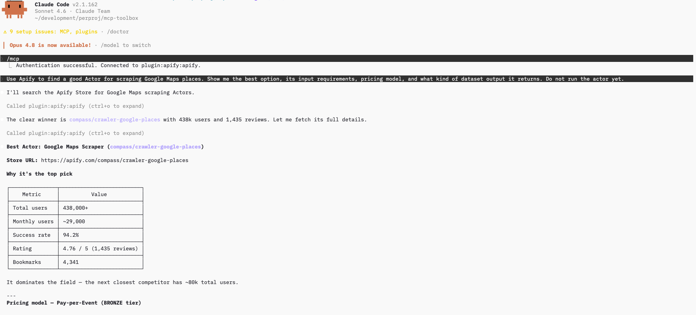

## Bundled skills

| Skill | Description |
| --- | --- |
| `apify-ultimate-scraper` | CLI-driven extraction using existing Actors for multi-step scraping and lead-generation workflows. |
| `apify-actor-development` | Full Actor lifecycle - template selection, development, local testing, and deployment with `apify push`. |
| `apify-actorization` | Converts existing JavaScript, TypeScript, Python, or CLI projects into Apify Actors. |
| `apify-generate-output-schema` | Generates dataset and key-value store schemas for existing Actors. |
| `apify-sdk-integration` | Integrates Actor execution into applications using the `apify-client` package. |

Example prompts that route to specific skills:

_Ultimate scraper:_

> "Find 10 highly rated coffee shops in Seattle with name, address, rating, phone, and website."

_Actor development:_

> "Create an Apify Actor that accepts a `startUrl` and `maxPages` input, crawls the site, and stores each page title and URL."

_SDK integration:_

> "Add Apify to this project. The Node.js API route should run an Actor and return dataset items as JSON."

## Troubleshooting

### The `apify` plugin is disabled

Run `/plugins`, open the **Installed** tab, select the `apify` plugin, and choose **Enable plugin**. If the action reads **Disable plugin** instead, the plugin is already enabled - the MCP server may need authentication; see [Authenticate to Apify](#authenticate-to-apify).

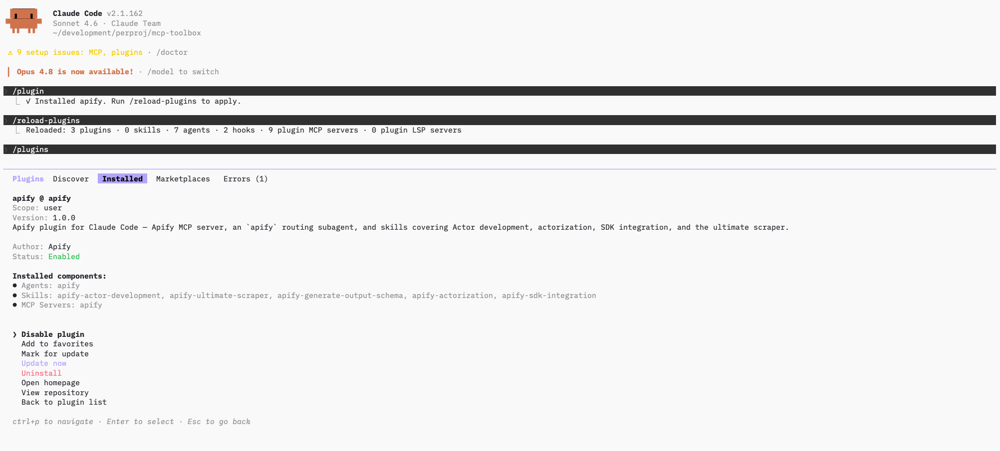

### The `/plugins` command isn't available

Plugins require a local installation of the Claude Code CLI. They aren't available in remote or web sessions (claude.ai/code). Install or update the Claude Code CLI locally.

### OAuth doesn't work, or you're running headless

If the browser doesn't open automatically, copy the OAuth URL shown in the terminal and paste it into your browser manually.

If you're running Claude Code in a headless environment (SSH, remote container) or the OAuth flow still fails, authenticate with an API token instead. Copy your token from [Apify Console > Settings > Integrations](https://console.apify.com/settings/integrations) and set it before starting Claude Code:

```bash
export APIFY_TOKEN=<YOUR_API_TOKEN>
```

## Limitations

- Long-running Actors may exceed the time a single tool call waits for completion. Reduce the scope or split the work across multiple prompts.
- Each Actor run consumes compute units on the Apify platform in addition to any Claude usage.
- Skills that edit files in your project (Actor development, actorization, SDK integration) make local changes - review them before deploying or committing.

## Related integrations

- [MCP server integration](/platform/integrations/mcp) - Use the Apify MCP server with other clients
- [ChatGPT integration](/platform/integrations/chatgpt) - Connect the Apify MCP server to ChatGPT

## Resources

- [Apify plugin for Claude Code](https://github.com/apify/apify-claude-code-plugin) - Source repository and full README with advanced setup notes (Apify CLI install, all auth paths, available MCP tools)
- [Claude Code documentation](https://code.claude.com/docs/en/overview) - Official Claude Code docs
- [Apify Store](https://apify.com/store) - Browse Actors you can run from Claude Code
