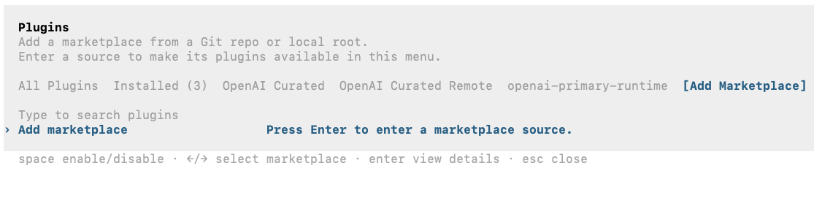
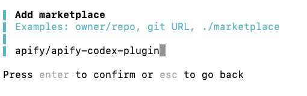
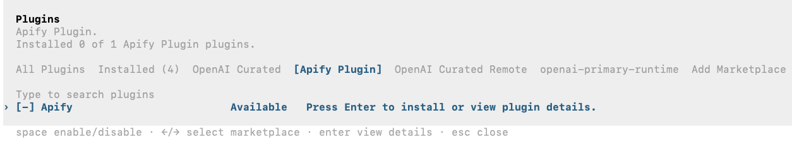
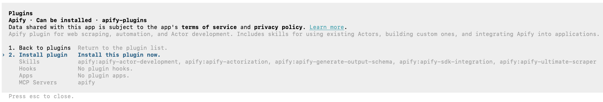
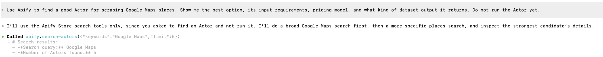
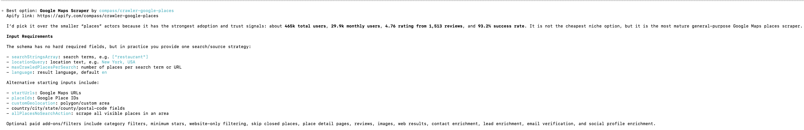

import ThirdPartyDisclaimer from '@site/sources/_partials/_third-party-integration.mdx';

[Codex](https://developers.openai.com/codex/) is OpenAI's agentic coding tool. The Codex CLI runs in your terminal, reads and edits your codebase, runs commands, and completes multi-step development tasks.

The [Apify plugin for Codex](https://github.com/apify/apify-codex-plugin) connects Codex to Apify's library of [Actors](https://apify.com/store) and bundles:

- The [Apify MCP server](/integrations/mcp) for searching the Store, running Actors, and retrieving datasets through the [Model Context Protocol (MCP)](https://modelcontextprotocol.io/docs/getting-started/intro).
- Five built-in skills for common workflows (see [Bundled skills](#bundled-skills) below).

This guide covers installation in the Codex CLI.

<ThirdPartyDisclaimer />

## Prerequisites

- [An Apify account](https://console.apify.com/sign-up) - sign up for free if you don't have one.
- [Codex CLI](https://developers.openai.com/codex/) - installed and authenticated locally.

## Install the plugin

1. In the Codex CLI, run the `/plugins` command.

    

1. Use the arrow keys to move right to the **Add Marketplace** tab, then press Enter.

    

1. Type the Apify plugin repository and press Enter to confirm:

    ```text
    apify/apify-codex-plugin
    ```

    

1. Open the **Apify Plugin** tab, select **Apify**, and press Enter to view the plugin details.

    

1. Select **Install plugin** and press Enter to install.

    

## Authenticate to Apify

The plugin bundles the Apify MCP server. Read-only tools like searching the Store and fetching Actor details work without signing in, but you need to authenticate to run Actors and access your account data.

1. The first time Codex calls a tool that requires authentication, such as running an Actor, it opens a browser tab for the Apify OAuth flow.

1. Review the permissions and click **Allow access**.

1. Back in the terminal, the `apify` MCP server is connected and ready to use in any new chat.

:::tip Session persistence

The connection stays authenticated for future sessions. You can revoke access at any time in [Apify Console > Settings > Integrations](https://console.apify.com/settings/integrations).

:::

## Run your first prompt

In any new Codex CLI chat, describe what you want in natural language. Because this bundle exposes the MCP tools and skills directly, be explicit about the workflow you want.

> Use Apify to find a good Actor for scraping Google Maps places. Show me the best option, its input requirements, pricing model, and what kind of dataset output it returns. Do not run the Actor yet.

Codex searches Apify Store and fetches the top Actor's details through the `apify` MCP server.



It then summarizes the Actor's inputs, pricing, and output - all without running the Actor.



## Bundled skills

| Skill | Description |
| --- | --- |
| `apify-ultimate-scraper` | CLI-driven extraction using existing Actors for multi-step scraping and lead-generation workflows. |
| `apify-actor-development` | Full Actor lifecycle - template selection, development, local testing, and deployment with `apify push`. |
| `apify-actorization` | Converts existing JavaScript, TypeScript, Python, or CLI projects into Apify Actors. |
| `apify-generate-output-schema` | Generates dataset and key-value store schemas for existing Actors. |
| `apify-sdk-integration` | Integrates Actor execution into applications using the `apify-client` package. |

Example prompts that route to specific skills:

_Ultimate scraper:_

> Find 10 highly rated coffee shops in Seattle with name, address, rating, phone, and website.

_Actor development:_

> Create an Apify Actor that accepts a `startUrl` and `maxPages` input, crawls the site, and stores each page title and URL.

_SDK integration:_

> Add Apify to this project. The Node.js API route should run an Actor and return dataset items as JSON.

## Troubleshooting

### The `/plugins` command isn't available

Plugins require a local installation of the Codex CLI with plugin support enabled. Install or update the Codex CLI locally, then run `/plugins` again.

### The Apify plugin isn't listed

Reopen `/plugins`, move to the **Apify Plugin** tab, and confirm the marketplace was added. If the **Apify** plugin still doesn't appear, re-add the marketplace using the repository `apify/apify-codex-plugin`.

### Browser doesn't open, or OAuth fails

If the browser doesn't open automatically, copy the OAuth URL shown in the terminal and paste it into your browser manually.

If you're running the Codex CLI in a headless environment (SSH, remote container) or the OAuth flow still fails, authenticate with an API token instead. Copy your token from [Apify Console > Settings > Integrations](https://console.apify.com/settings/integrations) and set it before starting Codex:

```bash
export APIFY_TOKEN=<YOUR_API_TOKEN>
```

## Limitations

- Long-running Actors may exceed the time a single tool call waits for completion. Reduce the scope or split the work across multiple prompts.
- Each Actor run consumes Apify platform usage from your plan in addition to any Codex usage. See [Billing](/account/billing) for details.
- Skills that edit files in your project (Actor development, actorization, SDK integration) make local changes - review them before deploying or committing.

## Related integrations

- [MCP server integration](/integrations/mcp) - Use the Apify MCP server with other clients
- [ChatGPT integration](/integrations/chatgpt) - Connect the Apify MCP server to ChatGPT

## Resources

- [Apify plugin for Codex](https://github.com/apify/apify-codex-plugin) - Source repository and full README with advanced setup notes (Apify CLI install, all auth paths, available MCP tools)
- [Codex documentation](https://developers.openai.com/codex/) - Official Codex docs
- [Apify Store](https://apify.com/store) - Browse Actors you can run from Codex
