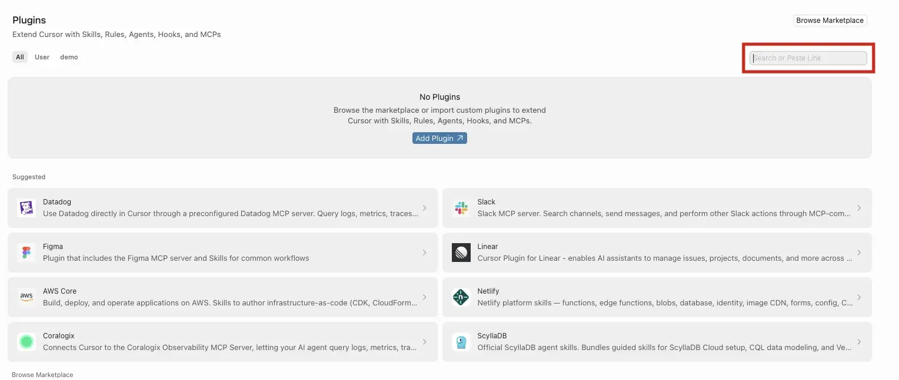
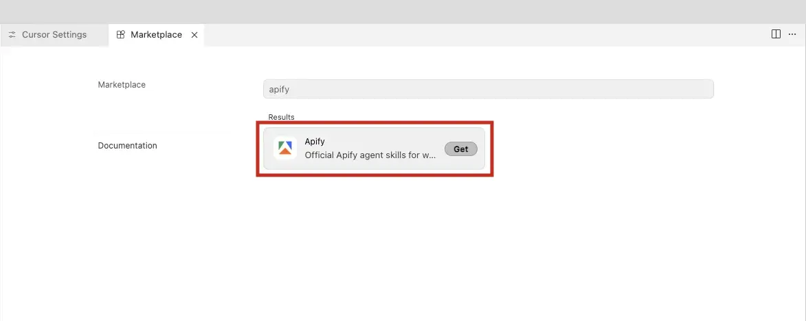
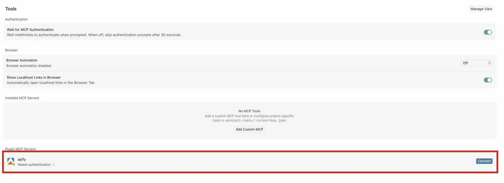
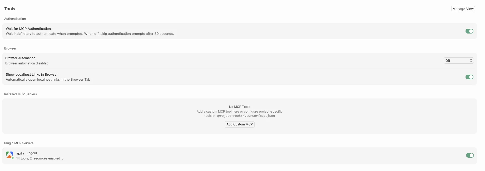
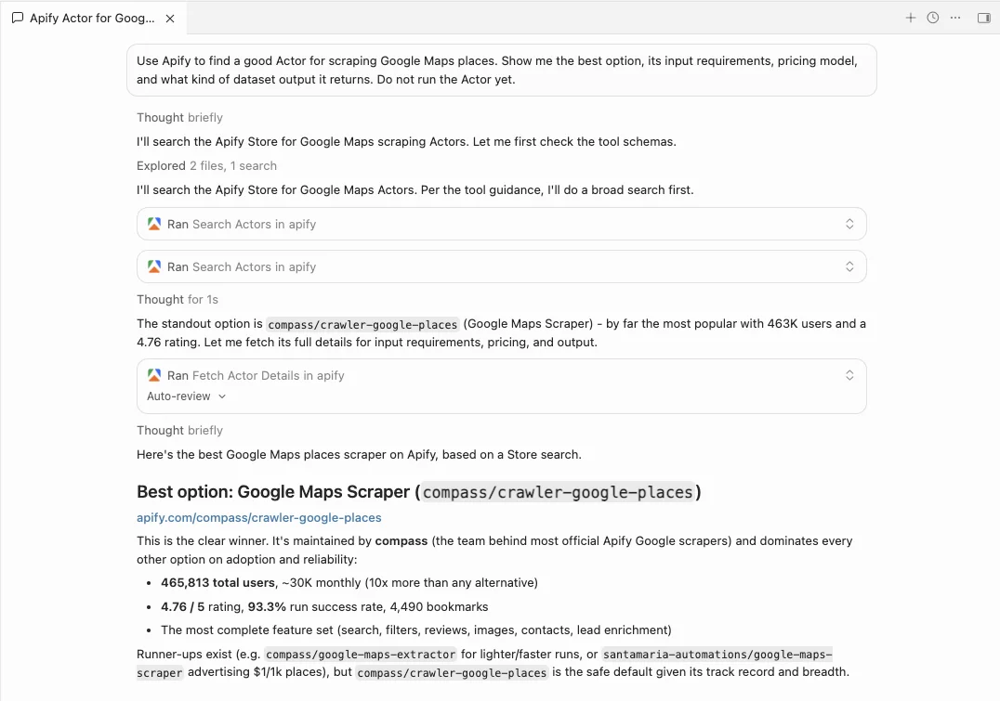

import ThirdPartyDisclaimer from '@site/sources/_partials/_third-party-integration.mdx';

[Cursor](https://cursor.com) is an AI-powered code editor that understands your codebase, edits files, runs commands, and completes multi-step development tasks from natural-language prompts.

The [Apify plugin for Cursor](https://github.com/apify/apify-cursor-plugin) connects Cursor to Apify's library of [Actors](https://apify.com/store) and bundles:

- The [Apify MCP server](/platform/integrations/mcp) for searching the Store, running Actors, and retrieving datasets through the [Model Context Protocol (MCP)](https://modelcontextprotocol.io/docs/getting-started/intro).
- An `apify` routing agent that picks the right tool or skill from a natural-language request.
- Five built-in skills for common workflows (see [Bundled skills](#bundled-skills) below).

This guide covers installation from the Cursor plugin marketplace.

<ThirdPartyDisclaimer />

## Prerequisites

- [An Apify account](https://console.apify.com/sign-up) - sign up for free if you don't have one.
- [Cursor](https://cursor.com) - installed and signed in locally.

## Install the plugin

1. Open **Cursor** > **Preferences** > **Cursor Settings**.

2. Select **Plugins**.

    

3. Search for **Apify**.

4. Select the **Apify Cursor plugin** from the results.

    

5. Click **Get**.

6. Choose an install scope. Select **This project** to enable the plugin only in the current project, or **All projects** to enable it for every project under your account.

## Authenticate to Apify

The plugin bundles the Apify MCP server. Read-only tools like searching the Store and fetching Actor details work without signing in, but you need to authenticate to run Actors and access your account data.

1. Open **Cursor** > **Preferences** > **Cursor Settings** and select **Tools & MCPs**.

1. Scroll to the bottom of the page. The **Apify MCP** server appears in the list.

    

1. Click **Connect**. Cursor opens a browser tab for the Apify OAuth flow.

1. Review the permissions and click **Allow access**.

    :::caution Dynamic registration warning

    The OAuth page shows a warning that the application was registered dynamically and wasn't verified by Apify. This is expected for the current plugin release - the plugin uses dynamic OAuth client registration. Make sure you trust this installation before allowing access.

    :::

1. Back in Cursor, the **Apify MCP** server shows as connected.

    

:::tip Session persistence

The connection stays authenticated for future sessions. You can revoke access at any time in [Apify Console > Settings > Integrations](https://console.apify.com/settings/integrations).

:::

## Run your first prompt

Describe what you want in natural language. The `apify` agent routes the request to the right tool or skill, so you don't need to name tools yourself.

> "Use Apify to find a good Actor for scraping Google Maps places. Show me the best option, its input requirements, pricing model, and what kind of dataset output it returns. Do not run the Actor yet."

The agent searches Apify Store, fetches the top Actor's details through the Apify MCP server, and summarizes its inputs, pricing, and output - all without running the Actor.



## Bundled skills

| Skill | Description |
| --- | --- |
| `apify-ultimate-scraper` | CLI-driven extraction using existing Actors for multi-step scraping and lead-generation workflows. |
| `apify-actor-development` | Full Actor lifecycle - template selection, development, local testing, and deployment with `apify push`. |
| `apify-actorization` | Converts existing JavaScript, TypeScript, Python, or CLI projects into Apify Actors. |
| `apify-generate-output-schema` | Generates dataset and key-value store schemas for existing Actors. |
| `apify-sdk-integration` | Integrates Actor execution into applications using the `apify-client` package. |

Example prompts that route to specific skills:

_Ultimate scraper:_

> "Find 10 highly rated coffee shops in Seattle with name, address, rating, phone, and website."

_Actor development:_

> "Create an Apify Actor that accepts a `startUrl` and `maxPages` input, crawls the site, and stores each page title and URL."

_SDK integration:_

> "Add Apify to this project. The Node.js API route should run an Actor and return dataset items as JSON."

## Troubleshooting

### The Apify MCP server stays disconnected

Open **Cursor** > **Preferences** > **Cursor Settings**, select **Tools & MCPs**, and toggle the **Apify MCP** server off and on. If it still doesn't connect, re-trigger the OAuth flow with **Connect**; see [Authenticate to Apify](#authenticate-to-apify).

### The wrong skill keeps getting picked

Start your request with `@apify` so the routing agent handles it. The agent owns the guardrails that pick the right skill and avoid common traps, such as confusing the `apify` and `apify-client` packages.

### Browser doesn't open, or OAuth fails

If the browser doesn't open automatically, copy the OAuth URL shown by Cursor and paste it into your browser manually.

If you're running Cursor in a remote session, devcontainer, or over SSH where no browser is available, authenticate with an API token instead. Copy your token from [Apify Console > Settings > Integrations](https://console.apify.com/settings/integrations) and set it in your environment before starting Cursor:

```bash
export APIFY_TOKEN=<YOUR_API_TOKEN>
```

## Limitations

- Long-running Actors may exceed the time a single tool call waits for completion. Reduce the scope or split the work across multiple prompts.
- Each Actor run consumes Apify platform usage from your plan in addition to any Cursor usage. See [Billing](/platform/console/billing) for details.
- Skills that edit files in your project (Actor development, actorization, SDK integration) make local changes - review them before deploying or committing.

## Related integrations

- [MCP server integration](/platform/integrations/mcp) - Use the Apify MCP server with other clients
- [ChatGPT integration](/platform/integrations/chatgpt) - Connect the Apify MCP server to ChatGPT

## Resources

- [Apify plugin for Cursor](https://github.com/apify/apify-cursor-plugin) - Source repository and full README with advanced setup notes (Apify CLI install, all auth paths, available MCP tools)
- [Cursor documentation](https://docs.cursor.com) - Official Cursor docs
- [Apify Store](https://apify.com/store) - Browse Actors you can run from Cursor
