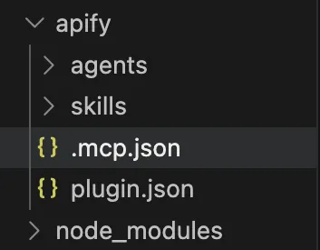
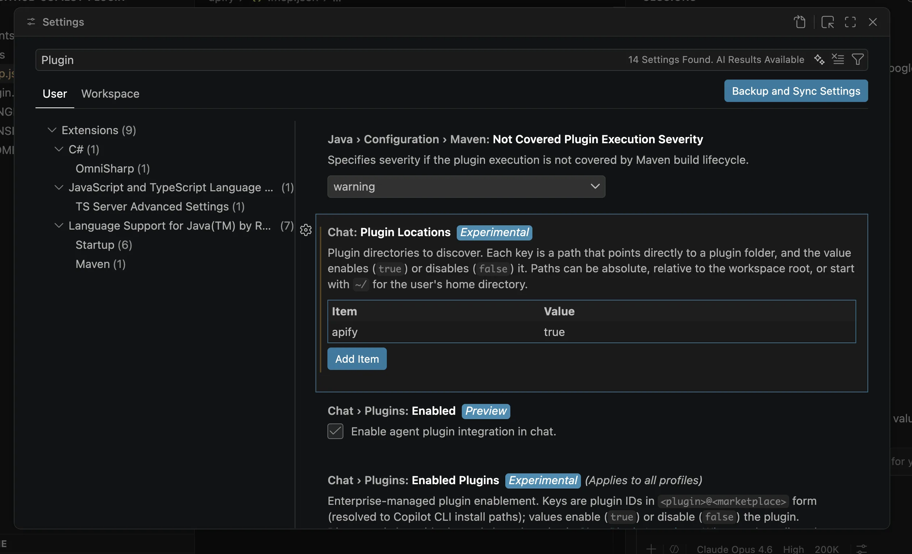
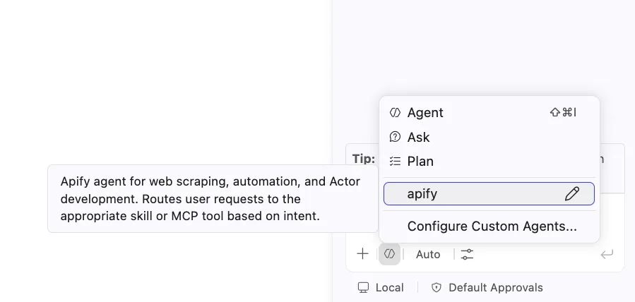
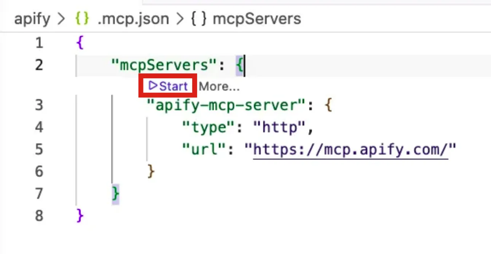
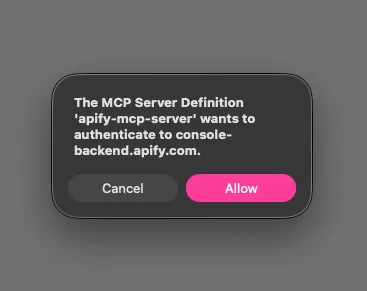
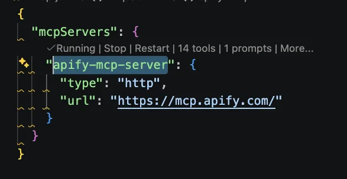

import ThirdPartyDisclaimer from '@site/sources/_partials/_third-party-integration.mdx';

[GitHub Copilot](https://github.com/features/copilot) is GitHub's AI coding assistant. In VS Code, its agent mode reads and edits your workspace, runs commands, and completes multi-step development tasks.

The [Apify plugin for GitHub Copilot](https://github.com/apify/apify-copilot-plugin) connects Copilot to Apify's library of [Actors](https://apify.com/store) and bundles:

- The [Apify MCP server](/platform/integrations/mcp) for searching the Store, running Actors, and retrieving datasets through the [Model Context Protocol (MCP)](https://modelcontextprotocol.io/docs/getting-started/intro).
- An `apify` routing agent that picks the right tool or skill from a natural-language request.
- Five built-in skills for common workflows (see [Bundled skills](#bundled-skills) below).

This guide covers setup in VS Code.

<ThirdPartyDisclaimer />

## Prerequisites

- [An Apify account](https://console.apify.com/sign-up) - sign up for free if you don't have one.
- [VS Code](https://code.visualstudio.com/) version 1.120 or newer, with the [GitHub Copilot Chat](https://marketplace.visualstudio.com/items?itemName=GitHub.copilot-chat) extension installed and signed in with Copilot access.
- [Git](https://git-scm.com/) - to clone the plugin repository.

## Install the plugin

The plugin is distributed as a repository you clone into your workspace. Copilot discovers it from the workspace folder.

1. Clone the plugin repository:

    ```bash
    git clone https://github.com/apify/apify-copilot-plugin apify-copilot
    ```

1. Open the cloned `apify-copilot` folder in VS Code. The Explorer shows an `apify` folder containing `agents`, `skills`, `.mcp.json`, and `plugin.json`.

    

1. Open **Settings** and search for `plugin`. Under **Chat: Plugin Locations**, select **Add Item**, set the item to `apify` (the plugin folder), and set its value to `true`. Make sure **Chat: Plugins** is also enabled.

    

1. Reload VS Code. Run **Developer: Reload Window** from the Command Palette, or restart the editor.

1. Open Copilot Chat, open the mode picker, and select the **apify** agent.

    

## Connect the Apify MCP server

The plugin registers the Apify MCP server (`https://mcp.apify.com/`) through `.mcp.json`. Read-only tools like searching the Store and fetching Actor details work without signing in, but you need to authenticate to run Actors and access your account data.

1. Open `apify/.mcp.json`. A **Start** action appears above the `apify-mcp-server` entry. Select it to start the server.

    

1. VS Code prompts that the MCP server wants to authenticate to `console-backend.apify.com`. Select **Allow**, then **Open** to launch the browser.

    

1. Complete the Apify OAuth flow in the browser: select an existing connection or create a new one, then review the permissions and confirm access.

1. Back in VS Code, the `apify-mcp-server` entry shows **Running**.

    

:::tip Session persistence

The connection stays authenticated for future sessions. You can revoke access at any time in [Apify Console > Settings > Integrations](https://console.apify.com/settings/integrations).

:::

## Run your first prompt

Select the **apify** agent and describe what you want in natural language. The agent routes the request to the right tool or skill, so you don't need to name tools yourself.

> "Use Apify to find a good Actor for scraping Google Maps places. Show me the best option, its input requirements, pricing model, and what kind of dataset output it returns. Do not run the Actor yet."

The agent searches Apify Store, fetches the top Actor's details through the Apify MCP server, and summarizes its inputs, pricing, and output - all without running the Actor.

## Bundled skills

| Skill | Description |
| --- | --- |
| `apify-ultimate-scraper` | CLI-driven extraction using existing Actors for multi-step scraping and lead-generation workflows. |
| `apify-actor-development` | Full Actor lifecycle - template selection, development, local testing, and deployment with `apify push`. |
| `apify-actorization` | Converts existing JavaScript, TypeScript, Python, or CLI projects into Apify Actors. |
| `apify-generate-output-schema` | Generates dataset and key-value store schemas for existing Actors. |
| `apify-sdk-integration` | Integrates Actor execution into applications using the `apify-client` package. |

Example prompts that route to specific skills:

_Ultimate scraper:_

> "Find 10 highly rated coffee shops in Seattle with name, address, rating, phone, and website."

_Actor development:_

> "Create an Apify Actor that accepts a `startUrl` and `maxPages` input, crawls the site, and stores each page title and URL."

_SDK integration:_

> "Add Apify to this project. The Node.js API route should run an Actor and return dataset items as JSON."

## Authentication paths

The `apify` agent uses the transport that fits the task, and each one authenticates differently:

- **MCP (search, run, retrieve data)**: OAuth through the browser, as described in [Connect the Apify MCP server](#connect-the-apify-mcp-server). No token setup needed.
- **Apify CLI (building Actors, actorization, CLI fallback)**: run `apify login` once, or set `APIFY_TOKEN` in headless environments. Get your token from [Apify Console > Settings > Integrations](https://console.apify.com/settings/integrations).
- **SDK integration (`apify-client`)**: reads the `APIFY_TOKEN` environment variable from your application's environment.

## Troubleshooting

### The `apify` agent doesn't appear in the picker

Confirm that **Chat: Plugin Locations** has an `apify` entry set to `true`, that **Chat: Plugins** is enabled, and that you reloaded the window after changing the settings. Plugin support requires VS Code 1.120 or newer.

### The Apify MCP server isn't listed or won't start

Open `apify/.mcp.json` and select the **Start** action above the `apify-mcp-server` entry. If the action is missing, update VS Code to 1.120 or newer and confirm the plugin is enabled.

### Browser doesn't open, or OAuth fails

If the browser doesn't open automatically, copy the OAuth URL from the VS Code dialog and paste it into your browser manually.

If you're running VS Code over SSH, in a devcontainer, or in any environment without a browser, the MCP OAuth flow can't complete. Authenticate locally first so the connection is stored, or use the CLI and SDK paths instead - run `apify login`, or set `APIFY_TOKEN`:

```bash
export APIFY_TOKEN=<YOUR_API_TOKEN>
```

### The wrong skill or transport keeps getting picked

Start from the **apify** agent. It is the single entry point that detects the available transport and routes each request to the correct tool or skill.

## Limitations

- Copilot plugin support is a preview feature in VS Code, so its settings and behavior may change between releases.
- The plugin is installed by cloning its repository into your workspace; it isn't published to a plugin marketplace yet.
- Long-running Actors may exceed the time a single tool call waits for completion. Reduce the scope or split the work across multiple prompts.
- Each Actor run consumes Apify platform usage from your plan in addition to any Copilot usage. See [Billing](/platform/console/billing) for details.
- Skills that edit files in your project (Actor development, actorization, SDK integration) make local changes - review them before deploying or committing.

## Related integrations

- [Claude Code CLI integration](/platform/integrations/claude-code-cli) - Install the Apify plugin in the Claude Code CLI
- [MCP server integration](/platform/integrations/mcp) - Use the Apify MCP server with other clients

## Resources

- [Apify plugin for GitHub Copilot](https://github.com/apify/apify-copilot-plugin) - Source repository and full README with advanced setup notes
- [GitHub Copilot documentation](https://docs.github.com/en/copilot) - Official GitHub Copilot docs
- [Apify MCP server documentation](/platform/integrations/mcp) - Connect the Apify MCP server to other clients
- [Apify Store](https://apify.com/store) - Browse Actors you can run from Copilot
