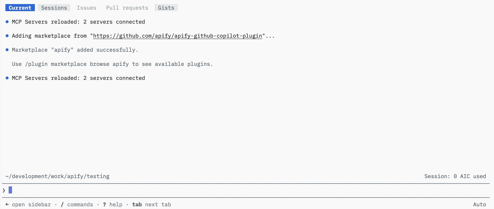
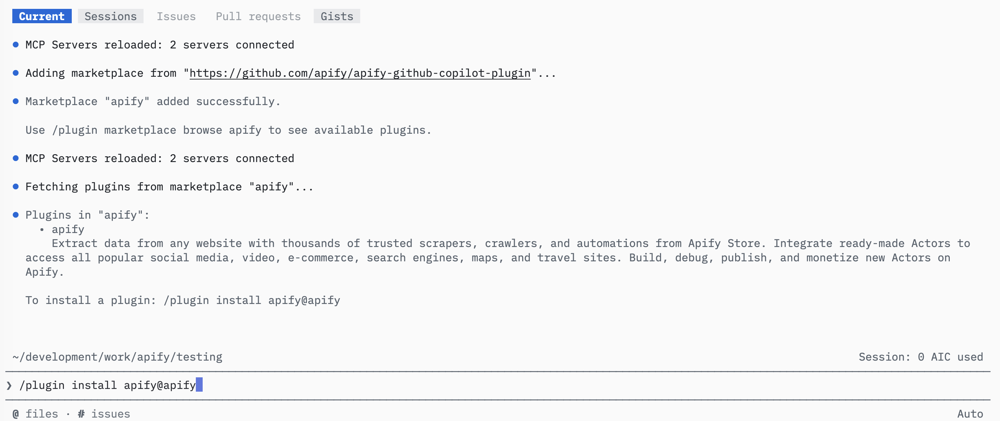
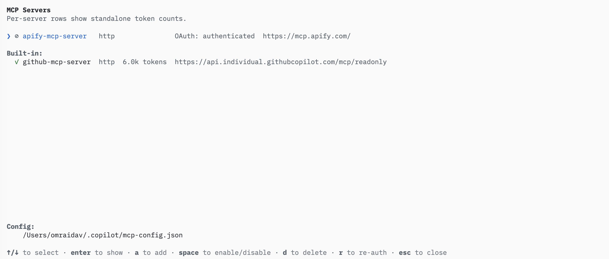
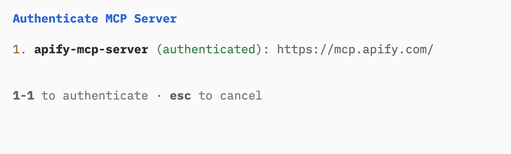
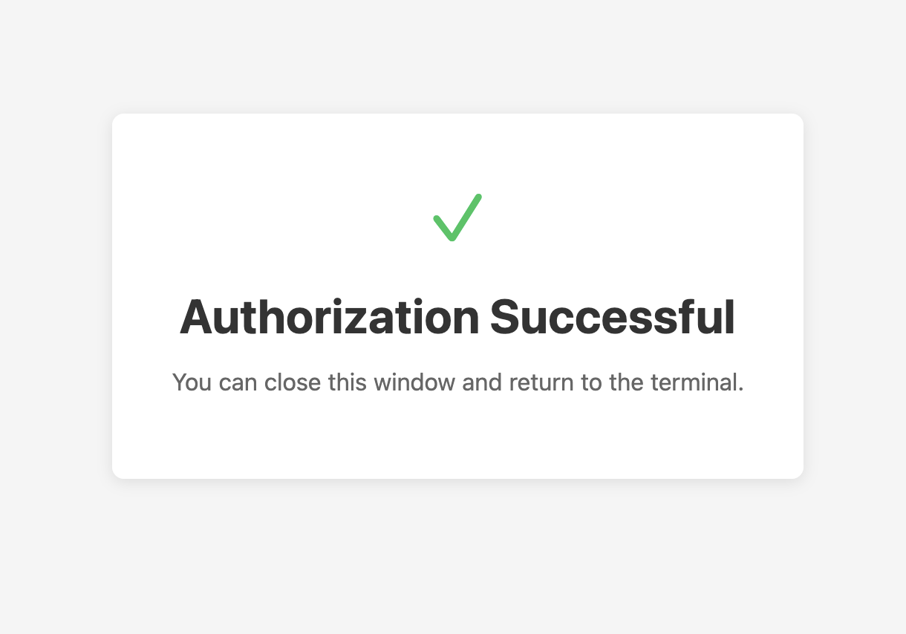
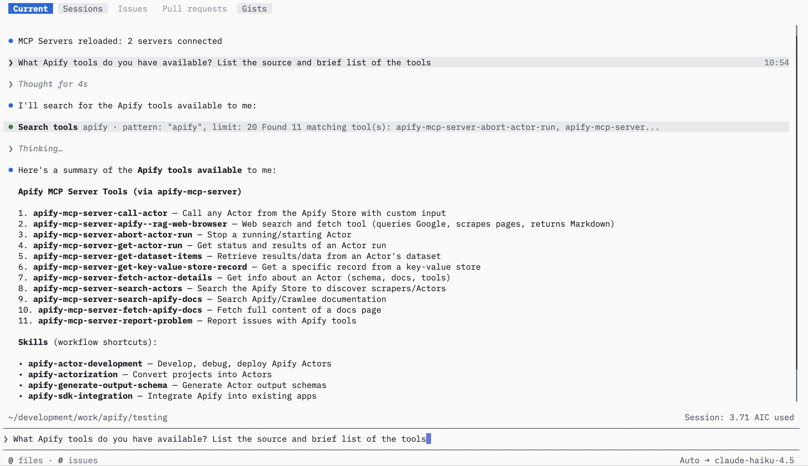

import ThirdPartyDisclaimer from '@site/sources/_partials/_third-party-integration.mdx';

The [GitHub Copilot CLI](https://docs.github.com/en/copilot/concepts/agents/copilot-cli) is GitHub's agentic coding tool that runs in your terminal. It reads and edits your codebase, runs commands, and completes multi-step development tasks.

The [Apify plugin for GitHub Copilot](https://github.com/apify/apify-github-copilot-plugin) connects Copilot to Apify's library of [Actors](https://apify.com/store) and bundles:

- The [Apify MCP server](/integrations/mcp) for searching Apify Store, running Actors, and retrieving datasets through the [Model Context Protocol (MCP)](https://modelcontextprotocol.io/docs/getting-started/intro).
- An `apify` routing agent that picks the right tool or skill from a natural-language request.
- Five built-in skills for common workflows (see [Bundled skills](#bundled-skills) below).

This guide covers installation in the GitHub Copilot CLI.

<ThirdPartyDisclaimer />

## Prerequisites

- [An Apify account](https://console.apify.com/sign-up) - sign up for free if you don't have one.
- [The GitHub Copilot CLI](https://docs.github.com/en/copilot/how-tos/set-up/install-copilot-cli) - installed and signed in with Copilot access.

## Install the plugin

The plugin is distributed through an Apify plugin marketplace that you add to Copilot by its repository URL.

1. In a Copilot session, add the Apify marketplace:

    ```text
    /plugin marketplace add https://github.com/apify/apify-github-copilot-plugin
    ```

    

1. Install the `apify` plugin from the marketplace:

    ```text
    /plugin install apify@apify
    ```

    

## Authenticate to Apify

The plugin bundles the Apify MCP server (`https://mcp.apify.com/`) over the HTTP transport. Read-only tools like searching Apify Store and fetching Actor details work without signing in, but you need to authenticate to run Actors and access your account data.

1. Run `/mcp` to open the MCP server manager. The `apify-mcp-server` entry appears in the list with the `http` transport.

    

1. Select `apify-mcp-server` and choose to authenticate. Copilot opens a browser tab for the Apify OAuth flow.

    

1. Complete the Apify OAuth flow in your browser and choose the account to connect.

    

1. Back in the terminal, Copilot confirms `Successfully authenticated with apify-mcp-server`.

    

:::tip Session persistence

The connection stays authenticated for future sessions. You can revoke access at any time in [Apify Console > Settings > Integrations](https://console.apify.com/settings/integrations).

:::

## Run your first prompt

Describe what you want in natural language. The `apify` agent routes the request to the right tool or skill, so you don't need to name tools yourself.

> Use Apify to find a good Actor for scraping Google Maps places. Show me the best option, its input requirements, pricing model, and what kind of dataset output it returns. Do not run the Actor yet.

The agent searches Apify Store, fetches the top Actor's details through the Apify MCP server, and summarizes its inputs, pricing, and output - all without running the Actor.

To check what's available, ask the agent to list its Apify tools.



## Bundled skills

| Skill | Description |
| --- | --- |
| `apify-ultimate-scraper` | CLI-driven extraction using existing Actors for multi-step scraping and lead-generation workflows. |
| `apify-actor-development` | Full Actor lifecycle - template selection, development, local testing, and deployment with `apify push`. |
| `apify-actorization` | Converts existing JavaScript, TypeScript, Python, or CLI projects into Apify Actors. |
| `apify-generate-output-schema` | Generates dataset and key-value store schemas for existing Actors. |
| `apify-sdk-integration` | Integrates Actor execution into applications using the `apify-client` package. |

Example prompts that route to specific skills:

_Ultimate scraper:_

> Find 10 highly rated coffee shops in Seattle with name, address, rating, phone, and website.

_Actor development:_

> Create an Apify Actor that accepts a `startUrl` and `maxPages` input, crawls the site, and stores each page title and URL.

_SDK integration:_

> Add Apify to this project. The Node.js API route should run an Actor and return dataset items as JSON.

## Authentication paths

The `apify` agent uses the transport that fits the task, and each one authenticates differently:

- For MCP tools (search, run, retrieve data), authenticate with OAuth through the browser, as described in [Authenticate to Apify](#authenticate-to-apify). No token setup is needed.
- For the Apify CLI (building Actors, actorization, CLI fallback), run `apify login` once, or set `APIFY_TOKEN` in headless environments. Get your token from [Apify Console > Settings > Integrations](https://console.apify.com/settings/integrations).
- For SDK integration with `apify-client`, set the `APIFY_TOKEN` environment variable in your application's environment.

## Troubleshooting

### The `apify` plugin isn't installed

Run `/plugin marketplace add https://github.com/apify/apify-github-copilot-plugin` to add the marketplace, then `/plugin install apify@apify` to install the plugin. Confirm the marketplace was added with `/plugin marketplace browse apify`.

### The Apify MCP server won't authenticate

Run `/mcp`, select `apify-mcp-server`, and choose to authenticate. Confirm the entry shows the `http` transport pointing to `https://mcp.apify.com/`. Read-only tools work without signing in, so run a search prompt first to confirm the server is connected.

### Browser doesn't open, or OAuth fails

If the browser doesn't open automatically, copy the OAuth URL shown in the terminal and paste it into your browser manually.

If you're running the CLI in a headless environment (SSH, remote container) or the OAuth flow still fails, authenticate with an API token instead. Copy your token from [Apify Console > Settings > Integrations](https://console.apify.com/settings/integrations) and set it before starting the CLI:

```bash
export APIFY_TOKEN=<YOUR_API_TOKEN>
```

### The agent picks the wrong skill or transport

Start from the `apify` agent. It is the single entry point that detects the available transport and routes each request to the correct tool or skill.

## Limitations

- Long-running Actors may exceed the time a single tool call waits for completion. Reduce the scope or split the work across multiple prompts.
- Each Actor run consumes Apify platform usage from your plan in addition to any Copilot usage. See [Billing](/account/billing) for details.
- Skills that edit files in your project (Actor development, actorization, SDK integration) make local changes - review them before deploying or committing.

## Related integrations

- [GitHub Copilot desktop app integration](/integrations/github-copilot-desktop) - Install the Apify plugin in the GitHub Copilot desktop app
- [MCP server integration](/integrations/mcp) - Use the Apify MCP server with other clients

## Resources

- [Apify plugin for GitHub Copilot](https://github.com/apify/apify-github-copilot-plugin) - Source repository and full README with advanced setup notes
- [GitHub Copilot CLI documentation](https://docs.github.com/en/copilot/concepts/agents/copilot-cli) - Official GitHub Copilot CLI docs
- [Apify Store](https://apify.com/store) - Browse Actors you can run from Copilot
