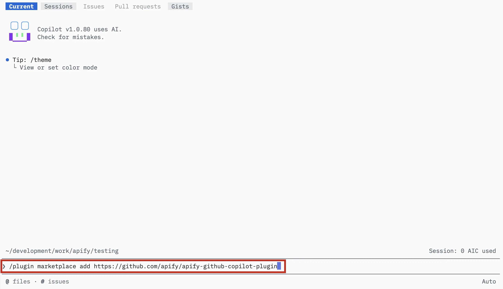
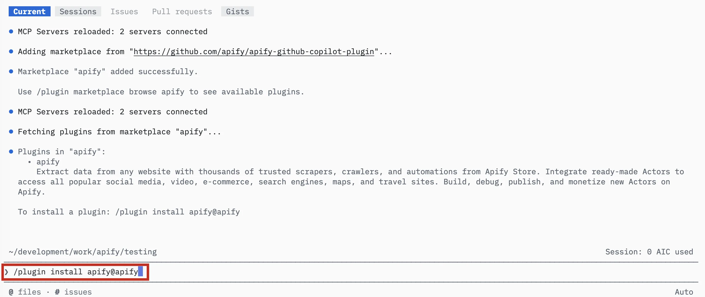
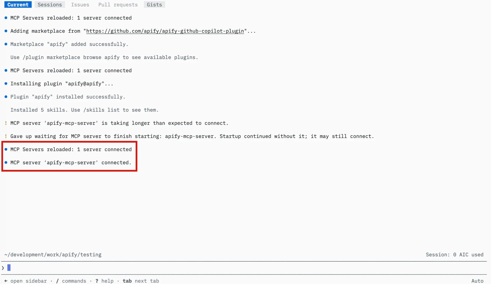
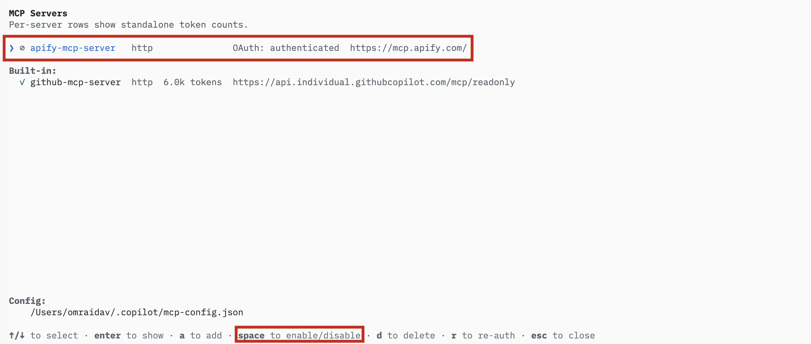
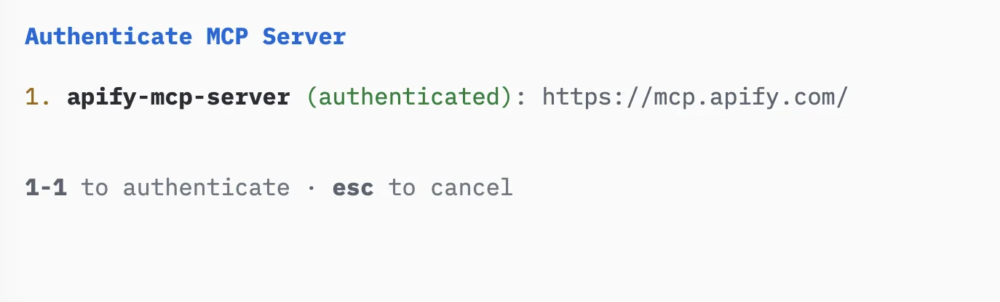
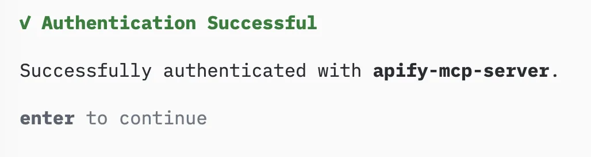
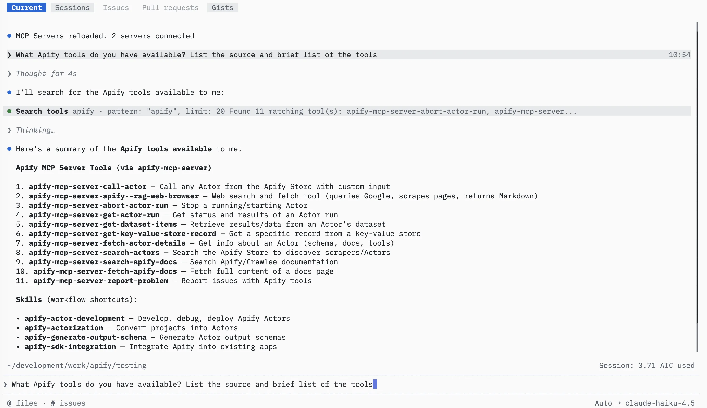

import ThirdPartyDisclaimer from '@site/sources/_partials/_third-party-integration.mdx';

The [GitHub Copilot CLI](https://docs.github.com/en/copilot/concepts/agents/copilot-cli) is GitHub's agentic coding tool that runs in your terminal. It reads and edits your codebase, runs commands, and completes multi-step development tasks.

The [Apify plugin for GitHub Copilot](https://github.com/apify/apify-github-copilot-plugin) connects Copilot to Apify's library of [Actors](https://apify.com/store) and bundles:

- The [Apify MCP server](/integrations/mcp) for searching Apify Store, running Actors, and retrieving datasets.
- An `apify` routing agent that picks the right tool or skill based on your prompt.
- [Five built-in ](#bundled-skills) for common workflows.

This guide covers installation in the GitHub Copilot CLI.

<ThirdPartyDisclaimer />

## Prerequisites

- [An Apify account](https://console.apify.com/sign-up) - sign up for free if you don't have one.
- [The GitHub Copilot CLI](https://docs.github.com/en/copilot/how-tos/set-up/install-copilot-cli) - installed and signed in.

## Install the plugin and sign in

The plugin lives in an Apify marketplace that you add to Copilot with a repository URL. Installing the plugin also sets up the bundled Apify MCP server and signs you in, so there's no separate authentication step.

1. In a Copilot session, add the Apify marketplace:

    ```text
    /plugin marketplace add https://github.com/apify/apify-github-copilot-plugin
    ```

    

1. Install the `apify` plugin from the marketplace:

    ```text
    /plugin install apify@apify
    ```

    This installs the plugin, its five [bundled skills](#bundled-skills), and the bundled Apify MCP server (`https://mcp.apify.com/`). Copilot then prompts you to sign in to Apify and opens a browser tab for the OAuth flow.

    

1. Complete the Apify OAuth flow in your browser and choose the account to connect. The browser confirms the authorization, and back in the terminal `apify-mcp-server` shows as connected.

    

:::note Read-only access without signing in

Read-only tools like searching Apify Store and fetching Actor details work without signing in. You only need to authenticate to run Actors and access your account data.

:::

:::tip Session persistence

The connection stays authenticated for future sessions. You can revoke access at any time in [Apify Console > Settings > Integrations](https://console.apify.com/settings/integrations).

:::

## Connect the MCP server manually

If you closed the browser before finishing the OAuth flow, or `apify-mcp-server` didn't connect during installation, connect it from the MCP server manager.

1. Run `/mcp` to open the MCP server manager. The `apify-mcp-server` entry appears in the list.

    

1. Select `apify-mcp-server` and choose to authenticate. Copilot opens a browser tab for the Apify OAuth flow.

    

1. Complete the OAuth flow. Back in the terminal, Copilot confirms that `apify-mcp-server` is connected.

    

## Run your first prompt

Describe what you want in plain language.

> Use Apify to find a good Actor for scraping Google Maps places. Show me the best option, its input requirements, pricing model, and what kind of dataset output it returns. Do not run the Actor yet.

The agent searches Apify Store, fetches the top Actor's details, and summarizes its inputs, pricing, and output - without running the Actor.

To check what's available, ask the agent to list its Apify tools.



## Bundled skills

| Skill | Description |
| --- | --- |
| `apify-ultimate-scraper` | CLI-driven extraction using existing Actors for multi-step scraping and lead-generation workflows. |
| `apify-actor-development` | Full Actor lifecycle - template selection, development, local testing, and deployment with `apify push`. |
| `apify-actorization` | Converts existing JavaScript, TypeScript, Python, or CLI projects into Apify Actors. |
| `apify-generate-output-schema` | Generates dataset and key-value store schemas for existing Actors. |
| `apify-sdk-integration` | Integrates Actor execution into applications using the `apify-client` package. |

Example prompts that route to specific skills:

_Ultimate scraper:_

> Find 10 highly rated coffee shops in Seattle with name, address, rating, phone, and website.

_Actor development:_

> Create an Apify Actor that accepts a `startUrl` and `maxPages` input, crawls the site, and stores each page title and URL.

_SDK integration:_

> Add Apify to this project. The Node.js API route should run an Actor and return dataset items as JSON.

## Authentication paths

The `apify` agent picks the right transport for each task. Each transport authenticates differently:

- For MCP tools (search, run, retrieve data), authenticate with OAuth through the browser, as described in [Install the plugin and sign in](#install-the-plugin-and-sign-in). You don't need to set up a token.
- For the Apify CLI (building Actors, actorization, CLI fallback), run `apify login` once, or set `APIFY_TOKEN` in headless environments. Get your token from [Apify Console > Settings > Integrations](https://console.apify.com/settings/integrations).
- For SDK integration with `apify-client`, set the `APIFY_TOKEN` environment variable in your application's environment.

## Troubleshooting

### The `apify` plugin isn't installed

Run `/plugin marketplace add https://github.com/apify/apify-github-copilot-plugin` to add the marketplace, then `/plugin install apify@apify` to install the plugin. Confirm the marketplace was added with `/plugin marketplace browse apify`.

### The Apify MCP server won't authenticate

Installation normally signs you in automatically. If the browser prompt didn't appear or you skipped it, connect the server manually: run `/mcp`, select `apify-mcp-server`, and choose to authenticate, as described in [Connect the MCP server manually](#connect-the-mcp-server-manually). Read-only tools work without signing in, so run a search prompt first to confirm the server is connected.

### Browser doesn't open, or OAuth fails

If the browser doesn't open automatically, copy the OAuth URL shown in the terminal and paste it into your browser manually.

If you're running the CLI in a headless environment (SSH, remote container) or the OAuth flow still fails, authenticate with an API token instead. Copy your token from [Apify Console > Settings > Integrations](https://console.apify.com/settings/integrations) and set it before starting the CLI:

```bash
export APIFY_TOKEN=<YOUR_API_TOKEN>
```

### The agent picks the wrong skill or transport

Start from the `apify` agent. It automatically detects the right transport and routes your request.

## Limitations

- Long-running Actors may time out during a single tool call. Reduce the scope or split the work across multiple prompts.
- Each Actor run counts toward your Apify plan usage in addition to any Copilot usage. See [Billing](/account/billing) for details.
- Skills that edit files in your project (Actor development, actorization, SDK integration) make local changes - review them before deploying or committing.

## Related integrations

- [GitHub Copilot desktop app integration](/integrations/github-copilot-desktop) - Install the Apify plugin in the GitHub Copilot desktop app
- [MCP server integration](/integrations/mcp) - Use the Apify MCP server with other clients

## Resources

- [Apify plugin for GitHub Copilot](https://github.com/apify/apify-github-copilot-plugin) - Source repository and full README with advanced setup notes
- [GitHub Copilot CLI documentation](https://docs.github.com/en/copilot/concepts/agents/copilot-cli) - Official GitHub Copilot CLI docs
- [Apify Store](https://apify.com/store) - Browse Actors you can run from Copilot
