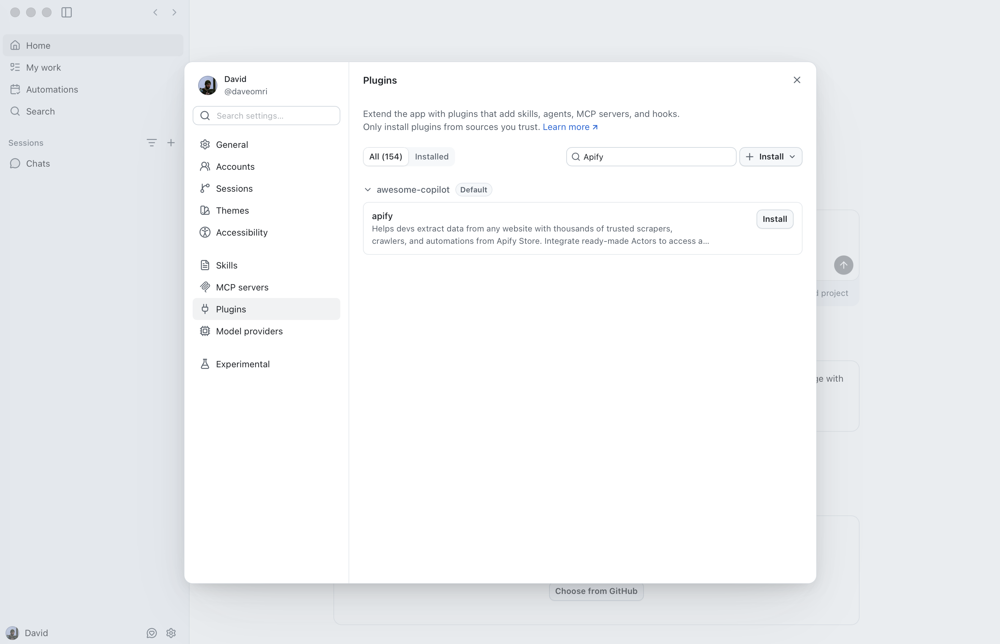
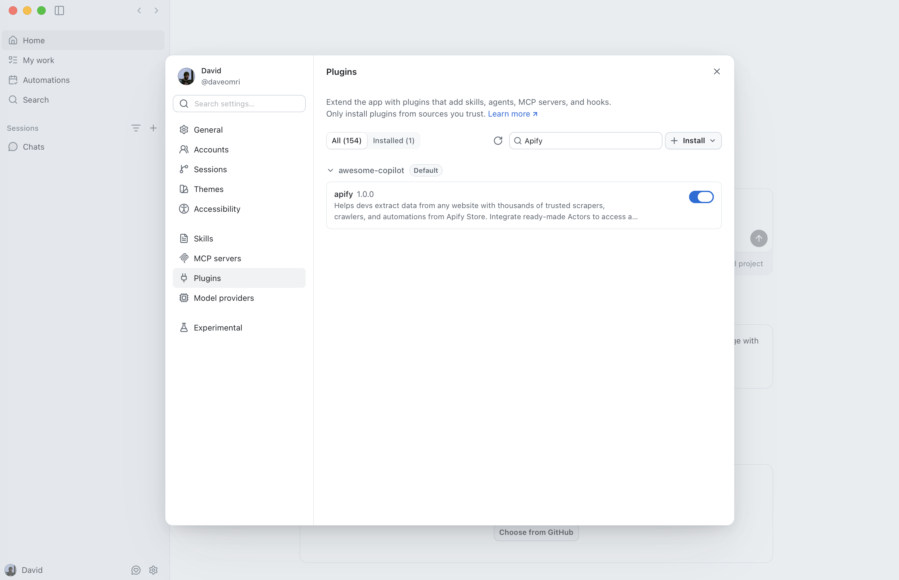
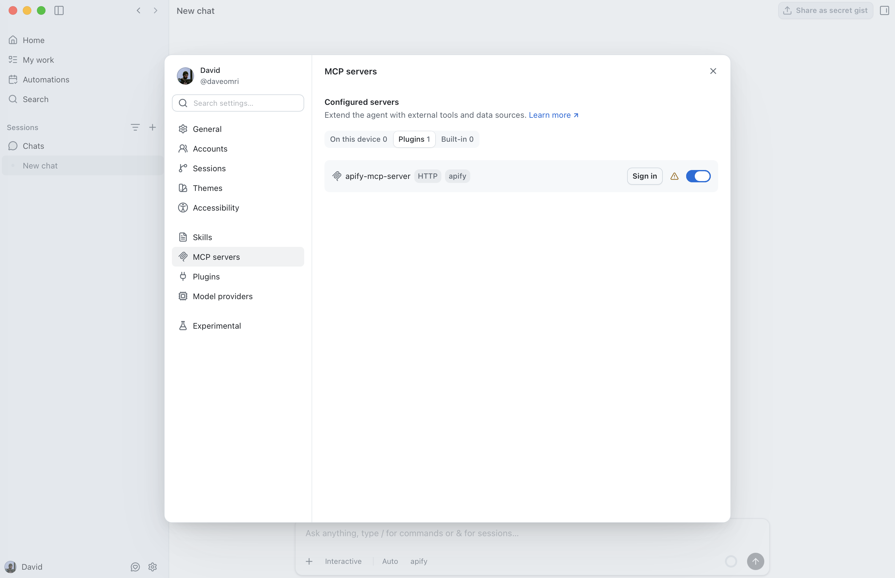
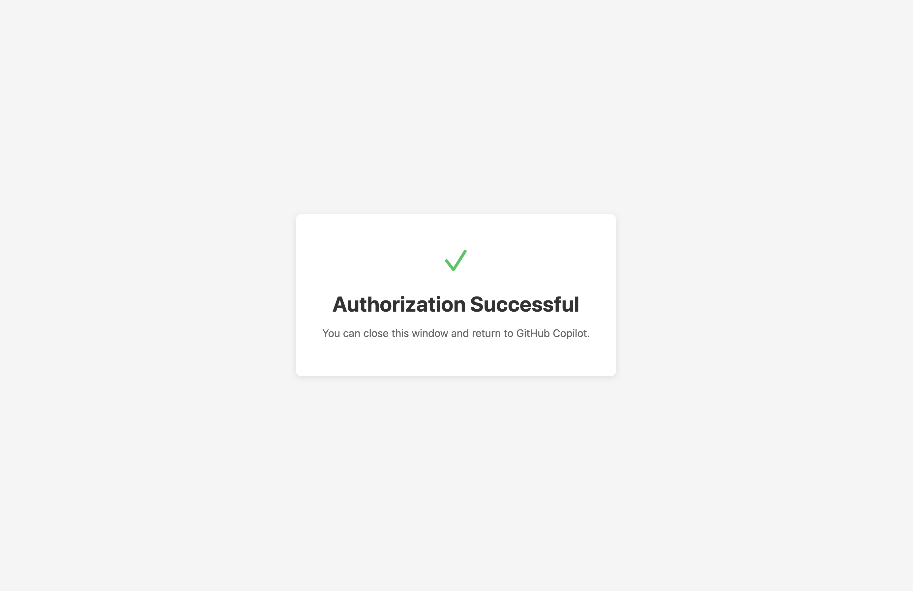
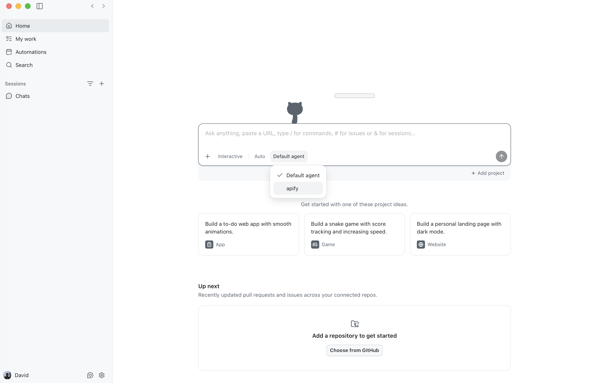
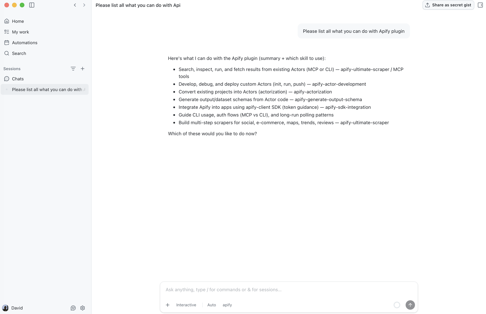

import ThirdPartyDisclaimer from '@site/sources/_partials/_third-party-integration.mdx';

The [GitHub Copilot desktop app](https://github.com/features/copilot) is GitHub's standalone Copilot client. It runs agentic coding sessions in a chat interface, connects to your repositories, and extends through plugins, skills, and MCP servers.

The [Apify plugin for GitHub Copilot](https://github.com/apify/apify-github-copilot-plugin) connects Copilot to Apify's library of [Actors](https://apify.com/store) and bundles:

- The [Apify MCP server](/integrations/mcp) for searching Apify Store, running Actors, and retrieving datasets through the [Model Context Protocol (MCP)](https://modelcontextprotocol.io/docs/getting-started/intro).
- An `apify` routing agent that picks the right tool or skill from a natural-language request.
- Five built-in skills for common workflows (see [Bundled skills](#bundled-skills) below).

This guide covers installation in the GitHub Copilot desktop app.

<ThirdPartyDisclaimer />

## Prerequisites

- [An Apify account](https://console.apify.com/sign-up) - sign up for free if you don't have one.
- The [GitHub Copilot desktop app](https://github.com/features/copilot) - installed and signed in with Copilot access.

## Install the plugin

1. Open **Settings**, select the **Plugins** tab, and search for `Apify`. The `apify` plugin appears in the results.

    

1. Select **Install**. The plugin appears under **Installed** with its toggle enabled.

    

:::note Shared configuration with the CLI

The desktop app and the [GitHub Copilot CLI](/integrations/github-copilot-cli) share the same plugin configuration. If the `apify` plugin doesn't appear in the search, add the Apify marketplace first by running `/plugin marketplace add https://github.com/apify/apify-github-copilot-plugin` in the CLI.

:::

## Connect the Apify MCP server

The plugin bundles the Apify MCP server (`https://mcp.apify.com/`) over the HTTP transport. Read-only tools like searching Apify Store and fetching Actor details work without signing in, but you need to authenticate to run Actors and access your account data.

1. Open **Settings**, select the **MCP servers** tab, and find `apify-mcp-server` with the `HTTP` transport. Select **Sign in**.

    

1. Complete the Apify OAuth flow in your browser and choose the account to connect.

    

:::tip Session persistence

The connection stays authenticated for future sessions. You can revoke access at any time in [Apify Console > Settings > Integrations](https://console.apify.com/settings/integrations).

:::

## Select the apify agent

Open the agent picker in the chat composer and select the `apify` agent so Copilot routes your requests through the Apify plugin.

## Run your first prompt

With the `apify` agent selected, describe what you want in natural language. The agent routes the request to the right tool or skill, so you don't need to name tools yourself.

> Use Apify to find a good Actor for scraping Google Maps places. Show me the best option, its input requirements, pricing model, and what kind of dataset output it returns. Do not run the Actor yet.

The agent searches Apify Store, fetches the top Actor's details through the Apify MCP server, and summarizes its inputs, pricing, and output - all without running the Actor.

## Bundled skills

| Skill | Description |
| --- | --- |
| `apify-ultimate-scraper` | CLI-driven extraction using existing Actors for multi-step scraping and lead-generation workflows. |
| `apify-actor-development` | Full Actor lifecycle - template selection, development, local testing, and deployment with `apify push`. |
| `apify-actorization` | Converts existing JavaScript, TypeScript, Python, or CLI projects into Apify Actors. |
| `apify-generate-output-schema` | Generates dataset and key-value store schemas for existing Actors. |
| `apify-sdk-integration` | Integrates Actor execution into applications using the `apify-client` package. |

Example prompts that route to specific skills:

_Ultimate scraper:_

> Find 10 highly rated coffee shops in Seattle with name, address, rating, phone, and website.

_Actor development:_

> Create an Apify Actor that accepts a `startUrl` and `maxPages` input, crawls the site, and stores each page title and URL.

_SDK integration:_

> Add Apify to this project. The Node.js API route should run an Actor and return dataset items as JSON.

## Troubleshooting

### The apify plugin doesn't appear in search

The desktop app shares its plugin configuration with the [GitHub Copilot CLI](/integrations/github-copilot-cli). Add the Apify marketplace in the CLI with `/plugin marketplace add https://github.com/apify/apify-github-copilot-plugin`, then reopen the **Plugins** tab and search again.

### The Apify MCP server won't sign in

Open **Settings > MCP servers**, confirm `apify-mcp-server` uses the `HTTP` transport, and select **Sign in** to restart the OAuth flow. Read-only tools work without signing in, so run a search prompt first to confirm the server is connected.

### The apify agent isn't available

Confirm the plugin is installed and enabled under **Settings > Plugins**, then reopen the agent picker in the chat composer. The `apify` agent appears once the plugin is active.

## Limitations

- Long-running Actors may exceed the time a single tool call waits for completion. Reduce the scope or split the work across multiple prompts.
- Each Actor run consumes Apify platform usage from your plan in addition to any Copilot usage. See [Billing](/account/billing) for details.
- Skills that edit files in your project (Actor development, actorization, SDK integration) make local changes - review them before deploying or committing.

## Related integrations

- [GitHub Copilot CLI integration](/integrations/github-copilot-cli) - Install the Apify plugin in the GitHub Copilot CLI
- [MCP server integration](/integrations/mcp) - Use the Apify MCP server with other clients

## Resources

- [Apify plugin for GitHub Copilot](https://github.com/apify/apify-github-copilot-plugin) - Source repository and full README with advanced setup notes
- [GitHub Copilot documentation](https://docs.github.com/en/copilot) - Official GitHub Copilot docs
- [Apify Store](https://apify.com/store) - Browse Actors you can run from Copilot
