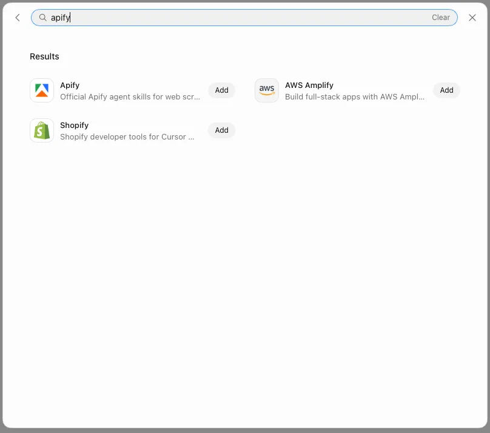

import ThirdPartyDisclaimer from '@site/sources/_partials/_third-party-integration.mdx';

[Grok Bot](https://docs.x.ai/grok-bot) is an AI teammate that works from a persistent cloud computer. It reads and edits files, runs commands, uses a browser, and completes multi-step development tasks.

The [Apify plugin for Grok Bot](https://github.com/apify/apify-cursor-plugin) connects Grok Bot to Apify's library of [Actors](https://apify.com/store) and bundles:

- The [Apify MCP server](/integrations/mcp) for searching Apify Store, running Actors, and retrieving datasets through the [Model Context Protocol (MCP)](https://modelcontextprotocol.io/docs/getting-started/intro).
- An `apify` routing agent that picks the right tool or skill from a natural-language request.
- Five built-in skills for common workflows (see [Bundled skills](#bundled-skills) below).

This guide covers setup in the Grok Bot app.

<ThirdPartyDisclaimer />

## Prerequisites

- [An Apify account](https://console.apify.com/sign-up) - sign up for free if you don't have one.
- [Grok Bot](https://docs.x.ai/grok-bot) - signed in to the Grok Bot app.

## Install the plugin

Connectors give a Bot a structured way to work with supported services. In the Grok Bot app, connectors appear as **Plugins**.

1. Open **Settings** > **Plugins**. The **Marketplace** opens with the **Plugins** tab selected.

    

1. Browse the available connectors and find **Apify**.

1. Choose **Add**.

Installed connectors are account-wide. Their availability is not isolated to one Bot.

## Authenticate to Apify

The plugin bundles the Apify MCP server. Read-only tools like searching Apify Store and fetching Actor details work without signing in, but you need to authenticate to run Actors and access your account data.

1. After you choose **Add**, complete authentication in your browser if Grok Bot requests it. Grok Bot opens a browser tab for the Apify OAuth flow.

1. Review the permissions and click **Allow access**.

1. Back in Grok Bot, the **Apify** connector is connected and tools are live.

:::tip Session persistence

The connection stays authenticated for future sessions. You can revoke access at any time in [Apify Console > Settings > Integrations](https://console.apify.com/settings/integrations).

:::

## Run your first prompt

In chat, type `@apify` to attach the Apify connector to the task. The routing agent picks the right tool or skill from a natural-language request, so you don't need to name tools yourself. Type `/` to reference a saved skill directly.

> @apify Use Apify to find a good Actor for scraping Google Maps places. Show me the best option, its input requirements, pricing model, and what kind of dataset output it returns. Do not run the Actor yet.

The `apify` agent searches Apify Store, fetches the top Actor's details through the Apify MCP server, and summarizes its inputs, pricing, and output - all without running the Actor.

## Bundled skills

| Skill | Description |
| --- | --- |
| `apify-ultimate-scraper` | CLI-driven extraction using existing Actors for multi-step scraping and lead-generation workflows. |
| `apify-actor-development` | Full Actor lifecycle - template selection, development, local testing, and deployment with `apify push`. |
| `apify-actorization` | Converts existing JavaScript, TypeScript, Python, or CLI projects into Apify Actors. |
| `apify-generate-output-schema` | Generates dataset and key-value store schemas for existing Actors. |
| `apify-sdk-integration` | Integrates Actor execution into applications using the `apify-client` package. |

Example prompts that route to specific skills:

_Ultimate scraper:_

> Find 10 highly rated coffee shops in Seattle with name, address, rating, phone, and website.

_Actor development:_

> Create an Apify Actor that accepts a `startUrl` and `maxPages` input, crawls the site, and stores each page title and URL.

_SDK integration:_

> Add Apify to this project. The Node.js API route should run an Actor and return dataset items as JSON.

## Troubleshooting

### The Apify plugin doesn't appear in Plugins

Open **Settings** > **Plugins** and browse or search for **Apify**. If it still doesn't appear, sign out and back in to the Grok Bot app, then reopen **Plugins**. Confirm you added the connector on this account - installed connectors are account-wide, not isolated to one Bot.

### Grok Bot picks the wrong skill

Start your request with `@apify` so the routing agent handles it. The agent owns the guardrails that pick the right skill and avoid common traps, such as confusing the `apify` and `apify-client` packages.

### The Apify MCP server shows as unauthenticated

Open **Settings** > **Plugins**, find the **Apify** connector, and complete authentication again. If the connector is already listed, remove it and choose **Add** to re-trigger the OAuth flow. See [Authenticate to Apify](#authenticate-to-apify).

### Browser doesn't open, or OAuth fails

If the browser doesn't open automatically, copy the OAuth URL shown by Grok Bot and paste it into your browser manually.

If the OAuth flow still fails, authenticate with an API token instead. Copy your token from [Apify Console > Settings > Integrations](https://console.apify.com/settings/integrations) and set it on the Grok Bot computer:

```bash
export APIFY_TOKEN=<YOUR_API_TOKEN>
```

## Limitations

- Long-running Actors may exceed the time a single tool call waits for completion. Reduce the scope or split the work across multiple prompts.
- Each Actor run consumes Apify platform usage from your plan in addition to any Grok Bot usage. See [Billing](/account/billing) for details.
- Skills that edit files in your project (Actor development, actorization, SDK integration) make changes on the Grok Bot cloud computer - review them before deploying or committing.
- Installed connectors are account-wide. Their availability is not isolated to one Bot.
- All Bots on your account share the same cloud computer. Files and credentials you place there are visible to every Bot.
- Prefer the Apify connector over browsing Apify's website in the Grok Bot browser. A connector is often more reliable than clicking through a site.

## Related integrations

- [MCP server integration](/integrations/mcp) - Use the Apify MCP server with other clients
- [ChatGPT integration](/integrations/chatgpt) - Connect the Apify MCP server to ChatGPT

## Resources

- [Apify plugin for Grok Bot](https://github.com/apify/apify-cursor-plugin) - Source repository and full README with advanced setup notes (all auth paths, available MCP tools)
- [Grok Bot documentation](https://docs.x.ai/grok-bot/computer-and-apps#connect-an-app) - Official Grok Bot docs for connecting apps
- [Apify Store](https://apify.com/store) - Browse Actors you can run from Grok Bot
