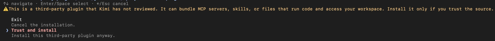

import ThirdPartyDisclaimer from '@site/sources/_partials/_third-party-integration.mdx';

[Kimi Code CLI](https://www.kimi.com/code/docs/en/kimi-code-cli/guides/getting-started.html) is Moonshot AI's agentic coding tool that runs in your terminal. It reads and edits your codebase, runs commands, and completes multi-step development tasks.

The [Apify plugin for Kimi Code](https://github.com/apify/apify-kimi-code-plugin) connects Kimi Code to Apify's library of [Actors](https://apify.com/store) and bundles:

- The [Apify MCP server](/integrations/mcp) for searching Apify Store, running Actors, and retrieving datasets through the [Model Context Protocol (MCP)](https://modelcontextprotocol.io/docs/getting-started/intro).
- A `using-apify` router skill that loads at session start and picks the right tool or skill from a natural-language request.
- Five built-in skills for common workflows (see [Bundled skills](#bundled-skills) below).

This guide covers installation from the Kimi Code third-party plugin marketplace.

<ThirdPartyDisclaimer />

## Prerequisites

- [An Apify account](https://console.apify.com/sign-up) - sign up for free if you don't have one.
- [Kimi Code CLI](https://www.kimi.com/code/docs/en/kimi-code-cli/guides/getting-started.html) - installed and authenticated locally, running Node.js 22.19.0 or later.

:::caution Kimi Code CLI, not the legacy kimi-cli

The plugin targets Kimi Code CLI (version `0.x`). Run `kimi --version` to check. It doesn't work with the legacy Python `kimi-cli` (version `1.4x`), which uses a different plugin format.

:::

## Install the plugin

1. Start Kimi Code in your terminal:

    ```bash
    kimi
    ```

1. Run `/plugins` to open the plugin manager.

1. Press Tab to switch to the **Curated** tab.

1. Select **Apify** from the list and press Enter.

    <!--  -->

1. Kimi Code shows a trust prompt because the plugin comes from a third-party publisher. Select **Trust and install**.

    

1. Run `/reload` to apply the plugin to the current session.

    Plugin changes don't reach a running session on their own. Instead of `/reload`, you can start a fresh session with `/new`.

1. Run `/plugins info apify` to confirm the plugin is installed and check for manifest diagnostics.

## Authenticate to Apify

The plugin bundles the Apify MCP server, which is enabled on install. Read-only tools like searching Apify Store and fetching Actor details work without signing in, but you need to authenticate to run Actors and access your account data.

Kimi Code doesn't start the OAuth flow on the first authenticated tool call, so run it explicitly once:

1. Run the login command:

    ```text
    /mcp-config login apify
    ```

1. Kimi Code opens a browser tab for the Apify OAuth flow. Review the permissions and click **Allow access**.

1. Back in the terminal, run `/mcp` to confirm the `apify` server shows as connected.

:::tip Session persistence

The connection stays authenticated for future sessions. You can revoke access at any time in [Apify Console > Settings > Integrations](https://console.apify.com/settings/integrations).

:::

## Run your first prompt

Describe what you want in natural language. The `using-apify` skill is already in context and routes the request to the right tool or skill, so you don't need to name tools yourself.

> Use Apify to find a good Actor for scraping Google Maps places. Show me the best option, its input requirements, pricing model, and what kind of dataset output it returns. Do not run the Actor yet.

The router searches Apify Store, fetches the top Actor's details through the Apify MCP server, and summarizes its inputs, pricing, and output - all without running the Actor.

## Bundled skills

| Skill | Description |
| --- | --- |
| `apify-ultimate-scraper` | CLI-driven extraction using existing Actors for multi-step scraping and lead-generation workflows. |
| `apify-actor-development` | Full Actor lifecycle - template selection, development, local testing, and deployment with `apify push`. |
| `apify-actorization` | Converts existing JavaScript, TypeScript, Python, or CLI projects into Apify Actors. |
| `apify-generate-output-schema` | Generates dataset and key-value store schemas for existing Actors. |
| `apify-sdk-integration` | Integrates Actor execution into applications using the `apify-client` package. |

Example prompts that route to specific skills:

_Ultimate scraper:_

> Find 10 highly rated coffee shops in Seattle with name, address, rating, phone, and website.

_Actor development:_

> Create an Apify Actor that accepts a `startUrl` and `maxPages` input, crawls the site, and stores each page title and URL.

_SDK integration:_

> Add Apify to this project. The Node.js API route should run an Actor and return dataset items as JSON.

Each skill is also registered as a slash command, so you can start a workflow directly. The canonical form is `/skill:<name>`, and the shorthand works when the name isn't taken by a built-in command:

```text
/apify-ultimate-scraper scrape reviews from a Google Maps listing
```

Text after the command is appended to the skill prompt.

The Actor development, actorization, and ultimate scraper skills call the local `apify` command. Install the Apify CLI before using them:

```bash
npm install -g apify-cli
```

## Approve read-only tools automatically

Kimi Code namespaces MCP tools as `mcp__<server>__<tool>`, so the Apify tools appear as `mcp__apify__search-actors`, `mcp__apify__call-actor`, and so on. To stop approving read-only lookups in every session, add permission rules to `~/.kimi-code/config.toml`:

```toml
[[permission.rules]]
decision = "allow"
pattern = "mcp__apify__search-actors"

[[permission.rules]]
decision = "allow"
pattern = "mcp__apify__fetch-actor-details"
```

Avoid a blanket `mcp__apify__*` rule. It also allows `call-actor`, which consumes platform usage.

## Troubleshooting

### Nothing happens after installing

Kimi Code doesn't apply plugin changes to a running session. Run `/reload`, or start a fresh session with `/new`.

### The MCP server shows as disconnected

Run `/mcp` to check the connection status, then `/plugins info apify` for manifest diagnostics. The default startup timeout is 30 seconds.

If the server is disabled, enable it and reload:

```text
/plugins mcp enable apify apify
/reload
```

### The browser doesn't open, or OAuth fails

Run `/mcp-config login apify` explicitly rather than waiting for an automatic prompt. If authorization is corrupted, delete `~/.kimi-code/credentials/mcp/` and log in again. `/logout` clears provider credentials but not MCP credentials.

If you're running Kimi Code in a headless environment (SSH, remote container) or in non-interactive prompt mode (`kimi -p`), the OAuth handshake can't complete. Authenticate on a machine with a browser first, then point the headless machine at the same `KIMI_CODE_HOME` so it picks up `credentials/mcp/`. Alternatively, override the `apify` entry in `~/.kimi-code/mcp.json` or `.kimi-code/mcp.json` with a static token - a project-level entry with the same name overrides the plugin's declaration.

For the CLI and SDK skills, copy your token from [Apify Console > Settings > Integrations](https://console.apify.com/settings/integrations) and export it before starting Kimi Code:

```bash
export APIFY_TOKEN=<YOUR_API_TOKEN>
```

### Kimi Code picks the wrong skill

All five workflow skills are visible as slash commands and can also be invoked by the model, so routing can miss. Describe the goal more explicitly - use existing Actors, build an Actor, actorize a project, generate output schemas, or integrate Apify into an app - or invoke the skill directly with `/skill:<name>`.

### The `apify` command isn't found

Install the Apify CLI with `npm install -g apify-cli` before using the `apify-actor-development`, `apify-actorization`, or `apify-ultimate-scraper` skills.

## Limitations

- Kimi Code has no custom subagents, so the plugin ships a `using-apify` router skill instead of the `apify` agent used by the [Claude Code CLI plugin](/integrations/claude-code-cli). The five workflow skills are identical.
- Long-running Actors may exceed the time a single tool call waits for completion. Reduce the scope or split the work across multiple prompts.
- Each Actor run consumes Apify platform usage from your plan in addition to any Kimi usage. See [Billing](/account/billing) for details.
- Skills that edit files in your project (Actor development, actorization, SDK integration) make local changes - review them before deploying or committing.

## Related integrations

- [MCP server integration](/integrations/mcp) - Use the Apify MCP server with other clients
- [Claude Code CLI integration](/integrations/claude-code-cli) - The equivalent plugin for Claude Code
- [Cursor integration](/integrations/cursor) - The Apify plugin for the Cursor editor

## Resources

- [Apify plugin for Kimi Code](https://github.com/apify/apify-kimi-code-plugin) - Source repository and full README with advanced setup notes (Apify CLI install, all auth paths, available MCP tools)
- [Kimi Code plugin documentation](https://www.kimi.com/code/docs/en/kimi-code-cli/customization/plugins.html) - Official plugin manager reference
- [Kimi Code MCP documentation](https://www.kimi.com/code/docs/en/kimi-code-cli/customization/mcp.html) - Official MCP configuration reference
- [Apify Store](https://apify.com/store) - Browse Actors you can run from Kimi Code
