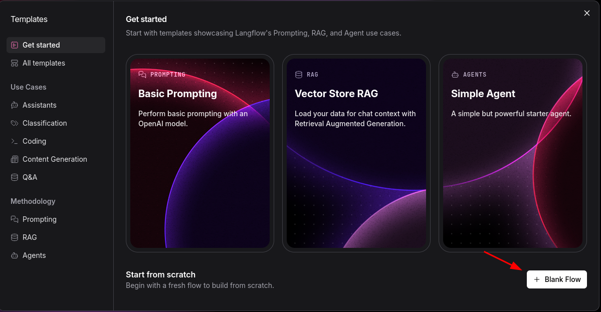
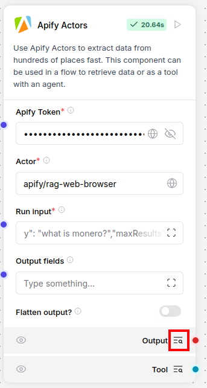
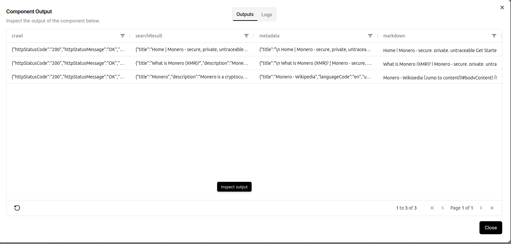
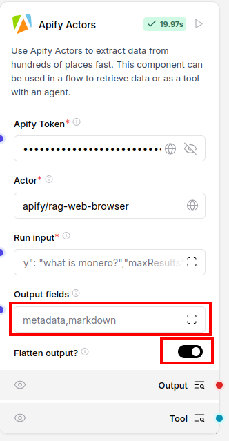
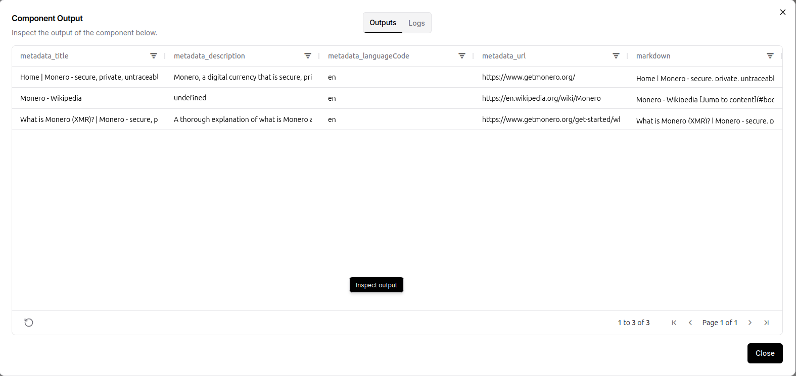
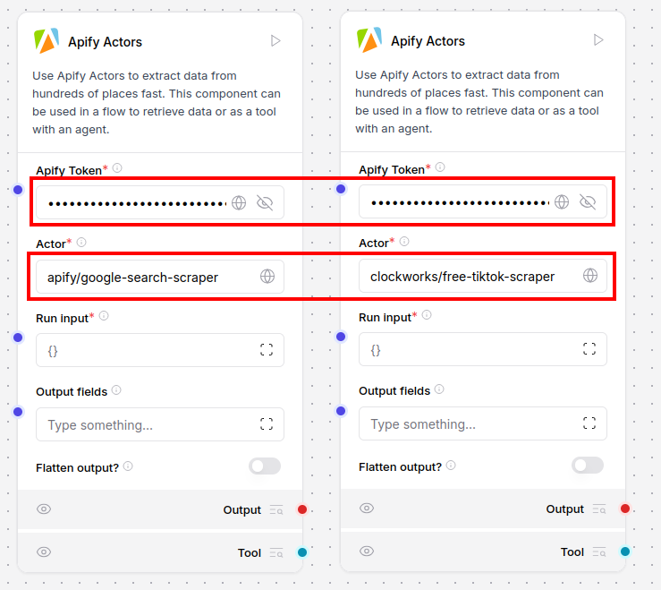
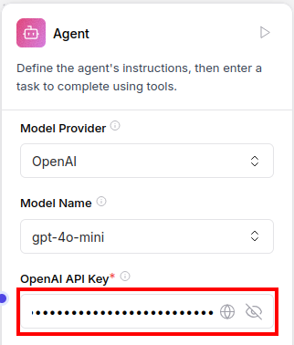
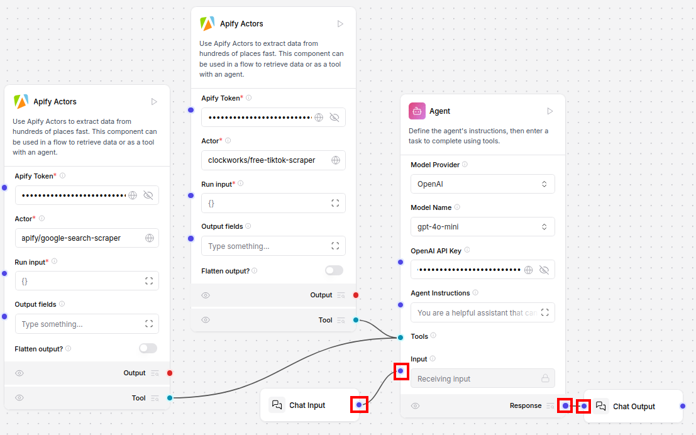
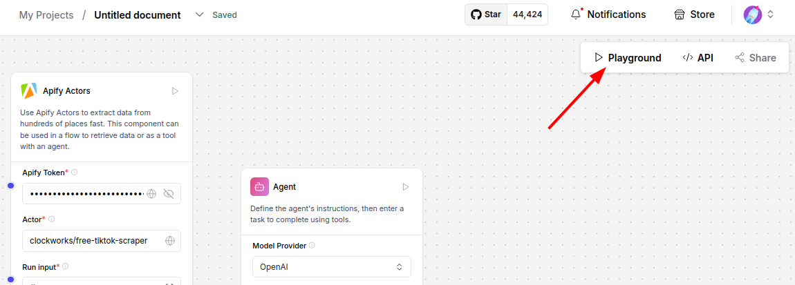
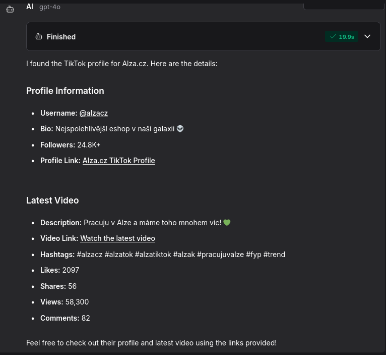

**Learn how to integrate Apify with Langflow to run complex AI agent workflows.**

---

## What is Langflow

[Langflow](https://langflow.org/) is a low-code, visual tool that enables developers to build powerful AI agents and workflows that can use any API, models, or databases.

:::note Explore Langflow

For more information on Langflow, visit its [documentation](https://docs.langflow.org/).

:::

## How to use Apify with Langflow

This guide will demonstrate two different ways to use Apify Actors with Langflow:

- **Calling Apify Actors in Langflow**: We will use the [RAG Web Browser](https://apify.com/apify/rag-web-browser) Actor to search Google for a query and extract the search results.
- **Building a flow to search for a company's social media profiles**: We will use the [Google Search Results Scraper](https://apify.com/apify/google-search-scraper) Actor to search the web for social media profiles of a given company. Then, we will use the [TikTok Data Extractor](https://apify.com/clockworks/free-tiktok-scraper) Actor to extract data from the TikTok profiles.

### Prerequisites

#### Apify API token

To use Apify Actors in Langflow, you need an Apify API token. If you don't have one, you can learn how to obtain it in the [Apify documentation](https://docs.apify.com/platform/integrations/api).

#### OpenAI API key

In order to work with agents in Langflow, you need an OpenAI API key. If you don't have one, you can get it from the [OpenAI platform](https://platform.openai.com/account/api-keys).

#### Langflow

:::note Cloud vs local setup

Langflow can either be installed locally or used in the cloud. The cloud version is available on the [Langflow](http://langflow.org/) website. If you are using the cloud version, you can skip the installation step, and go straight to [Creating a new flow](#creating-a-new-flow)

:::

First, we need to install the Langflow platform using python package and project manager [uv](https://docs.astral.sh/uv/):

```bash
uv pip install langflow
```

After successfully installing Langflow, we can start the platform:

```bash
uv run langflow run
```

When the platform is started, open the [Langflow UI](http://127.0.0.1:7860) in your browser.

> Other installation methods can be found in the [Langflow documentation](https://docs.langflow.org/get-started-installation).

### Creating a new flow

On the Langflow welcome screen, click the **New Flow** button and then create **Blank Flow**:


Now, we can start building our flow.

### Calling Apify Actors in Langflow

To call Apify Actors in Langflow, we need to add the **Apify Actors** component to the flow.
From the bundle menu, add **Apify Actors** component:


Next, we need to configure the Apify Actors components. First, input your API token (learn how to get it [here](https://docs.apify.com/platform/integrations/api)). Then, set the Actor ID of the component to `apify/rag-web-browser` to use the [RAG Web Browser](https://apify.com/apify/rag-web-browser). Set the **Run input** field to pass arguments to the Actor run, allowing it to search Google with the query `"what is monero?"` (full Actor input schema can be found [here](https://apify.com/apify/rag-web-browser/input-schema)):

```json
{"query": "what is monero?", "maxResults": 3}
```

Now, we can run the component by clicking the **Run** button.


Once the run is finished, we can view the output by clicking the **Output** button.


The output should look similar to this:


To filter only the `metadata` and `markdown` fields, set **Output fields** to `metadata,markdown`. Additionally, enable **Flatten output** by setting it to `true`. This will output only the metadata and text content from the search results.
> Flattening is necessary when you need to access nested dictionary fields in the output data object; they cannot be accessed directly otherwise in the Data object.



When you run the component again, the output contains only the `markdown` and flattened `metadata` fields:



Now that we understand how to call Apify Actors, let's build a practical example where we search for a company's social media profiles and extract data from them.

### Building a flow to search for a company's social media profiles

Create a new flow and add two **Apify Actors** components from the menu.

Input your API token (learn how to get it [here](https://docs.apify.com/platform/integrations/api)) and set the Actor ID of the first component to `apify/google-search-scraper` and the second one to `clockworks/free-tiktok-scraper`:


Add the **Agent** component from the menu and set your OpenAI API key (get it [here](https://platform.openai.com/account/api-keys)):

:::tip Optimize Agent results

For better results, switch the model to `gpt-4o` instead of `gpt-4o-mini` in the Agent configuration

:::



To be able to interact with the agent, add **Chat Input** and **Chat Output** components from the menu and connect them to the Agent component **Input** and **Response**.
Then connect both Apify Actor components **Tool** outputs to the Agent component **Tools** input so that the agent can call the Apify Actors. The final flow that can search the web for a company's social media profiles and extract data from them should look like this:


Click the **Playground** button and chat with the agent to test the flow:


Here is an example agent output for the following query:

```text
find tiktok profile of company openai using google search and then show me the profile bio and their latest video
```


