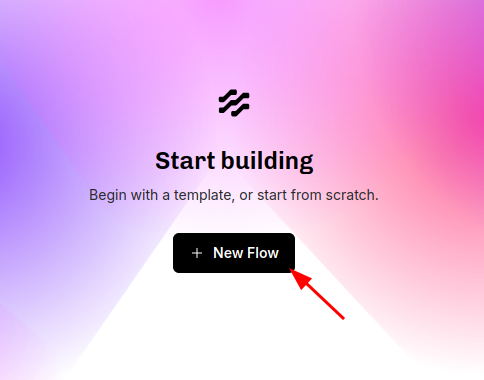
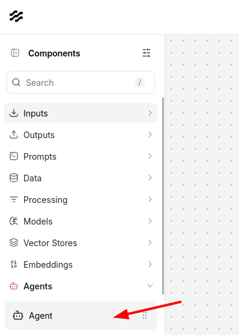
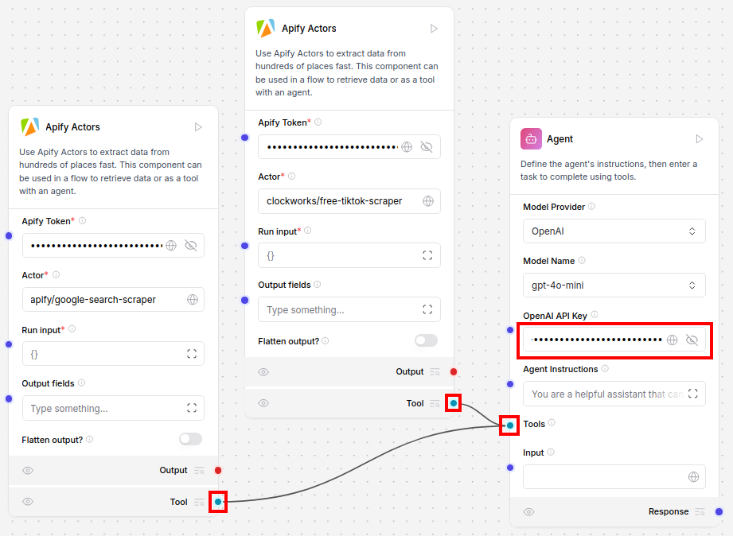
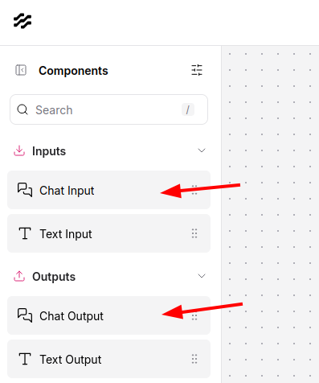

**Learn how to integrate Apify with Langflow, in order to run complex AI agent workflows.**

---

## What is Langflow?

[Langflow](https://langflow.org/) is a visual low-code tool for developers that makes it easier to build powerful AI agents and workflows that can use any API, model, or database.

> For more information on Langflow, visit its [documentation](https://docs.langflow.org/).

## How to use Apify with Langflow

To show how to use the platform, we are going to create an example AI agent workflow that will search the web for social media profiles of a given company and then extract data from the profiles. We will use the [Google Search Results Scraper](https://apify.com/apify/google-search-scraper) Actor to search the web for social media profiles of a given company. Then we will use the [TikTok Data Extractor](https://apify.com/clockworks/free-tiktok-scraper) Actor to extract data from the TikTok profiles.

> Langflow can either be installed locally or used in the cloud. The cloud version is available on the [Langflow](http://langflow.org/) website. If you are using the cloud version, you can skip the installation step.

### Installation

First, we need to install the Langflow platform using [uv](https://docs.astral.sh/uv/):
```bash
uv pip install langflow
```

After the successful installation of Langflow, we can start the platform:
```bash
uv run langflow run
```
Other installation methods can be found in the [Langflow documentation](https://docs.langflow.org/get-started-installation).

When the platform is started, open the [Langflow UI](http://127.0.0.1:7860) in your browser.

### Building your flow

In the Langflow welcome screen, click the **New Flow** button:


In the **New Flow** screen, click **Blank Flow**:


From the bundle menu on the left side, add two **Apify Actors** components:


Input your API token (learn how to get it [here](https://docs.apify.com/platform/integrations/api))
and set the Actor ID of the first component to `apify/google-search-scraper` and the second one to `clockworks/free-tiktok-scraper`:


Now add the *Agent* component from the menu and set your OpenAI API key (get it [here](https://platform.openai.com/account/api-keys)):
> For better results, switch the model to `gpt-4o` instead of `gpt-4o-mini` in the Agent configuration



Then connect the Apify Actor components **Tool** output to the Agent component **Tools** input:


Now add **Chat Input** and **Chat Output** components from the menu and connect them to the Agent component **Input** and **Response**:


The flow should look like this:


Click the **Playground** button in the top right corner and chat with the Agent to test the flow:


Here is an example Agent output for the following query:
```
find tiktok profile of company alza.cz using google search and then show me the profile bio and their latest video
```

