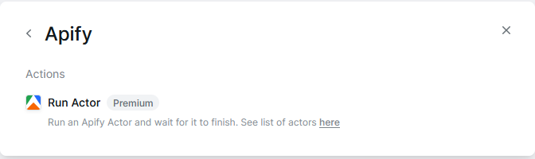

**Learn how to integrate your Apify Actors with Lindy.**

---

[Lindy](https://www.lindy.ai/) is an AI-powered automation platform that lets you create intelligent workflows and automate complex tasks. By integrating Apify with Lindy, you can leverage Apify's web scraping capabilities within Lindy's AI-driven automation workflows to extract data, monitor websites, and trigger actions based on scraped information.

## Prerequisites

To use the Apify integration with Lindy, you need:

- A Lindy account with access to premium actions (required for certain integrations or higher usage limits).

## How to Run an Apify Actor from Lindy

This section demonstrates how to integrate Apify's data extraction capabilities into Lindy's AI automation.

1. Start a new Lindy workflow by clicking the **+ New Lindy** button.

    

    Select **Start from scratch** to build a custom workflow.

    

1. Choose a trigger that will initiate your automation. For this demonstration, we will select **Chat with Lindy/Message received**. This allows you to trigger the Apify Actor simply by sending a message to Lindy.

    
    

1. After setting the trigger, select **Perform an Action**.

    

    In the action search box, search for "Apify" or navigate to the **Scrapers** category and choose **Run Actor**.

    

1. Configure the Apify "Run Actor" Module. In the Apify "Run Actor" configuration, choose the Actor you want to execute. For example, select the **Instagram profile scraper**.

    

:::tip Actor availability

You have access to thousands of Actors available on the [Apify Store](https://apify.com/store).

:::

This establishes the fundamental workflow: 
_Chatting with Lindy can now trigger the Apify Instagram Profile Scraper._

### Extending Your Workflow

Lindy offers different triggers (e.g., _email received_, _Slack message received_, etc.) and actions beyond running an Actor.

After the Apify Actor run is initiated, you can define what happens next, depending on your needs:

- **When Actor Run Starts:**
  - You might want to send a notification.
  - Log the start time.
  - Run a pre-processing step.
- **After Results Are Available:** Once the Apify Actor completes and its results are ready, you can:
  - Retrieve the Actor's output data from its dataset.
  - Pass the extracted data to Lindy's AI for summarization, analysis, content generation, or other AI-driven tasks.
  - Route the data to other services (e.g., Google Sheets, databases, email notifications) using Lindy's action modules.

## Available Actions in Lindy for Apify

While Lindy's specific module names may evolve, the core Apify functionalities typically exposed are:

- **Run Actor:** Initiates a specific Apify Actor and can optionally wait for its completion.
