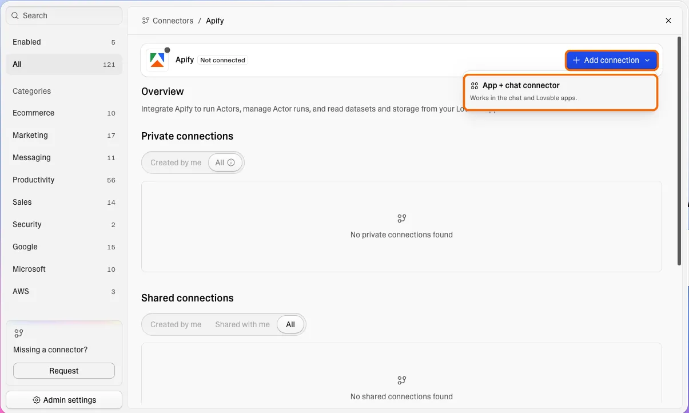

import ThirdPartyDisclaimer from '@site/sources/_partials/_third-party-integration.mdx';

[Lovable](https://lovable.dev) is an AI app builder that turns a prompt into a working web app. The [Apify connector](https://docs.lovable.dev/integrations/apify), built and maintained by Lovable, lets those apps call the Apify API through a shared connection, so an app can run [Actors](https://apify.com/store) and display the results.

Apify is available as an app and chat connector: one connection works both in the project chat while you build and in the published app. Once the connection is linked to a project, your app can:

- Run Actors to scrape websites and automate browser workflows.
- Track an Actor run until it finishes.
- Read results from [datasets](/storage/dataset) and [key-value stores](/storage/key-value-store).
- List recent Actor runs and their datasets.

<ThirdPartyDisclaimer />

## Prerequisites

Before you connect the two platforms, you need:

- _An Apify account_ - If you don't have one, [sign up here](https://console.apify.com/sign-up).
- _Apify API token_ - Get your token from the **API & Integrations** section in [Apify Console](https://console.apify.com/settings/integrations). See [API token](/integrations/api#api-token) for scope and expiration options.
- _A Lovable account_ - App and chat connectors are available on the Free, Pro, and Business plans.
- _Permission to create connections_ - Enterprise plans restrict connection creation to **No one** by default, until an admin changes it in **Connectors > Admin settings > App + chat connectors**.

## Connect Apify to Lovable

The connection lives at the workspace level, so you create it once and reuse it across projects.

1. In Lovable, open [**Connectors**](https://lovable.dev/dashboard?connectors), search for `Apify`, and select it.
1. Select **Add connection**, then choose **App + chat connector**.

    

1. Fill in the connection dialog, pasting your Apify API token when it asks for one.
1. Select **Connect**.

A new connection is private to you. Share it with specific people or with the whole workspace to let them link it to their own projects.

You can create more than one connection, each with its own token, which keeps environments such as development and production separate. Revoking one token leaves the others working.

To use the connection in a project, ask Lovable in the project chat to link the project to it.

## Build a feature that runs an Actor

After you link the project, describe the feature in the project chat and name the Actor you want to run. Lovable generates the API calls, the state handling, and the UI that renders the dataset.

Actors that pair well with a Lovable front end include:

- [Google Maps Scraper](https://apify.com/compass/crawler-google-places) for lead lists built from directory pages.
- [Instagram Profile Scraper](https://apify.com/apify/instagram-profile-scraper) and [TikTok Scraper](https://apify.com/clockworks/tiktok-scraper) for social monitoring feeds.
- [E-commerce Scraping Tool](https://apify.com/apify/e-commerce-scraping-tool) for price tracking dashboards.
- [Website Content Crawler](https://apify.com/apify/website-content-crawler) and [Google Search Results Scraper](https://apify.com/apify/google-search-scraper) for research and summarization pages.

Example prompts:

- _"Use Apify and build a dashboard that runs the E-commerce Scraping Tool Actor on a list of product URLs and charts the price history."_
- _"Use Apify and build a console that lists recent Actor runs with status, duration, and a link to each dataset."_

Runs started through the connector bill against your Apify plan, and the cost of each run stays visible in Apify Console. Lovable doesn't handle Apify billing.

## Handle long-running Actor runs

Actor runs take anywhere from seconds to minutes, and the Apify API rate-limits both run creation and dataset reads. That shapes how you prompt.

For a long run, ask Lovable to start the run, poll the run status at a slow interval until it finishes, and only then read the dataset. For a short job, [Run Actor synchronously and get dataset items](/api/v2/actor-run-sync-get-dataset-items-post) starts the run and returns the dataset in one call. The run has to finish within 300 seconds, or the endpoint returns `408 Request Timeout`.

## Limitations

Two constraints are worth knowing before you design around the connector:

- Tokens aren't rotated automatically. When you [rotate a token](/integrations/api#rotation) in Apify Console, update the Lovable connection with the new one. Requests fail until you do.
- Per-end-user Apify login isn't supported. Each connection represents a single Apify account, shared across every project linked to it, so all usage lands on that one account.

## Manage the connection

Manage an existing connection from [**Connectors**](https://lovable.dev/dashboard?connectors) in Lovable: select **Apify**, then open the connection.

- Unlink a project to remove Apify access from that project while the connection stays available to the others.
- Delete the connection to remove it from the workspace. Deletion is permanent, removes the credentials from every linked project, and breaks any app feature that uses Apify until you add a new connection.

Deleting a connection in Lovable doesn't revoke the token in Apify. To cut off access entirely, delete the token in [**Settings > API & Integrations**](https://console.apify.com/settings/integrations) as well.

## Troubleshooting

Most problems come down to the token, the connection, or Apify's rate limits.

### Authentication errors

- _Check the token is still valid_ - If you revoked or rotated the token in Apify Console, the connection keeps sending the old one. Create a new token and update the connection in Lovable.
- _Check the token's permissions_ - A token with [limited permissions](/integrations/api#limited-permissions) can't reach an Actor or storage outside its scope. Use a token that covers what the app runs and reads.

### Rate-limited requests

- _Back off on `429`_ - A `429` response means the Apify API is [rate-limiting](/api/v2#rate-limiting) your account. Ask Lovable to retry with exponential backoff rather than re-sending at a fixed interval, otherwise the app stays throttled.
- _Slow the polling down_ - Polling a long run too often burns the same rate limit the run itself needs. See [Handle long-running Actor runs](#handle-long-running-actor-runs).

### Connection not available

- _Check who can create connections_ - On Enterprise plans, connection creation is set to **No one** until an admin changes it. See [Lovable's admin controls](https://docs.lovable.dev/integrations/admin-controls#who-can-create-connections-and-clients).
- _Check the project link_ - A connection does nothing until it's linked to a project. Ask Lovable in the project chat to link the project to it.

### Actor run failures

- _Check the run logs_ - Open the run in [Apify Console](https://console.apify.com/) to see why it failed.
- _Check the Actor's input_ - An Actor rejects a run when required input is missing or malformed. Compare what the app sends against the Actor's input schema in Apify Store.

## Resources

- [Lovable documentation for the Apify connector](https://docs.lovable.dev/integrations/apify)
- [Lovable app and chat connectors](https://docs.lovable.dev/integrations/app-connectors)
- [Apify API token](/integrations/api#api-token)
