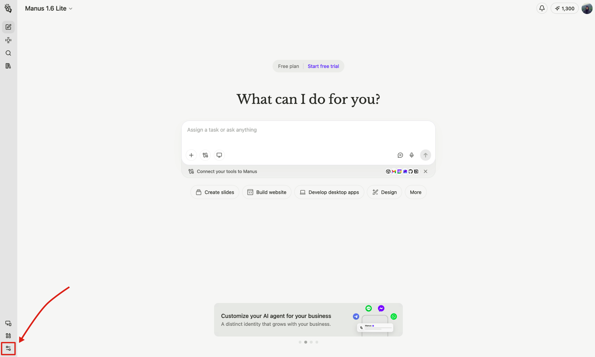
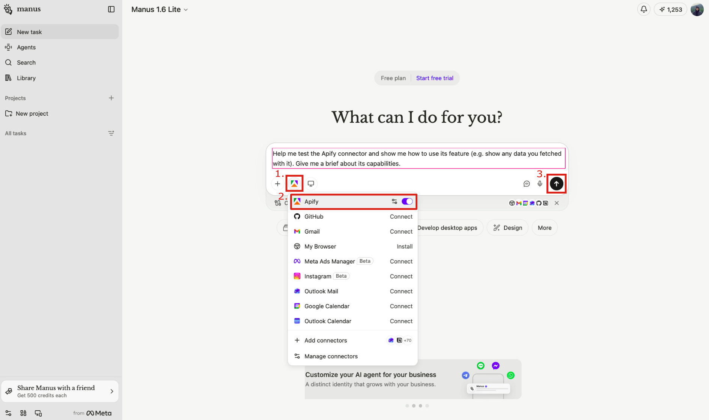
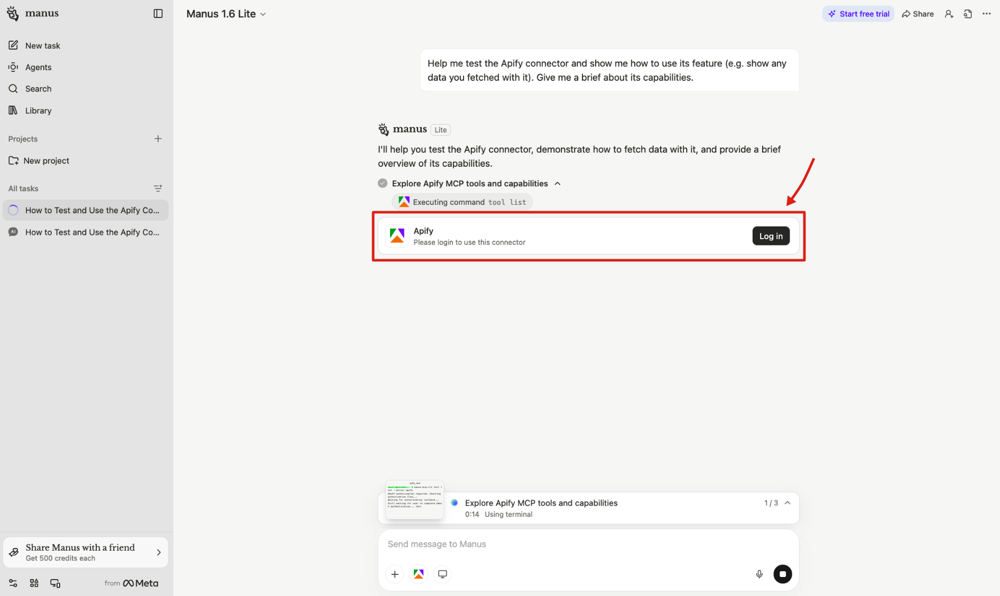

The _Manus_ integration connects Manus to Apify's library of [Actors](https://apify.com/store) through the [Model Context Protocol (MCP)](https://modelcontextprotocol.io/docs/getting-started/intro).
This allows Manus agents to search and run Actors, scrape URLs, and retrieve datasets directly in agent sessions - without writing any code.
You can also import [Apify Agent Skills](https://github.com/apify/agent-skills) from GitHub to give Manus structured, reusable scraping workflows.

_Example prompt_: "Search for 'best project management tools' on Google and summarize the top 10 results"

In this guide, you'll learn how to connect Manus to the Apify MCP server as a custom connector, and how to import Apify Agent Skills from GitHub.

## Prerequisites

Before connecting Manus to Apify, you'll need:

- _An Apify account_ - If you don't have an Apify account, [sign up](https://console.apify.com/sign-up)
- _A Manus account_ - MCP access is available on all Manus plans, including Free

## Connect the Apify MCP server

1. In Manus, open **Settings**.

    

1. Open **Connectors**.

    

1. Click **+ Add connectors**.

    

1. Select the **Custom MCP** tab.
1. Click **+ Add custom MCP** → choose **Direct configuration**.
1. Fill in the following fields:
    - **Server name** - e.g. `Apify`
    - **Transport type** - `HTTP` (default)
    - **Server URL** - `https://mcp.apify.com`
    - **Icon** (optional) - `https://apify.com/img/apify-logo/logomark-32x32.svg`
1. You can leave the **Custom headers** empty and click **Save**.


When you first use an Apify tool in a Manus session, you'll be prompted to sign in to your Apify account via OAuth. After that, the connector stays authorized for future sessions.



You can also reach the connector setup from the Manus chat interface: click **Connect Apps** → **Add Connectors** → search for **Custom MCP**.



## Configure tools

After connecting, the Apify MCP server exposes a default set of tools including `search-actors`, `call-actor`, `get-actor-output`, `apify/rag-web-browser`, `search-apify-docs`, and `fetch-apify-docs`.

To control which tools are available, append a `tools=` query parameter to the server URL:

| Goal | Server URL |
| --- | --- |
| Default tool set | `https://mcp.apify.com` |
| Actors and docs only | `https://mcp.apify.com?tools=actors,docs` |
| Specific Actors only | `https://mcp.apify.com?tools=apify/instagram-scraper,apify/google-search-scraper` |

Use the interactive configurator at [mcp.apify.com](https://mcp.apify.com) to browse available tools and generate a ready-made URL.

## Try the MCP connector in Manus

Once your connector is ready:

1. Start a new Manus session.
1. Ask Manus to use Apify tools. For example:

    > "Search for 'best project management tools' on Google and summarize the top 10 results"

Manus will call `search-actors` to find the [Google Search Scraper](https://apify.com/apify/google-search-scraper), use `call-actor` to run it, and then `get-actor-output` to retrieve and summarize the results.

## Import Apify Agent Skills

[Apify Agent Skills](https://github.com/apify/agent-skills) are reusable, structured workflows that tell Manus _how_ to accomplish scraping tasks using Apify tools.
Unlike MCP connectors (which provide tool access), skills bundle domain knowledge, step-by-step instructions, and best practices into a single importable module.

Available skills include:

| Skill | Description |
| --- | --- |
| `apify-ultimate-scraper` | Universal scraper for 55+ platforms - Instagram, TikTok, Google Maps, Amazon, and more |
| `apify-actor-development` | Full Actor lifecycle: template selection, development, testing, and deployment |
| `apify-actorization` | Converts existing projects into Apify Actors |
| `apify-generate-output-schema` | Generates dataset and key-value store schemas from Actor source code |

### Import a skill from GitHub

Each skill lives in its own folder inside the [apify/agent-skills](https://github.com/apify/agent-skills) repository.
When importing in Manus, you must provide the URL of the folder that contains the `SKILL.md` file, not the repository root.

Folder URLs follow this format:

```text
https://github.com/apify/agent-skills/tree/main/{skill-name}
```

To import the `apify-ultimate-scraper` skill:

1. In Manus, go to the **Skills** tab in the sidebar.
1. Click **+ Add** → **Import from GitHub**.

<!-- TODO: Screenshot → save as ../images/manus/skills-import-github.png
     Capture: The Manus Skills tab with the "Import from GitHub" dialog open, showing
     the URL input field. The field should be empty or contain the example URL.
     Highlight: Red border around the URL input field. -->

1. Paste the skill folder URL:

    ```text
    https://github.com/apify/agent-skills/tree/main/apify-ultimate-scraper
    ```

1. Click **Import**.

<!-- TODO: Screenshot → save as ../images/manus/skill-imported.png
     Capture: The Manus Skills tab after a successful import, showing apify-ultimate-scraper
     (or multiple Apify skills) listed and ready to use.
     Highlight: Red border around the newly imported apify-ultimate-scraper skill entry. -->

Repeat this for any other skill you want to add.

### Use an imported skill

Activate a skill in any Manus chat by typing `/` followed by the skill name.
For example, to use `apify-ultimate-scraper`:

1. Type `/apify-ultimate-scraper` in the Manus chat.
1. Ask Manus to perform a task, for example:

    > "Get the top 10 posts from @natgeo on Instagram"

Manus will load the skill instructions and use the appropriate Apify Actors to complete the task.

<!-- TODO: Screenshot → save as ../images/manus/skill-in-action.png
     Capture: A Manus chat session showing the /apify-ultimate-scraper skill triggered,
     with Manus executing the Instagram scrape task and returning results (posts, follower
     counts, or similar structured output).
     Highlight: Red border around the /apify-ultimate-scraper trigger in the chat input,
     and a red border around the structured output block in the response. -->

## Limitations

- Manus times out long-running operations. Actors that require extended processing may not complete within a single session - run them asynchronously using the [Apify API](/platform/integrations/api) if needed.
- Each MCP tool call consumes Manus credits in addition to any Apify platform costs. Complex workflows using multiple Actors can consume credits quickly.
- Manus auto-redacts API keys in shared sessions, but avoid sharing sessions that contain sensitive or proprietary data.

## Related integrations

- [Claude integration](/platform/integrations/claude) - Use the Apify MCP server with Claude Desktop and Claude.ai
- [ChatGPT integration](/platform/integrations/chatgpt) - Connect the Apify MCP server to ChatGPT
- [MCP documentation](/platform/integrations/mcp) - Complete guide to the Apify MCP server

## Resources

- [Manus MCP Connectors docs](https://manus.im/docs/integrations/mcp-connectors) - Official Manus documentation on custom MCP servers
- [Manus Agent Skills docs](https://manus.im/docs/integrations/agent-skills) - Official Manus documentation on Skills
- [Apify Agent Skills repository](https://github.com/apify/agent-skills) - Browse and import Apify skills
- [Apify MCP server configurator](https://mcp.apify.com) - Interactive tool to configure and preview the Apify MCP server
- [Apify MCP documentation](/platform/integrations/mcp) - Complete guide to using the Apify MCP server
