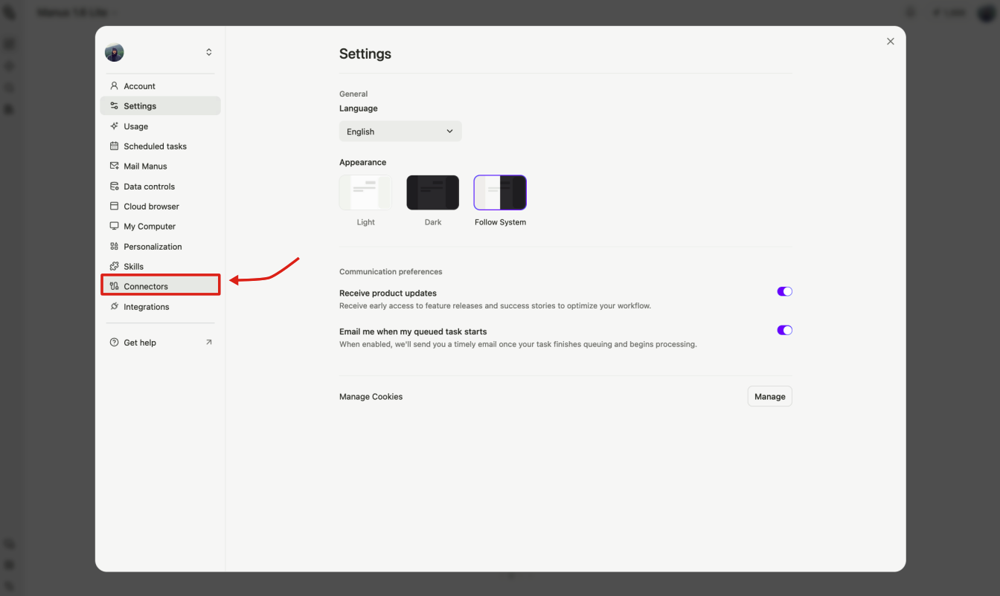
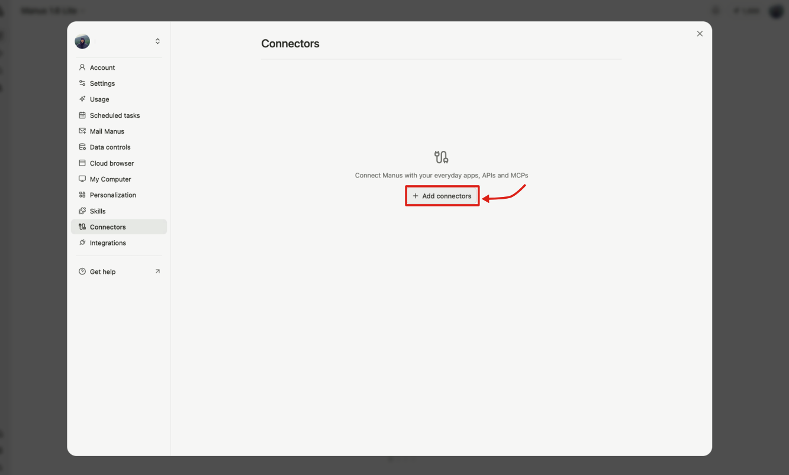
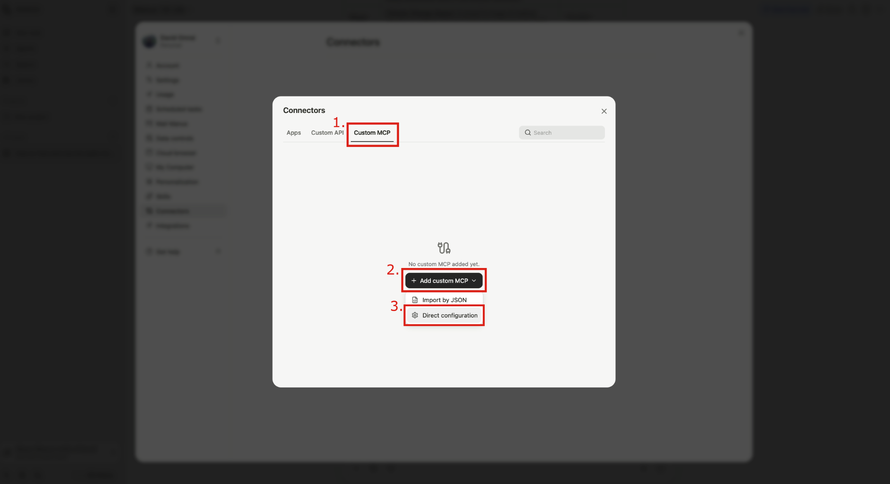
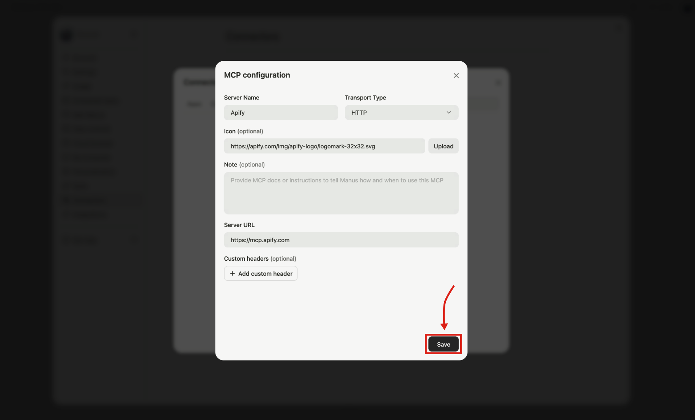
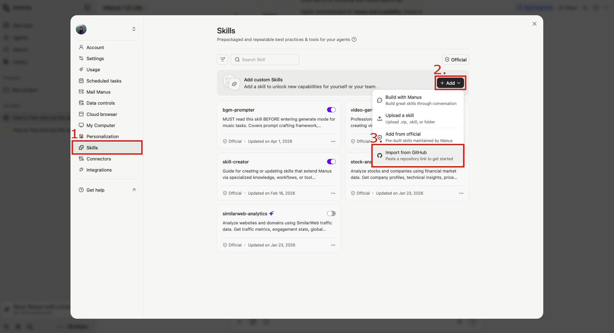
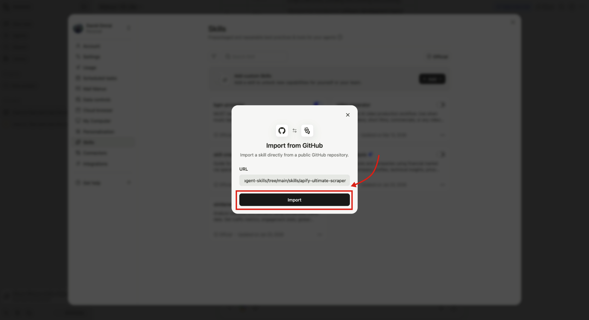
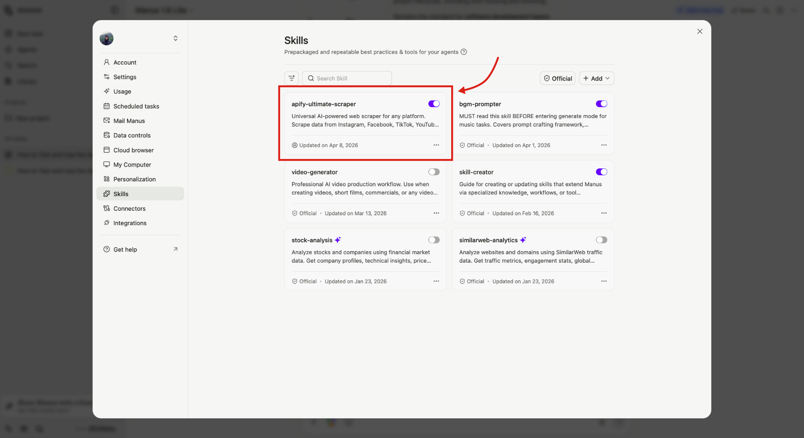
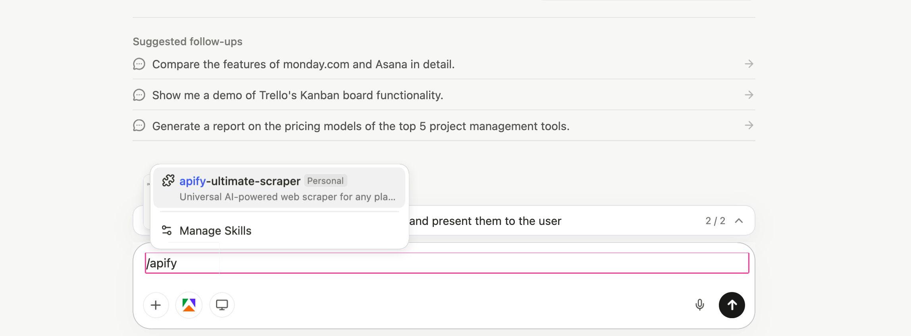
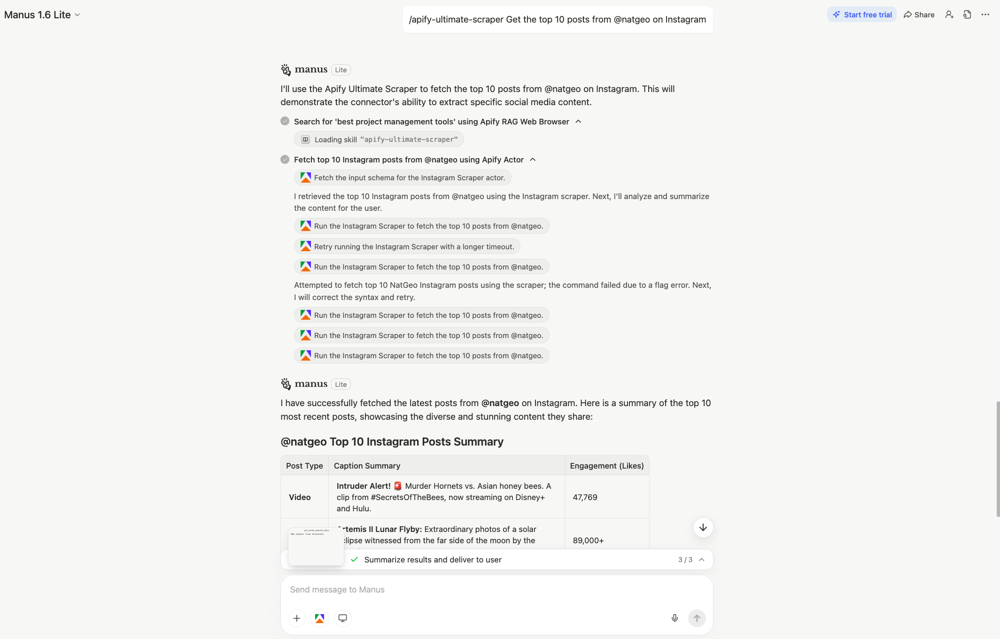
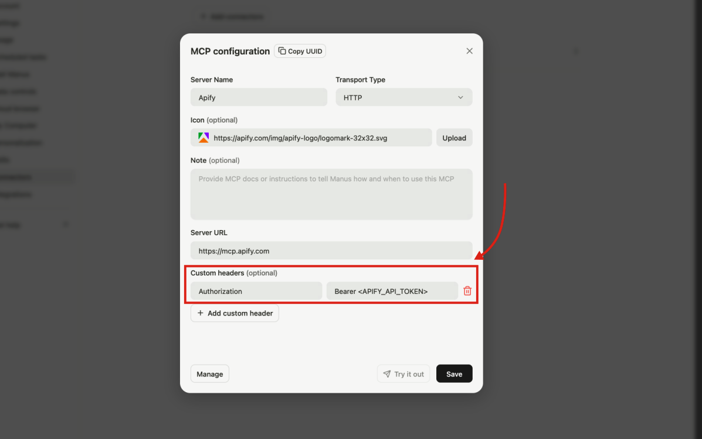

The _Manus_ integration connects Manus to Apify's library of [Actors](https://apify.com/store) through the [Model Context Protocol (MCP)](https://modelcontextprotocol.io/docs/getting-started/intro).
This allows Manus agents to search and run Actors, scrape URLs, and retrieve datasets directly in agent sessions - without writing any code.
You can also import [Apify Agent Skills](https://github.com/apify/agent-skills) from GitHub to give Manus structured, reusable scraping workflows.

_Example prompt_:

> "Search for 'best project management tools' on Google and summarize the top 10 results"

In this guide, you'll learn how to connect Manus to the Apify MCP server as a custom connector, and how to import Apify Agent Skills from GitHub.

## Prerequisites

Before connecting Manus to Apify, you'll need:

- [An Apify account](https://console.apify.com/sign-up) - If you don't have one yet, sign up for free.
- [A Manus account](https://manus.im) - MCP access is available on all Manus plans, including Free.

## Connect the Apify MCP server

1. In Manus, open **Settings**.

    

1. Open **Connectors**.

    

1. Click **+ Add connectors**.

    

1. Go to the **Custom MCP** tab, click **+ Add custom MCP**, then select **Direct configuration** for a manual setup.

    
1. Fill in the following fields and click **Save**:
    - **Server name** - e.g. `Apify`
    - **Transport type** - `HTTP` (default)
    - **Icon** (optional) - `https://apify.com/img/apify-logo/logomark-32x32.svg`
    - **Server URL** - `https://mcp.apify.com`
    

:::tip Customize available tools

The default MCP server URL exposes a predefined set of tools. You can choose exactly which tools and Actors are available by building a custom MCP URL with the [MCP configurator](https://mcp.apify.com). See [Configure tools](#configure-tools) below for details.

:::

## Try the MCP connector in Manus

To use the Apify connector in a chat session, click the connectors icon in the toolbar below the chat input and toggle **Apify** on.


The first time Manus tries to call an Apify tool, it will pause and prompt you to **Log in** to your Apify account via OAuth. After you authorize, the connector stays authenticated for future sessions.


:::tip Authentication fallback

If the OAuth login doesn't work, you can authenticate with your API token instead. See [OAuth login not working](#oauth-login-not-working) for instructions.

:::

:::tip Revoke access

You can revoke the Manus connector's access to your Apify account at any time in [Apify Console > Settings > Integrations](https://console.apify.com/settings/integrations).

:::

Try asking Manus something like:

> "Search for 'best project management tools' on Google and summarize the top 10 results"

Manus will call `search-actors` to find [Google Search Scraper](https://apify.com/apify/google-search-scraper), use `call-actor` to run it, and then `get-actor-output` to retrieve and summarize the results.

## Configure tools

After connecting, the Apify MCP server exposes a default set of tools for Actor discovery (`search-actors`, `fetch-actor-details`, `call-actor`, `get-actor-output`), web browsing (`apify/rag-web-browser`), and documentation search (`search-apify-docs`, `fetch-apify-docs`). See the [full tool reference](/platform/integrations/mcp#available-tools) for the complete list.

To control which tools are available, append a `tools=` query parameter to the server URL:

| Goal | Server URL |
| --- | --- |
| Default tool set | `https://mcp.apify.com` |
| Actor discovery and Apify docs search only | `https://mcp.apify.com?tools=actors,docs` |
| Specific Actors only | `https://mcp.apify.com?tools=apify/instagram-scraper,apify/google-search-scraper` |

Use the interactive configurator at [mcp.apify.com](https://mcp.apify.com) to browse available tools and generate a MCP server URL you can paste directly into Manus.

## Import Apify Agent Skills

[Apify Agent Skills](https://github.com/apify/agent-skills) are reusable, structured workflows that tell Manus _how_ to accomplish scraping tasks using Apify tools.
Unlike MCP connectors (which provide tool access), each skill is a `SKILL.md` file that bundles domain knowledge, step-by-step instructions, and best practices Manus can follow.

Available skills include:

| Skill | Description |
| --- | --- |
| `apify-ultimate-scraper` | Universal scraper for 55+ platforms - Instagram, TikTok, Google Maps, Amazon, and more |
| `apify-actor-development` | Full Actor lifecycle: template selection, development, testing, and deployment |
| `apify-actorization` | Converts existing projects into Apify Actors |
| `apify-generate-output-schema` | Generates dataset and key-value store schemas from Actor source code |

### Import a skill from GitHub

Each skill lives in its own folder inside the [apify/agent-skills](https://github.com/apify/agent-skills) repository.

:::note Skill folder URL

When importing in Manus, provide the URL of the folder that contains the `SKILL.md` file, not the repository root.

:::

Folder URLs follow this format:

```text
https://github.com/apify/agent-skills/tree/main/skills/{skill-name}
```

To import the `apify-ultimate-scraper` skill:

1. In Manus, open **Settings** and select the **Skills** tab.
1. Click **+ Add** → **Import from GitHub**.

    

1. Paste the skill folder URL and click **Import**:

    ```text
    https://github.com/apify/agent-skills/tree/main/skills/apify-ultimate-scraper
    ```

    

After importing, the skill appears in your Skills list with its toggle turned on, meaning you can reference it in any chat right away.



Repeat this for any other skill you want to add.

### Use an imported skill

Reference a skill in any Manus chat by typing `/` followed by the skill name.
For example, to use `apify-ultimate-scraper`:

1. Type `/apify-ultimate-scraper` in the Manus chat.

    

1. Ask Manus to perform a task, for example:

    > "Get the top 10 posts from @natgeo on Instagram"

Manus will load the skill instructions and use the appropriate Apify Actors to complete the task.



## Troubleshooting

### OAuth login not working

If the OAuth prompt fails or you can't complete the login flow, you can connect using your Apify API token directly.

1. Go to [Apify Console > Settings > Integrations](https://console.apify.com/settings/integrations) and copy your API token.
1. In Manus, open the Apify connector settings and add a custom header:
    - **Header name** - `Authorization`
    - **Header value** - `Bearer <APIFY_API_TOKEN>` (replace `<APIFY_API_TOKEN>` with your actual token)
1. Click **Save**.

    

## Limitations

- Long-running Actors may time out before a Manus session finishes processing them. If a scrape times out, reduce the scope (fewer URLs, smaller result limits) or split the work across multiple prompts.
- Each MCP tool call consumes Manus credits in addition to any Apify platform costs. Complex workflows using multiple Actors can consume credits quickly.
- When you share a Manus session, recipients can see conversation messages and output artifacts. Connectors are automatically disabled in shared sessions, but avoid including sensitive data in the conversation itself.

## Related integrations

- [ChatGPT integration](/platform/integrations/chatgpt) - Connect the Apify MCP server to ChatGPT
- [MCP server integration](/platform/integrations/mcp) - Use the Apify MCP server with Claude Desktop, VS Code, and other clients

## Resources

- [Manus MCP Connectors docs](https://manus.im/docs/integrations/mcp-connectors) - Official Manus documentation on custom MCP servers
- [Manus Agent Skills docs](https://manus.im/docs/features/skills) - Official Manus documentation on Skills
- [Apify Agent Skills repository](https://github.com/apify/agent-skills) - Browse and import Apify skills
- [Apify Store](https://apify.com/store) - Browse Actors you can run from Manus
- [Apify MCP server configurator](https://mcp.apify.com) - Interactive tool to configure and preview the Apify MCP server
