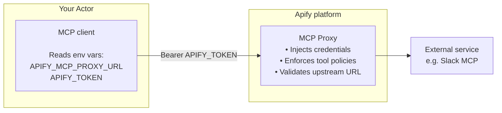

MCP Connectors let Actors call third-party services through [Model Context Protocol](https://modelcontextprotocol.io/docs/getting-started/intro) (MCP) on your behalf, using your credentials. Supported services include Notion, Slack, GitHub, Sentry, and Supabase.

You authorize a Connector once in your account settings. When you run an Actor that accepts Connectors, the input form shows a picker filtered to those compatible with the Actor's requirements. At runtime, the Apify platform injects your credentials server-side. The Actor never sees a token.

MCP Connectors are distinct from the [Apify MCP server](/platform/integrations/mcp). The MCP server exposes Apify Actors as tools to outside AI clients (Claude, ChatGPT, Cursor, and others); MCP Connectors do the opposite, letting Apify Actors call external MCP servers as tools. The two features are independent and can be used together or separately.

## How it works

1. The Actor developer declares which Connectors the Actor accepts in its input schema.
1. When you run the Actor, you select an eligible Connector in the input form. If you don't have one yet, you can create and authorize a new Connector in advance under **Settings > API & Integrations**.
1. When the Actor sends an MCP request to `APIFY_MCP_PROXY_URL/<connectorId>`, the Apify MCP Proxy validates the request, injects your credentials, and forwards it to the upstream MCP server the Connector is authorized against.

The Actor code uses a standard MCP client - no Apify-specific SDK is required.

## Security model

MCP Connectors are designed so that the Actor never holds your credentials, and you stay in control of what the Actor can do with them.

- Your credentials stay private. The Actor code never sees your tokens or API keys. The platform injects them on your behalf before forwarding each request.
- You control which Connectors an Actor can access. An Actor can only use Connectors you explicitly provide in the input. It cannot reach your other Connectors.
- Actors are held to what they declare. The proxy enforces that an Actor can only call tools it explicitly declared in its input schema. It cannot use your Connector to call anything beyond that, regardless of what the Connector supports.
- Access ends when the run ends. The proxy session expires as soon as the Actor run finishes.

For the developer-side controls and tool-permission model, see [Build Actors with MCP Connectors](/platform/integrations/mcp-connectors/use-in-actors#tool-permissions).

## Authentication methods

When you create a Connector, the platform inspects the MCP server URL you provide and offers the authentication methods that server supports.

| Method | When to use |
| --- | --- |
| API key or bearer token | The MCP server uses a static API key or personal access token (PAT). |
| OAuth | The server supports OAuth and either (a) supports Dynamic Client Registration (DCR), so Apify registers an OAuth client automatically, or (b) Apify provides a managed OAuth client for that service. |
| Own OAuth client | The server uses OAuth but neither DCR nor an Apify-managed client is available. You register your own OAuth app with the provider and supply the credentials to Apify. |

At launch, Notion and Supabase can be connected with no OAuth app setup on your side. Services such as GitHub, Slack, Google, and Microsoft require the Own OAuth Client flow - the same approach used by Claude Code, VS Code, and ChatGPT integrations.

For step-by-step instructions on creating, authorizing, and managing Connectors, see [Account settings - MCP Connectors](/platform/console/settings#mcp-connectors).

## Use cases

Typical patterns that MCP Connectors enable:

- Push results to user tools. An Actor that scrapes data on a schedule writes the output to a Notion database, a Supabase table, or a Slack channel the user owns - without the Actor ever holding a Notion API key or a Slack token.
- Combine Apify scraping with the user's own integrations. An Actor crawls a list of companies, then enriches the output by calling MCP tools the user has connected (CRM, project tracker, internal database).
- Multi-service workflows. An Actor that monitors something can post a message to Slack on one condition and write a row to a database on another, with both connections supplied by the user at runtime.
- Reusable utility Actors. A single Actor takes a generic input (a dataset ID, a URL, a search query) and one or more user-supplied Connectors as the destination, so the same Actor works across many services.

## Current limitations

- Apify-managed OAuth clients are limited at launch. Only Notion and Supabase work without OAuth app registration. For other OAuth-based services (GitHub, Slack, Google, Microsoft, and others), use the Own OAuth Client flow.
- Per-tool restrictions on Connectors are not editable in the UI. The platform discovers and displays the tools a Connector exposes, but the Connector itself does not yet support restricting individual tools. All discovered tools are allowed by default at the Connector level. Tool restrictions can still be enforced from the Actor side through the input schema - see [Tool permissions](/platform/integrations/mcp-connectors/use-in-actors#tool-permissions).
- Tools are discovered once. Tool discovery happens when you first authorize a Connector. There is no automatic re-discovery if the upstream server adds new tools.

## Next steps

- [Build Actors with MCP Connectors](/platform/integrations/mcp-connectors/use-in-actors) - declare Connectors in your input schema, connect from TypeScript or Python, and configure tool permissions.
- [Account settings - MCP Connectors](/platform/console/settings#mcp-connectors) - create, authorize, and manage Connectors in Apify Console.
- [Apify MCP server](/platform/integrations/mcp) - expose Apify Actors as MCP tools to outside AI clients.
