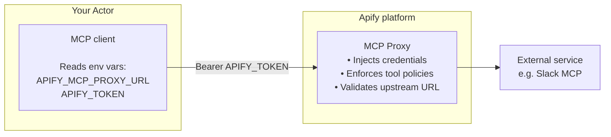

MCP connectors let Actors call third-party services through [Model Context Protocol](https://modelcontextprotocol.io/docs/getting-started/intro) (MCP) on your behalf, using your credentials. Supported services include Notion, Slack, GitHub, Sentry, and Supabase.

You authorize a connector once in your [Account settings > API & Integrations](https://console.apify.com/settings/integrations). When you run an Actor that accepts connectors, the input form shows a picker filtered to those compatible with the Actor's requirements. At runtime, the Apify platform injects your service credentials server-side. The Actor authenticates to the proxy with its Apify run token, never with your third-party credentials.

MCP connectors are distinct from the [Apify MCP server](/integrations/mcp). The MCP server exposes Apify Actors as tools to outside AI clients (Claude, ChatGPT, Cursor, and others); MCP connectors do the opposite, letting Apify Actors call external MCP servers as tools. The two features are independent and can be used together or separately.

## How it works

 
1. The Actor developer declares which connectors the Actor accepts in its input schema (either a specific server, or any MCP-compatible connector).
1. When you run the Actor, you select an eligible connector in the input form. If you don't have one yet, you can create and authorize a new connector in advance under **Settings > API & Integrations** or inline within the Actor input.
1. When the Actor sends an MCP request to `APIFY_MCP_PROXY_URL/<connectorId>`, the Apify MCP Proxy validates the request, injects your credentials, and forwards it to the upstream MCP server the connector is authorized against.

The Actor code uses a standard MCP client - no Apify-specific SDK is required.

## Security model

MCP connectors are designed so that the Actor never holds your credentials, and you stay in control of what the Actor can do with them.

- Your third-party credentials stay private. The Actor uses its Apify run token to reach the proxy; the OAuth token, API key, or PAT stored in the connector never enters the Actor. The platform injects it server-side before forwarding each request.
- You control which connectors an Actor can access. An Actor can only use connectors you explicitly provide in the input. It cannot reach your other connectors.
- Actors are held to what they declare. The proxy enforces that an Actor can only call tools it explicitly declared in its input schema. It cannot use your connector to call anything beyond that, regardless of what the connector supports.
- Access ends when the run ends. The proxy session expires as soon as the Actor run finishes.
- You control which tools a connector permits. The restriction applies to every Actor using the connector, on top of each Actor's own declared tool constraints.

For the developer-side controls and tool-permission model, see [Build Actors with MCP connectors](/integrations/mcp-connectors/use-in-actors#tool-permissions).

## Authentication methods

When you create a connector, the platform inspects the MCP server URL you provide and offers the authentication methods that server supports.

| Method | When to use |
| --- | --- |
| API key or bearer token | The MCP server uses a static API key or personal access token (PAT). |
| OAuth | The server supports OAuth and either (a) supports Dynamic Client Registration (DCR), so Apify registers an OAuth client automatically, or (b) Apify provides a managed OAuth client for that service. |
| Own OAuth client | The server uses OAuth but neither DCR nor an Apify-managed client is available. You register your own OAuth app with the provider and supply the credentials to Apify. |

Apify provides automatic OAuth client setup for Notion and Supabase. For GitHub, Slack, Google, Microsoft Entra, and other providers, register your own OAuth app and use the Own OAuth Client flow.

Tools are discovered when you first authorize a connector. To pick up new tools added to the upstream server, re-authorize the connector.

Create and manage your connectors in [Settings > API & Integrations > MCP connectors](/account/settings#mcp-connectors).

## Run an Actor with a connector

When you run an Actor that accepts MCP connectors, the input form shows a connector picker filtered to those compatible with the Actor's requirements. Pick one of your authorized connectors, or create a new one inline. To set connectors up in advance, see [Account settings - MCP connectors](/account/settings#mcp-connectors).

## Use cases

Typical patterns that MCP connectors enable:

- Push results to user tools. An Actor that scrapes data on a schedule writes the output to a Notion database, a Supabase table, or a Slack channel the user owns - without the Actor ever holding a Notion API key or a Slack token.
- Combine Apify scraping with the user's own integrations. An Actor crawls a list of companies, then enriches the output by calling MCP tools the user has connected (CRM, project tracker, internal database).
- Multi-service workflows. An Actor that monitors something can post a message to Slack on one condition and write a row to a database on another, with both connections supplied by the user at runtime.
- Reusable utility Actors. A single Actor takes a generic input (a dataset ID, a URL, a search query) and one or more user-supplied connectors as the destination, so the same Actor works across many services.

## Next steps

- [Build Actors with MCP connectors](/integrations/mcp-connectors/use-in-actors) - declare connectors in your input schema, connect from TypeScript or Python, and configure tool permissions.
- [Account settings - MCP connectors](/account/settings#mcp-connectors) - create, authorize, and manage connectors in Apify Console.
- [Apify MCP server](/integrations/mcp) - expose Apify Actors as MCP tools to outside AI clients.
