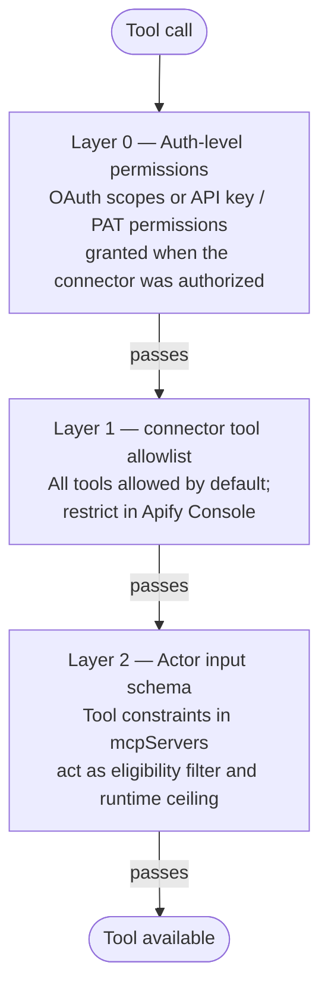

import Tabs from '@theme/Tabs';
import TabItem from '@theme/TabItem';

This guide explains how to build Actors that accept [MCP connectors](/integrations/mcp-connectors) as input, connect to them at runtime, and constrain which tools they can call.

## Declare connectors in the input schema

To accept MCP connectors as input, set `resourceType: "mcpConnector"` on the input field. This renders a connector picker in Apify Console and enforces which connectors are compatible with the Actor.

### Single connector

For an Actor that uses one connector, set `type` to `string`:

```json
{
    "slackConnector": {
        "title": "Slack connector",
        "description": "Connector to your Slack workspace",
        "type": "string",
        "resourceType": "mcpConnector",
        "mcpServers": [
            { "url": "https://mcp.slack.com/mcp" }
        ]
    }
}
```

At runtime, the input value is a single connector ID:

```json
{ "slackConnector": "conn_abc123" }
```

### Multiple connectors

For an Actor that accepts several connectors, set `type` to `array`:

```json
{
    "mcpConnectors": {
        "title": "MCP connectors",
        "description": "MCP server connections for this Actor to use",
        "type": "array",
        "resourceType": "mcpConnector",
        "mcpServers": [
            { "url": "*" }
        ]
    }
}
```

At runtime, the input value is an array of connector IDs:

```json
{ "mcpConnectors": ["conn_abc123", "conn_def456"] }
```

## The `mcpServers` rule list

Each entry in `mcpServers` is an independent rule that defines an eligible connector by the upstream server URL it targets and the tools it must support. A connector is eligible if it satisfies at least one entry: its server URL matches the entry's `url` pattern and it meets the entry's `tools` constraints.

The rules serve two purposes at once:

- _Eligibility filter_ - the connector picker in the input form only offers connectors that match at least one rule.
- _Runtime ceiling_ - the proxy holds the Actor to its declaration. The Actor can only see (through a filtered `tools/list`) and call (through a guarded `tools/call`) tools that fall within the rule it matched.

### `url`

URL pattern of the server an entry targets. The `*` wildcard matches zero or more characters.

```json
"mcpServers": [
    { "url": "https://mcp.slack.com/mcp" },
    { "url": "https://*.slack.com/*" },
    { "url": "*" }
]
```

### `tools.required`

An optional array of tool name patterns. For each pattern, the connector must support at least one tool with a matching name. The `*` wildcard matches zero or more characters. Omit `required` (or use `["*"]`) to place no restriction on tool names.

```json
"mcpServers": [
    {
        "url": "https://mcp.slack.com/mcp",
        "tools": {
            "required": ["send_message", "list_channels", "post_*"]
        }
    }
]
```

### Behavioral hints

Four hint fields constrain which tools are permitted based on their [MCP tool annotations](https://modelcontextprotocol.io/docs/concepts/tools#tool-annotations). When a hint is omitted, it imposes no restriction. When set to an explicit `true` or `false`, a tool passes only if its effective hint value matches. If the upstream server does not annotate a tool, the MCP specification default applies.

| Hint | Omitted | Explicitly `true` | Explicitly `false` |
| --- | --- | --- | --- |
| `readOnly` | No restriction | Read-only tools only | Mutating tools only (includes unannotated tools - MCP default is `false`) |
| `destructive` | No restriction | Destructive tools only (includes unannotated tools - MCP default is `true`) | Non-destructive tools only |
| `idempotent` | No restriction | Idempotent tools only | Non-idempotent tools only (includes unannotated tools - MCP default is `false`) |
| `openWorld` | No restriction | Open-world tools only (includes unannotated tools - MCP default is `true`) | Closed-world tools only |

Example combining `required` patterns with hints:

```json
"mcpServers": [
    {
        "url": "https://mcp.example.com/*",
        "tools": {
            "required": ["read_*"],
            "readOnly": true,
            "destructive": false
        }
    }
]
```

## Input schema reference

```typescript
// Single connector (type: "string")
{
    title: string;              // Required.
    description: string;        // Required.
    type: "string";
    resourceType: "mcpConnector";
    mcpServers: McpServer[];    // Required. At least one entry.

    editor?: "resourcePicker"   // Default. Shows a connector picker in the UI.
           | "textfield"        // Accepts a connector ID as free text.
           | "hidden";

    nullable?: boolean;
    default?: string;
    prefill?: string;
    example?: string;
    sectionCaption?: string;
    sectionDescription?: string;
}

// Multiple connectors (type: "array")
{
    title: string;
    description: string;
    type: "array";
    resourceType: "mcpConnector";
    mcpServers: McpServer[];

    editor?: "resourcePicker"   // Default. Shows a connector picker in the UI.
           | "hidden";

    minItems?: number;
    maxItems?: number;
    uniqueItems?: boolean;

    nullable?: boolean;
    default?: string[];
    prefill?: string[];
    example?: string[];
    sectionCaption?: string;
    sectionDescription?: string;
}

// McpServer entry
{
    url: string;                // URL or pattern. Use "*" to accept any server.
    tools?: {
        required?: string[];    // Tool name patterns. Omit or ["*"] for all tools.
        readOnly?: boolean;
        destructive?: boolean;
        idempotent?: boolean;
        openWorld?: boolean;
    };
}
```

## Examples

### Read-only Slack monitor

```json
{
    "properties": {
        "slackConnector": {
            "title": "Slack connector",
            "description": "Read-only access to your Slack workspace",
            "type": "string",
            "resourceType": "mcpConnector",
            "mcpServers": [
                {
                    "url": "https://mcp.slack.com/mcp",
                    "tools": {
                        "required": ["list_*", "get_*", "read_*"],
                        "readOnly": true,
                        "destructive": false,
                        "idempotent": true
                    }
                }
            ]
        }
    }
}
```

### General-purpose agent

Any server, any tools:

```json
{
    "properties": {
        "mcpConnectors": {
            "title": "MCP connectors",
            "description": "Give this Actor access to any MCP servers you want it to use",
            "type": "array",
            "resourceType": "mcpConnector",
            "mcpServers": [
                { "url": "*" }
            ]
        }
    }
}
```

### Multi-service messaging

Multiple allowed servers, send-only tools:

```json
{
    "properties": {
        "messagingConnectors": {
            "title": "Messaging connectors",
            "description": "Connections to messaging services for sending notifications",
            "type": "array",
            "resourceType": "mcpConnector",
            "mcpServers": [
                {
                    "url": "https://mcp.slack.com/mcp",
                    "tools": { "required": ["send_message", "post_*", "list_channels"] }
                },
                {
                    "url": "https://mcp.discord.com/mcp",
                    "tools": { "required": ["send_message", "post_*", "list_channels"] }
                }
            ]
        }
    }
}
```

### Output-writing Actor

Any server that supports at least one output-writing tool:

```json
{
    "properties": {
        "outputConnectors": {
            "title": "Output connectors",
            "description": "Connectors to any MCP servers that support at least one output-writing tool",
            "type": "array",
            "resourceType": "mcpConnector",
            "mcpServers": [
                { "url": "*", "tools": { "required": ["send_*"] } },
                { "url": "*", "tools": { "required": ["post_*"] } },
                { "url": "*", "tools": { "required": ["write_*"] } },
                { "url": "*", "tools": { "required": ["log_*"] } }
            ]
        }
    }
}
```

## Connect from the Actor

Every Actor run receives two environment variables for MCP connector access.

| Variable | Description |
| --- | --- |
| `APIFY_MCP_PROXY_URL` | Base URL of the Apify MCP Proxy. Connect to a connector at `${APIFY_MCP_PROXY_URL}/<connectorId>`. |
| `APIFY_TOKEN` | API token of the user who started the Actor. Use it as the bearer token for proxy requests. |

The Actor uses a standard MCP client to connect to the proxy URL with the token as a bearer credential. No Apify-specific MCP SDK is required.

<Tabs groupId="language">
<TabItem value="typescript" label="TypeScript">

Install the [official MCP TypeScript SDK](https://github.com/modelcontextprotocol/typescript-sdk):

```bash
npm install @modelcontextprotocol/sdk
```

```typescript
import { Client } from '@modelcontextprotocol/sdk/client/index.js';
import { StreamableHTTPClientTransport } from '@modelcontextprotocol/sdk/client/streamableHttp.js';
import { Actor } from 'apify';

await Actor.init();

const input = await Actor.getInputOrThrow<{ slackConnector: string }>();
const connectorId = input.slackConnector;

const transport = new StreamableHTTPClientTransport(
    new URL(`${process.env.APIFY_MCP_PROXY_URL}/${connectorId}`),
    {
        requestInit: {
            headers: {
                Authorization: `Bearer ${process.env.APIFY_TOKEN}`,
            },
        },
    },
);

const client = new Client({ name: 'my-actor', version: '1.0.0' });
await client.connect(transport);

const { tools } = await client.listTools();
console.log(tools.map((t) => t.name));

const result = await client.callTool({
    name: 'send_message',
    arguments: { channel: '#general', text: 'Hello from Apify!' },
});

await client.close();
await Actor.exit();
```

</TabItem>
<TabItem value="python" label="Python">

Install the [official MCP Python SDK](https://github.com/modelcontextprotocol/python-sdk):

```bash
pip install mcp httpx apify
```

```python
import asyncio
import os

import httpx
from apify import Actor
from mcp import ClientSession
from mcp.client.streamable_http import streamable_http_client

async def main():
    async with Actor:
        input_data = await Actor.get_input()
        connector_id = input_data['slack_connector']

        proxy_url = os.environ['APIFY_MCP_PROXY_URL']
        token = os.environ['APIFY_TOKEN']

        async with httpx.AsyncClient(
            headers={"Authorization": f"Bearer {token}"},
        ) as http_client:
            async with streamable_http_client(
                f"{proxy_url}/{connector_id}",
                http_client=http_client,
            ) as (read, write, _):
                async with ClientSession(read, write) as session:
                    await session.initialize()
                    tools = (await session.list_tools()).tools
                    result = await session.call_tool(
                        "send_message",
                        arguments={
                            "channel": "#general",
                            "text": "Hello from Apify!",
                        },
                    )

asyncio.run(main())
```

</TabItem>
</Tabs>

## Connect multiple connectors

When the input field uses `type: "array"`, create one MCP client per connector ID. Each connector gets its own session through the proxy.

```typescript
import { Client } from '@modelcontextprotocol/sdk/client/index.js';
import { StreamableHTTPClientTransport } from '@modelcontextprotocol/sdk/client/streamableHttp.js';

const connectorIds: string[] = input.mcpConnectors;

const clients = await Promise.all(
    connectorIds.map(async (connectorId) => {
        const transport = new StreamableHTTPClientTransport(
            new URL(`${process.env.APIFY_MCP_PROXY_URL}/${connectorId}`),
            {
                requestInit: {
                    headers: { Authorization: `Bearer ${process.env.APIFY_TOKEN}` },
                },
            },
        );
        const client = new Client({ name: 'my-actor', version: '1.0.0' });
        await client.connect(transport);
        return client;
    }),
);
```

## Tool permissions

Three independent layers control which tools are accessible when an Actor uses a connector. A tool is available only if it passes every configured layer. An unconfigured layer imposes no restriction.



### Layer 0 - authentication scope

When you authorize a connector, the permissions granted at the auth step (OAuth scopes, or the permissions configured on an API key or PAT) bound everything that follows. A tool that requires write access to a resource the token cannot reach will fail at the upstream MCP server, regardless of what the other layers allow.

### Layer 1 - connector tool allowlist

At the connector level, all tools the upstream MCP server discovers are allowed by default. You can restrict which tools the connector permits in Apify Console. This is useful when you want to limit access at the connector level. The set of discovered tools is fixed at the time the connector is authorized.

### Layer 2 - input schema constraints

The Actor's `mcpServers[].tools` declaration in the input schema is the strongest enforcement point because it ties tool access to a specific Actor. The proxy filters `tools/list` responses to only show the declared tools and rejects `tools/call` requests for any tool outside the declared set.

For the full schema, see [The `mcpServers` rule list](#the-mcpservers-rule-list).

## Related pages

- [MCP connectors overview](/integrations/mcp-connectors)
- [Input schema specification - resource type](/actors/development/actor-definition/input-schema/specification/v1#resource-type)
- [Account settings - MCP connectors](/account/settings#mcp-connectors)
- [Apify environment variables](/actors/development/programming-interface/environment-variables#system-environment-variables)
