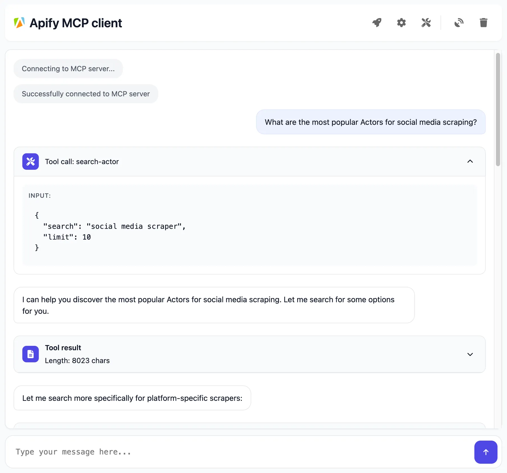

<!-- markdownlint-disable MD024 -->

The _Apify Model Context Protocol (MCP) Server_ allows AI applications to connect to Apify's extensive library of Actors as tools to perform web scraping, data extraction, or other automation tasks in real time.


## Quickstart

You can use the Apify MCP Server in two ways:

- _HTTPS Endpoint_ `mcp.apify.com`: Connect your MCP client through OAuth or by including `Authorization: Bearer <APIFY_TOKEN>` header in your requests.
  - `https://mcp.apify.com` for streamable transport
- _Standard Input/Output (stdio)_: Ideal for local integrations and command-line tools such as the Claude for Desktop client.
  - Set MCP client server command to `npx @apify/actors-mcp-server` and environment variable `APIFY_TOKEN` to your Apify API token
  - See `npx @apify/actors-mcp-server --help` for more options

:::tip Quick setup options
_MCP server configuration for other clients_: Use https://mcp.apify.com to select Actors and tools, then copy the configuration to your client.

_Claude Desktop_: Download and run the [Apify MCP Server DXT file](https://github.com/apify/actors-mcp-server/releases/latest/download/actors-mcp-server.dxt) for one-click installation.

:::

## Prerequisites

Before you start, make sure you have the following:

1. _An Apify account:_ Sign up for a free Apify account if you don’t have one.
1. _Apify API Token:_ Get your personal API token from the **Integrations** section in [Apify Console](https://console.apify.com/account#/integrations). This token will be used to authorize the MCP server to run Actors on your behalf.
1. _MCP client:_ An AI agent or client that supports MCP. This could be Anthropic Claude for Desktop, a VS Code extension with MCP support, Apify’s web-based Tester MCP Client, or any custom client implementation. See supported MCP clients in [official documentation](https://modelcontextprotocol.io/clients).

## Example usage (Streamable HTTP with OAuth)

We recommend connecting through OAuth for a secure and simple authentication process.

During setup, provide the server URL `https://mcp.apify.com`. You will then be redirected to your browser to sign in to your Apify account and approve the connection. The configuration steps may vary slightly depending on your MCP client.

```json
{
 "mcpServers": {
   "apify": {
     "url": "https://mcp.apify.com"
   }
 }
}
```

You can also use your Apify token directly, instead of OAuth, by setting the `Authorization: Bearer <APIFY_TOKEN>` header in the MCP server configuration:

```json
{
 "mcpServers": {
   "apify": {
     "url": "https://mcp.apify.com",
     "headers": {
         "Authorization": "Bearer your-apify-token"
     }
   }
  }
}
```

## Example usage (local stdio with Claude for Desktop)

Let’s walk through an example of using Claude for Desktop with the Apify MCP Server:

1. _Configure Claude for Desktop:_ Enable MCP servers via the **Developer settings**. You need to add an entry for the Apify MCP server. For instance, in Claude’s config file, under `mcpServers`, add an entry like:

    ```json
    {
     "mcpServers": {
       "actors-mcp-server": {
         "command": "npx",
         "args": ["-y", "@apify/actors-mcp-server"],
         "env": {
            "APIFY_TOKEN": "YOUR_APIFY_TOKEN"
         }
       }
     }
    }
    ```

    This tells Claude to spawn the Apify MCP Server (via the [Actors MCP Server](https://www.npmjs.com/package/@apify/actors-mcp-server) NPM package with your API token (on the first run, it will download the package automatically).

1. _Launch Claude and connect:_ After updating the config, restart Claude for Desktop. If successful, Claude will show a “plugin” (often indicated by a plug icon 🔌) signifying it connected to the Apify Actors MCP server.

1. _Use the Actors in conversation:_ You can chat with Claude and ask it to use Apify Actors. For example: _“What Apify Actors can I use?”_ Claude will list available tools via the MCP server. If none are pre-loaded, it may show defaults or guide you to find more.

:::note Web-based alternative

If you prefer not to set up Claude desktop, you can achieve a similar result using [Apify’s Tester MCP Client](https://apify.com/jiri.spilka/tester-mcp-client), which provides a web UI to test the MCP server.)

:::



## Interact with the MCP server over legacy SSE transport

:::caution Legacy SSE transport is discouraged

We strongly recommend using the latest [streamable HTTP transport](https://modelcontextprotocol.io/specification/2025-06-18/basic/transports#streamable-http) for new integrations via `https://mcp.apify.com` instead of `https://mcp.apify.com/sse`. The legacy SSE transport is deprecated and will be removed in the future.

:::

You can interact with the server through legacy Server-Sent Events (SSE) to send messages and receive responses.

In the client settings, you need to provide server configuration:

```json
{
    "mcpServers": {
        "apify": {
            "type": "sse",
            "url": "https://mcp.apify.com/sse",
            "headers": {
                "Authorization": "Bearer your-apify-token"
            }
        }
    }
}
```

## Tools, resources, and prompts

The MCP server provides a set of tools for interacting with Apify Actors.
Since the Apify Store is large and growing rapidly, the MCP server provides a way to dynamically discover and use new Actors.

### Actors

Any [Apify Actor](https://apify.com/store) can be used as a tool.
By default, the server is pre-configured with one Actor, `apify/rag-web-browser`, and several helper tools.
The MCP server loads an Actor's input schema and creates a corresponding MCP tool.
This allows the AI agent to know exactly what arguments to pass to the Actor and what to expect in return.

For example, for the `apify/rag-web-browser` Actor, the input parameters are:

```json
{
  "query": "restaurants in San Francisco",
  "maxResults": 3
}
```

You don't need to manually specify which Actor to call or its input parameters; the LLM handles this automatically.
When a tool is called, the arguments are automatically passed to the Actor by the LLM.
You can refer to the specific Actor's documentation for a list of available arguments.

### Helper tools

One of the most powerful features of using MCP with Apify is dynamic tool discovery.
It gives an AI agent the ability to find new tools (Actors) as needed and incorporate them.
Here are some special MCP operations and how the Apify MCP Server supports them:

- **Apify Actors**: Search for Actors, view their details, and use them as tools for the AI.
- **Apify documentation**: Search the Apify documentation and fetch specific documents to provide context to the AI.
- **Actor runs**: Get lists of your Actor runs, inspect their details, and retrieve logs.
- **Apify storage**: Access data from your datasets and key-value stores.

### Overview of available tools

Here is an overview list of all the tools provided by the Apify MCP Server.

| Tool name | Category | Description | Enabled by default |
| :--- | :--- | :--- | :---: |
| `search-actors` | actors | Search for Actors in the Apify Store. | ✅ |
| `fetch-actor-details` | actors | Retrieve detailed information about a specific Actor. | ✅ |
| `call-actor` | actors | Call an Actor and get its run results. | ✅ |
| [`apify-slash-rag-web-browser`](https://apify.com/apify/rag-web-browser) | Actor (see [tool configuration](#tools-configuration)) | An Actor tool to browse the web. | ✅ |
| `search-apify-docs` | docs | Search the Apify documentation for relevant pages. | ✅ |
| `fetch-apify-docs` | docs | Fetch the full content of an Apify documentation page by its URL. | ✅ |
| `get-actor-run` | runs | Get detailed information about a specific Actor run. |  |
| `get-actor-run-list` | runs | Get a list of an Actor's runs, filterable by status. |  |
| `get-actor-log` | runs | Retrieve the logs for a specific Actor run. |  |
| `get-dataset` | storage | Get metadata about a specific dataset. |  |
| `get-dataset-items` | storage | Retrieve items from a dataset with support for filtering and pagination. |  |
| `get-dataset-schema` | storage | Generate a JSON schema from dataset items. |  |
| `get-key-value-store` | storage | Get metadata about a specific key-value store. |  |
| `get-key-value-store-keys`| storage | List the keys within a specific key-value store. |  |
| `get-key-value-store-record`| storage | Get the value associated with a specific key in a key-value store. |  |
| `get-dataset-list` | storage | List all available datasets for the user. |  |
| `get-key-value-store-list`| storage | List all available key-value stores for the user. |  |
| `add-actor` | experimental | Add an Actor as a new tool for the user to call. |  |

### Tools configuration

The `tools` configuration parameter is used to specify loaded tools - either categories or specific tools directly, and Apify Actors. For example, `tools=storage,runs` loads two categories; `tools=add-actor` loads just one tool.

When no query parameters are provided, the MCP server loads the following `tools` by default:

- `actors`
- `docs`
- `apify/rag-web-browser`

If the tools parameter is specified, only the listed tools or categories will be enabled - no default tools will be included.

:::tip Easy configuration

Use the [UI configurator](https://mcp.apify.com/) to configure your server, then copy the configuration to your client.

:::

**Configuring the hosted server:**

The hosted server can be configured using query parameters in the URL. For example, to load the default tools, use:

```text
https://mcp.apify.com?tools=actors,docs,apify/rag-web-browser
```

For minimal configuration, if you want to use only a single Actor tool - without any discovery or generic calling tools, the server can be configured as follows:

```text
https://mcp.apify.com?tools=apify/my-actor
```

This setup exposes only the specified Actor (`apify/my-actor`) as a tool. No other tools will be available.

**Configuring the CLI:**

The CLI can be configured using command-line flags. For example, to load the same tools as in the hosted server configuration, use:

```bash
npx @apify/actors-mcp-server --tools actors,docs,apify/rag-web-browser
```

The minimal configuration is similar to the hosted server configuration:

```bash
npx @apify/actors-mcp-server --tools apify/my-actor
```

As above, this exposes only the specified Actor (`apify/my-actor`) as a tool. No other tools will be available.

:::caution Important recommendation

**The default tools configuration may change in future versions.** When no `tools` parameter is specified, the server currently loads default tools, but this behavior is subject to change.

**For production use and stable interfaces, always explicitly specify the `tools` parameter** to ensure your configuration remains consistent across updates.

:::

### Prompts

The server provides a set of predefined example prompts to help you get started interacting with Apify through MCP. For example, there is a `GetLatestNewsOnTopic` prompt that allows you to easily retrieve the latest news on a specific topic using the [RAG Web Browser](https://apify.com/apify/rag-web-browser) Actor.

### Resources

The server does not yet provide any resources.

## Rate limits

The Apify MCP server has a rate limit of _30 requests per second_ per user. If you exceed this limit, you will receive a `429 Too Many Requests` response.

## Support and contribution

The Apify MCP Server is an open-source project.
You can report bugs, suggest new features, or ask questions in the [GitHub issues](https://github.com/apify/actors-mcp-server/issues).
If you find this project useful, please [star it on GitHub](https://github.com/apify/actors-mcp-server) to show your support!

- _Authorization (API Token):_ If the MCP server isn’t executing Actors, ensure you provided a correct Apify API token. Without a valid `APIFY_TOKEN`, the server cannot start Actor runs. Always set the `APIFY_TOKEN` environment variable when running locally.
- _Ensure latest version:_ If running via NPM, always use the latest version of `@apify/actors-mcp-server` for the newest features and fixes. You can append `@latest` when installing or in your config args to ensure this.
- _Node.js environment:_ If running the server locally, make sure Node.js is installed and up to date (`node -v`). The MCP server requires Node.js v18+.
- _No response or long delay:_ Keep in mind that when an Actor tool is called, it may take some time to complete (depending on the task). If nothing is coming back, check the Actor’s logs in Apify console — the Actor might be waiting on a long operation or input.

## Learn more

- [Model Context Protocol (MCP)](https://modelcontextprotocol.io/introduction): Learn about the open standard on the official MCP website – understanding the protocol can help you build custom agents.
- [Actors MCP Server GitHub](https://github.com/apify/actors-mcp-server): The README for the Apify MCP Server actor (available on Apify Store as `apify/actors-mcp-server`) provides technical details on implementation and advanced usage.
- [Apify Tester MCP Client](https://apify.com/jiri.spilka/tester-mcp-client): A specialized client actor (`jiri.spilka/tester-mcp-client`) that you can run to simulate an AI agent in your browser. Useful for testing your setup with a chat UI.
- [How to use MCP with Apify Actors](https://blog.apify.com/how-to-use-mcp/): Learn how to expose over 5,000 Apify Actors to AI agents with Claude and LangGraph, and configure MCP clients and servers.
- [Apify MCP Server Tutorial](https://www.youtube.com/watch?v=BKu8H91uCTg): Integrate thousands of Apify Actors and Agents with Claude.
