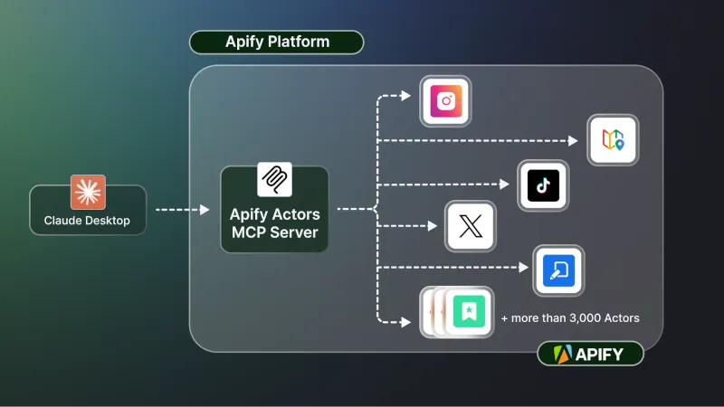
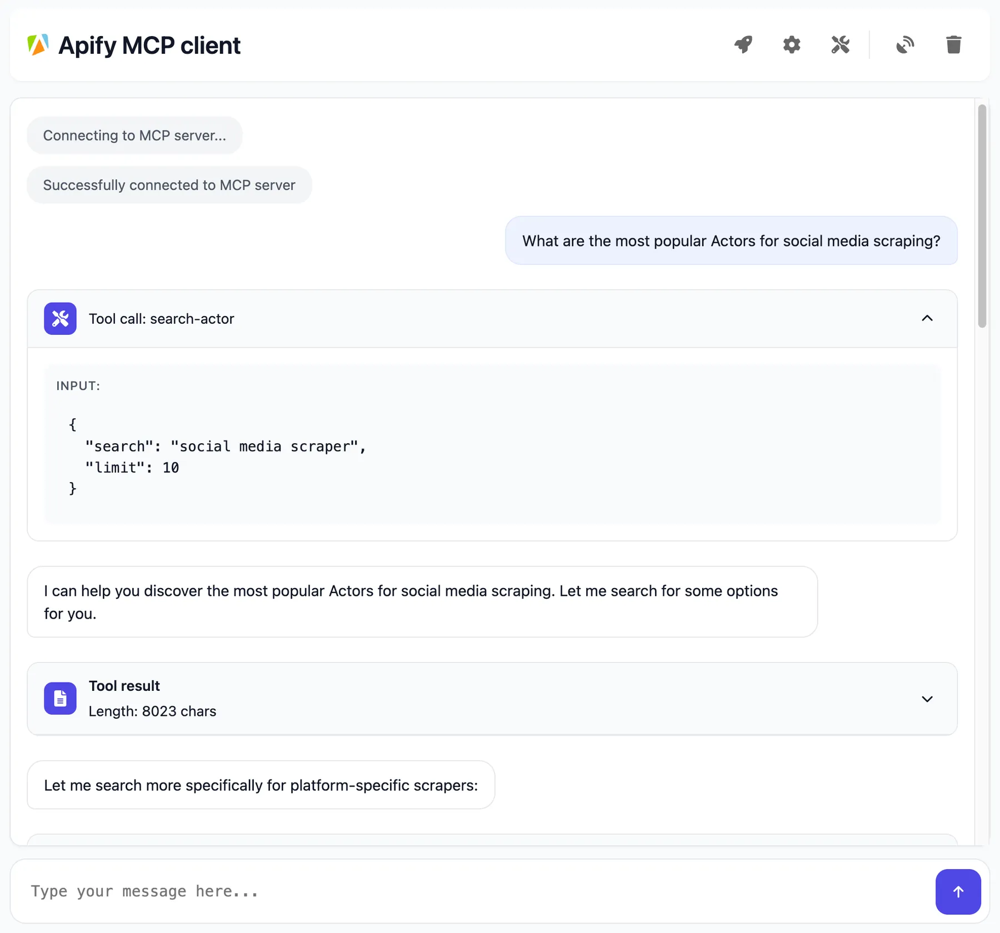

<!-- markdownlint-disable MD024 -->

The _Apify Model Context Protocol (MCP) Server_ allows AI applications to connect to Apify’s extensive library of Actors as tools to perform web scraping, data extraction, or other automation tasks in real time.



## How to use

You can use the Apify MCP Server in three ways:

- Local STDIO transport with desktop client (e.g. Claude Desktop)
- Run [Apify Actors MCP Server](https://apify.com/apify/actors-mcp-server) as Actor
- Use [mcp.apify.com](https://mcp.apify.com) with both legacy SSE on `/sse` and streamable transport in `/`

## Prerequisites

Before you start, make sure you have the following:

1. _An Apify account:_ Sign up for a free Apify account if you don’t have one.
1. _Apify API Token:_ Get your personal API token from the **Integrations** section in [Apify Console](https://console.apify.com/account#/integrations). This token will be used to authorize the MCP server to run Actors on your behalf.
1. _MCP Client:_ You will also need an AI agent or client that supports MCP. This could be Anthropic Claude (Desktop edition), a VS Code extension with MCP support, Apify’s web-based Tester MCP Client, or any custom client implementation. See supported MCP clients in [official documentation](https://modelcontextprotocol.io/clients).

## Example Usage (Local STDIO with Claude Desktop)

While you can interact with the MCP server using raw API calls or cURL, in practice you’ll often use an AI assistant interface. Let’s walk through an example of using Claude Desktop with the Apify MCP Server:

1. _Configure Claude Desktop:_ Claude Desktop supports MCP servers via the **Developer Mode** configuration. You need to add an entry for the Apify MCP server. For instance, in Claude’s config file, under `mcpServers`, add an entry like:

```json
    {
     "mcpServers": {
       "actors-mcp-server": {
         "command": "npx",
         "args": ["-y", "@apify/actors-mcp-server"],
         "env": {
            "APIFY_TOKEN": "YOUR_APIFY_TOKEN"
         }
       }
     }
    }
```

This tells Claude to spawn the Apify MCP Server (via the NPM package) with your API token. (On first run, it will download the package automatically.)

1. _Launch Claude and connect:_ After updating the config, restart Claude Desktop. If successful, Claude will show a “plugin” (often indicated by a plug icon 🔌) signifying it connected to the Apify Actors MCP server.

1. _Use the Actors in conversation:_ Now you can chat with Claude and ask it to use Apify Actors. For example, you might ask: _“What Apify Actors can I use?”_ Claude (through the MCP server) will list tools (Actors) available. If none are pre-loaded beyond the defaults, it might show a few default ones or instruct how to discover more. You can then ask something like: _“Use the Instagram Scraper to get the latest posts from NASA’s profile.”_ Claude will internally call the `apify/instagram-scraper` Actor via the MCP server and stream the results back to you, perhaps summarizing the output.

    Behind the scenes, Claude didn’t need to know the details of Apify’s API or Actors — it relied on the MCP server to handle tool execution. You, as the user, just see the answer or result in the chat.

1. **Dynamic tool loading:** If you ask for something that requires a tool not initially present, Claude can invoke the discovery mechanism. For instance, _“Find an Actor that scrapes Google Search and use it to search for ‘climate change news’.”_ Claude can call `search-actors` (to find a Google Search scraper), then `add-actor` (to add it), and then call it — all within one conversation. The result will then be presented.

This example shows how an AI assistant can leverage Apify Actors through MCP in a conversational way. The key is that once the client (Claude) is configured, you can use natural language to trigger complex workflows on Apify.

_(If you prefer not to set up Claude Desktop, you can achieve a similar result using [Apify’s Tester MCP Client](https://apify.com/jiri.spilka/tester-mcp-client), which provides a web UI to test the MCP server.)_



## Interact with the MCP Server over SSE

You can interact with the server through Server-Sent Events (SSE) to send messages and receive responses.

In the client settings, you need to provide server configuration:

```json
{
    "mcpServers": {
        "apify": {
            "type": "sse",
            "url": "https://actors-mcp-server.apify.actor/sse",
            "env": {
                "APIFY_TOKEN": "your-apify-token"
            }
        }
    }
}
```

## Adding Multiple Actors

By default, the main Actors MCP Server starts with a **default set of Actors** (currently a few popular ones like Instagram Scraper, RAG Web Browser, etc.). However, you can customize which Actors are available:

- **Via Actor Task (on Apify platform):** If you are running the MCP server as an Apify Actor (instead of via NPM), you can create a Task for the `apify/actors-mcp-server` Actor with a custom input specifying the Actors you want. This input would include an array of actor IDs or names. Running that Task (in Standby mode) will launch the MCP server with your chosen Actors instead of the defaults. This is useful if you always want a certain subset of tools and don’t need full dynamic discovery.
- **Dynamic adding during a session:** If your client supports it, the agent itself can add Actors dynamically by name (using the `add-actor` operation) at runtime. For example, after using `search-actors` to find an Actor’s name, calling `add-actor` with that name will load it. Note that not all MCP client frameworks allow dynamic tool addition at runtime, but Apify’s own tester client does (when `enableActorAutoLoading` in Actors MCP Server is true).
- **Via config file (for Claude Desktop):** When using Claude Desktop, you can specify which Actors should be immediately available by configuring your `mcpServers` settings. Add the Actors as a comma-separated list in the `--actors` parameter, as shown in the example below. This pre-loads your selected tools without requiring discovery during conversations, ideal for workflows with predictable tool needs.

```json
   {
    "mcpServers": {
      "actors-mcp-server": {
        "command": "npx",
        "args": [
          "-y", "@apify/actors-mcp-server",
          "--actors", "lukaskrivka/google-maps-with-contact-details,apify/instagram-scraper"
        ],
        "env": {
           "APIFY_TOKEN": "YOUR_APIFY_TOKEN"
        }
      }
    }
   }
```

In summary, you can start with a broad set (everything open and discoverable) or a narrow set (just what you need) and even expand tools on the fly, giving your agent a lot of flexibility without overwhelming it initially.

## Dynamic Actor Tooling

One of the powerful features of MCP with Apify is **dynamic actor tooling** – the ability for an AI agent to find new tools (Actors) as needed and incorporate them. Here are some special MCP operations and how Apify MCP Server supports them:

- **`search-actors`:** Discover available Actors or MCP-Servers in Apify Store using full text search using keywords.Users try to discover Actors using free form query in this case search query must be converted to full text search. Returns a list of Actors with name, description, run statistics, pricing, starts, and URL. You perhaps need to use this tool several times to find the right Actor. You should prefer simple keywords over complex queries. Limit number of results returned but ensure that relevant results are returned. This is not a general search tool, it is designed to search for Actors in Apify Store.
- **`get-actor-details`:** Get documentation, readme, input schema and other details about an Actor. For example, when user says, I need to know more about web crawler Actor.Get details for an Actor with with Actor ID or Actor full name, i.e. username/name.Limit the length of the README if needed.
- **`help-tool`:** Helper tool to get information on how to use and troubleshoot the Apify MCP server. This tool always returns the same help message with information about the server and how to use it. Call this tool in case of any problems or uncertainties with the server.
- **`add-actor`:** Add a tool, Actor or MCP-Server to available tools by Actor ID or Actor name. A tool is an Actor or MCP-Server that can be called by the userDo not execute the tool, only add it and list it in available tools. For example, add a tool with username/name when user wants to scrape data from a website.
- **`remove-actor`:** Remove a tool, an Actor or MCP-Server by name from available tools. For example, when user says, I do not need a tool username/name anymore

:::tip Dynamic tool loading

Not all AI agent frameworks fully support these dynamic operations. Some require that the tool list is fixed at the start of the session. The Apify MCP Server will send notifications (via the MCP protocol) when the tool list changes, but it’s up to the client to handle that. Apify’s Tester MCP Client can handle this (allowing truly dynamic tool loading in a conversation), whereas something like Claude might not dynamically update its UI to show new tools (Claude’s design expects a fixed set of tools per session). In practice, with Claude you can still use `search-actors` to decide on a tool and then directly call it by name (even if it wasn’t in the initial list) if you use the `enableAddingActors=true` mode (which the Apify client uses by default). This essentially lets the server accept tool calls to Actors not originally in the list, simplifying dynamic usage.

:::

## Troubleshooting

- _Authorization (API Token):_ If the MCP server isn’t executing Actors, ensure you provided a correct Apify API token. Without a valid `APIFY_TOKEN`, the server cannot start Actor runs. Always set the `APIFY_TOKEN` environment variable when running locally.
- _Connection issues (Claude Desktop SSE):_ Claude Desktop (free version) may occasionally drop SSE connections. If you see it disconnect frequently, it’s likely not an issue with Apify but with Claude’s SSE handling. In such cases, using the Stdio integration (as configured in Developer Mode) is recommended (Claude will handle restarts of the process if needed).
- _Ensure latest version:_ If running via NPM, always use the latest version of `@apify/actors-mcp-server` for the newest features and fixes. You can append `@latest` when installing or in your config args to ensure this.
- _Node.js environment:_ If running the server locally, make sure Node.js is installed and up to date (`node -v`). The MCP server requires Node.js v18+.
- _No response or long delay:_ Keep in mind that when an Actor tool is called, it may take some time to complete (depending on the task). The MCP client should stream intermediate results if possible. If nothing is coming back, check the Actor’s logs on Apify — the Actor might be waiting on a long operation or input. Using smaller input (e.g., limiting results with parameters like `maxResults=1`) is a good practice for quick responses, as noted in our guidelines.

## Learn more

- [Model Context Protocol (MCP)](https://modelcontextprotocol.io/introduction): Learn about the open standard on the official MCP website – understanding the protocol can help you build custom agents.
- [Apify Actors MCP Server](https://apify.com/apify/actors-mcp-server): The README for the Apify MCP Server actor (available on Apify Store as `apify/actors-mcp-server`) provides technical details on implementation and advanced usage.
- [Apify Tester MCP Client](https://apify.com/jiri.spilka/tester-mcp-client): A specialized client actor (`jiri.spilka/tester-mcp-client`) that you can run to simulate an AI agent in your browser. Useful for testing your setup with a chat UI.
- [How to use MCP with Apify Actors](https://blog.apify.com/how-to-use-mcp/): Learn how to expose over 5,000 Apify Actors to AI agents with Claude and LangGraph, and configure MCP clients and servers.
