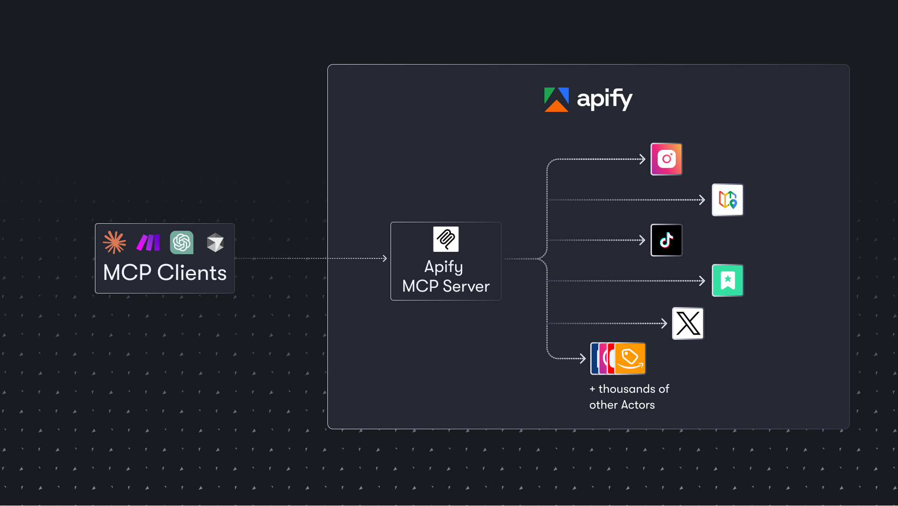

<!-- markdownlint-disable MD024 -->

import Tabs from '@theme/Tabs';
import TabItem from '@theme/TabItem';

The Apify's MCP server ([mcp.apify.com](https://mcp.apify.com)) allows AI applications and agents to interact with the Apify platform
using [Model Context Protocol](https://modelcontextprotocol.io/). The server enables AI agents to
discover and run Actors from [Apify Store](https://apify.com/store), access storages and results,
and enabled AI coding assistants to access Apify documentation and tutorials.



## Prerequisites

Before connecting your AI to Apify, you'll need three things:

- _An Apify account_ - Sign up for an Apify account, if you don't have one.
- _Apify API token_ - Get your API token from the **Integrations** section in [Apify Console](https://console.apify.com/account#/integrations). This token authorizes the MCP server to run Actors on your behalf. Make sure to keep it secure.
- _MCP client_ - An AI agent or client that supports Model Context Protocol (MCP) This could be Anthropic's Claude for Desktop, a VS Code extension with MCP support, or any application that implements the MCP specification. The [official MCP documentation](https://modelcontextprotocol.io/clients) maintains a list of compatible clients.

## Quick start

You can connect to the Apify MCP server in two ways: use our hosted service for a quick and easy setup using [Streamable HTTP with OAuth](#streamable-http-with-oauth-recommended), or run the server locally for development and testing using [local stdio](#local-stdio).

### Streamable HTTP with OAuth (recommended)

Provide the server URL `https://mcp.apify.com`. You will be redirected to your browser to sign in to your Apify account and approve the connection.

<Tabs>
<TabItem value="OAuth" label="OAuth" >

When you connect for the first time, you'll be redirected to your browser to sign in to Apify and authorize the connection. This OAuth flow ensures secure
authentication without exposing your API token.

```json
{
  "mcpServers": {
    "apify": {
      "url": "https://mcp.apify.com"
    }
  }
}
```

</TabItem>
<TabItem value="Bearer token" label="Bearer token">

You can also use your Apify token directly, instead of OAuth, by setting the `Authorization: Bearer <APIFY_TOKEN>` header in the MCP server configuration.

```json
{
  "mcpServers": {
    "apify": {
      "url": "https://mcp.apify.com",
      "headers": {
        "Authorization": "Bearer <APIFY_TOKEN>"
      }
    }
  }
}
```

Replace `<APIFY_TOKEN>` with your actual Apify API token from the [Integrations section](https://console.apify.com/account#/integrations).

</TabItem>
</Tabs>

:::tip Quick setup options

_MCP server configuration for other clients_: Use the [UI configuration tool](https://mcp.apify.com/) to select Actors and tools, then copy the configuration to your client.

:::

#### Client configuration

Here's how to add the Apify MCP server to popular text editors and AI assistants:

<Tabs>
<TabItem value="cursor" label="Cursor">

:::tip One-click installation

The [Apify UI configurator](https://mcp.apify.com/) offers a one-click install button for Cursor that automatically applies the configuration to your client.

:::

To add Apify MCP server to Cursor manually:

1. Create or open the `.cursor/mcp.json` file.
1. Add the following to the configuration file:

    <Tabs>
    <TabItem value="OAuth" label="OAuth" >

    ```json
    {
      "mcpServers": {
        "apify": {
          "url": "https://mcp.apify.com"
        }
      }
    }
    ```

    When you connect for the first time, you'll be redirected to your browser to sign in to Apify and authorize the connection. This OAuth flow ensures secure authentication without exposing your API token.

    </TabItem>
    <TabItem value="Bearer token" label="Bearer token">

    You can also use your Apify token directly, instead of OAuth, by setting the `Authorization: Bearer <APIFY_TOKEN>` header in the MCP server configuration.

    ```json
    {
      "mcpServers": {
        "apify": {
          "url": "https://mcp.apify.com",
          "headers": {
            "Authorization": "Bearer <APIFY_TOKEN>"
          }
        }
      }
    }
    ```

    Replace `<APIFY_TOKEN>` with your actual Apify API token from the [Integrations section](https://console.apify.com/account#/integrations).

    </TabItem>
    </Tabs>

</TabItem>
<TabItem value="vscode" label="VS Code">

:::tip One-click installation

The [Apify UI configurator](https://mcp.apify.com/) offers a one-click install button for VS Code that automatically applies the configuration to your client.

:::

VS Code supports MCP through GitHub Copilot's agent mode (requires Copilot subscription):

1. Ensure you have GitHub Copilot installed
1. Open Command Palette (<kbd>CMD</kbd>/<kbd>CTRL</kbd> + <kbd>Shift</kbd> + <kbd>P</kbd>) and run _MCP: Open User Configuration_ command.
   - This will open `mcp.json` file in your user profile. If the file does not exist, VS Code creates it for you.
1. Add the following to the configuration file:

    <Tabs>
    <TabItem value="OAuth" label="OAuth" >

    ```json
    {
      "mcpServers": {
        "apify": {
          "url": "https://mcp.apify.com"
        }
      }
    }
    ```

    When you connect for the first time, you'll be redirected to your browser to sign in to Apify and authorize the connection. This OAuth flow ensures secure authentication without exposing your API token.

    </TabItem>
    <TabItem value="Bearer token" label="Bearer token">

    You can also use your Apify token directly, instead of OAuth, by setting the `Authorization: Bearer <APIFY_TOKEN>` header in the MCP server configuration.

    ```json
    {
      "mcpServers": {
        "apify": {
          "url": "https://mcp.apify.com",
          "headers": {
            "Authorization": "Bearer <APIFY_TOKEN>"
          }
        }
      }
    }
    ```

    Replace `<APIFY_TOKEN>` with your actual Apify API token from the [Integrations section](https://console.apify.com/account#/integrations).

    </TabItem>
    </Tabs>

</TabItem>
<TabItem value="claude-desktop" label="Claude Desktop">

:::tip One-click installation

Download and run the [Apify MCP Server `.mcpb` file](https://github.com/apify/actors-mcp-server/releases/latest/download/apify-mcp-server.mcpb) for one-click installation.

:::

To manually configure Apify's MCP server for Claude Desktop:

1. Open Claude Desktop settings.
1. Navigate to the **Developer** section.
1. Add the following to the configuration file:

```json
{
  "mcpServers": {
    "actors-mcp-server": {
      "command": "npx",
      "args": ["-y", "@apify/actors-mcp-server"],
      "env": {
        "APIFY_TOKEN": "<APIFY_TOKEN>"
      }
    }
  }
}
```

Replace `<APIFY_TOKEN>` with your actual Apify API token from the [Integrations section](https://console.apify.com/account#/integrations).

</TabItem>
</Tabs>

### Local stdio

If your client doesn't support remote MCP servers using the `https://mcp.apify.com` URL, you can run the server locally instead. This method uses the stdio transport to connect directly through your local environment.

Add this to your configuration file:

```json
{
  "mcpServers": {
    "actors-mcp-server": {
      "command": "npx",
      "args": ["-y", "@apify/actors-mcp-server"],
      "env": {
        "APIFY_TOKEN": "YOUR_APIFY_TOKEN"
      }
    }
  }
}
```

The server will download automatically on first use and connect using your API token.

## Tool selection

By default, the MCP server loads essential tools for Actor discovery, documentation search, and the RAG Web Browser Actor. You can customize which tools
are available by adding parameters to the server URL:

`https://mcp.apify.com?tools=actors,docs,apify/rag-web-browser`

For minimal setups where you only need specific Actors:

`https://mcp.apify.com?tools=apify/instagram-scraper,apify/google-search-scraper`

This configuration approach works for both hosted and local setups. For the CLI version:

`npx @apify/actors-mcp-server --tools actors,docs,apify/web-scraper`

:::tip Easy configuration

Use the UI configurator `https://mcp.apify.com/` to select your tools visually, then copy the configuration to your client.

:::

### Available tools

| Tool name | Category | Enabled by default | Description |
| :--- | :--- | :--- | :--- |
| `search-actors` | actors | ✅ | Search for Actors in Apify Store |
| `fetch-actor-details` | actors | ✅ | Retrieve detailed information about a specific Actor |
| `call-actor`* | actors | ❔ | Call an Actor and get its run results |
| [`apify/rag-web-browser`](https://apify.com/apify/rag-web-browser) | Actor | ✅ | Browse and extract web data |
| `search-apify-docs` | docs | ✅ | Search the Apify documentation for relevant pages |
| `fetch-apify-docs` | docs | ✅ | Fetch the full content of an Apify documentation page by its URL |
| `get-actor-run` | runs | | Get detailed information about a specific Actor run |
| `get-actor-run-list` | runs | | Get a list of an Actor's runs, filterable by status |
| `get-actor-log` | runs | | Retrieve the logs for a specific Actor run |
| `get-dataset` | storage | | Get metadata about a specific dataset |
| `get-dataset-items` | storage | | Retrieve items from a dataset with support for filtering and pagination |
| `get-dataset-schema` | storage | | Generate a JSON schema from dataset items |
| `get-key-value-store` | storage | | Get metadata about a specific key-value store |
| `get-key-value-store-keys` | storage | | List the keys within a specific key-value store |
| `get-key-value-store-record` | storage | | Get the value associated with a specific key in a key-value store |
| `get-dataset-list` | storage | | List all available datasets for the user |
| `get-key-value-store-list` | storage | | List all available key-value stores for the user |
| `add-actor`* | experimental | ❔ | Add an Actor as a new tool for the user to call |
| `get-actor-output`* | - | ✅ | Retrieve the output from an Actor call which is not included in the output preview of the Actor tool. |


:::note Retrieving full output

The `get-actor-output` tool is automatically included with any Actor-related tool, such as `call-actor`, `add-actor`, or specific Actor tools like `apify-slash-rag-web-browser`. When you call an Actor, you receive an output preview. Depending on the output format and length, the preview may contain the complete output or only a limited version to avoid overwhelming the LLM. To retrieve the full output, use the `get-actor-output` tool with the `datasetId` from the Actor call. This tool supports limit, offset, and field filtering.

:::

#### Dynamic tool discovery

One of the most powerful features is the ability to discover and use new Actors on demand.
It can search Apify Store for relevant Actors using the `search-actors` tool, inspect Actor details to understand required inputs, add the Actor as a new tool, and execute it with appropriate parameters.

This dynamic discovery means your AI can adapt to new tasks without manual configuration.
Each discovered Actor becomes immediately available for future use in the conversation.


:::note Dynamic tool discovery

When you use the `actors` tool category, clients that support dynamic tool discovery (such as Claude.ai web and VS Code) will automatically receive the `add-actor` tool instead of `call-actor` for enhanced Actor discovery capabilities.
For a detailed overview of client support for dynamic discovery, see the [MCP client capabilities package](https://github.com/apify/mcp-client-capabilities).

:::

## Telemetry

The MCP Server collects telemetry data about tool calls and MCP clients to help Apify understand usage patterns and improve the service.
Participation in this program is optional and you may opt out if you prefer not to share any information.

### Data collection

All telemetry data is collected and stored securely.
We do not collect any sensitive information such as conversation, arguments passed to tools, API tokens, or personal data.

The server collects anonymous information about tool usage, including:

- Usage of all tools (calls, success/failure, duration)
- MCP client attributes (client name, version, capabilities)

By default, telemetry is **enabled** for all tool calls.

### Remote server

For the remote server (`mcp.apify.com`), you can opt out of telemetry by adding the `telemetry-enabled=false` query parameter to the server URL:

```text
https://mcp.apify.com?telemetry-enabled=false
```

### Local stdio server

For the local stdio server, you can opt out of telemetry by setting the `--telemetry-enabled` CLI flag to `false` or the `TELEMETRY_ENABLED` environment variable to `false`.

CLI flags take precedence over environment variables.

```bash
# Disable via CLI flag
npx @apify/actors-mcp-server --telemetry-enabled=false

# Or set environment variable
export TELEMETRY_ENABLED=false
npx @apify/actors-mcp-server
```

## Advanced usage

### Production best practices

- For production deployments, explicitly specify which tools to load rather than relying on defaults. This ensures consistent behavior across updates:

    `https://mcp.apify.com?tools=actors,docs,apify/rag-web-browser`

- For a local stdio server, always use the latest version of the server by appending `@latest` to your npm commands.
- Monitor your API usage through Apify Console to stay within your plan limits.

## Rate limits and performance

The Apify MCP server allows up to _30_ requests per second per user. This limit applies to all operations including Actor runs, storage access, and
documentation queries. If you exceed this limit, you'll receive a `429` response and should implement appropriate retry logic.

<!-- markdownlint-disable MD001 -->
## Troubleshooting

##### Authentication errors

- _Check your API token_: Verify that your Apify API token is correct. You can find it in the **Integrations** section of the [Apify Console](https://console.apify.com/account#/integrations). Without a valid token, the server cannot start Actor runs.
- _Set environment variable for local development_: When running the MCP server locally, ensure you have set the `APIFY_TOKEN` environment variable.

##### Local environment setup

- _The MCP server requires Node.js v18 or higher_. Check your installed version by running `node -v` in your terminal.
- _Using the latest server version_: To ensure you have the latest features and bug fixes, use the latest version of the `@apify/actors-mcp-server` package. You can do this by appending `@latest` to the package name in your `npx` command or configuration file.

##### Actor execution issues

- _No response or long delays_: Actor runs can take time to complete depending on their task. If you're experiencing long delays, check the Actor's logs in Apify Console. The logs will provide insight into the Actor's status and show if it's processing a long operation or has encountered an error.

<!-- markdownlint-enable MD001 -->
## Support and resources

The Apify MCP Server is an open-source project. Report bugs, suggest features, or ask questions in the [GitHub repository](https://github.com/apify/apify-mcp-server/issues).

If you find this project useful, please star it on [GitHub](https://github.com/apify/apify-mcp-server) to show your support!

To learn more about MCP and Apify integration:

- [Model Context Protocol specification](https://modelcontextprotocol.io) - Learn about the open standard on the official MCP website – understanding the protocol can help you build custom agents.
- [How to use MCP with Apify Actors](https://blog.apify.com/how-to-use-mcp/) - Learn how to expose over thousands of Apify Actors to AI agents with Claude and LangGraph, and configure MCP clients and servers.
- [Video tutorial](https://www.youtube.com/watch?v=BKu8H91uCTg) - Integrate thousands of Apify Actors and Agents with Claude.
- [Apify Tester MCP Client](https://apify.com/jiri.spilka/tester-mcp-client) - A specialized client Actor that you can run to simulate an AI agent in your browser. Useful for testing your setup with a chat UI.
