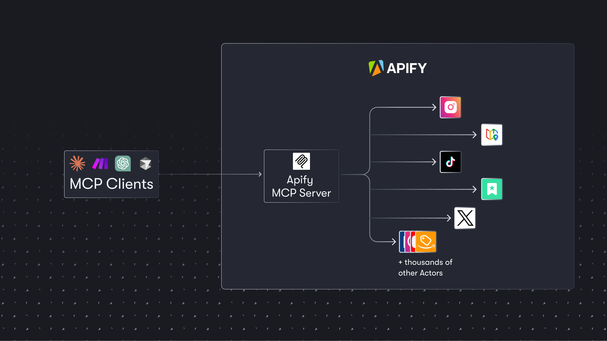

import Tabs from '@theme/Tabs';
import TabItem from '@theme/TabItem';
import ThirdPartyDisclaimer from '@site/sources/_partials/_third-party-integration.mdx';

The Apify's MCP server ([mcp.apify.com](https://mcp.apify.com)) allows AI applications and agents to interact with the Apify platform
using [Model Context Protocol](https://modelcontextprotocol.io/docs/getting-started/intro) (MCP). The MCP server enables AI agents to
discover and run Actors from [Apify Store](https://apify.com/store), access storages and results,
and enables AI coding assistants to access Apify documentation and tutorials.



<ThirdPartyDisclaimer />

:::info Apify MCP server vs MCP connectors

This page covers the Apify MCP server, which exposes Apify Actors as tools to outside AI clients. If you are building an Actor that needs to call third-party MCP servers (such as Notion or Slack) on a user's behalf, see [MCP connectors](/integrations/mcp-connectors) instead.

:::

## Apify AI vs the MCP server

The Apify MCP server and [Apify AI](/account/apify-ai) share the same Actor search and execution backend, but they serve different audiences:

- _MCP server_ - a programmatic interface for external AI agents, IDEs, and CLIs. Use it when you build or operate your own agent.
- _Apify AI_ - the conversational interface inside [Apify Console](https://console.apify.com) for users who interact with Apify through a chat UI rather than their own agent.

Actor ranking on both surfaces uses parameters similar to those evaluated by the [Actor quality score](/actors/publishing/quality-score), so Actors with higher quality scores tend to rank higher.

## Excluded Actors

The MCP server intentionally excludes two categories of Actors from search and execution:

- _Full-permission Actors_ - excluded for security. Running a [full-permission Actor](/actors/running/permissions#full-permission-actors) is a decision you approve personally, so an LLM can't make it on your behalf.
- _Rental Actors_ - excluded because their subscription-based model doesn't fit the sporadic, on-demand way the MCP server runs Actors.

## Quick start

The server URL is `https://mcp.apify.com`. All you need to connect is an MCP client - an AI agent, IDE, or CLI that implements the Model Context Protocol. The [official MCP documentation](https://modelcontextprotocol.io/clients) maintains a list of compatible clients.

Discovering Actors and reading documentation needs no account. Running Actors and reading storage data needs authentication. Start with [anonymous discovery](#anonymous-discovery), then add credentials when you're ready to execute.

If your client doesn't support remote MCP servers, run the server [locally over stdio](#local-stdio) instead.

:::tip Structured output schemas

The hosted Apify MCP server at `https://mcp.apify.com` supports _output schema inference_ for structured Actor results. Actor tools automatically include inferred output schemas with field-level type information. This helps AI agents understand the expected result structure before calling an Actor. The local stdio server does not support this feature.

:::

### Anonymous discovery

The MCP server accepts requests without an API token when the `tools` query parameter (see [Tool selection](#tool-selection)) contains only tools enabled for unauthenticated use. These tools cover Actor discovery and documentation lookup:

- `search-actors`
- `fetch-actor-details`
- `search-apify-docs`
- `fetch-apify-docs`

Connect to this URL and no credentials are required:

`https://mcp.apify.com?tools=search-actors,fetch-actor-details,search-apify-docs,fetch-apify-docs`

```json
{
  "mcpServers": {
    "apify": {
      "url": "https://mcp.apify.com?tools=search-actors,fetch-actor-details,search-apify-docs,fetch-apify-docs"
    }
  }
}
```

Use this to browse Apify Store, inspect Actor input and output schemas, and search the documentation. To run an Actor or read its results, authenticate first.

If the `tools` parameter includes any other tool, or you connect to the default endpoint, the server requires an API token.

### Authentication

Running Actors, reading run data, and accessing storage all require an Apify account. Sign up for one if you don't have it yet.

Choose one of two methods. OAuth is recommended - it never exposes your API token to the client. Use a bearer token when your client can't complete a browser-based flow.

#### Hosted OAuth (recommended)

Provide the server URL `https://mcp.apify.com` with no credentials in the configuration:

```json
{
  "mcpServers": {
    "apify": {
      "url": "https://mcp.apify.com"
    }
  }
}
```

When you connect for the first time, you'll be redirected to your browser to sign in to Apify and authorize the connection. This OAuth flow ensures secure authentication without exposing your API token.

#### Bearer token

If your client can't complete the OAuth flow, pass your Apify token directly by setting the `Authorization: Bearer <APIFY_TOKEN>` header:

```json
{
  "mcpServers": {
    "apify": {
      "url": "https://mcp.apify.com",
      "headers": {
        "Authorization": "Bearer <APIFY_TOKEN>"
      }
    }
  }
}
```

Replace `<APIFY_TOKEN>` with your API token from the **API & Integrations** section of [Apify Console](https://console.apify.com/settings/integrations). This token authorizes the MCP server to run Actors on your behalf, so keep it secure.

### Client configuration

The configuration below uses OAuth. To use a token instead, add the `Authorization` header described in [Bearer token](#bearer-token).

<Tabs>
<TabItem value="cursor" label="Cursor">

:::tip One-click installation

The [Apify UI configurator](https://mcp.apify.com/) offers a one-click install button for Cursor that automatically applies the configuration to your client.

:::

To add the Apify MCP server to Cursor manually:

1. Create or open the `.cursor/mcp.json` file.
1. Add the following to the configuration file:

    ```json
    {
      "mcpServers": {
        "apify": {
          "url": "https://mcp.apify.com"
        }
      }
    }
    ```

</TabItem>
<TabItem value="vscode" label="VS Code">

:::tip One-click installation

The [Apify UI configurator](https://mcp.apify.com/) offers a one-click install button for VS Code that automatically applies the configuration to your client.

:::

VS Code supports MCP through GitHub Copilot's agent mode (requires Copilot subscription):

1. Ensure you have GitHub Copilot installed.
1. Open Command Palette (<kbd>CMD</kbd>/<kbd>CTRL</kbd> + <kbd>Shift</kbd> + <kbd>P</kbd>) and run the _MCP: Open User Configuration_ command.
   - This will open `mcp.json` file in your user profile. If the file does not exist, VS Code creates it for you.
1. Add the following to the configuration file:

    ```json
    {
      "mcpServers": {
        "apify": {
          "url": "https://mcp.apify.com"
        }
      }
    }
    ```

</TabItem>
<TabItem value="claude-desktop" label="Claude Desktop">

[Add a custom connector](https://support.claude.com/en/articles/11175166) in Claude Desktop and use `https://mcp.apify.com` as the server URL. On first connection, your browser opens to sign in to Apify and authorize the connection.

You can also search for "Apify" in the connector directory and install it directly.

For detailed setup options and troubleshooting, see the [Claude Desktop integration guide](/integrations/claude-desktop).

</TabItem>
<TabItem value="apify-cli" label="Apify CLI">

Use the Apify CLI to add the Apify MCP server to a supported local client:

```bash
apify mcp install cursor
```

Available clients are: `claude-code`, `cursor`, `vscode`, `vscode-insiders`, `codex`, `kiro`, and `antigravity`.

The command creates or updates a user-level MCP server entry named `apify`. For Cursor, Kiro, and Antigravity, it writes to the client's MCP config file. For Claude Code, VS Code, VS Code Insiders, and Codex CLI, it uses the client's own install command.

By default, the command uses the API token saved by `apify login`. To use a different token or Apify account than the one configured in the Apify CLI, pass `--token <APIFY_TOKEN>`:

```bash
apify mcp install cursor --token <APIFY_TOKEN>
```

Use `--tools` to expose only selected tools or Actors:

```bash
apify mcp install vscode --tools search-actors,apify/rag-web-browser
```

</TabItem>
</Tabs>

:::tip Configuration for other clients

Use the [UI configuration tool](https://mcp.apify.com/) to select Actors and tools, then copy the configuration to your client.

:::

### Local stdio

If your client doesn't support remote MCP servers using the `https://mcp.apify.com` URL, you can run the server locally instead. This method uses the stdio transport to connect directly through your local environment.

Add this to your configuration file:

```json
{
  "mcpServers": {
    "actors-mcp-server": {
      "command": "npx",
      "args": ["-y", "@apify/actors-mcp-server"],
      "env": {
        "APIFY_TOKEN": "YOUR_APIFY_TOKEN"
      }
    }
  }
}
```

The server will download automatically on first use and connect using your API token.

## Tool selection

By default, the MCP server loads the `actors` and `docs` tool categories, the `apify/rag-web-browser` Actor, and `report-problem`. You can customize which tools are available by adding parameters to the server URL:

`https://mcp.apify.com?tools=actors,docs,apify/rag-web-browser`

For minimal setups where you only need specific Actors:

`https://mcp.apify.com?tools=apify/instagram-scraper,apify/google-search-scraper`

This configuration approach works for both hosted and local setups. For the CLI version:

`npx @apify/actors-mcp-server --tools actors,docs,apify/web-scraper`

:::tip Easy configuration

Use the UI configurator `https://mcp.apify.com/` to select your tools visually, then copy the configuration to your client.

:::

### Available tools

The server groups tools into five categories: `actors`, `docs`, `runs`, `storage`, and `dev`.

:::caution The tools parameter replaces the defaults

The `tools` parameter does not add to the default selection - it replaces it. Connecting to `https://mcp.apify.com?tools=storage` gives you the storage tools and nothing else, without `search-actors` or `call-actor`. List every category you want: `https://mcp.apify.com?tools=actors,docs,storage`.

The `apify/rag-web-browser` Actor is part of the defaults but isn't part of any category, so listing every category - even `?tools=actors,docs` - still drops it. Add it explicitly: `?tools=actors,docs,apify/rag-web-browser`.

:::

The server automatically adds tools marked _auto-injected_ whenever `call-actor` or a specific Actor tool is loaded, even if you didn't select them. They cover the run and result lookups an agent needs immediately after starting a run, so a default configuration exposes them too.

| Tool name | Category | Loaded by default | Description |
| :--- | :--- | :--- | :--- |
| `search-actors` | actors | ✅ | Search for Actors in Apify Store |
| `fetch-actor-details` | actors | ✅ | Retrieve detailed information about a specific Actor, including its input and output schema, README (summary when available, full otherwise), and pricing |
| `call-actor` | actors | ✅ | Run an Actor and wait up to `waitSecs` (0-45, default 30) for it to finish. Returns the run status, storage IDs, and field metadata - not the results themselves |
| [`apify/rag-web-browser`](https://apify.com/apify/rag-web-browser) | Actor | ✅ | Browse and extract web data |
| `search-apify-docs` | docs | ✅ | Search the Apify documentation for relevant pages |
| `fetch-apify-docs` | docs | ✅ | Fetch the full content of an Apify documentation page by its URL |
| `get-actor-run` | runs | Auto-injected | Get detailed information about a specific Actor run |
| `get-actor-run-list` | runs | | Get a list of an Actor's runs, filterable by status |
| `get-actor-log` | runs | | Retrieve the logs for a specific Actor run |
| `abort-actor-run` | runs | Auto-injected | Abort a running Actor run |
| `get-dataset` | storage | | Get metadata about a specific dataset |
| `get-dataset-items` | storage | Auto-injected | Retrieve items from a dataset with support for filtering and pagination |
| `get-dataset-schema` | storage | | Generate a JSON schema from dataset items |
| `get-key-value-store` | storage | | Get metadata about a specific key-value store |
| `get-key-value-store-keys` | storage | | List the keys within a specific key-value store |
| `get-key-value-store-record` | storage | Auto-injected | Get the value associated with a specific key in a key-value store |
| `get-dataset-list` | storage | | List all available datasets for the user |
| `get-key-value-store-list` | storage | | List all available key-value stores for the user |
| `report-problem` | dev | ✅ | Report a problem with the MCP server to Apify |

#### Retrieve Actor results

`call-actor` returns the run's status and storage IDs, not its output. To read the results, call `get-dataset-items` with the `datasetId` from the run. This is why the run and storage tools are auto-injected alongside `call-actor` - an agent needs them to finish the job. Runs that haven't reached a terminal state also include a `nextStep` with polling instructions.

#### Actor tool names

Actors selected with the `tools` parameter become tools of their own, named `{username}--{actor-name}`. For example, `apify/rag-web-browser` is exposed as `apify--rag-web-browser`. Usernames containing a dot use `-dot-` in place of the dot, and names longer than 64 characters are truncated with a hash suffix to keep them unique.

:::note Client-specific tool availability

`report-problem` loads by default, but the server withholds it when telemetry is disabled or when your client is on the exclusion list. If you connect with telemetry off using `telemetry-enabled=false`, you won't see it.

:::

#### Find and call any Actor on demand

Your AI can search Apify Store for relevant Actors using the `search-actors` tool, inspect Actor details to understand required inputs, and call any Actor by name using `call-actor` - without needing to pre-configure it. This means your AI can adapt to new tasks without manual configuration.

## Agentic payments

Agentic payments allow AI agents to autonomously pay for Actor runs without requiring an Apify API token:

- [AGI](/integrations/x402) - buy a prepaid Apify API token from [Apify AGI](https://agi.apify.com) with an x402 or MPP payment, then use it against this MCP server or the Apify API directly. Recommended for most agents - works for any Actor, not just Pay Per Event ones.
- [Skyfire](/integrations/skyfire) - managed payment tokens through the [Skyfire](https://www.skyfire.xyz/) payment platform.

The MCP server also has its own Direct x402 support (per-request, no minted token, Pay Per Event Actors only) via [`mcpc`](https://github.com/apify/mcp-cli) - see the [Apify MCP Server README](https://github.com/apify/apify-mcp-server#-agentic-payments) for setup.

For setup instructions and details, see the individual integration pages.

## Telemetry

The MCP server collects telemetry data about tool calls and MCP clients to help Apify understand usage patterns and improve the service.
Participation in this program is optional and you may opt out if you prefer not to share any information.

### Data collection

All telemetry data is collected and stored securely.
We do not collect any sensitive information such as conversations, arguments passed to tools, API tokens, or personal data.

The server collects anonymous information about tool usage, including:

- Basic information about used tools (calls, success/failure, duration)
- MCP client attributes (client name, version, capabilities)

By default, telemetry is _enabled_ for all tool calls.

### Opt out of telemetry

#### Remote server

For the remote server (`mcp.apify.com`), you can opt out of telemetry by adding the `telemetry-enabled=false` query parameter to the server URL:

```text
https://mcp.apify.com?telemetry-enabled=false
```

#### Local stdio server

For the local stdio server, opt out of telemetry using a CLI flag or an environment variable. When both the CLI flag and environment variable are set, the CLI flag takes precedence.

- _CLI flag_: set the `--telemetry-enabled` CLI flag to `false`:

  ```bash
  npx @apify/actors-mcp-server --telemetry-enabled=false
  ```

- _Environment variable_: set the `TELEMETRY_ENABLED` environment variable to `false`:

  ```bash
  export TELEMETRY_ENABLED=false
  npx @apify/actors-mcp-server
  ```

## Advanced usage

### Production best practices

- For production deployments, explicitly specify which tools to load rather than relying on defaults. This ensures consistent behavior across updates:

    `https://mcp.apify.com?tools=actors,docs,apify/rag-web-browser`

- For a local stdio server, always use the latest version of the server by appending `@latest` to your npm commands.
- Monitor your API usage through Apify Console to stay within your plan limits.

## Rate limits and performance

The Apify MCP server allows up to _30_ requests per second per user. This limit applies to all operations including Actor runs, storage access, and
documentation queries. If you exceed this limit, you'll receive a `429` response and should implement appropriate retry logic.

<!-- markdownlint-disable MD001 -->
## Troubleshooting

:::tip Claude Desktop issues

For Claude Desktop-specific troubleshooting (tools not loading, connection errors, corrupted cache), see [Claude Desktop troubleshooting](/integrations/claude-desktop#troubleshooting).

:::

##### Authentication errors

- _Check your API token_: Verify that your Apify API token is correct. You can find it in the **API & Integrations** section of the [Apify Console](https://console.apify.com/settings/integrations). Without a valid token, the server cannot start Actor runs.
- _Set environment variable for local development_: When running the MCP server locally, ensure you have set the `APIFY_TOKEN` environment variable.

##### Local environment setup

- _The MCP server requires Node.js v18 or higher_. Check your installed version by running `node -v` in your terminal.
- _Using the latest server version_: To ensure you have the latest features and bug fixes, use the latest version of the `@apify/actors-mcp-server` package. You can do this by appending `@latest` to the package name in your `npx` command or configuration file.

##### Actor execution issues

- _No response or long delays_: Actor runs can take time to complete depending on their task. If you're experiencing long delays, check the Actor's logs in Apify Console. The logs will provide insight into the Actor's status and show if it's processing a long operation or has encountered an error.

<!-- markdownlint-enable MD001 -->
## Support and resources

The Apify MCP server is an open-source project. Report bugs, suggest features, or ask questions in the [GitHub repository](https://github.com/apify/apify-mcp-server/issues).

If you find this project useful, please star it on [GitHub](https://github.com/apify/apify-mcp-server) to show your support!

To learn more about MCP and Apify integration:

- [Model Context Protocol specification](https://modelcontextprotocol.io) - Learn about the open standard on the official MCP website - understanding the protocol can help you build custom agents.
- [How to use MCP with Apify Actors](https://blog.apify.com/how-to-use-mcp/) - Learn how to expose over thousands of Apify Actors to AI agents with Claude and LangGraph, and configure MCP clients and servers.
- [Video tutorial](https://www.youtube.com/watch?v=BKu8H91uCTg) - Integrate thousands of Apify Actors and Agents with Claude.
- [Apify Tester MCP Client](https://apify.com/jiri.spilka/tester-mcp-client) - A specialized client Actor that you can run to simulate an AI agent in your browser. Useful for testing your setup with a chat UI.
