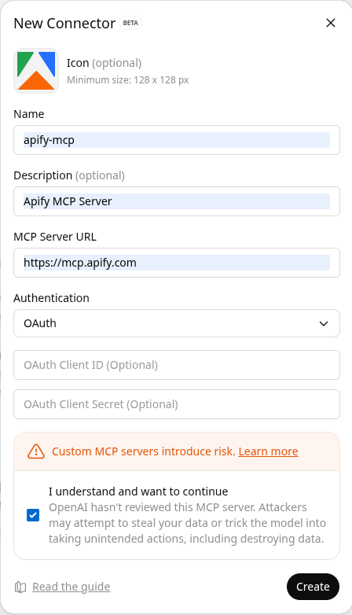
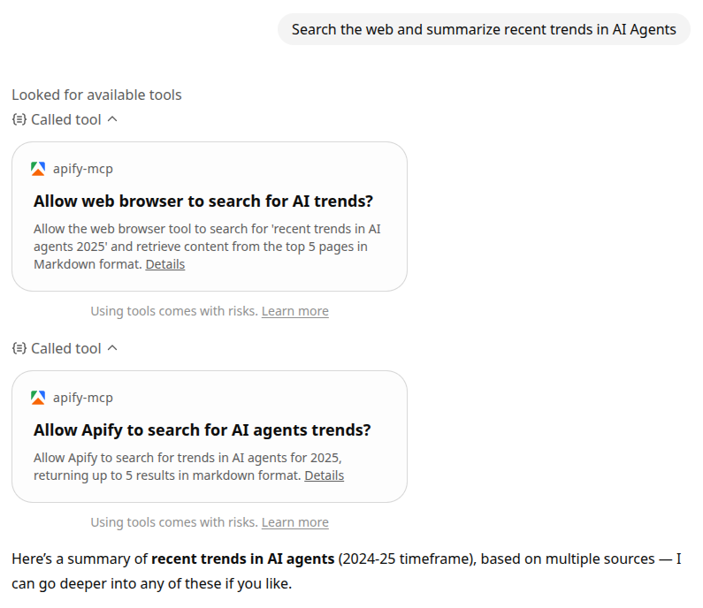

import ThirdPartyDisclaimer from '@site/sources/_partials/_third-party-integration.mdx';

The _ChatGPT_ integration enables you to connect ChatGPT to Apify's extensive library of [Actors](https://apify.com/store) through the [Model Context Protocol (MCP)](https://modelcontextprotocol.io/docs/getting-started/intro).
This allows ChatGPT to access real-time web data and automation capabilities by using Apify tools directly in conversations.
By default, the Apify MCP server exposes a set of tools that let you search and run any Actor you have access to, including all public Actors and rental Actors you have rented.

_Example query_: "Find and run an Actor that scrapes Instagram profiles and gets the profile of @natgeo"

In this tutorial, you'll learn how to connect _ChatGPT_ to the _Apify MCP server_ using a custom connector.

<ThirdPartyDisclaimer />

## Prerequisites

Before connecting ChatGPT to Apify, you'll need:

- _An Apify account_ - If you don't have an Apify account already, you can [sign up](https://console.apify.com/sign-up). The MCP server authorizes ChatGPT to access your Apify account via OAuth, so no API token is required.
- _An OpenAI account with access to ChatGPT_ - You need an OpenAI account to use ChatGPT.
- _ChatGPT with Developer mode enabled_ - You must enable [Developer Mode](https://platform.openai.com/docs/guides/developer-mode) to add custom connectors (when the Developer mode is active, the message input box is outlined in orange).

:::note ChatGPT Business and Enterprise workspaces
If you're using ChatGPT Business or Enterprise, a workspace admin must enable the Apify connector for the organization before members can add it. See [Enable Apify for your organization](#enable-apify-for-your-organization) below.
:::

## Enable Apify for your organization

ChatGPT Business and Enterprise workspaces require a workspace admin to allow the Apify connector before individual members can add it:

1. Sign in to ChatGPT as a workspace owner or admin.
1. Go to **Settings > Workspace > Connectors**.
1. Add the Apify MCP server (`https://mcp.apify.com`) to the list of allowed connectors and save your changes.

Once enabled, members of your workspace can create the connector by following the steps in the next section.

## Create an MCP connector

1. In ChatGPT, go to **Settings > Apps & Connectors > Create**. If you don't see the **Create** button, enable Developer mode or reload the page.

1. Fill in the following fields:

    - **Name** - a user-facing title, e.g., `Apify`
    - **Description** - a short description of what the connector does, for example: `Extract data from any website with thousands of scrapers, crawlers, and automations from Apify Store`
    - **Logo** - upload an image to identify the connector. ChatGPT requires the logo file to be under 10 KB.
    - **MCP Server URL** - choose one of the following:
        - `https://mcp.apify.com` - use the default set of Apify tools
        - `https://mcp.apify.com?tools=actors,docs,mtrunkat/url-list-download-html` - use specific tools
        - Refer to [mcp.apify.com](https://mcp.apify.com) for details
    - **Authentication** - OAuth, you don't need to provide a client ID or secret.

1. Select **Create** to proceed to the authentication page.
You’ll be redirected to the Apify website to authorize ChatGPT to access your Apify account.

Once authorized, you'll return to ChatGPT and see a success message with a list of tools available from the Apify MCP server.

:::caution Cannot modify tools after creation
ChatGPT does not allow modifying the selected tools after the connector is created.
If you need to add or remove tools later, you'll need to create a new connector.
:::

## Try the MCP connector in ChatGPT

Once your connector is ready:

1. Open a **new chat** in ChatGPT.
1. Click the **+** button near the message composer and select **More**.
1. Choose your **Apify MCP connector** to add it to the conversation.
1. Ask ChatGPT to use Apify tools, for example:

   > “Search the web and summarize recent trends in AI agents”

You'll need to grant permission for each Apify tool when it's used for the first time.
You should see ChatGPT calling Apify tools - such as the [RAG Web Browser](https://apify.com/apify/rag-web-browser) - to gather information.

## Limitations

- MCP integration in ChatGPT is still in _beta_ and may have some limitations or bugs.
- Tool selection and execution can be _slow_, especially with the latest GPT models.
- _Custom connectors_ are only available in ChatGPT _Developer mode_.
- When creating connectors that include social media scrapers (Instagram, TikTok), OpenAI may display a _Safety Scan_ warning indicating that some tools might fetch sensitive data.

## Related integrations

- [OpenAI Assistants integration](/platform/integrations/openai-assistants) - Use Apify Actors with OpenAI Assistants API via function calling
- [OpenAI Agents SDK integration](/platform/integrations/openai-agents) - Integrate Apify MCP server with OpenAI Agents SDK

## Resources

- [ChatGPT Developer mode](https://platform.openai.com/docs/guides/developer-mode) - Learn how to enable Developer Mode in ChatGPT
- [Connectors and MCP servers](https://platform.openai.com/docs/guides/tools-connectors-mcp) - Official OpenAI documentation on using MCP servers with ChatGPT
- [Apify MCP server](https://mcp.apify.com) - Interactive configuration tool for the Apify MCP server
- [Apify MCP documentation](/platform/integrations/mcp) - Complete guide to using the Apify MCP server
