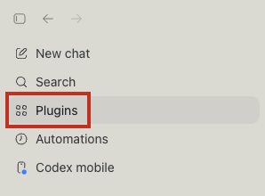
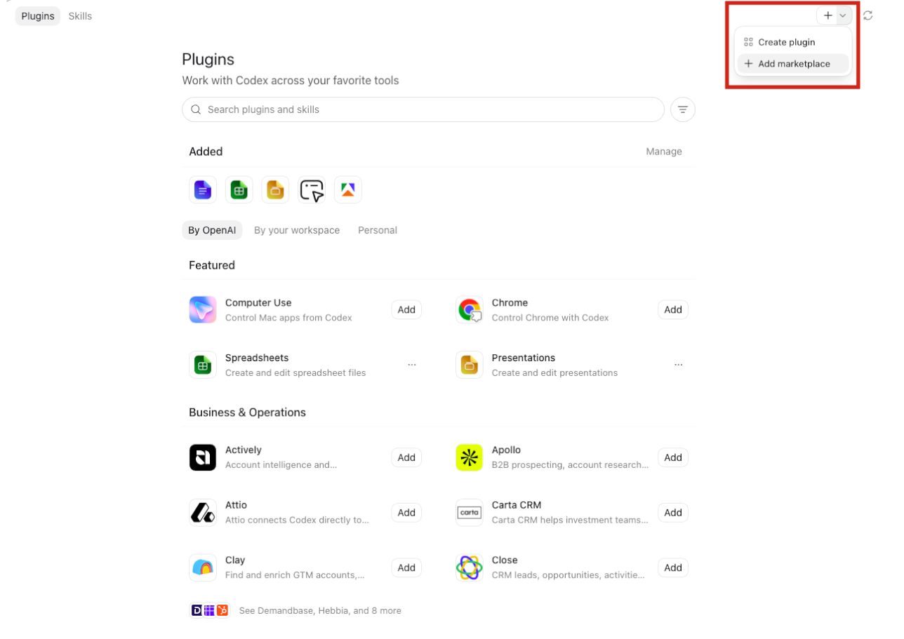
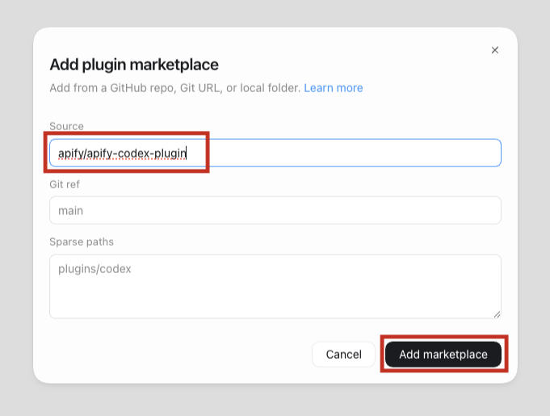
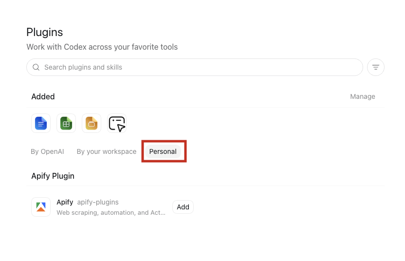
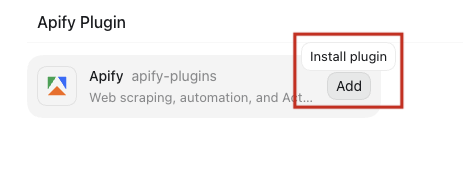
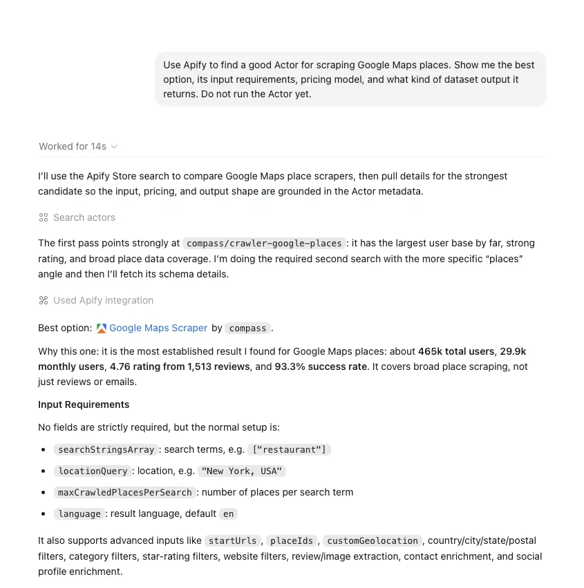

import ThirdPartyDisclaimer from '@site/sources/_partials/_third-party-integration.mdx';

[Codex](https://developers.openai.com/codex/) is OpenAI's agentic coding tool. It reads and edits your codebase, runs commands, and completes multi-step development tasks.

The [Apify plugin for Codex](https://github.com/apify/apify-codex-plugin) connects Codex to Apify's library of [Actors](https://apify.com/store) and bundles:

- The [Apify MCP server](/integrations/mcp) for searching Apify Store, running Actors, and retrieving datasets through the [Model Context Protocol (MCP)](https://modelcontextprotocol.io/docs/getting-started/intro).
- Five built-in skills for common workflows (see [Bundled skills](#bundled-skills) below).

This guide covers installation in the ChatGPT desktop app, where you select **Codex** from the top-left menu. To use Codex in your terminal instead, see the [Codex CLI](/integrations/codex-cli) guide.

<ThirdPartyDisclaimer />

## Prerequisites

- [An Apify account](https://console.apify.com/sign-up) - sign up for free if you don't have one.
- [Codex](https://developers.openai.com/codex/) - installed.

## Install the plugin

1. In Codex, open the sidebar and select **Plugins**.

    

1. On the **Plugins** screen, select the dropdown next to **+** and choose **Add marketplace**.

    

1. In the **Add plugin marketplace** dialog, enter the Apify plugin repository in the **Source** field:

    ```text
    apify/apify-codex-plugin
    ```

    

1. Select **Add marketplace**.

1. On the **Plugins** screen, open the **Personal** tab. The **Apify** plugin appears under **Apify Plugin**.

    

1. Select **Add** next to **Apify**.

    

1. In the dialog, select **Add to Codex**.

1. Select **Install Apify** to start the Apify MCP server setup.

## Authenticate to Apify

The plugin bundles the Apify MCP server. Read-only tools like searching Apify Store and fetching Actor details work without signing in, but you need to authenticate to run Actors and access your account data.

1. After you select **Install Apify**, Codex starts the Apify MCP server setup and opens a browser tab for the Apify OAuth flow.

1. Review the permissions and select **Allow access**.

1. Back in Codex, the `apify` MCP server connects and is ready to use.

:::tip Session persistence

The connection stays authenticated for future sessions. You can revoke access at any time in [Apify Console > Settings > Integrations](https://console.apify.com/settings/integrations).

:::

## Run your first prompt

Describe what you want in natural language. Because this bundle exposes the MCP tools and skills directly, be explicit about the workflow you want.

> Use Apify to find a good Actor for scraping Google Maps places. Show me the best option, its input requirements, pricing model, and what kind of dataset output it returns. Do not run the Actor yet.

Codex searches Apify Store, fetches the top Actor's details through the `apify` MCP server, and summarizes its inputs, pricing, and output - all without running the Actor.



## Bundled skills

| Skill | Description |
| --- | --- |
| `apify-ultimate-scraper` | CLI-driven extraction using existing Actors for multi-step scraping and lead-generation workflows. |
| `apify-actor-development` | Full Actor lifecycle - template selection, development, local testing, and deployment with `apify push`. |
| `apify-actorization` | Converts existing JavaScript, TypeScript, Python, or CLI projects into Apify Actors. |
| `apify-generate-output-schema` | Generates dataset and key-value store schemas for existing Actors. |
| `apify-sdk-integration` | Integrates Actor execution into applications using the `apify-client` package. |

Example prompts that route to specific skills:

_Ultimate scraper:_

> Find 10 highly rated coffee shops in Seattle with name, address, rating, phone, and website.

_Actor development:_

> Create an Apify Actor that accepts a `startUrl` and `maxPages` input, crawls the site, and stores each page title and URL.

_SDK integration:_

> Add Apify to this project. The Node.js API route should run an Actor and return dataset items as JSON.

## Troubleshooting

### The Apify plugin does not appear in the list

Open the **Plugins** screen, switch to the **Personal** tab, and confirm the Apify marketplace was added. If the **Apify** plugin still doesn't appear, re-add the marketplace using the repository `apify/apify-codex-plugin`.

### The Plugins screen does not appear

Plugins require a local installation of Codex with plugin support enabled. Install or update Codex, then reopen the **Plugins** screen.

### Browser doesn't open, or OAuth fails

If the browser doesn't open automatically, copy the OAuth URL shown by Codex and paste it into your browser manually.

If you're running Codex in a headless environment (SSH, remote container) or the OAuth flow still fails, authenticate with an API token instead. Copy your token from [Apify Console > Settings > Integrations](https://console.apify.com/settings/integrations) and set it before starting Codex:

```bash
export APIFY_TOKEN=<YOUR_API_TOKEN>
```

## Limitations

- Long-running Actors may exceed the time a single tool call waits for completion. Reduce the scope or split the work across multiple prompts.
- Each Actor run consumes Apify platform usage from your plan in addition to any Codex usage. See [Billing](/account/billing) for details.
- Skills that edit files in your project (Actor development, actorization, SDK integration) make local changes - review them before deploying or committing.

## Related integrations

- [MCP server integration](/integrations/mcp) - Use the Apify MCP server with other clients
- [ChatGPT integration](/integrations/chatgpt) - Connect the Apify MCP server to ChatGPT

## Resources

- [Apify plugin for Codex](https://github.com/apify/apify-codex-plugin) - Source repository and full README with advanced setup notes (Apify CLI install, all auth paths, available MCP tools)
- [Codex documentation](https://developers.openai.com/codex/) - Official Codex docs
- [Apify Store](https://apify.com/store) - Browse Actors you can run from Codex
