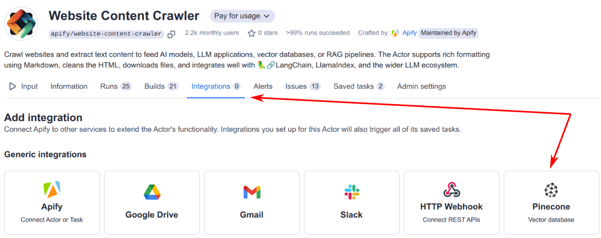
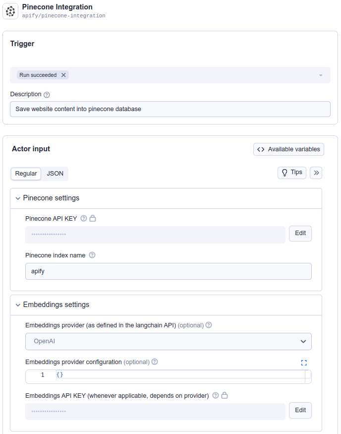

**Learn how to integrate Apify with Pinecone to feed data crawled from the web into the Pinecone vector database.**

---

[Pinecone](https://www.pinecone.io) is a managed vector database that allows users to store and query dense vectors for AI applications such as recommendation systems, semantic search, and retrieval augmented generation (RAG).

The Apify integration for Pinecone enables you to export results from Apify Actors and Dataset items into a specific Pinecone vector index.

## Prerequisites

Before you begin, ensure that you have the following:

- A [Pinecone database](https://www.pinecone.io/) set up.
- A Pinecone index created & Pinecone API token obtained.
- An [OpenAI API key](https://openai.com/index/openai-api/) to compute text embeddings.
- An [Apify API token](https://docs.apify.com/platform/integrations/api#api-token) to access [Apify Actors](https://apify.com/store).


### Integration Methods

You can integrate Apify with Pinecone using either the Apify Console or the Apify Python SDK.

:::note Website Content Crawler usage

The examples utilize the Website Content Crawler Actor, which deeply crawls websites, cleans HTML by removing modals and navigation elements, and converts HTML to Markdown for training AI models or providing web content to LLMs and generative AI applications.

:::

#### Apify Console

1. Set up the [Website Content Crawler](https://apify.com/apify/website-content-crawler) Actor in the [Apify Console](https://console.apify.com). Refer to this guide on how to set up [website content crawl for your project](https://blog.apify.com/talk-to-your-website-with-large-language-models/).

1. Once you have the crawler ready, navigate to the integration section and add Apify’s Pinecone integration.

    

1. Select when to trigger this integration (typically when a run succeeds) and fill in all the required fields for the Pinecone integration. You can learn more about the input parameters at the [Pinecone integration input schema](https://apify.com/apify/pinecone-integration/input-schema).

   

1. For a comprehensive explanation on how to combine Actors to accomplish more complex tasks, refer to the guide on [Actor-to-Actor](https://blog.apify.com/connecting-scrapers-apify-integration/) integrations.

#### Python

Another way to interact with Pinecone is through the [Apify Python SDK](https://docs.apify.com/sdk/python/).

1. Install the Apify Python SDK by running the following command:

    `pip install apify-client`

1. Create a Python script and import all the necessary modules:

    ```python
    from apify_client import ApifyClient

    APIFY_API_TOKEN = "YOUR-APIFY-TOKEN"
    OPENAI_API_KEY = "YOUR-OPENAI-API-KEY"
    PINECONE_API_KEY = "YOUR-PINECONE-API-KEY"

    client = ApifyClient(APIFY_API_TOKEN)
    ```

1. Call the [Website Content Crawler](https://apify.com/apify/website-content-crawler) Actor to crawl the Pinecone documentation and extract text content from the web pages:

    ```python
    actor_call = client.actor("apify/website-content-crawler").call(
        run_input={"startUrls": [{"url": "https://docs.pinecone.io/home"}]}
    )

    print("Website Content Crawler Actor has finished")
    print(actor_call)
    ```

1. Use Apify's [Pinecone integration](https://apify.com/apify/pinecone-integration) to store all the selected data from the dataset (provided by `datasetId` from the Actor call) into the Pinecone vector database.

    ```python
    pinecone_integration_inputs = {
        "pineconeApiKey": PINECONE_API_KEY,
        "pineconeIndexName": "apify",
        "datasetFields": ["text"],
        "datasetId": actor_call["defaultDatasetId"],
        "enableDeltaUpdates": True,
        "deltaUpdatesPrimaryDatasetFields": ["url"],
        "expiredObjectDeletionPeriodDays": 30,
        "embeddingsApiKey": OPENAI_API_KEY,
        "embeddingsProvider": "OpenAI",
        "performChunking": True,
        "chunkSize": 1000,
        "chunkOverlap": 0,
    }

    actor_call = client.actor("apify/pinecone-integration").call(run_input=pinecone_integration_inputs)
    print("Apify's Pinecone Integration has finished")
    print(actor_call)
    ```

You have successfully integrated Apify with Pinecone and the data is now stored in the Pinecone vector database.

## Additional Resources

- [Apify Pinecone integration](https://apify.com/apify/pinecone-integration)
- [What is Pinecone and why use it with your LLMs?](https://blog.apify.com/what-is-pinecone-why-use-it-with-llms/)
- [Pinecone documentation](https://docs.pinecone.io/)
