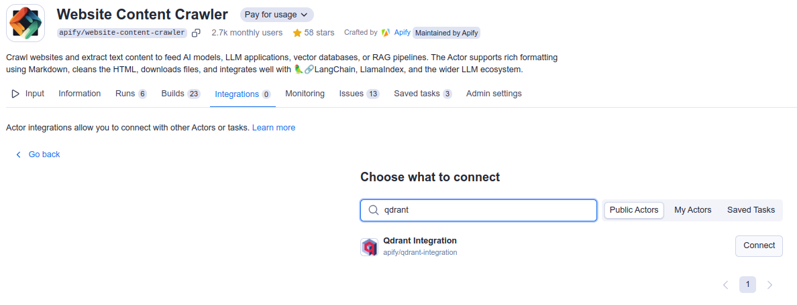
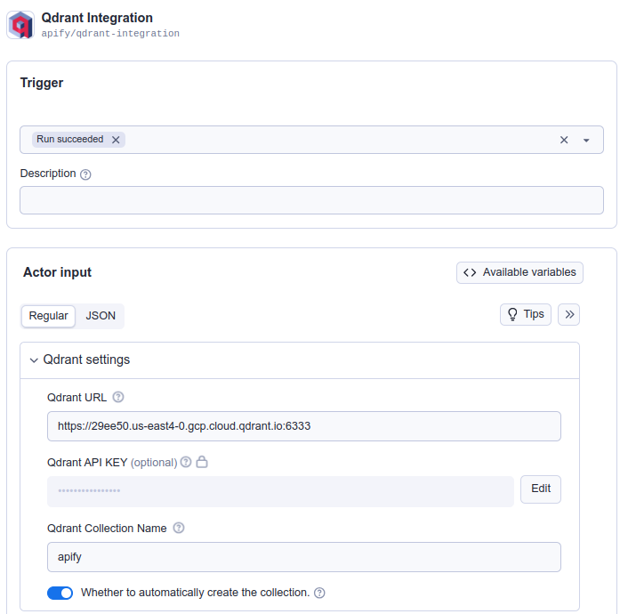

**Learn how to integrate Apify with Qdrant to transfer crawled into the Qdrant vector database.**

---

[Qdrant](https://qdrant.tech) is a high performance managed vector database that allows users to store and query dense vectors for next generation AI applications such as recommendation systems, semantic search, and retrieval augmented generation (RAG).

The Apify integration for Qdrant enables you to export results from Apify Actors and Dataset items into a specific Qdrant collection.

## Prerequisites

Before you begin, ensure that you have the following:

- A [Qdrant database](https://qdrant.tech) set up.
- A Qdrant URL to the database and Qdrant API token.
- An [OpenAI API key](https://openai.com/index/openai-api/) to compute text embeddings.
- An [Apify API token](https://docs.apify.com/platform/integrations/api#api-token) to access [Apify Actors](https://apify.com/store).


### Integration Methods

You can integrate Apify with Qdrant using either the Apify Console or the Apify Python SDK.

:::note Website Content Crawler usage

The examples utilize the Website Content Crawler Actor, which deeply crawls websites, cleans HTML by removing modals and navigation elements, and converts HTML to Markdown for training AI models or providing web content to LLMs and generative AI applications.

:::

#### Apify Console

1. Set up the [Website Content Crawler](https://apify.com/apify/website-content-crawler) Actor in the [Apify Console](https://console.apify.com). Refer to this guide on how to set up [website content crawl for your project](https://blog.apify.com/talk-to-your-website-with-large-language-models/).

1. Once you have the crawler ready, navigate to the integration section and add Qdrant integration via Connect Actor or Task.

    

1. Search for Qdrant integration and connect it.

   

1. Select when to trigger this integration (typically when a run succeeds) and fill in all the required fields for the Qdrant integration. You can learn more about the input parameters at the [Qdrant integration input schema](https://apify.com/apify/qdrant-integration).

   

1. For a comprehensive explanation on how to combine Actors to accomplish more complex tasks, refer to the guide on [Actor-to-Actor](https://blog.apify.com/connecting-scrapers-apify-integration/) integrations.

#### Python

Another way to interact with Qdrant is through the [Apify Python SDK](https://docs.apify.com/sdk/python/).

1. Install the Apify Python SDK by running the following command:

    `pip install apify-client`

1. Create a Python script and import all the necessary modules:

    ```python
    from apify_client import ApifyClient

    APIFY_API_TOKEN = "YOUR-APIFY-TOKEN"
    OPENAI_API_KEY = "YOUR-OPENAI-API-KEY"

    QDRANT_URL = "YOUR-QDRANT-URL"
    QDRANT_API_KEY = "YOUR-QDRANT-API-KEY"

    client = ApifyClient(APIFY_API_TOKEN)
    ```

1. Call the [Website Content Crawler](https://apify.com/apify/website-content-crawler) Actor to crawl the Qdrant documentation and extract text content from the web pages:

    ```python
    actor_call = client.actor("apify/website-content-crawler").call(
        run_input={"startUrls": [{"url": "https://qdrant.tech/documentation/"}]}
    )
    ```

1. Call Apify's Qdrant integration and store all data in the Qdrant Vector Database:

    ```python
    qdrant_integration_inputs = {
        "qdrantUrl": QDRANT_URL,
        "qdrantApiKey": QDRANT_API_KEY,
        "qdrantCollectionName": "apify",
        "qdrantAutoCreateCollection": True,
        "datasetId": actor_call["defaultDatasetId"],
        "datasetFields": ["text"],
        "enableDeltaUpdates": True,
        "deltaUpdatesPrimaryDatasetFields": ["url"],
        "expiredObjectDeletionPeriodDays": 30,
        "embeddingsProvider": "OpenAI",
        "embeddingsApiKey": OPENAI_API_KEY,
        "performChunking": True,
        "chunkSize": 1000,
        "chunkOverlap": 0,
    }
    actor_call = client.actor("apify/qdrant-integration").call(run_input=qdrant_integration_inputs)

    ```

You have successfully integrated Apify with Qdrant and the data is now stored in the Qdrant vector database.

## Additional Resources

- [Apify Qdrant integration](https://apify.com/apify/qdrant-integration)
- [Qdrant documentation](https://qdrant.tech/documentation/)
