import ThirdPartyDisclaimer from '@site/sources/_partials/_third-party-integration.mdx';

[Qoder CLI](https://qoder.com) is an agentic coding tool that runs in your terminal. It reads and edits your codebase, runs commands, and completes multi-step development tasks.

The [Apify plugin for Qoder](https://github.com/apify/apify-qoder-plugin) connects the Qoder CLI to Apify's library of [Actors](https://apify.com/store) and bundles:

- The [Apify MCP server](/integrations/mcp) for searching Apify Store, running Actors, and retrieving datasets through the [Model Context Protocol (MCP)](https://modelcontextprotocol.io/docs/getting-started/intro).
- An `apify` routing agent that picks the right tool or skill from a natural-language request.
- Five built-in skills for common workflows (see [Bundled skills](#bundled-skills) below).

<ThirdPartyDisclaimer />

## Prerequisites

- [An Apify account](https://console.apify.com/sign-up) - sign up for free if you don't have one.
- [Qoder CLI](https://qoder.com) - installed and signed in locally.

## Install the plugin

1. In the Qoder CLI, run `/plugins` to open the plugin manager.

    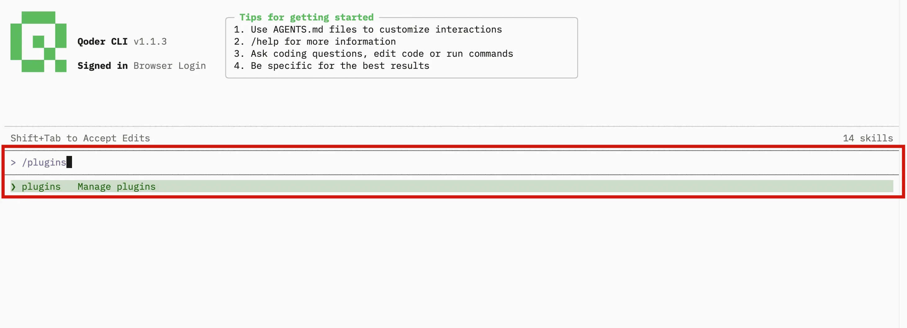

1. Open the **Marketplaces** tab and select **+ Add marketplace**.

    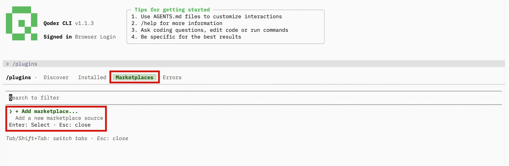

1. Paste the Apify plugin repository URL and press Enter:

    ```text
    https://github.com/apify/apify-qoder-plugin
    ```

    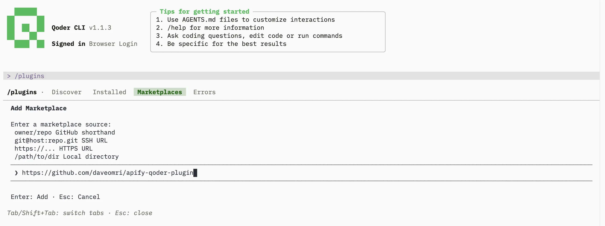

1. Open the **Discover** tab. The `apify` plugin appears in the list. Press Enter to view its details.

    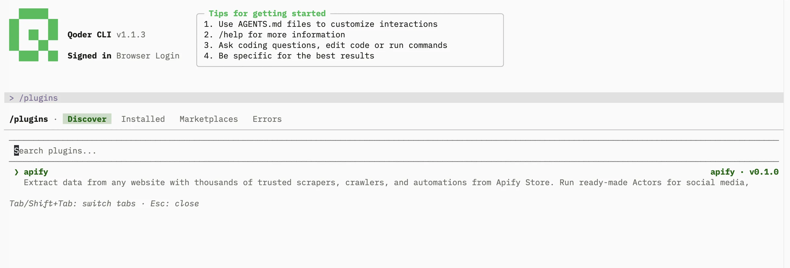

1. Review the plugin details and trust warning, then select **Install (user scope)** and press Enter.

    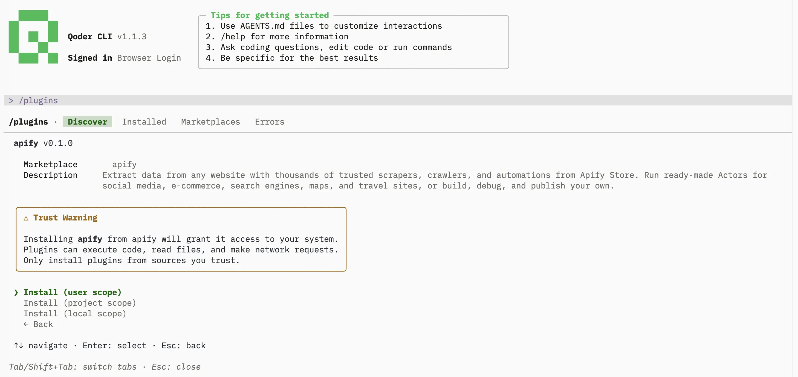

1. Run `/plugins reload` to apply the changes, then restart the Qoder CLI so the bundled MCP server registers (see the tip below).

1. Open the **Installed** tab to confirm the `apify` plugin is enabled and its MCP server shows as connected.

    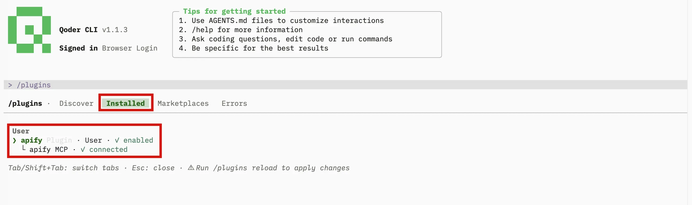

:::tip Restart the CLI so the MCP server registers

The Apify MCP server registers when the Qoder CLI starts, not on `/plugins reload`. If `/mcp` shows no Apify server after installing, fully quit and reopen the Qoder CLI.

:::

## Authenticate to Apify

The plugin bundles the Apify MCP server. Read-only tools like searching Apify Store and fetching Actor details work without signing in, but you need to authenticate to run Actors and access your account data.

1. Run `/mcp` to open the MCP server manager and select **Plugin** to list plugin-provided servers.

    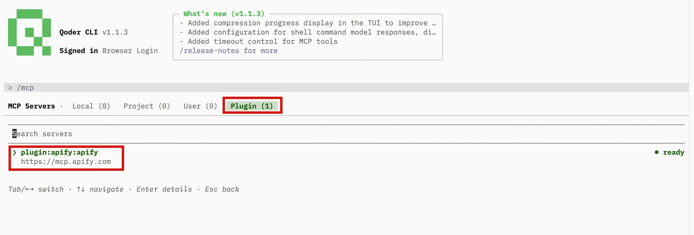

1. Select **plugin:apify:apify** to open its details. The status reads **needs authentication**. Select **Authenticate**.

    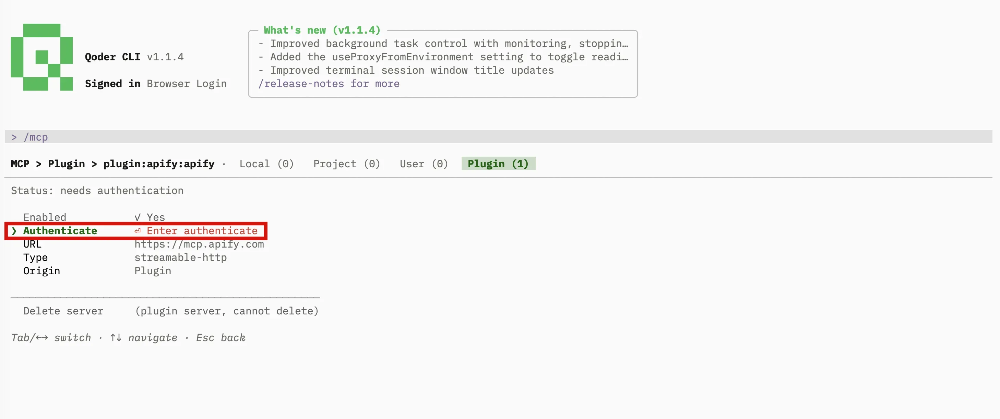

1. At the consent prompt, select **Yes** to open the Apify authentication page in your browser.

    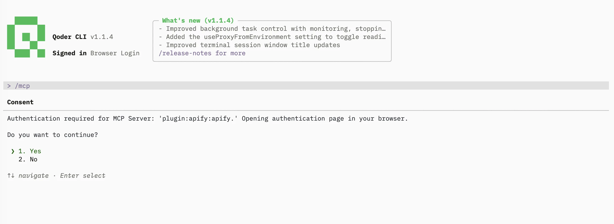

1. The Qoder CLI waits for the browser callback. If the browser doesn't open automatically, copy the full URL shown in the terminal and paste it into your browser.

    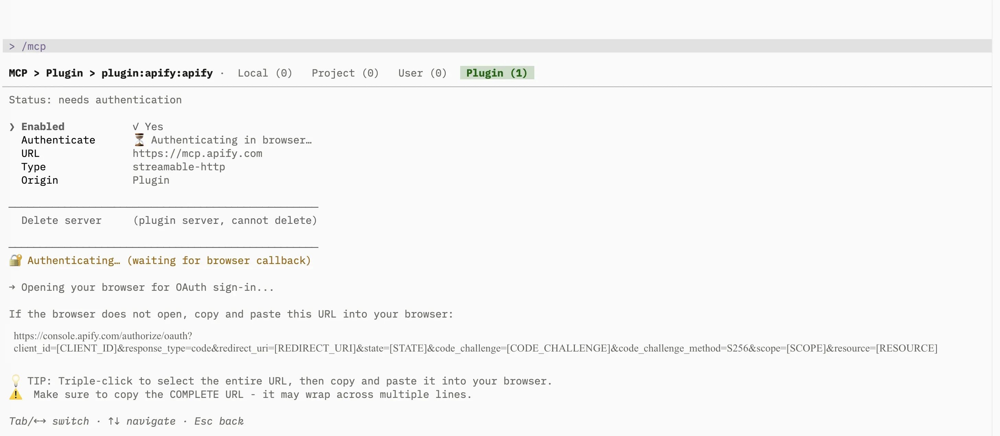

1. In the browser, review the permissions and allow access. A confirmation page tells you to close the window and return to the Qoder CLI.

    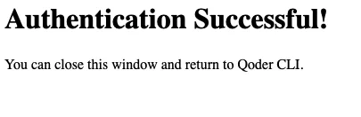

1. Back in the terminal, the server status changes to **ready** and the Apify tools become available.

    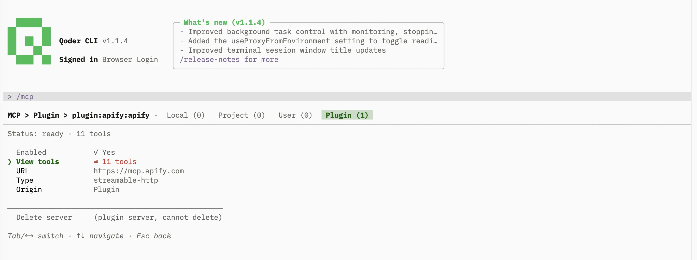

To see what the agent can call, select **View tools** on the server detail. The Apify MCP server exposes 11 tools, each labeled read-only, destructive, or open-world.

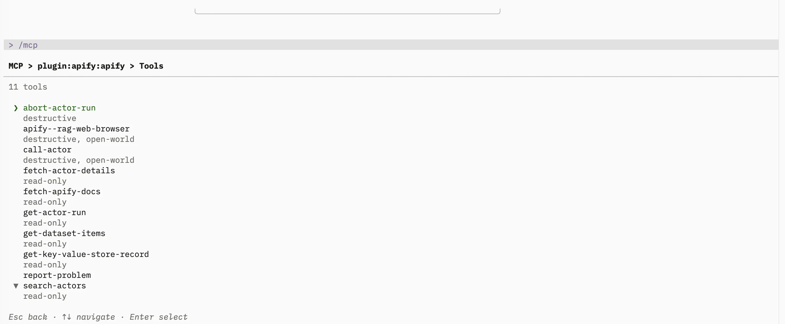

:::tip Session persistence

The connection stays authenticated for future sessions. You can revoke access at any time in [Apify Console > Settings > Integrations](https://console.apify.com/settings/integrations).

:::

## Run your first prompt

Describe what you want in natural language. The `apify` agent routes the request to the right tool or skill, so you don't need to name tools yourself.

> List what Apify tools you have available.

The agent lists the Apify MCP tools and skills it can call, grouped by purpose.

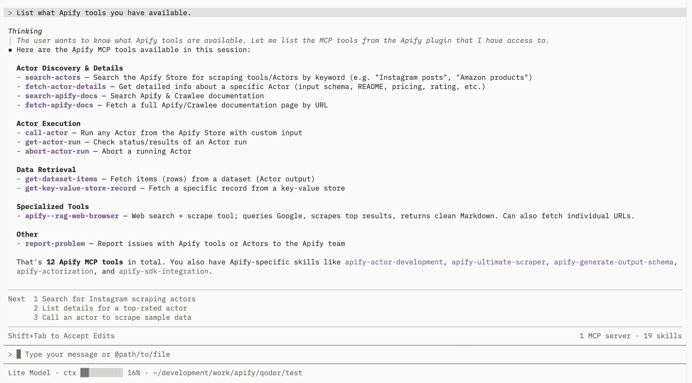

To go further, ask it to find an Actor for a task:

> Use Apify to find a good Actor for scraping Google Maps places. Show me the best option, its input requirements, pricing model, and what kind of dataset output it returns. Do not run the Actor yet.

## Bundled skills

| Skill | Description |
| --- | --- |
| `apify-ultimate-scraper` | CLI-driven extraction using existing Actors for multi-step scraping and lead-generation workflows. |
| `apify-actor-development` | Full Actor lifecycle - template selection, development, local testing, and deployment with `apify push`. |
| `apify-actorization` | Converts existing JavaScript, TypeScript, Python, or CLI projects into Apify Actors. |
| `apify-generate-output-schema` | Generates dataset and key-value store schemas for existing Actors. |
| `apify-sdk-integration` | Integrates Actor execution into applications using the `apify-client` package. |

Example prompts that route to specific skills:

_Ultimate scraper:_

> Find 10 highly rated coffee shops in Seattle with name, address, rating, phone, and website.

_Actor development:_

> Create an Apify Actor that accepts a `startUrl` and `maxPages` input, crawls the site, and stores each page title and URL.

_SDK integration:_

> Add Apify to this project. The Node.js API route should run an Actor and return dataset items as JSON.

## Troubleshooting

### The Apify MCP server doesn't appear

Run `/mcp` and check the **Plugin** list. If no Apify server is shown, the plugin was installed but the server hasn't registered yet. The server registers at startup, so fully quit and reopen the Qoder CLI, then check again.

### The `apify` plugin is disabled

Run `/plugins`, open the **Installed** tab, select the `apify` plugin, and enable it. Run `/plugins reload` to apply the change in the current session.

### The `/plugins` command isn't available

Plugins require a local installation of the Qoder CLI. Install or update the Qoder CLI locally, then run `/plugins` again.

### Browser doesn't open, or OAuth fails

If the browser doesn't open automatically, copy the OAuth URL shown in the terminal and paste it into your browser manually.

If you're running the Qoder CLI in a headless environment (SSH, remote container) or the OAuth flow still fails, authenticate with an API token instead. Copy your token from [Apify Console > Settings > Integrations](https://console.apify.com/settings/integrations) and set it before starting the Qoder CLI:

```bash
export APIFY_TOKEN=<YOUR_API_TOKEN>
```

## Limitations

- Long-running Actors may exceed the time a single tool call waits for completion. Reduce the scope or split the work across multiple prompts.
- Each Actor run consumes Apify platform usage from your plan in addition to any Qoder usage. See [Billing](/account/billing) for details.
- Skills that edit files in your project (Actor development, actorization, SDK integration) make local changes - review them before deploying or committing.

## Related integrations

- [Qoder IDE integration](/integrations/qoder-ide) - Import the same plugin in the Qoder IDE
- [QoderWork integration](/integrations/qoder-work) - Upload the plugin in QoderWork
- [MCP server integration](/integrations/mcp) - Use the Apify MCP server with other clients

## Resources

- [Apify plugin for Qoder](https://github.com/apify/apify-qoder-plugin) - Source repository and README with advanced setup notes
- [Qoder documentation](https://docs.qoder.com) - Official Qoder docs
- [Apify Store](https://apify.com/store) - Browse Actors you can run from the Qoder CLI
