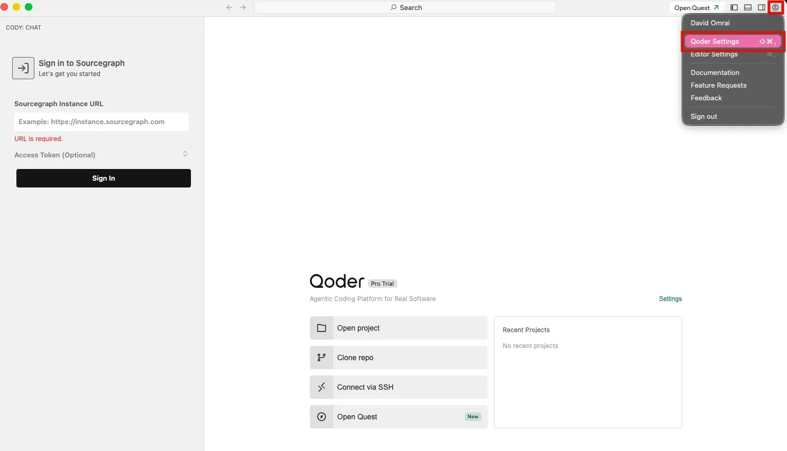
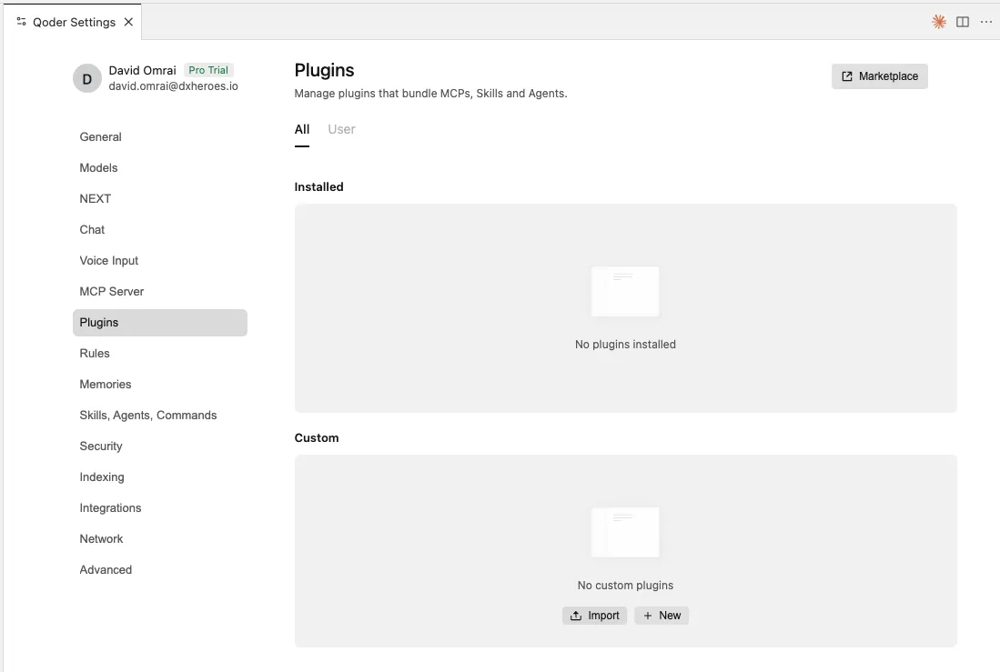
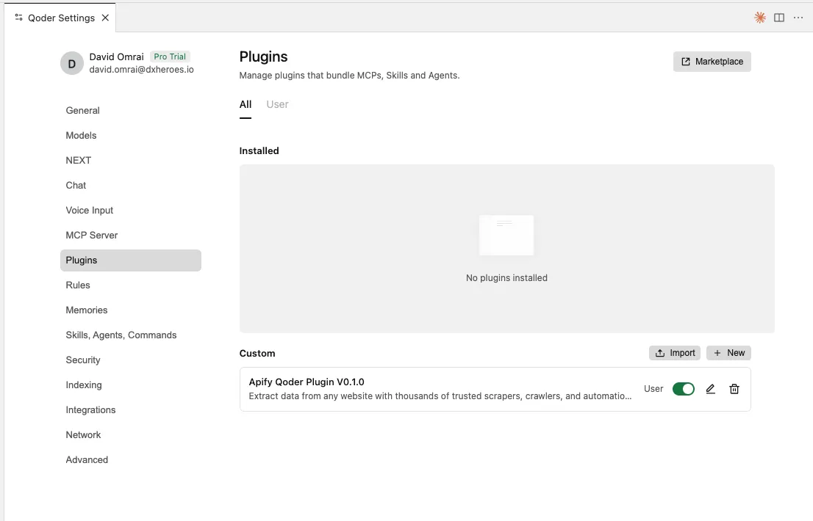
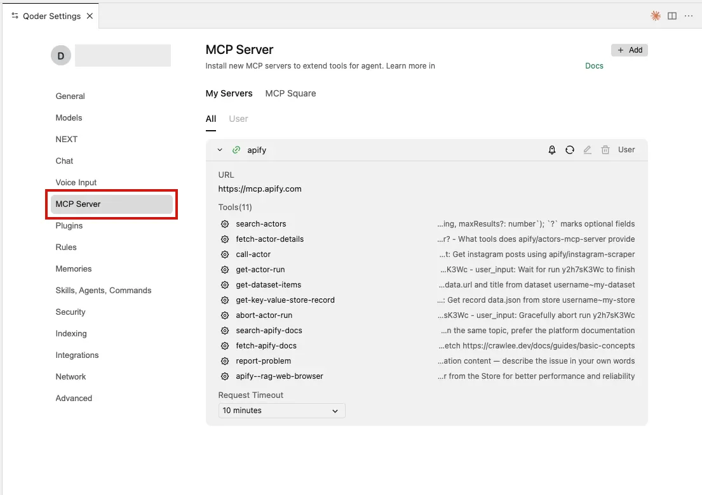
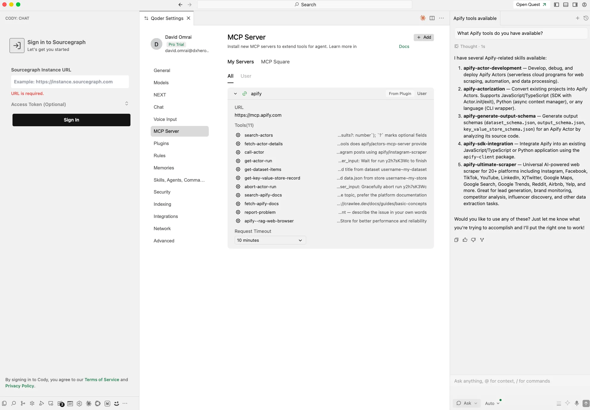

import ThirdPartyDisclaimer from '@site/sources/_partials/_third-party-integration.mdx';

[Qoder IDE](https://qoder.com) is an agentic coding editor. It reads and edits your project, runs commands, and completes multi-step development tasks from a built-in chat.

The [Apify plugin for Qoder](https://github.com/apify/apify-qoder-plugin) connects the Qoder IDE to Apify's library of [Actors](https://apify.com/store) and bundles:

- The [Apify MCP server](/integrations/mcp) for searching Apify Store, running Actors, and retrieving datasets through the [Model Context Protocol (MCP)](https://modelcontextprotocol.io/docs/getting-started/intro).
- An `apify` routing agent that picks the right tool or skill from a natural-language request.
- Five built-in skills for common workflows (see [Bundled skills](#bundled-skills) below).

<ThirdPartyDisclaimer />

## Prerequisites

- [An Apify account](https://console.apify.com/sign-up) - sign up for free if you don't have one.
- [Qoder IDE](https://qoder.com) - installed and signed in.
- A local copy of the [Apify plugin for Qoder](https://github.com/apify/apify-qoder-plugin) - clone or download the repository so you can import it.

## Import the plugin

1. Open the account menu and select **Qoder Settings**.

    

1. Select **Plugins**, then under **Custom** select **Import**.

    

1. Select the Apify plugin folder from your local copy of the repository. The **Apify Qoder Plugin** appears under **Custom**, enabled for your user.

    

1. Select **MCP Server** to confirm the `apify` server is registered from the plugin. It connects to `https://mcp.apify.com` and exposes the Apify tools.

    

## Authenticate to Apify

Read-only tools like searching Apify Store and fetching Actor details work without signing in, but you need to authenticate to run Actors and access your account data.

On the first action that needs your account, the Qoder IDE opens a browser tab for the Apify OAuth flow. Review the permissions and allow access to finish signing in. The connection stays authenticated for future sessions, and you can revoke access at any time in [Apify Console > Settings > Integrations](https://console.apify.com/settings/integrations).

## Run your first prompt

Open the chat and describe what you want in natural language. The `apify` agent routes the request to the right tool or skill, so you don't need to name tools yourself.

> What Apify tools do you have available?

The agent lists the Apify MCP tools and skills it can call.

## Bundled skills

| Skill | Description |
| --- | --- |
| `apify-ultimate-scraper` | Extraction using existing Actors for multi-step scraping and lead-generation workflows. |
| `apify-actor-development` | Full Actor lifecycle - template selection, development, local testing, and deployment with `apify push`. |
| `apify-actorization` | Converts existing JavaScript, TypeScript, Python, or CLI projects into Apify Actors. |
| `apify-generate-output-schema` | Generates dataset and key-value store schemas for existing Actors. |
| `apify-sdk-integration` | Integrates Actor execution into applications using the `apify-client` package. |

## Troubleshooting

### The Apify server doesn't appear under MCP Server

Confirm the **Apify Qoder Plugin** is enabled on the **Plugins** page, then open the **MCP Server** page again. If the server is still missing, restart the Qoder IDE so the plugin's MCP server registers.

### Actor runs time out

Increase the request timeout for the `apify` server on the **MCP Server** page. Long-running Actors may still exceed the limit; reduce the scope or split the work across multiple prompts.

### Browser doesn't open, or OAuth fails

If the browser doesn't open automatically, copy the OAuth URL shown by the IDE and paste it into your browser manually. If sign-in still fails, authenticate with an API token from [Apify Console > Settings > Integrations](https://console.apify.com/settings/integrations).

## Limitations

- Long-running Actors may exceed the time a single tool call waits for completion. Reduce the scope or split the work across multiple prompts.
- Each Actor run consumes Apify platform usage from your plan in addition to any Qoder usage. See [Billing](/account/billing) for details.
- Skills that edit files in your project (Actor development, actorization, SDK integration) make local changes - review them before deploying or committing.

## Related integrations

- [Qoder CLI integration](/integrations/qoder-cli) - Install the same plugin in the Qoder CLI
- [QoderWork integration](/integrations/qoder-work) - Upload the plugin in QoderWork
- [MCP server integration](/integrations/mcp) - Use the Apify MCP server with other clients

## Resources

- [Apify plugin for Qoder](https://github.com/apify/apify-qoder-plugin) - Source repository and README with advanced setup notes
- [Qoder documentation](https://docs.qoder.com) - Official Qoder docs
- [Apify Store](https://apify.com/store) - Browse Actors you can run from the Qoder IDE
