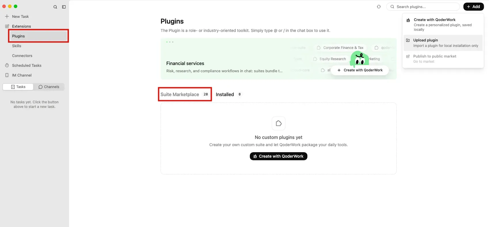
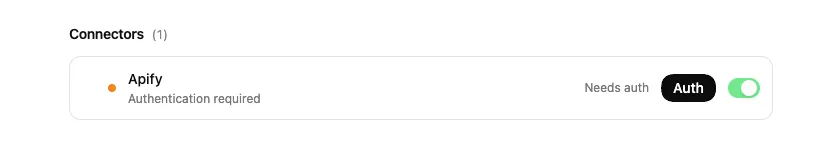
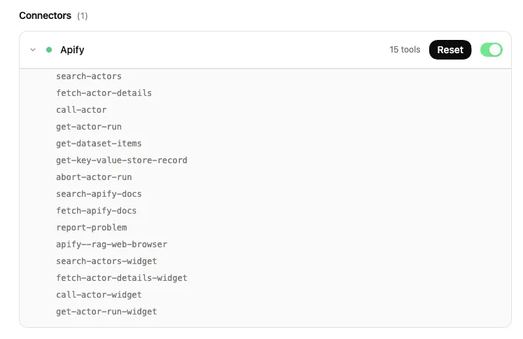
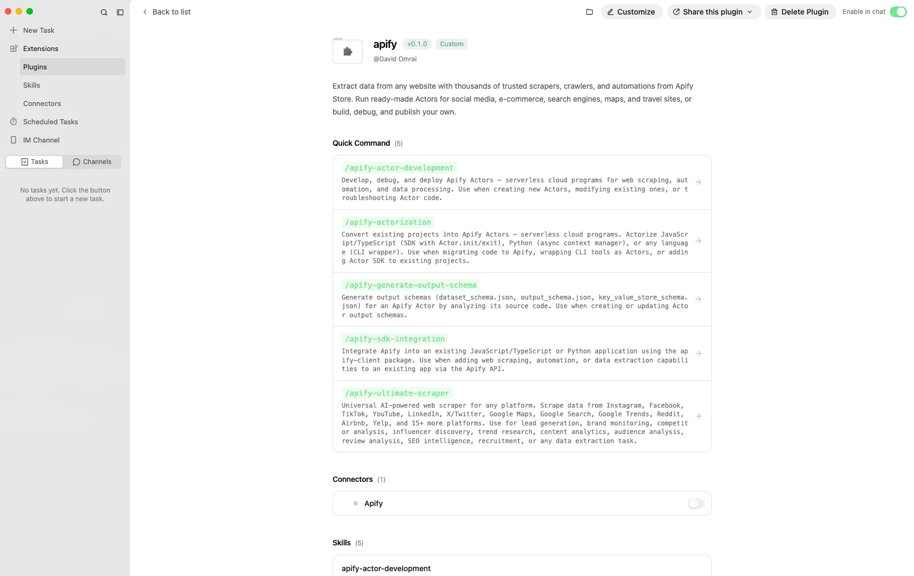
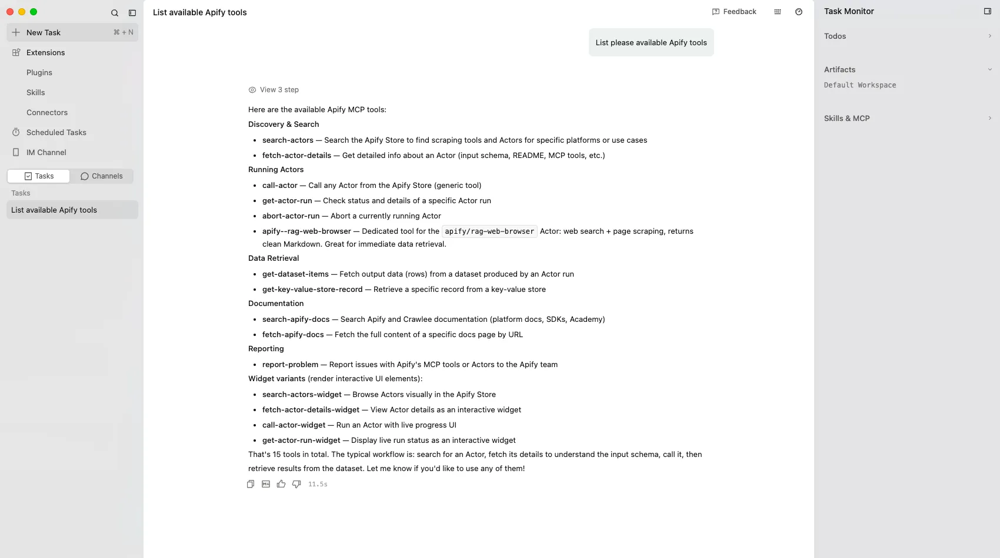

import ThirdPartyDisclaimer from '@site/sources/_partials/_third-party-integration.mdx';

[QoderWork](https://qoder.com) is a desktop assistant for knowledge work. It runs tasks and chats using role-oriented plugins that bundle MCP connectors, skills, and agents.

The [Apify plugin for Qoder](https://github.com/apify/apify-qoder-plugin) adds Apify to QoderWork and bundles:

- The [Apify MCP server](/integrations/mcp) as a connector for searching Apify Store, running Actors, and retrieving datasets through the [Model Context Protocol (MCP)](https://modelcontextprotocol.io/docs/getting-started/intro).
- An `apify` routing agent that picks the right tool or skill from a natural-language request.
- Five built-in skills, available as quick commands (see [Bundled skills](#bundled-skills) below).

<ThirdPartyDisclaimer />

## Prerequisites

- [An Apify account](https://console.apify.com/sign-up) - sign up for free if you don't have one.
- [QoderWork](https://qoder.com) - installed and signed in.
- A local copy of the [Apify plugin for Qoder](https://github.com/apify/apify-qoder-plugin) - download the plugin bundle so you can upload it.

## Upload the plugin

1. Open **Plugins**, select **+ Add**, then select **Upload plugin**.

    

1. Select the Apify plugin bundle from your local copy. The `apify` plugin is installed for local use and appears under your custom plugins.

## Authenticate the Apify connector

The plugin adds Apify as a connector. Read-only tools like searching Apify Store and fetching Actor details work without signing in, but you need to authenticate to run Actors and access your account data.

1. Open the `apify` plugin. Under **Connectors**, the Apify connector shows **Authentication required**. Select **Auth**.

    

1. Complete the Apify OAuth flow in your browser and allow access. The connector then reports its available tools.

    

The connection stays authenticated for future sessions. You can revoke access at any time in [Apify Console > Settings > Integrations](https://console.apify.com/settings/integrations).

## Enable the plugin in chat

1. On the plugin page, turn on **Enable in chat**. The plugin's quick commands and connector become available in tasks and chat.

    

1. Start a task or chat and describe what you want. The `apify` agent routes the request to the right tool or skill.

    > List available Apify tools.

    

## Bundled skills

Each skill is available as a quick command. Type `/` in a task or chat to run one directly.

| Quick command | Description |
| --- | --- |
| `/apify-ultimate-scraper` | Extraction using existing Actors for multi-step scraping and lead-generation workflows. |
| `/apify-actor-development` | Full Actor lifecycle - template selection, development, local testing, and deployment with `apify push`. |
| `/apify-actorization` | Converts existing JavaScript, TypeScript, Python, or CLI projects into Apify Actors. |
| `/apify-generate-output-schema` | Generates dataset and key-value store schemas for existing Actors. |
| `/apify-sdk-integration` | Integrates Actor execution into applications using the `apify-client` package. |

## Widget tools

In QoderWork, the Apify connector also exposes interactive widget variants of its core tools - `search-actors-widget`, `fetch-actor-details-widget`, `call-actor-widget`, and `get-actor-run-widget`. They render Actor search, details, runs, and run status as interactive UI elements in chat instead of plain text.

## Troubleshooting

### The Apify connector stays on "Authentication required"

Open the `apify` plugin, select **Auth** on the Apify connector, and complete the browser sign-in. If the browser doesn't open automatically, copy the OAuth URL and paste it into your browser manually.

### Tools don't appear in chat

Confirm **Enable in chat** is turned on for the `apify` plugin and that the Apify connector is authenticated. Reopen the task or chat after enabling the plugin.

### Actor runs time out

Long-running Actors may exceed the time a single tool call waits for completion. Reduce the scope or split the work across multiple prompts.

## Limitations

- Long-running Actors may exceed the time a single tool call waits for completion. Reduce the scope or split the work across multiple prompts.
- Each Actor run consumes Apify platform usage from your plan in addition to any Qoder usage. See [Billing](/account/billing) for details.
- Skills that edit files (Actor development, actorization, SDK integration) make local changes - review them before deploying or committing.

## Related integrations

- [Qoder CLI integration](/integrations/qoder-cli) - Install the same plugin in the Qoder CLI
- [Qoder IDE integration](/integrations/qoder-ide) - Import the plugin in the Qoder IDE
- [MCP server integration](/integrations/mcp) - Use the Apify MCP server with other clients

## Resources

- [Apify plugin for Qoder](https://github.com/apify/apify-qoder-plugin) - Source repository and README with advanced setup notes
- [Qoder documentation](https://docs.qoder.com) - Official Qoder docs
- [Apify Store](https://apify.com/store) - Browse Actors you can run from QoderWork
