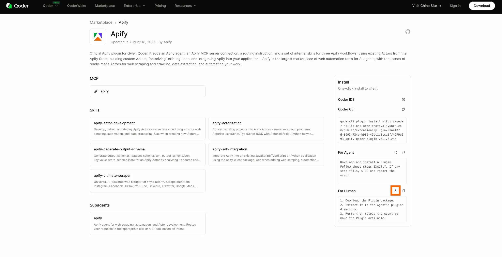

import ThirdPartyDisclaimer from '@site/sources/_partials/_third-party-integration.mdx';

[Qwen Code](https://github.com/QwenLM/qwen-code) is an open-source agentic coding tool that runs in your terminal. It reads and edits your codebase, runs commands, and completes multi-step development tasks. Qwen Code installs extensions from several ecosystems, including Qoder plugins, so it reuses the same [Apify plugin built for Qoder](https://github.com/apify/apify-qoder-plugin) with no separate build.

On install, Qwen Code converts the Qoder plugin into its own extension format and keeps everything the plugin bundles:

- The [Apify MCP server](/integrations/mcp) for searching Apify Store, running Actors, and retrieving datasets through the [Model Context Protocol (MCP)](https://modelcontextprotocol.io/docs/getting-started/intro).
- An `apify` routing agent that picks the right tool or skill from a natural-language request.
- Five built-in skills for common workflows (see [Bundled skills](#bundled-skills) below).

<ThirdPartyDisclaimer />

## Prerequisites

- [An Apify account](https://console.apify.com/sign-up) - sign up for free if you don't have one
- [Qwen Code](https://github.com/QwenLM/qwen-code) - installed and configured with a model provider

## Install the plugin

Qwen Code installs the Apify plugin from its ZIP archive with the `qwen extensions install` command. Download the ZIP first, then point the installer at the local file.

1. Open the [Apify plugin on the Qoder Marketplace](https://qoder.com/marketplace/plugin?id=bbbdb1cb-8bad-441e-b42f-ce0e33e3a521). Under **For Human**, select the download icon to download the plugin ZIP.
    

1. Install the archive, replacing the path with where you saved it:

    ```bash
    qwen extensions install ./apify-qoder-plugin-<version>.zip
    ```

    Qwen Code converts the Qoder manifest to its own `qwen-extension.json`, registers the bundled skills and the `apify` agent, and adds the Apify MCP server from the plugin's root `.mcp.json`.

1. Restart Qwen Code so the extension and its MCP server load.

To scope the extension to the current workspace instead of your user account, add `--scope workspace`.

:::tip One plugin, two transports

The plugin's `.mcp.json` declares the Apify MCP endpoint under both `url` and `httpUrl`. Qwen Code reads `httpUrl` for streamable HTTP, while the Qoder apps read `url`, so the same artifact connects in every host without editing.

:::

## Authenticate to Apify

The plugin bundles the Apify MCP server and connects to its default endpoint, which requires an Apify account. Authenticate before your first prompt - without a token the server rejects every tool call, including Actor search.

1. Run `/mcp` to open the MCP management dialog and find the `apify` server.

1. Select the `apify` server and authenticate. Qwen Code opens the Apify authorization page in your browser.

1. In the browser, review the permissions and allow access. A confirmation page tells you to close the window and return to Qwen Code.

1. Back in the terminal, the `apify` server status changes to connected and the Apify tools become available.

:::tip Session persistence

The connection stays authenticated for future sessions. You can revoke access at any time in [Apify Console > Settings > Integrations](https://console.apify.com/settings/integrations).

:::

## Run your first prompt

Describe what you want in natural language. The `apify` agent routes the request to the right tool or skill, so you don't need to name tools yourself.

> List what Apify tools you have available.

The agent lists the Apify MCP tools and skills it can call, grouped by purpose.

To go further, ask it to find an Actor for a task:

> Use Apify to find a good Actor for scraping Google Maps places. Show me the best option, its input requirements, pricing model, and what kind of dataset output it returns. Do not run the Actor yet.

## Bundled skills

| Skill | Description |
| --- | --- |
| `apify-ultimate-scraper` | Extraction using existing Actors for multi-step scraping and lead-generation workflows. |
| `apify-actor-development` | Full Actor lifecycle - template selection, development, local testing, and deployment with `apify push`. |
| `apify-actorization` | Converts existing JavaScript, TypeScript, Python, or CLI projects into Apify Actors. |
| `apify-generate-output-schema` | Generates dataset and key-value store schemas for existing Actors. |
| `apify-sdk-integration` | Integrates Actor execution into applications using the `apify-client` package. |

Skills are available through the `/skills` command, and the `apify` agent appears under **Extension Agents** in the subagent manager. These prompts route to specific skills.

To run `apify-ultimate-scraper`:

> Find 10 highly rated coffee shops in Seattle with name, address, rating, phone, and website.

To run `apify-actor-development`:

> Create an Apify Actor that accepts a `startUrl` and `maxPages` input, crawls the site, and stores each page title and URL.

To run `apify-sdk-integration`:

> Add Apify to this project. The Node.js API route should run an Actor and return dataset items as JSON.

## Manage the extension

Use the `qwen extensions` commands to manage the plugin after install:

```bash
qwen extensions disable apify   # turn the plugin off
qwen extensions enable apify    # turn it back on
qwen extensions uninstall apify # remove it
```

Inside a session, run `/extensions list` to see installed extensions or `/extensions` for the interactive manager.

To move to a newer release, download the new ZIP and install it again. The `qwen extensions update` command only covers extensions installed from a local path or a git repository, so it can't update an archive install.

## Troubleshooting

### The Apify MCP server doesn't appear

Run `/mcp` to check the server list. If no Apify server is shown, the extension was installed but the server hasn't registered yet. Fully quit and reopen Qwen Code, then check again.

### The MCP server fails with an SSE error

An older plugin build declared the MCP endpoint only under `url`, which Qwen Code reads as a legacy SSE transport and rejects with an `SSE error: Non-200 status code (400)`. Reinstall the latest release archive - its `.mcp.json` also sets `httpUrl`, which Qwen Code uses for streamable HTTP.

### Browser doesn't open, or OAuth fails

If the browser doesn't open automatically, copy the authorization URL from the terminal and open it manually.

If the flow still fails, authenticate the `apify` server with an API token instead by adding an `Authorization: Bearer <APIFY_TOKEN>` header to its configuration - see [Bearer token authentication](/integrations/mcp) for the exact shape. Copy your token from [Apify Console > Settings > Integrations](https://console.apify.com/settings/integrations).

Setting `APIFY_TOKEN` in your shell doesn't authenticate the MCP server. It covers the Apify CLI and `apify-client`, which the Actor development, actorization, and SDK integration skills use, so those skills keep working without MCP access. For them, run `apify login` once, or set the variable in a headless environment:

```bash
export APIFY_TOKEN=<YOUR_API_TOKEN>
```

## Limitations

- The plugin's role guide ships as `qoder.md`. Qwen Code auto-loads a root `system-prompt.md` as context, so this file is not injected automatically. The `apify` agent and skills still work; invoke the agent to get the routing behavior.
- Long-running Actors may exceed the time a single tool call waits for completion. Reduce the scope or split the work across multiple prompts.
- Each Actor run consumes Apify platform usage from your plan in addition to any Qwen Code usage. See [Billing](/account/billing) for details.
- Skills that edit files in your project (Actor development, actorization, SDK integration) make local changes - review them before deploying or committing.

## Related integrations

- [Qoder integration](/integrations/qoder-plugin) - Install the same plugin in the Qoder CLI, IDE, Desktop app, or QoderWork
- [MCP server integration](/integrations/mcp) - Use the Apify MCP server with other clients

## Resources

- [Apify plugin for Qoder](https://github.com/apify/apify-qoder-plugin) - Source repository and README with advanced setup notes
- [Qwen Code extensions](https://qwenlm.github.io/qwen-code-docs/en/users/extension/introduction/) - Official extension install and management docs
- [Apify Store](https://apify.com/store) - Browse Actors you can run from Qwen Code
