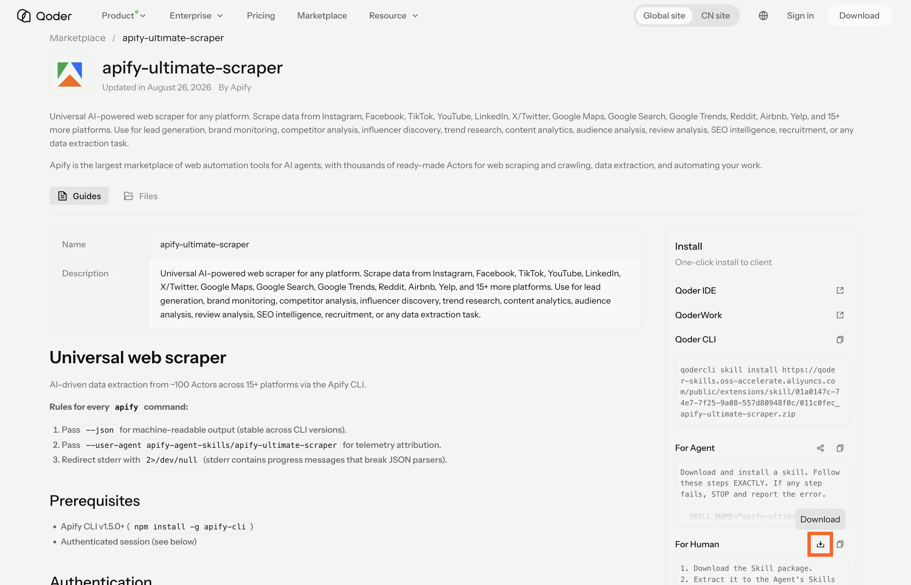

import ThirdPartyDisclaimer from '@site/sources/_partials/_third-party-integration.mdx';

Alibaba ships two agent tools under the Qwen name, and both can call Apify [Actors](https://apify.com/store). They connect to Apify in different ways:

- **[Qwen Code](#qwen-code)** is an open-source agentic coding tool that runs in your terminal. It supports the Qoder plugin format, so it installs the full [Apify plugin built for Qoder](https://github.com/apify/apify-qoder-plugin) - the Apify MCP server, the `apify` routing agent, and five skills - with no separate build.
- **[QwenWork](#qwenwork)** is an all-in-one workplace AI agent for documents, data, and knowledge work, available as desktop and web apps. It is not a plugin host, so you connect the [Apify MCP server](/integrations/mcp) as a custom connector and upload the Apify skills individually.

<ThirdPartyDisclaimer />

## Supported surfaces

| Product | What it is | How Apify connects |
| --- | --- | --- |
| [Qwen Code](#qwen-code) | Agentic coding tool in the terminal | Install the Apify plugin (bundles the MCP server, the `apify` agent, and skills) |
| [QwenWork](#qwenwork) | Workplace AI agent (desktop and web) | Apify MCP server as a custom connector, plus skills uploaded one by one |

## Prerequisites

- [An Apify account](https://console.apify.com/sign-up) - sign up for free if you don't have one
- The Qwen tool you want to use - [Qwen Code](https://github.com/QwenLM/qwen-code) installed with a model provider, or [QwenWork](https://qwenwork.ai) installed and signed in

## Qwen Code

Qwen Code installs the same plugin as Qoder and keeps everything it bundles:

- The [Apify MCP server](/integrations/mcp) for searching Apify Store, running Actors, and retrieving datasets through the [Model Context Protocol (MCP)](https://modelcontextprotocol.io/docs/getting-started/intro).
- An `apify` routing agent that picks the right tool or skill from a natural-language request.
- Five built-in skills for common workflows (see [Bundled skills](#bundled-skills) below).

### Install the plugin

Qwen Code installs the Apify plugin from its ZIP archive with the `qwen extensions install` command. Download the ZIP first, then point the installer at the local file.

1. Open the [Apify plugin on the Qoder Marketplace](https://qoder.com/marketplace/plugin?id=bbbdb1cb-8bad-441e-b42f-ce0e33e3a521). Under **For Human**, select the download icon to download the plugin ZIP.
    

1. Install the archive, replacing the path with where you saved it:

    ```bash
    qwen extensions install ./apify-qoder-plugin-<version>.zip
    ```

    Qwen Code converts the Qoder manifest to its own `qwen-extension.json`. It registers the bundled skills and the `apify` agent, then adds the Apify MCP server from the plugin's root `.mcp.json`.

1. Restart Qwen Code so the extension and its MCP server load.

To scope the extension to the current workspace instead of your user account, add `--scope workspace`.

:::tip One plugin, two transports

The plugin's `.mcp.json` declares the Apify MCP endpoint under both `url` and `httpUrl`. Qwen Code reads `httpUrl` for streamable HTTP, while the Qoder apps read `url`, so the same artifact connects in every host without editing.

:::

### Authenticate to Apify

The plugin bundles the Apify MCP server and connects to its default endpoint, which requires an Apify account. Authenticate before your first prompt - without a token the server rejects every tool call, including Actor search.

1. Run `/mcp` to open the MCP management dialog and find the `apify` server.

1. Select the `apify` server and authenticate. Qwen Code opens the Apify authorization page in your browser.

1. In the browser, review the permissions and allow access. A confirmation page tells you to close the window and return to Qwen Code.

1. Back in the terminal, the `apify` server status changes to connected and the Apify tools become available.

The connection stays authenticated for future sessions. You can revoke access at any time in [Apify Console > Settings > Integrations](https://console.apify.com/settings/integrations?utm_source=qwen&utm_medium=integrations).

### Run your first prompt

Describe what you want in natural language. The `apify` agent routes the request to the right tool or skill, so you don't need to name tools yourself.

> List what Apify tools you have available.

To go further, ask it to find an Actor for a task:

> Use Apify to find a good Actor for scraping Google Maps places. Show me the best option, its input requirements, pricing model, and what kind of dataset output it returns. Do not run the Actor yet.

### Manage the extension

Use the `qwen extensions` commands to manage the plugin after install:

```bash
qwen extensions disable apify   # turn the plugin off
qwen extensions enable apify    # turn it back on
qwen extensions uninstall apify # remove it
```

Inside a session, run `/extensions list` to see installed extensions or `/extensions` for the interactive manager.

To move to a newer release, download the new ZIP and install it again. The `qwen extensions update` command only covers extensions installed from a local path or a git repository, so it can't update an archive install.

## QwenWork

QwenWork isn't a plugin host, so the bundled `apify` agent isn't available there. You give it Apify in two steps: connect the [Apify MCP server](/integrations/mcp) as a custom connector for the tools, and upload the Apify skills you want as local skills.

### Add the Apify MCP server

Add the Apify MCP server under **Extensions > Connectors**. It authenticates through Apify OAuth, so there's no token to paste.

1. Open **Extensions > Connectors**, then select **+ Add**.

1. Choose **Streamable HTTP** as the server type and fill in the form:
    - **Server Name:** `apify`
    - **Server URL:** `https://mcp.apify.com`

1. Select **Add**. QwenWork opens the Apify authorization page in your browser.

1. Sign in to Apify and allow access. The browser redirects back to QwenWork, and the connector connects.

The Apify tools for searching Apify Store, running Actors, and retrieving datasets are then available in tasks and chat. You can also paste a JSON configuration instead of filling in the form. To revoke access later, remove the connector or manage the connection in [Apify Console > Settings > Integrations](https://console.apify.com/settings/integrations?utm_source=qwen&utm_medium=integrations).

### Add the Apify skills

QwenWork installs skills one at a time from a local package. Each Apify skill is a `.zip` that contains a `SKILL.md` and its `references/` folder.

1. Download the Apify skill packages you want. Each skill has its own page on the [Qoder Marketplace](https://qoder.com/marketplace). In the **Install** panel, under **For Human**, select the download icon to save the skill `.zip`.

    

1. In QwenWork, open **Extensions > Skills**, select **+ Add**, then **Upload skill**.

1. Drag the `.zip` into the **Install Skill** dialog (or select it), then select **Install**. The skill appears under **Installed > Local install**.

1. Repeat for each skill you want to add.

QwenWork uses an installed skill automatically when a task matches the trigger conditions in its `SKILL.md`. See [Bundled skills](#bundled-skills) for the five Apify skills.

### Run your first prompt

With the connector added, describe a task in natural language and QwenWork calls the Apify tools:

> Use Apify to find 10 highly rated coffee shops in Seattle with name, address, rating, phone, and website.

To scope a source directly, name the Actor's target:

> Use Apify to scrape the latest 50 posts from a public Instagram profile and return them as a table.

## Bundled skills

| Skill | Description |
| --- | --- |
| `apify-ultimate-scraper` | Extraction using existing Actors for multi-step scraping and lead-generation workflows. |
| `apify-actor-development` | Full Actor lifecycle - template selection, development, local testing, and deployment with `apify push`. |
| `apify-actorization` | Converts existing JavaScript, TypeScript, Python, or CLI projects into Apify Actors. |
| `apify-generate-output-schema` | Generates dataset and key-value store schemas for existing Actors. |
| `apify-sdk-integration` | Integrates Actor execution into applications using the `apify-client` package. |

In Qwen Code, skills are available through the `/skills` command, and the `apify` agent appears under **Extension Agents** in the subagent manager. In QwenWork, upload the skills you want (see [Add the Apify skills](#add-the-apify-skills)), and it runs them by trigger condition. These prompts route to specific skills:

To run `apify-ultimate-scraper`:

> Find 10 highly rated coffee shops in Seattle with name, address, rating, phone, and website.

To run `apify-actor-development`:

> Create an Apify Actor that accepts a `startUrl` and `maxPages` input, crawls the site, and stores each page title and URL.

To run `apify-sdk-integration`:

> Add Apify to this project. The Node.js API route should run an Actor and return dataset items as JSON.

## Troubleshooting

Common issues and how to fix them.

### The Apify MCP server doesn't appear

In Qwen Code, run `/mcp` to check the server list. In QwenWork, open **Extensions > Connectors** and confirm the `apify` connector is installed. If the server is missing, fully quit and reopen the app, then check again.

### The MCP server fails with an SSE error

This affects Qwen Code. An older plugin build declared the MCP endpoint only under `url`, which Qwen Code reads as a legacy SSE transport and rejects with an `SSE error: Non-200 status code (400)`. Reinstall the latest release archive - its `.mcp.json` also sets `httpUrl`, which Qwen Code uses for streamable HTTP.

### Browser doesn't open, or OAuth fails

If the sign-in page doesn't open or the server stays disconnected:

- **Qwen Code:** copy the authorization URL from the terminal and open it manually. If sign-in still fails, add an `Authorization: Bearer <APIFY_TOKEN>` header to the `apify` server in `~/.qwen/settings.json` under `mcpServers` - see [Bearer token authentication](/integrations/mcp) for the shape.
- **QwenWork:** remove the connector and add it again. If OAuth still won't complete, re-add it with an `Authorization` header set to `Bearer <APIFY_TOKEN>`.

Get the token from [Apify Console > Settings > Integrations](https://console.apify.com/settings/integrations?utm_source=qwen&utm_medium=integrations). Setting `APIFY_TOKEN` in your shell doesn't authenticate the MCP server; it only covers the Apify CLI and `apify-client` used by the Actor development, actorization, and SDK integration skills, so run `apify login` once for those.

## Limitations

- In Qwen Code, the plugin's role guide ships as `qoder.md`. Qwen Code auto-loads a root `system-prompt.md` as context, so this file is not injected automatically. The `apify` agent and skills still work; invoke the agent to get the routing behavior.
- QwenWork doesn't host the bundled `apify` agent, so it has no automatic routing. Add the skills you need and let their trigger conditions apply, or name the task clearly.
- Long-running Actors may exceed the time a single tool call waits for completion. Reduce the scope or split the work across multiple prompts.
- Each Actor run consumes Apify platform usage from your plan in addition to any Qwen usage. See [Billing](/account/billing) for details.
- Skills that edit files in your project (Actor development, actorization, SDK integration) make local changes - review them before deploying or committing.

## Related integrations

- [Qoder integration](/integrations/qoder-plugin) - Install the same plugin in the Qoder CLI, IDE, Desktop app, or QoderWork
- [MCP server integration](/integrations/mcp) - Use the Apify MCP server with other clients

## Resources

- [Apify plugin for Qoder](https://github.com/apify/apify-qoder-plugin) - Source repository and README with advanced setup notes
- [Qwen Code extensions](https://qwenlm.github.io/qwen-code-docs/en/users/extension/introduction/) - Official extension install and management docs
- [QwenWork documentation](https://docs.qwenwork.ai) - Official QwenWork docs for connectors and skills
- [Apify Store](https://apify.com/store) - Browse Actors you can run from Qwen
