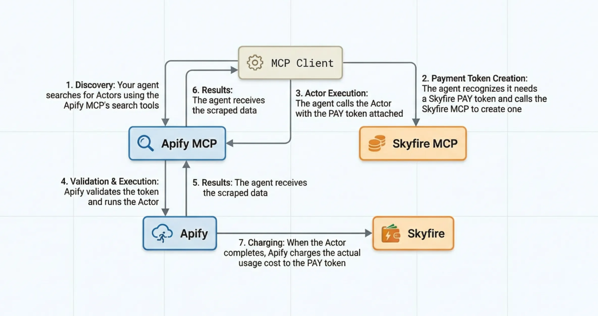

import Tabs from '@theme/Tabs';
import TabItem from '@theme/TabItem';

Agentic payments enable AI agents to autonomously run Apify Actors using third-party payment providers, without requiring traditional Apify user accounts. This allows agents to discover, execute, and pay for web scraping and automation tasks independently.

Apify supports agentic payments through _Skyfire_, a payment network specifically designed for AI agents.

:::warning Experimental feature

Keep in mind that agentic payments are an experimental feature and may undergo significant changes considering the rapid evolution of payment protocols and AI technologies.

:::

## What is Skyfire?

[Skyfire](https://skyfire.xyz/) is a payment network built specifically for AI agents, enabling autonomous transactions with digital wallets and spending controls. It provides the infrastructure necessary for agents to make payments on behalf of users, allowing autonomous AI-driven workflows.

With Skyfire integration, agents can discover available Apify Actors, execute scraping and automation tasks, and pay for services using pre-funded Skyfire tokens, all without human intervention.

## Use Skyfire with Apify MCP Server

The [Apify MCP server](https://docs.apify.com/platform/integrations/mcp) provides the simplest way for agents to access Apify's Actor library using Skyfire payments.

### Prerequisites

Before using agentic payments through MCP, you need:

1. _A Skyfire account_ with a funded wallet - [sign up at Skyfire](https://app.skyfire.xyz/auth)
1. _An MCP client_ that supports multiple server connections, such as [OpenCode](https://opencode.ai/), [Claude Desktop](https://claude.com/download) with MCP support, or other compatible clients
1. _Both MCP servers configured_: Skyfire's MCP server and Apify's MCP server

### Configuration

Configure your MCP client to connect to both the Skyfire and Apify MCP servers. When connecting to the Apify MCP server for agentic payments, you must include the `?payment=skyfire` query parameter in the server URL. This enables the agentic payment flow and informs the agent about payment requirements.

```text
https://mcp.apify.com?payment=skyfire
```

<Tabs>
<TabItem value="OpenCode" label="OpenCode" >

If you're using [OpenCode](https://opencode.ai/), add this configuration to your `opencode.json` file (refer to [OpenCode configuration docs](https://opencode.ai/docs/config/) for file location on your system):

```json
{
  "$schema": "https://opencode.ai/config.json",
  "mcp": {
    "skyfire": {
      "enabled": true,
      "type": "remote",
      "url": "https://mcp.skyfire.xyz/mcp",
      "headers": {
        "skyfire-api-key": "YOUR_SKYFIRE_API_KEY"
      }
    },
    "apify": {
      "enabled": true,
      "type": "remote",
      "url": "https://mcp.apify.com?payment=skyfire"
    }
  }
}
```

</TabItem>
<TabItem value="Claude Desktop" label="Claude Desktop" >

If you're using [Claude Desktop](https://claude.com/download), add this configuration to your `claude_desktop_config.json` file (refer to [Claude Desktop configuration docs](https://modelcontextprotocol.io/docs/develop/connect-local-servers) for file location on your system) and restart the application:

```json
{
  "mcpServers": {
    "skyfire": {
      "command": "npx",
      "args": [
        "mcp-remote",
        "https://mcp.skyfire.xyz/mcp",
        "--header",
        "skyfire-api-key: YOUR_SKYFIRE_API_KEY"
      ]
    },
    "apify": {
      "command": "npx",
      "args": [
        "mcp-remote",
        "https://mcp.apify.com?payment=skyfire"
      ]
    }
  },
  "isUsingBuiltInNodeForMcp": true
}
```

</TabItem>
</Tabs>

Replace `YOUR_SKYFIRE_API_KEY` with Skyfire buyer API key, which you can obtain from your [Skyfire dashboard](https://app.skyfire.xyz/auth).

### How it works

When an agent uses the Apify MCP server with Skyfire payments, the workflow proceeds as follows:

1. The agent searches for suitable Actors using the search tools or works with pre-loaded Actors.
1. When attempting to run an Actor, the agent recognizes the need for a Skyfire PAY token with a minimum of $5 and calls the Skyfire MCP server to create it.
1. The agent calls the Actor tool with the payment token.
1. The Apify platform validates the token and starts the Actor run.
1. The Actor does the work and delivers results.
1. When the run completes, the agent receives the Actor results and can retrieve additional data if needed.
1. Finally, Apify's billing system charges the Skyfire PAY token for the actual usage cost.

Any unused funds remain available in the token for future runs or are returned to your Skyfire wallet when the token expires. This means you will not lose money if the actual usage is less than the $5 minimum.



### Pre-loading Actors

For more predictable workflows, you can pre-load specific Actors when connecting to the MCP server by adding them to the URL:

```text
https://mcp.apify.com?payment=skyfire&tools=actor1,actor2,actor3
```

Replace `actor1,actor2,actor3` with the actual Actor IDs you want to make available, such as `junglee/free-amazon-product-scraper,streamers/youtube-scraper`.
See which Actors [support agentic payments](#supported-actors).

### Actor discovery

When not pre-loading Actors, agents can discover suitable Actors dynamically using the search tools. The search automatically filters results to show only Actors that support agentic payments.

## Use Skyfire with Apify API

For direct API integration, you can use Skyfire PAY tokens to authenticate and pay for Actor runs.

:::info Handled by MCP

The MCP client handles these operations automatically when using Skyfire PAY tokens.

:::

### Authentication

Instead of using a traditional Apify API token, pass your Skyfire PAY token in the request header:

```text
skyfire-pay-id: YOUR_SKYFIRE_PAY_TOKEN
```

### Run an Actor

Make a standard Actor run request to the [run Actor endpoint](https://docs.apify.com/api/v2#/reference/actors/run-collection/run-actor), but include the Skyfire PAY token in the header.

```bash title="Example of using the synchronous run endpoint"
curl -X POST \
  'https://api.apify.com/v2/acts/ACTOR_ID/run-sync' \
  -H 'skyfire-pay-id: YOUR_SKYFIRE_PAY_TOKEN' \
  -H 'Content-Type: application/json' \
  -d '{
    "input": {
      "your": "input"
    }
  }'
```

You can also use the asynchronous [run Actor endpoint](https://docs.apify.com/api/v2#/reference/actors/run-collection/run-actor) if you don't need to wait for results immediately.

### Retrieving results

After your Actor run completes, you can retrieve results using the [dataset endpoints](https://docs.apify.com/api/v2#/reference/datasets) or [key-value store endpoints](https://docs.apify.com/api/v2#/reference/key-value-stores). Include the same `skyfire-pay-id` header to authenticate these requests.

### Supported Actors

Not all Actors in the Apify Store can be run using agentic payments.

Apify maintains a curated list of Actors approved for agentic payments. To check if an Actor supports agentic payments, use the `allowsAgenticUsers=true` query parameter when [searching the store via API](https://docs.apify.com/api/v2#/reference/store/store-actors-collection/get-list-of-actors-in-store).

```text
https://api.apify.com/v2/store?allowsAgenticUsers=true
```

### Payment requirements

Your Skyfire PAY token must have at least _$5_ available to run Actors. However, you will only be charged for actual usage. If an Actor run costs less than 5$, the unused funds remain available in your token for future runs or return to your Skyfire wallet when the token expires.

### Unsupported features

The following operations are not supported with agentic payments:

- Schedule creation or management
- Standby run initiation
- Integration setup such as webhooks to external services
- Actor resurrection after the payment token has been settled

## Resources

- **[Model Context Protocol documentation](https://docs.apify.com/platform/integrations/mcp)** - Complete guide to using the Apify MCP server
- **[Skyfire documentation](https://skyfire.xyz/)** - Official Skyfire guides and API reference
- **[Apify API reference](https://docs.apify.com/api/v2)** - Complete API documentation for direct integration
- **[Actor permissions](https://docs.apify.com/platform/actors/development/permissions)** - Understanding Actor permission levels
