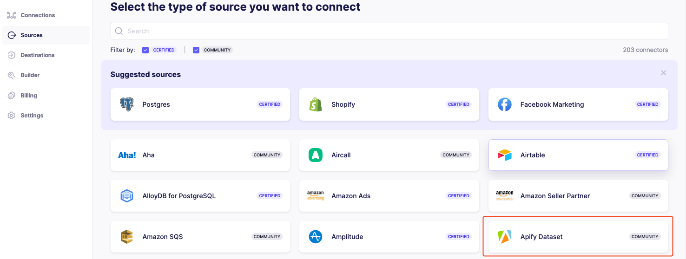
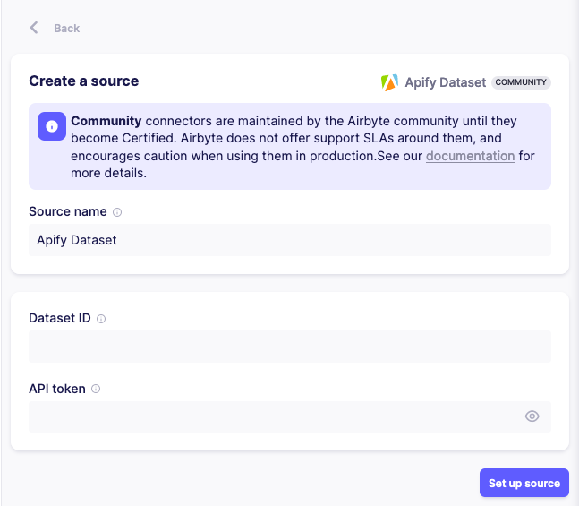
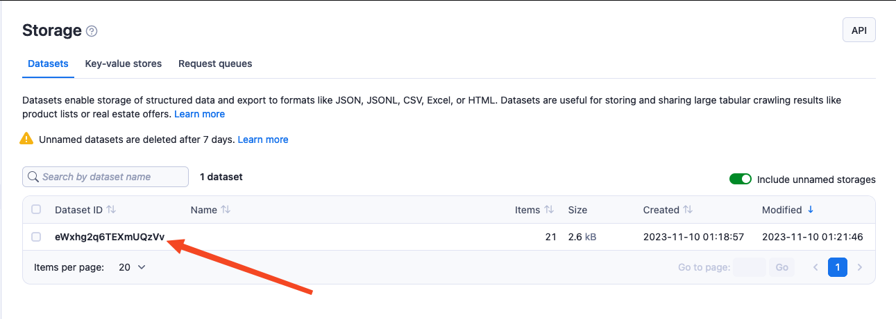

**Learn how to integrate your Apify Datasets with Airbyte.**

---

Airbyte is an open-source data integration platform that allows you to move your data between different sources and destinations using pre-built connectors, which are maintained either by Airbyte itself or by its community.
One of these connectors is the Apify Dataset connector, which makes it simple to move data from Apify Datasets to any supported destination.

To use Airbyte's Apify connector you need to:

* Have an Apify account.
* Have an Airbyte account.

## Set up Apify connector in Airbyte

Once you have all the necessary accounts set up, you need to set up the Apify connector.
To do so, you will need to navigate to **Sources** tab in Airbyte and select **Apify Dataset**

You will need to provide a **dataset ID** and your Apify API Token. You can find both of these in [Apify Console](https://console.apify.com).

To find your **dataset ID**, you need to navigate to **Storage** tab in Apify Console. Copy it and paste it in Airbyte.

To find your Apify API Token, you need to navigate to **Settings** tab and select **Integrations**. Copy it and paste it in the relevant field in Airbyte.

And that's it! You now have Apify Datasets set up as a Source, and you can use Airbyte to transfer your datasets to one of the available destinations.

To learn further steps on how to setup a Connection, visit [Airbyte's documentation](https://docs.airbyte.com/using-airbyte/getting-started/set-up-a-connection)
