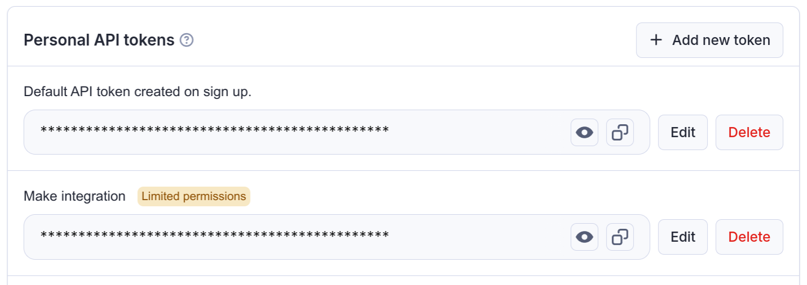
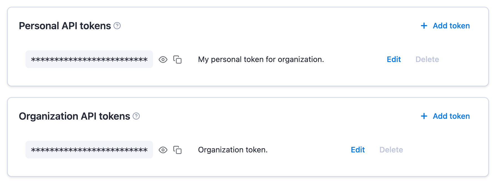

# API integrations

**Learn how to integrate with Apify via API.**

---

The API is well described in the [**API Reference**](/api/v2). If you want to use theApify API from JavaScript/NodeJS or Python, we recommend you use one of our API clients:

- [**apify-client**](/api/client/js/) NPM package supporting both browser and server
- [**apify-client**](/api/client/python/) PyPI package.

You are not limited to those packages - any HTTP client can be used (axios, curl, wget, ...) - but the official API clients implement the best practices such as exponential backoff or rate limit handling.

## API token

To access the Apify API in your integrations, you need to authenticate using your secret API token. You can find it on the [Integrations](https://console.apify.com/account?tab=integrations) page in Apify Console. Give your token a reasonable description, and never use one token for several services, much like you shouldn't use the same password for different accounts.

## Authentication

There are 2 ways how to authenticate the Apify API. You can either pass the token via the `Authorization` HTTP header or the URL `token` query parameter. We always recommend you use the authentication via the HTTP header as this method is more secure.

> **IMPORTANT**: **Do not share the API token with untrusted parties, or use it directly from client-side code,
unless you fully understand the consequences!**

Note that some API endpoints, such as [Get list of keys](/api/v2#/reference/key-value-stores/key-collection/get-list-of-keys),
do not require an authentication token because they contain a hard-to-guess identifier that effectively serves as an authentication key.

## Organization accounts

 > This information is only relevant to members or owners of organization accounts.

When working under an organization account, you will see two types of API tokens on the Integrations page.

The Personal API tokens are different from your own Personal API tokens mentioned above. If you use this token in an integration, it will have the same permissions that you have within the organization, and all the operations you use it for will be ascribed to you.

On the other hand the Organization API tokens (only visible if you are the owner or have Manage access tokens permission) have full permissions and are not tied to a specific member of the organization.
