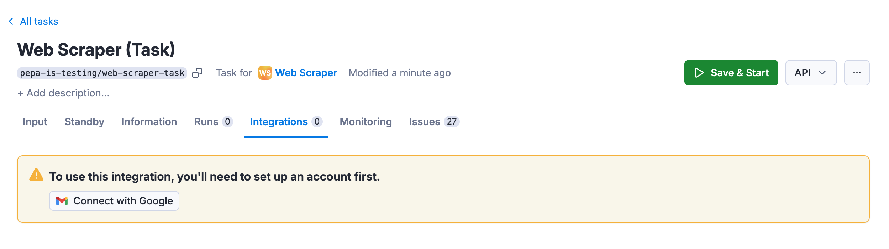
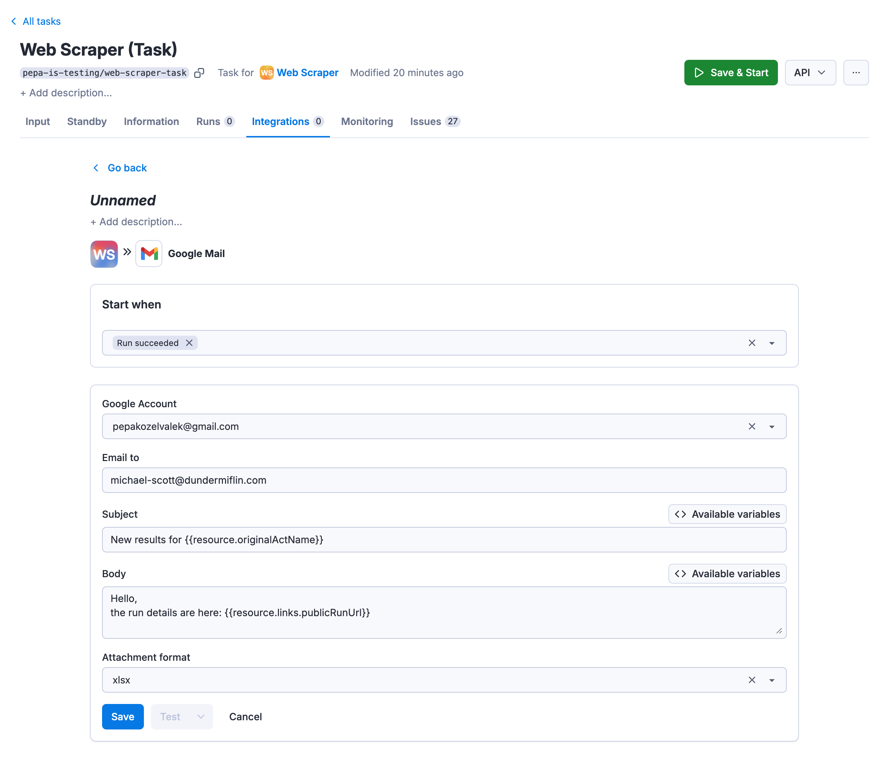

import ThirdPartyDisclaimer from '@site/sources/_partials/_third-party-integration.mdx';

Send automated email notifications with Actor run results to any Gmail address. Set up the integration on an Actor or saved task to receive emails after each successful run.

<ThirdPartyDisclaimer />

## Get started

To use the Apify integration for Gmail, you will need:

- An [Apify account](https://console.apify.com/).
- A Google account

## Set up Gmail integration

1. Head over to the **Integrations** tab of your Actor or saved task and click on the **Send results email via Gmail** integration.

    

1. Click on **Connect with Google** button and select the account with which you want to use the integration.

    

1. Set up the integration details. **Subject** and **Body** fields can make use of available variables. Dataset can be attached in several formats.
 By default, the integration is triggered by successful runs only.

    

1. Click on **Save** & enable the integration.

Once this is done, run your Actor to test whether the integration is working.

You can manage your connected accounts at **[Settings > API & Integrations](https://console.apify.com/settings/integrations)**.

