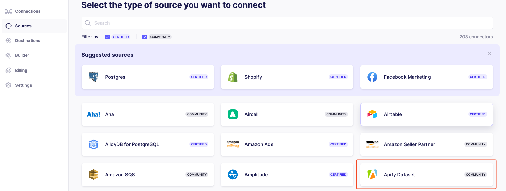
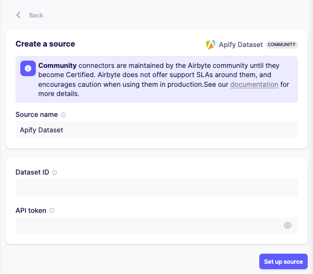
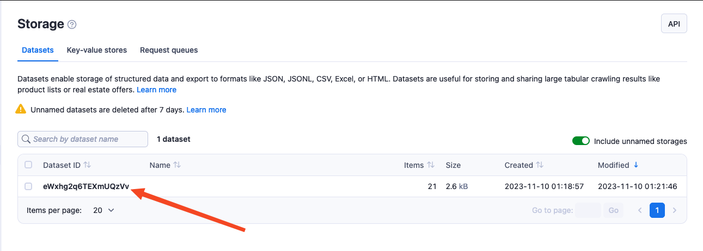
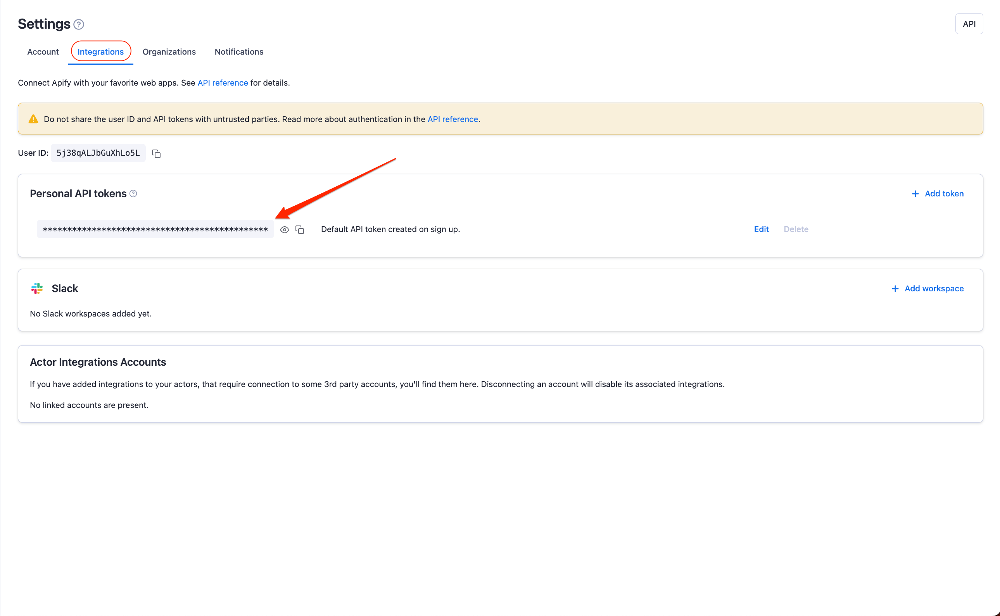

import ThirdPartyDisclaimer from '@site/sources/_partials/_third-party-integration.mdx';

[Airbyte](https://airbyte.com) is an open-source data integration platform that moves data between sources and destinations using pre-built connectors, maintained by Airbyte or its community. The Apify Dataset connector lets you move data from your Apify datasets to any Airbyte-supported destination.

This guide shows you how to set up Apify datasets as a source in Airbyte and, optionally, trigger a sync automatically after every Actor run.

<ThirdPartyDisclaimer />

## Prerequisites

* An [Apify account](https://console.apify.com).
* An [Airbyte account](https://airbyte.com).

## Set up the Apify Dataset source in Airbyte

In Airbyte, open the **Sources** tab and select **Apify Dataset**.



Enter your **dataset ID** and **Apify API token**. You can find both in [Apify Console](https://console.apify.com).



To find your **dataset ID**, open the **Storage** tab in Apify Console and copy the ID of the dataset you want to use.



To find your **Apify API token**, open **Settings > API & Integrations** in Apify Console and copy the token.



Your Apify dataset is now available as a source. Next, connect it to a destination so Airbyte knows where to move the data.

## Connect the source to a destination

Setting up the source only tells Airbyte where your data comes from. To actually move it, create a _connection_: an Airbyte pipeline that links your Apify Dataset source to a destination and controls how and when the data syncs. To set one up, follow [Set up a connection](https://docs.airbyte.com/using-airbyte/getting-started/set-up-a-connection) in the Airbyte documentation.

## Trigger a sync automatically after an Actor run

Instead of syncing on a schedule, you can start an Airbyte sync as soon as an Actor run finishes. Use an Apify [webhook](/integrations/webhooks) to call the Airbyte API and refresh the connection whenever new data is scraped.

To set this up, you need an Airbyte connection that uses your Apify Dataset as a source, plus Airbyte API access: an access token and the **connection ID** (copy it from the connection's URL in Airbyte). The exact endpoint and authentication depend on whether you use Airbyte Cloud or a self-managed instance, so check the [Airbyte API reference](https://reference.airbyte.com/reference/createjob) for the current details.

1. In [Apify Console](https://console.apify.com), open the Actor and go to the **Integrations** tab.
1. Under **Connect with Apify**, click **HTTP webhook**.
1. Configure the webhook:
    * **Event types**: `Run succeeded` (`ACTOR.RUN.SUCCEEDED`)
    * **URL**: the Airbyte API endpoint that starts a sync, for example `https://api.airbyte.com/v1/jobs`
1. Set the **Headers template** to authenticate with your Airbyte token:

    ```json
    {
        "Authorization": "Bearer YOUR_AIRBYTE_TOKEN",
        "Content-Type": "application/json"
    }
    ```

1. Set the **Payload template** to start a sync for your connection:

    ```json
    {
        "connectionId": "YOUR_CONNECTION_ID",
        "jobType": "sync"
    }
    ```

1. Click **Save**, then **Test** to confirm that Airbyte starts a sync.

Every successful Actor run now triggers Airbyte to move the freshly scraped data to your destination, with no manual step in between.
