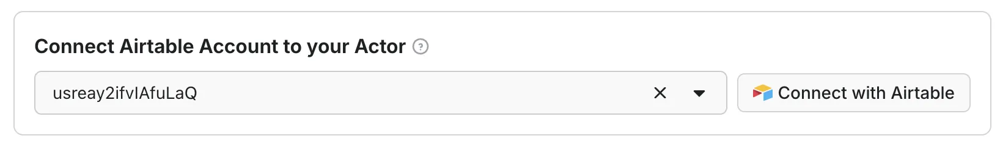
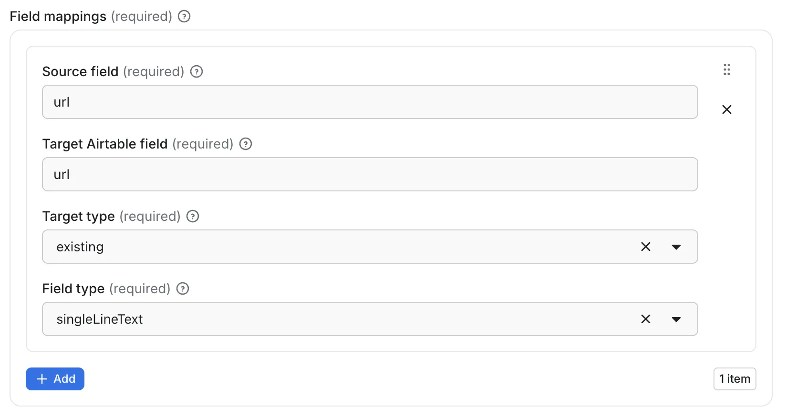
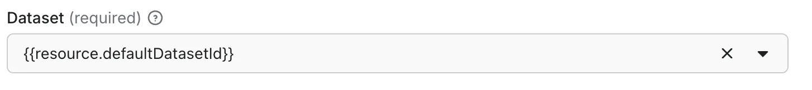

import ThirdPartyDisclaimer from '@site/sources/_partials/_third-party-integration.mdx';

The [Airtable Data Import Actor](https://console.apify.com/actors/f4DM1wGmMQdnTLbrE/info/readme?build=latest) transfers items from any Apify dataset into an [Airtable](https://www.airtable.com/) base. Use it standalone or chain it after other Actors in automated workflows via [integrations](/integrations).

<ThirdPartyDisclaimer />

## Prerequisites

- An [Apify account](https://console.apify.com/)
- An [Airtable account](https://www.airtable.com/)
- The [Airtable Data Import Actor](https://console.apify.com/actors/f4DM1wGmMQdnTLbrE/info/readme?build=latest)

## Connect to Airtable

The Actor uses OAuth 2.0 to connect to your Airtable account:

1. Navigate to the Actor's **Integrations** tab in Apify Console.
1. Click **Connect** next to Airtable and follow the OAuth consent flow.
1. Once connected, the OAuth account field is populated automatically.



The Actor retrieves a fresh access token at the start of each run. Your Airtable credentials are never stored or logged.

## Configure the Actor

Configure the Actor from its **Input** tab in Apify Console. Each field is described below.

### Operation

Controls how the Actor handles the target table and its existing records.

- `Append`: Adds new records to the table. Existing records are never modified or deleted. Use for continuous pipelines.
- `Override`: Deletes all existing records before importing. Use for full data refreshes.
- `Create`: Creates a new table with fields from your mappings, then imports data. If the table already exists, the `clearOnCreate` setting determines what happens.

### Clear on create

A safety switch for `Create` mode only. Defaults to `false`.

- `Enabled` (`true`): Clears all existing records and imports. Use for automated fresh starts.
- `Disabled` (`false`): Throws an error if the table exists, preventing accidental data loss.

### Base

Accepts a base ID (`appXXXXXXXXXXXXXX`, found in the Airtable URL) or a base name. Base IDs are recommended - they are immutable and globally unique.


### Table

Accepts a table name or table ID (`tblXXXXXXXXXXXXXX`). When using `Create` mode and the table does not exist, the Actor creates it automatically.

### Dataset ID

Specifies the dataset to import from:

- A static dataset ID (for example, `cqxkhXcn2SCjTpeCz`).
- `{{resource.defaultDatasetId}}` when used as an integration - automatically passes the upstream Actor's dataset.

### Unique ID

Enables duplicate detection. When set, the Actor reads existing values from the mapped Airtable column and skips records with matching values. The value must match one of the `source` fields in your `dataMappings`.

### Field mappings

An array defining how dataset fields map to Airtable columns.



Each mapping has these properties:

| Property | Description |
| --- | --- |
| `source` | Dataset field path, supports dot notation for nested objects (`crawl.depth`, `metadata.uid`) |
| `target` | Airtable column name |
| `targetType` | `existing` if the field already exists, `new` to create it automatically |
| `fieldType` | Airtable field type: `singleLineText`, `multilineText`, `number`, `checkbox` |

#### Dot notation

Use dot notation to access nested object properties. `items[0].name` style array indexing is not supported.

#### Field types

| Field type | Use for |
| --- | --- |
| `singleLineText` | Names, URLs, IDs (max 10,000 characters) |
| `multilineText` | Descriptions, paragraphs, JSON blobs |
| `number` | Prices, counts, ratings (integer precision) |
| `checkbox` | Boolean values, yes/no flags |

:::caution Number precision

The Actor creates `number` fields with integer precision. For decimal values, create the field manually in Airtable and use `targetType: "existing"`.

:::

## Import results from another Actor automatically

Chain the Actor after a scraping or extraction Actor so its dataset flows into Airtable on every run. Use this for scheduled scrapers, recurring price checks, or any pipeline where fresh data should reach your base without a manual trigger.

1. Open the upstream Actor in Apify Console and go to the **Integrations** tab.
1. Click **Add integration** and select **Airtable Data Import Actor**.
1. Set `datasetId` to `{{resource.defaultDatasetId}}`.
1. Configure the base, table, operation, and field mappings.
1. Connect your Airtable account via OAuth.



## Example of the output

After each run, the Actor writes a JSON summary to its dataset. Each field reports a key result from the import operation:

```json
{
    "success": true,
    "operation": "Append",
    "baseName": "My Product Catalog",
    "tableName": "Products",
    "totalItems": 1500,
    "importedCount": 1450,
    "skippedDuplicates": 50,
    "duration": 330
}
```

## Example configurations

<details>
<summary>Append with duplicate detection</summary>

```json
{
    "operation": "Append",
    "base": "appABC123456789",
    "table": "Products",
    "datasetId": "{{resource.defaultDatasetId}}",
    "uniqueId": "url",
    "dataMappings": [
        { "source": "title", "target": "Product Name", "targetType": "existing", "fieldType": "singleLineText" },
        { "source": "price", "target": "Price", "targetType": "existing", "fieldType": "number" },
        { "source": "url", "target": "URL", "targetType": "existing", "fieldType": "singleLineText" },
        { "source": "description", "target": "Description", "targetType": "existing", "fieldType": "multilineText" },
        { "source": "inStock", "target": "In Stock", "targetType": "existing", "fieldType": "checkbox" }
    ]
}
```

</details>

<details>
<summary>Create new table</summary>

```json
{
    "operation": "Create",
    "clearOnCreate": false,
    "base": "appXYZ987654321",
    "table": "Customer Feedback",
    "datasetId": "cqxkhXcn2SCjTpeCz",
    "dataMappings": [
        { "source": "reviewer.name", "target": "Reviewer Name", "targetType": "new", "fieldType": "singleLineText" },
        { "source": "rating", "target": "Rating", "targetType": "new", "fieldType": "number" },
        { "source": "comment", "target": "Review Text", "targetType": "new", "fieldType": "multilineText" },
        { "source": "verified", "target": "Verified Purchase", "targetType": "new", "fieldType": "checkbox" }
    ]
}
```

</details>

<details>
<summary>Override for full refresh</summary>

```json
{
    "operation": "Override",
    "base": "Daily Competitor Prices",
    "table": "Pricing",
    "datasetId": "{{resource.defaultDatasetId}}",
    "dataMappings": [
        { "source": "sku", "target": "SKU", "targetType": "existing", "fieldType": "singleLineText" },
        { "source": "competitor", "target": "Competitor", "targetType": "existing", "fieldType": "singleLineText" },
        { "source": "price", "target": "Price", "targetType": "existing", "fieldType": "number" }
    ]
}
```

</details>

## Limits

- Text values are truncated at 10,000 characters per field.
- `number` fields are created with integer precision; create decimal fields manually.
- Imports process at approximately 50 records per second (10 per batch, 200ms delay).
- Progress is automatically persisted - if a run is interrupted, it resumes from where it left off.

## Next steps

- [Learn about Apify integrations](/integrations) to chain Actors in automated workflows.
- [Explore Airtable's API documentation](https://airtable.com/developers/web/api/field-model) for field type details.
- If you have questions about the Airtable integration, reach out via the support live chat in Console or the [developer community on Discord](https://discord.com/invite/jyEM2PRvMU).
