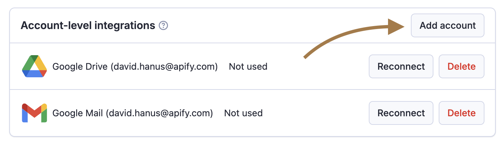
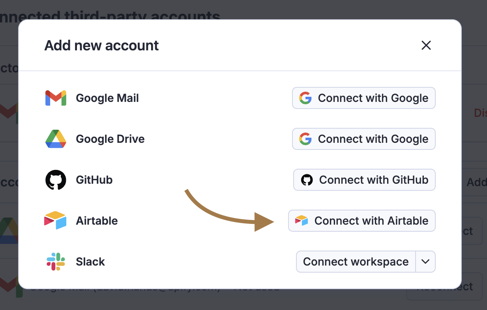
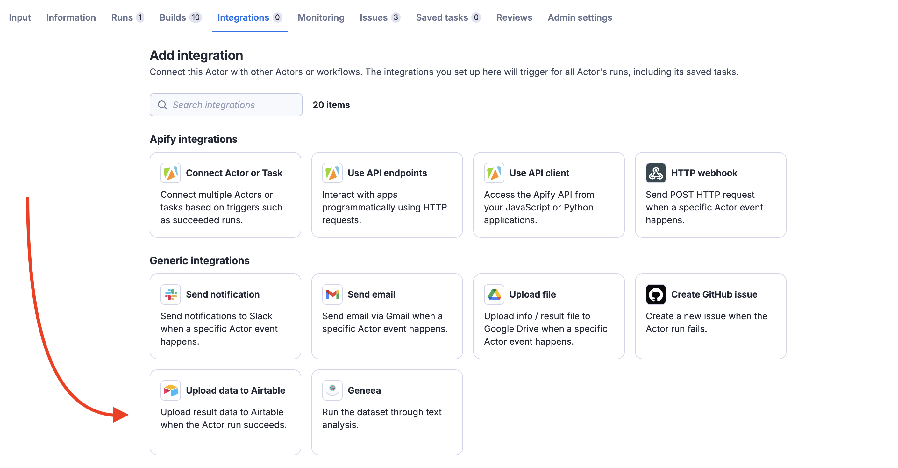
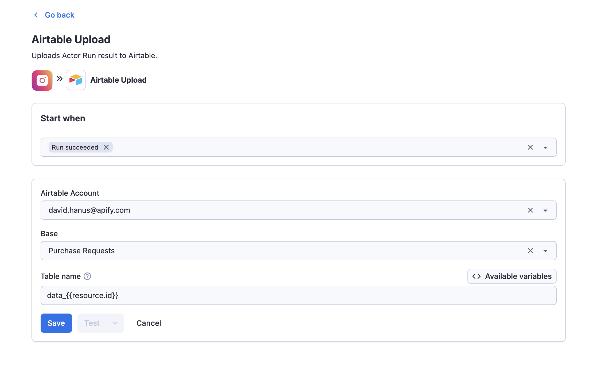
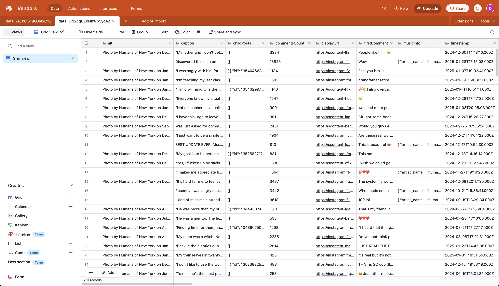

**Learn how to integrate your Apify Actors with Airtable. This article shows you how to automatically upload results to your Airtable when an Actor run succeeds.**

---

## Get started

To use the Apify integration for Airtable, you will need:

- An [Apify account](https://console.apify.com/).
- An Airtable account

## Connect your Airtable account

In order to upload run results of your Actors to Airtable, you’ll need to connect your Airtable account and grant Apify the necessary permissions. Airtable uses OAuth 2.0, a web standard that allows Apify to integrate with your Airtable account securely and manage data transfers on your behalf.

### Follow the steps below to connect your Airtable account to Apify:

1. Visit the [API & Integrations tab](https://console.apify.com/settings/integrations) in the Settings section of Apify Console.

2. Scroll down to the **Account-level integrations** and click on the **Add account** button.

    

3. From the list of available services, select **Airtable**.

    

4. The OAuth 2.0 authorization flow will initiate, allowing you to securely connect your Airtable account.

5. After authorization, you’ll be prompted to select the workspaces and bases you want to grant Apify access to.

## Set up Airtable integration

1. [Choose an Actor or Task](https://console.apify.com/actors) to integrate with Airtable and head to its **Integrations** tab.

2. Click **Upload data to Airtable** to initiate the integration setup.

    

3. Select a connected Airtable account and choose the base where the integration will upload run results.

4. Enter a table name. A new table will be created for each execution of this integration. To ensure uniqueness, use dynamic variables. If a table with the same name already exists, a random token will be appended.

    

5. Save the integration. Once your Actor runs, you’ll see its results uploaded to Airtable.

    

