**Learn how to integrate Apify with Airtable. This article shows you how to use the Apify extension on Airtable.**

---

[Airtable](https://www.airtable.com/)  is a cloud-based platform for organizing, managing, and collaborating on data. With Apify integration for Airtable, you can automatically upload Actor run results to Airtable after a successful run.

This integration uses OAuth 2.0, a secure authorization protocol, to connect your Airtable account to Apify and manage data transfers.

## Connect Apify with Airtable

To use the Apify integration for Airtable, ensure you have:

- An [Apify account](https://console.apify.com/)
- An [Airtable account](https://www.airtable.com/)

## Types of integration

You could integrate Apify with Airtable using one of two available options. This guide explain how to use the extension which is the recommended integration.

- _Apify extension_ on Airtable website.
- _Console integration_ on the Actor page.

This guide will explain how to use the _Apify extension_, for Apify Console integration go to the _Console integration_ page in the docs.

## Setup

### Install Apify extension

Go to [Airtable](https://airtable.com) and open the base you would like to work with. Press the **Tools** dropdown in the top right corner and click **Extensions**.

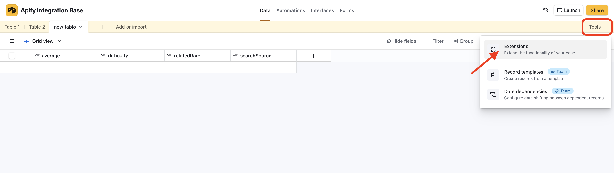

<!-- TODO: improve pictures when Apify integration is published -->
Search for Apify extenison and install it

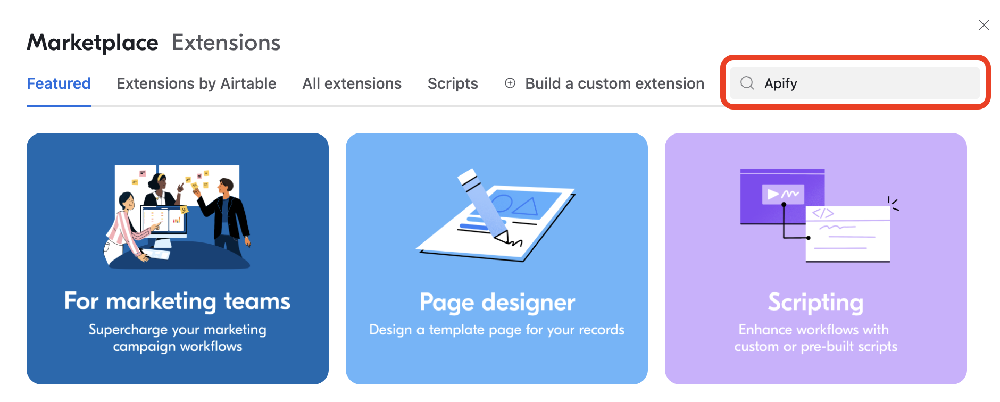

Open the Apify extension and login using OAuth 2.0 with your Apify account. If you dont have an account, visit [Apify registration](https://console.apify.com/sign-up) page.

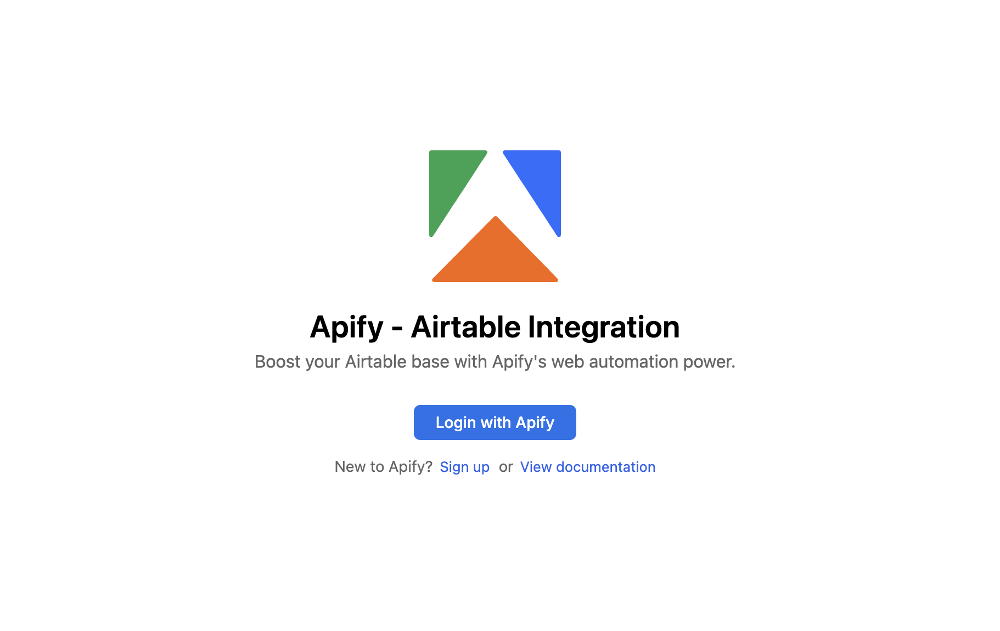

## Extension Overview

Apify extension helps you map and import data into your Airtable base.

### Features

- Run Actors
- Run tasks
- Get dataset items
- Map and import the data into your base

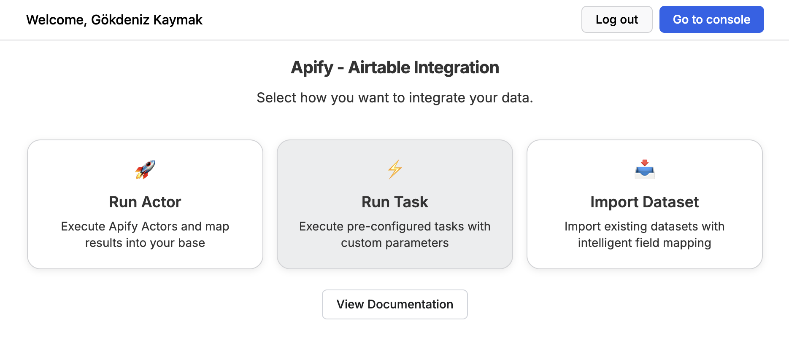

### Run Actor

1. Select any Actor from `Apify store` or `recently used Actors`
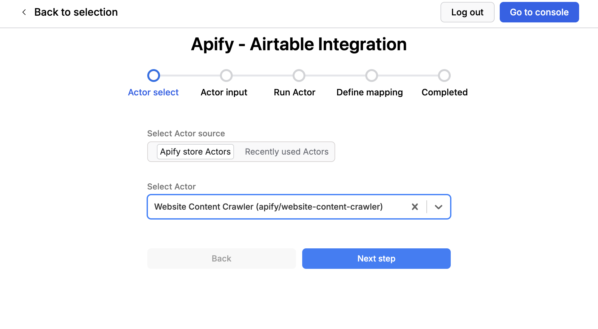

1. Fill in the Actor input form.
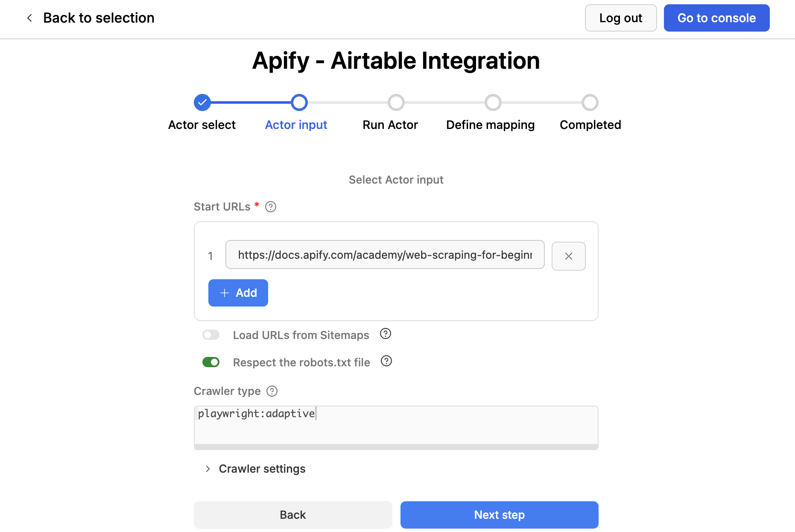

1. Run the Actor and wait for results
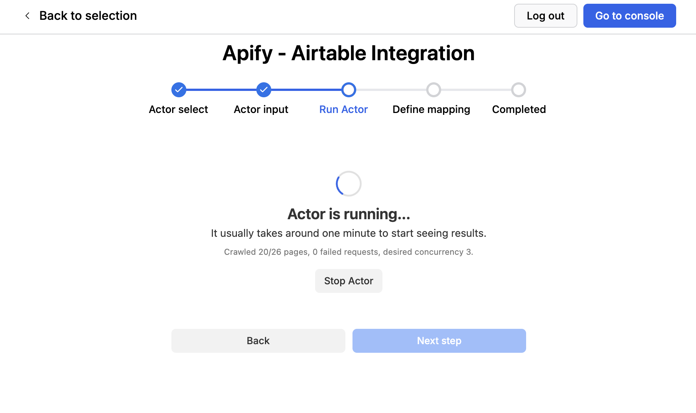

### Data Mapping

This section will explain how to map your run results or dataset items into your Airtable base

#### Mapping row

Apify extension has UI elements that allow you to map dataset fields to Airtable fields.


**Source:** dataset field from Apify.

**Target:** Target Airtable field label. For mode `new` it creates new fields in your table

**Field Type:** Displays the type of the target Airtable field. For `new` mode you need to also specify this field.

#### Select Fields to Map

The preview window next to the mapping rows will help you view and pick fields from the dataset.
"." character in the labels point to the children elements of an object

**Example Source**: crawl.depth <br/>
**Apify Field**:

```bash
{
    crawl: {
    depth: 3,
    }
}
```

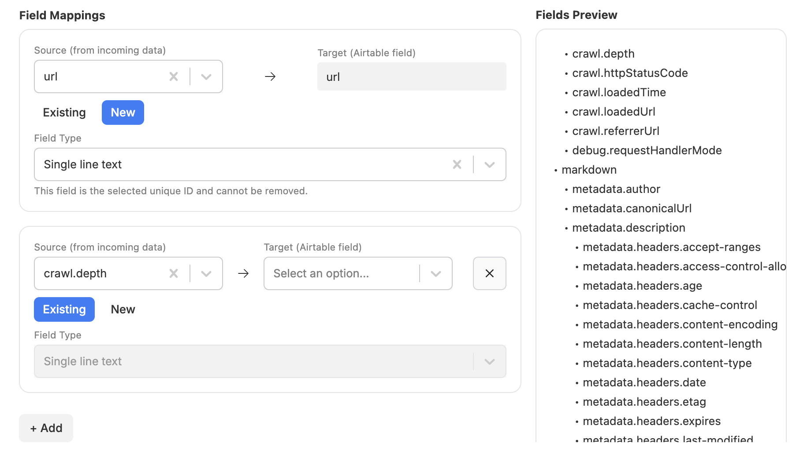

#### Automatic field matching

Apify extension looks at the field labels in your table and matches them with dataset fields giving you a default list of mappings.

##### How does it work

Source: `crawl.depth`
it checks for fields in your table with label either `depth` or `crawl.depth`. If there is a match it adds a mapping row automatically.


#### Duplicate filtering

Select a **Unique ID** on the data mapping step. The unique ID will be added to the list of mapping rows.
Make sure it points to the correct field in your table. While importing the data will be filtered by existing values in the table.
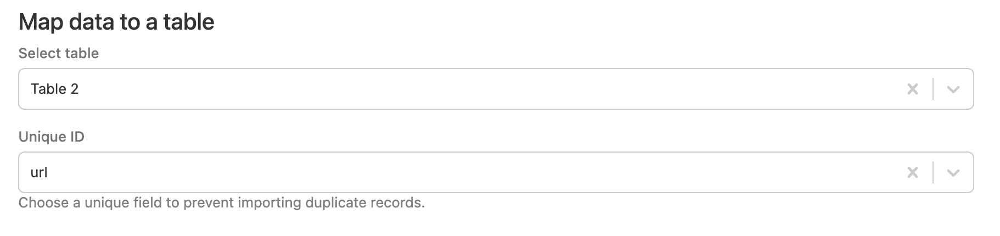

#### Preview Mapped Data

Preview the results and start the import

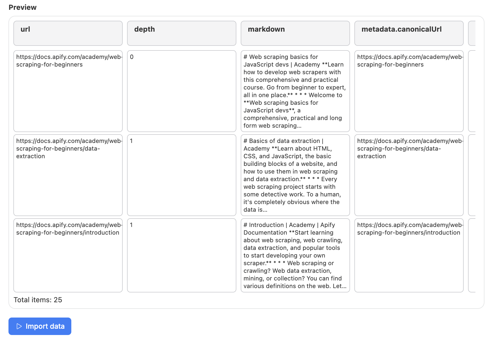

### Run Task

You can select and run any saved Apify task directly from the extension to reuse preconfigured inputs.

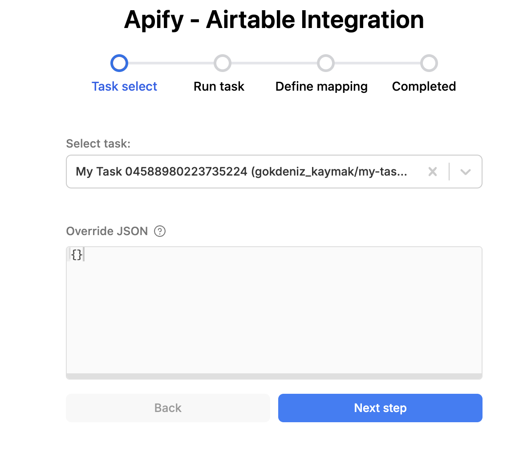


### Get Dataset

Retrieve items from any Apify dataset and import them into your Airtable base with a single click.


