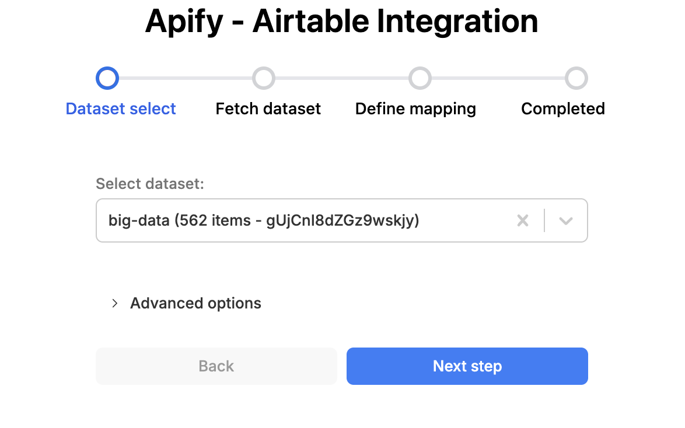
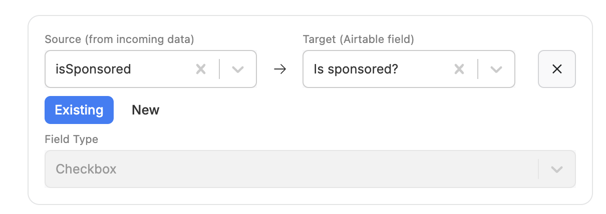

**Learn how to integrate Apify with Airtable. This article shows you how to use the Apify extension on Airtable.**

---

[Airtable](https://www.airtable.com/)  is a cloud-based platform for organizing, managing, and collaborating on data. With the Apify integration for Airtable, you can automatically upload Actor run results to Airtable after a successful run.

This integration uses OAuth 2.0, a secure authorization protocol, to connect your Airtable account to Apify and manage data transfers.

## Connect Apify with Airtable

To use the Apify integration for Airtable, ensure you have:

- An [Apify account](https://console.apify.com/)
- An [Airtable account](https://www.airtable.com/)

## Types of integration

You can integrate Apify with Airtable using one of two options:

- _Apify extension_ on Airtable website.
- _Console integration_ on the Actor page.

This guide explains how to use the _Apify extension_. For console integration instructions, see the [Console integration](/platform/integrations/airtable/console) documentation

## Setup

### Install Apify extension

Go to [Airtable](https://airtable.com) and open the base you would like to work with. Press the **Tools** dropdown in the top right corner and click **Extensions**.


<!-- TODO: improve pictures when Apify integration is published -->
Search for Apify extenison and install it


Open the Apify extension and login using OAuth 2.0 with your Apify account. If you dont have an account, visit [Apify registration](https://console.apify.com/sign-up) page.


## Extension overview

The Apify extension helps you map and import data into your Airtable base.

### Features

The extension provides the following capabilities:

- Run Actors
- Run tasks
- Get dataset items
- Map and import the data into your base


### Run Actor

1. Select any Actor from **Apify store** or **recently used Actors**


1. Fill in the Actor input form.


1. Run the Actor and wait for results


### Run task

You can select and run any saved Apify task directly from the extension to reuse preconfigured inputs.


### Get dataset items

Retrieve items from any Apify dataset and import them into your Airtable base with a single click.



### Map data to Airtable

This section explains how to map your Actor run results or dataset items into your Airtable base.

#### Understanding mapping rows

The Apify extension provides UI elements that allow you to map dataset fields to Airtable fields.



**Source:** The dataset field from Apify.
**Target:** The target Airtable field label. For **new** mode, this creates new fields in your table.
**Field Type:** The type of the target Airtable field. For **new** mode, you must specify this field type.

#### Select fields to map

The preview window next to the mapping rows will help you view and pick fields from the dataset.
A period (`.`) in field labels indicates nested elements within an object.

```bash title="Example of `crawl.depth`"
{
    crawl: {
        depth: 'the field you selected',
    }
}


#### Automatic field matching

The Apify extension examines the field labels in your table and matches them with dataset fields, providing a default list of mappings.

_How it works_: For a source field like `crawl.depth`, the extension checks for fields in your table with labels matching either `depth` or `crawl.depth`. When it finds a match, it automatically adds a mapping row.

#### Import operations

1. **CREATE**: Creates a new table for each run of this integration.
1. **APPEND**: Adds new records to the specified table. If the table doesn't exist, a new one is created.
1. **OVERWRITE**: Replaces all records in the specified table with new data. If the table doesn't exist, a new one is created.

#### Filter duplicate records

To prevent duplicate records, select a **Unique ID** on the data mapping step. The unique ID is added to the list of mapping rows. Ensure it points to the correct field in your table. During import, the extension filters data by existing values in the table.


#### Preview Mapped Data

Preview the results and start the import


