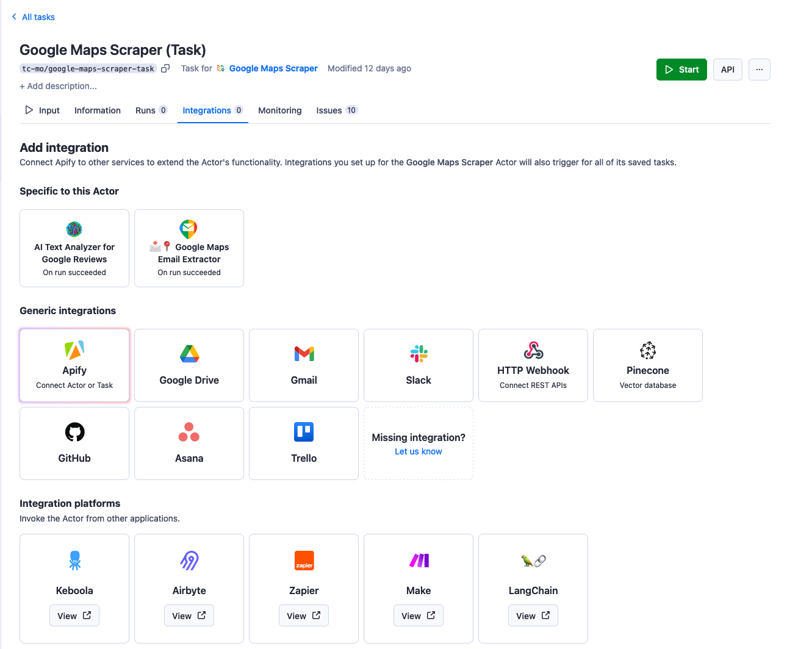
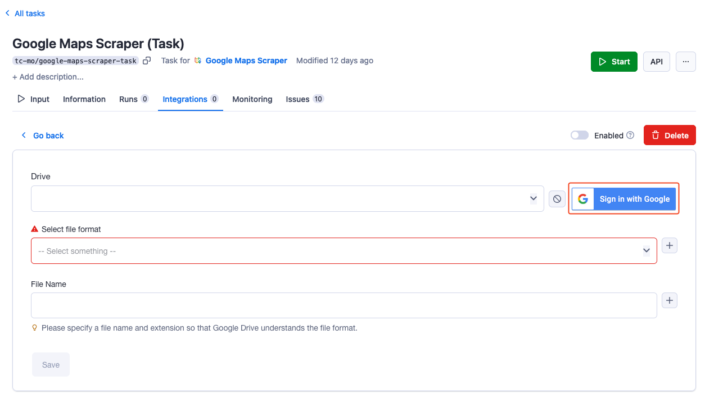
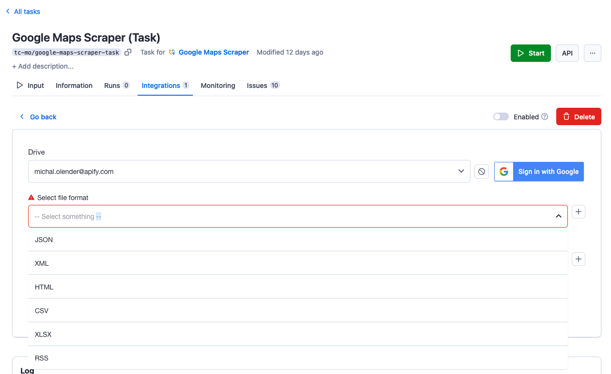
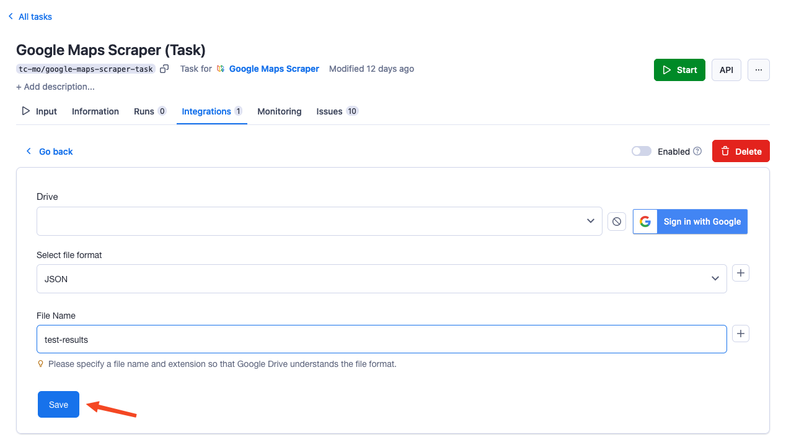

**Learn how to integrate your Apify Actors with Google Drive. This article shows you how to automatically save results to your drive when an Actor run succeeds.**

---

Completementary to the following guide we've created a detailed video, that will guide you through the process of setting up your Google Drive integration.

<iframe width="560" height="315" src="https://www.youtube-nocookie.com/embed/IFTeKdj6ZGM" title="YouTube video player" frameborder="0" allow="accelerometer; autoplay; clipboard-write; encrypted-media; gyroscope; picture-in-picture; web-share" allowfullscreen></iframe>

## Get started

To use the Apify integration for Google Drive, you will need:

- An [Apify account](https://console.apify.com/).
- A Google account
- A saved Actor Task

## Set up Google Drive integration

1. Head over to **Integrations** tab in your saved task and click on the Google Drive integration.

    

1. Click on **Sign in with Google** button and select the account with which you want to use the integration.

    

1. Select the desired format of the dataset file.

    

1. Click on **Save** & enable the integration.

    

Once this is done, run your Actor to test whether the integration is working.

