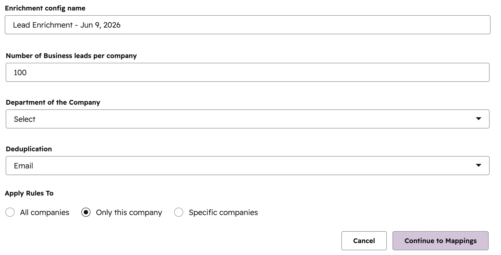
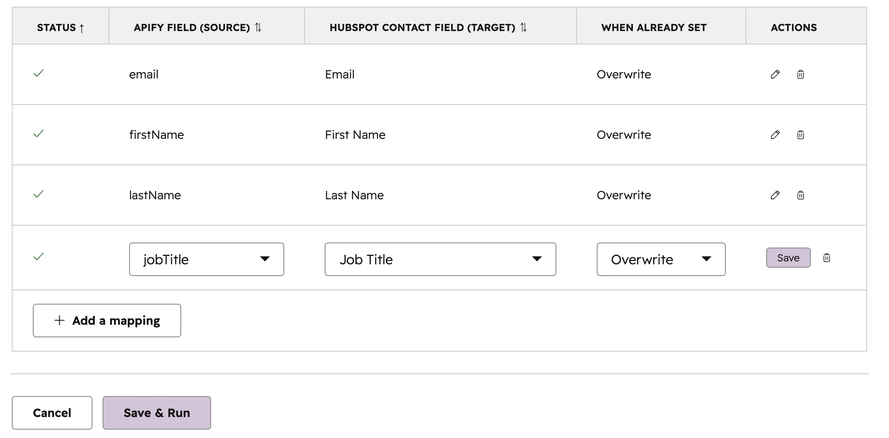
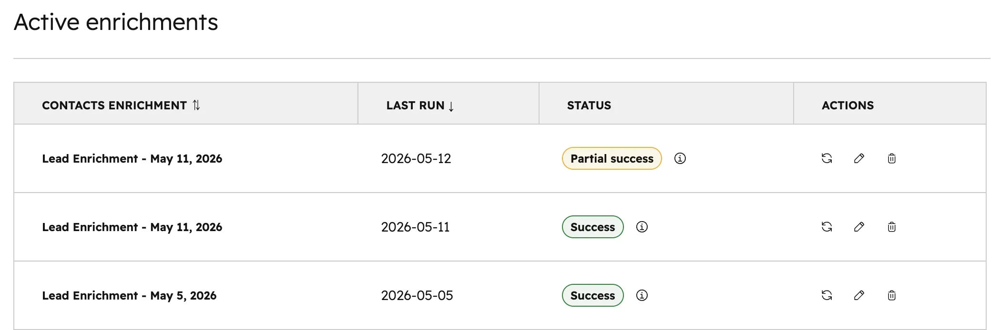
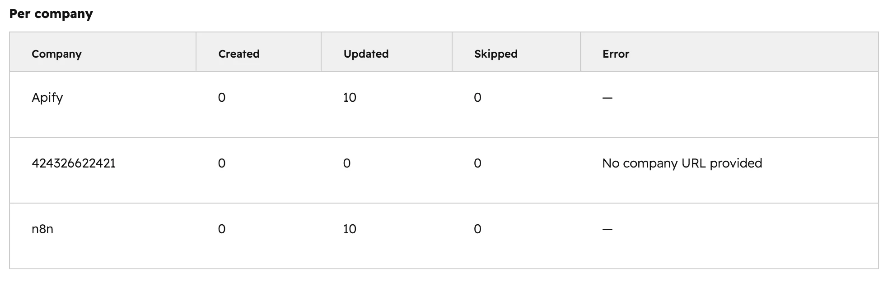
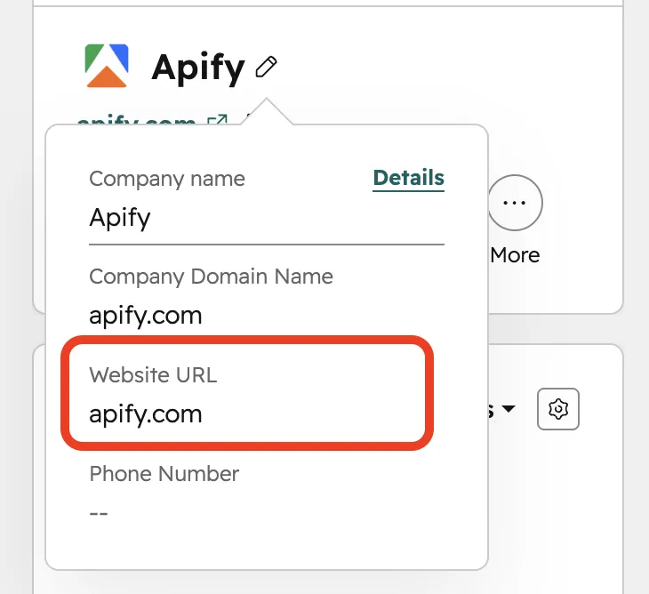

import ThirdPartyDisclaimer from '@site/sources/_partials/_third-party-integration.mdx';

With the Apify integration for [HubSpot](https://www.hubspot.com/), you can enrich your CRM with business contacts scraped from company websites. The integration runs as a CRM card inside your HubSpot portal, uses Apify's Contact Details Scraper to extract contacts, and writes results back as HubSpot contacts automatically.

<ThirdPartyDisclaimer />

## Prerequisites

To use the Apify integration for HubSpot, you need:

- A [HubSpot account](https://www.hubspot.com/) with CRM access (Contacts, Companies).
- An [Apify account](https://console.apify.com/).
- Admin permissions in HubSpot to install apps.
- Company records with a website URL in HubSpot (or you can provide a temporary URL).

## Install the integration

Install the Apify app from the HubSpot Marketplace:

1. Find the **Apify** app in the HubSpot Marketplace (or use the install link provided by your Apify contact).
2. Click **Install**. This starts a two-step OAuth authorization:
   - **Step 1:** Authorize HubSpot to share your CRM data with Apify (contacts, companies, properties).
   - **Step 2:** You are redirected to Apify Console to authorize your Apify account.
3. On success, you see an installation confirmation page.

The app is now connected to both your HubSpot portal and your Apify account.

## Add the CRM card

After installation, add the Apify card to your CRM record pages:

1. In HubSpot, go to **CRM** > **Contacts** (or **Companies**).
2. Open any contact or company record.
3. Click the **Customize** button on the right side of the record page.
4. Select the **Default view**.
5. Click **Add card**, then go to the **Card Library**.
6. Search for **Apify** and click **Add card**.

The Apify card now appears on the right sidebar of your CRM record pages.

:::note Card operates on companies

The card is designed for company record pages. When viewing a contact record, the card uses the parent company's data for enrichment operations.

:::

## Create a lead enrichment

Click the **+ Add Lead Enrichment** button in the Apify card to open the configuration wizard.

### Step 1: Configure enrichment details

| Field | Description | Default |
| ----- | ----------- | ------- |
| **Enrichment config name** | A label for this configuration. | Auto: "Lead Enrichment - [date]" |
| **Number of Business leads per company** | Maximum contacts to scrape per company website (minimum 1). | 100 |
| **Department of the Company** | Filter contacts by department (IT, Marketing, Finance, HR, and more). | None (all departments) |
| **Deduplication** | How to identify duplicate contacts: **Email** or **Phone**. | Email |
| **Apply Rules To** | Which companies to target. | Only this company |

For **Apply Rules To**, you have three options:

- **Only this company** — enrich only the current company.
- **Specific companies** — pick multiple companies from a list.
- **All companies** — target every company in your portal with a website URL.

If the current company has no website URL in its HubSpot record, a warning dialog appears with two options:

- **Update the HubSpot record** — edit the company in HubSpot, then click **Check again**.
- **Use a temporary URL** — enter a URL manually just for this enrichment (does not change the HubSpot record).

### Step 2: Map fields

Field mappings define which data from the scraper goes into which HubSpot contact property. Default mappings are pre-filled for common fields:

| Apify source field | HubSpot contact property |
| ------------------ | ----------------------- |
| `email` | `email` |
| `firstName` | `firstname` |
| `lastName` | `lastname` |
| `jobTitle` | `jobtitle` |
| `linkedinProfile` | `hs_linkedin_url` |
| `mobileNumber` | `phone` |
| `city` | `city` |
| `state` | `state` |
| `country` | `country` |
| `companyName` | `company` |

Each mapping row has three settings:

- **APIFY FIELD (SOURCE)** — dropdown of available output fields from the scraper.
- **HUBSPOT CONTACT FIELD (TARGET)** — dropdown of your HubSpot contact properties (both standard and custom).
- **WHEN ALREADY SET** — **Overwrite** (replace existing value) or **Skip if set** (keep existing non-empty values).

- Each HubSpot property can only be used once as a target.
- Click **Add a mapping** to add more rows.
- You can save a config with zero mappings — a confirmation dialog will ask you to confirm.

Click **Save & Run** to save the configuration and immediately start an enrichment run.

## Manage your enrichments

### Active enrichments list

The main card view shows all your enrichment configurations for the current HubSpot portal, with 10 configs per page.

| Column | Description |
| ------ | ----------- |
| **CONTACTS ENRICHMENT** | Config name. Click to open run history. |
| **LAST RUN** | Date of the most recent run (newest first). |
| **STATUS** | Real-time status badge. |
| **ACTIONS** | Refresh (re-run), Edit, Delete. |

The list updates automatically every second while any config is actively running.

### Run history

Click any config name in the active enrichments list to open its run history.

The header shows:

- Config name
- Actor: Contact Details Scraper
- Number of companies targeted and field mappings
- **Run again** and **Edit & run** buttons

Each run in the history table shows:

| Column | Description |
| ------ | ----------- |
| **Started** | When the run began. |
| **Status** | Badge showing current state. |
| **Duration** | How long the run took (or "In progress" for active runs). |
| **Created** | Number of new contacts created. |
| **Updated** | Number of existing contacts updated. |
| **Skipped** | Number of contacts intentionally skipped. |
| **Results** | External link to view dataset in Apify Console. |

Expand a row (click the arrow) to see:

- Error message (if the run failed).
- Per-company breakdown — Created, Updated, Skipped, and Error counts per company (up to 5 companies displayed).
- Companies in run — list of company domains included.
- Field mappings used — the exact mappings that were applied.

The history shows 20 runs per page and auto-refreshes every 10 seconds while the newest run is active.

### Abort a run

While a run is in progress, an **Abort** button appears next to the status badge. Clicking it stops both the scraper and data-import processes and marks the run as errored with "Aborted by user."

## Run statuses

Each run goes through these stages:

| Status | What it means |
| ------ | ------------- |
| **Running** | The Contact Details Scraper is visiting company websites and extracting contacts. |
| **Importing** | The data-import process is writing contacts to your HubSpot CRM. |
| **Success** | All companies were processed without errors. |
| **Partial Success** | Some companies processed successfully, some had errors. |
| **Error** | The run failed (either scraping or import phase). |

Only one run can be active per config. Starting a new run while one is in progress will show an error.

Click the info icon on any completed run to see detailed statistics, including rows total, created/updated/skipped counts, per-company breakdown, and links to the scraper and import runs on Apify Console.

## How data is written

### Deduplication

The system checks whether a scraped contact already exists in your HubSpot:

- **Email mode (default):** Searches contacts by `email` property.
- **Phone mode:** Searches contacts by `phone` property.

If a matching contact is found, it is updated. If no match is found, a new contact is created. Contacts without a deduplication identifier (no email in email mode, no phone in phone mode) are skipped.

### Overwrite behavior

For each field mapping, you choose what happens when the target HubSpot property already has a value:

- **Overwrite** — the existing value is always replaced with the scraped value.
- **Skip if set** — if the HubSpot property already has a non-empty value, it is preserved. The scraped value is only written if the property is currently empty.

If all mapped fields are already populated and all are set to **Skip if set**, the contact is skipped entirely.

### Country normalization

Country values from the scraper are normalized to ISO 3166-1 alpha-2 codes when writing to the `country` property. For example, "United States" becomes "US," "United Kingdom" becomes "GB," and "Germany" becomes "DE." Over 40 country name variants are recognized.

### Association

Each created or updated contact is automatically associated with the correct company record in HubSpot using the standard contact-to-company association. If the association fails but the contact was written successfully, the contact data is preserved and the association error is logged separately.

## Limitations

- **Lead enrichment only.** The integration currently supports only the Contact Details Scraper. A General Enrichment option that would let you use any Apify Actor is planned but not yet available.
- **Contacts, not companies.** The integration writes data to HubSpot Contacts (and associates them to companies). It does not modify company records.
- **Company website required.** Each target company must have a website URL in its HubSpot record (or a temporary URL must be provided).
- **One run at a time per config.** You cannot start a new run while one is already in progress.
- **No automated scheduling.** Enrichment runs must be triggered manually.
- **Per-company UI limit.** The run history view shows up to 5 companies in the per-company breakdown. For full results, use the **View import results** link to Apify Console.
- **HubSpot API rate limits apply.** If your portal has a high volume of contacts being imported, HubSpot may throttle API calls.

## FAQ

### Does the integration modify my existing HubSpot data?

It only modifies contacts. It can create new contacts or update existing ones based on your deduplication and overwrite settings. Company records are never modified. You control exactly which fields are written via field mappings.

### What happens if a scraped contact already exists in HubSpot?

The system searches for existing contacts by email (or phone, depending on your deduplication setting). If a match is found, the contact is updated with the mapped fields (respecting your overwrite/skip preferences). If no match is found, a new contact is created.

### Can I enrich multiple companies at once?

Yes. Use the **Specific companies** option to pick multiple companies, or **All companies** to target every company in your portal with a website URL.

### How do I see what data was scraped?

Each run in the Run History view has a **Results** link that opens the full dataset in Apify Console, where you can browse every scraped data point.

### Can I cancel a run that is in progress?

Yes. Click the **Abort** button that appears next to the status badge on any running or importing run.

### Does this cost Apify credits?

Yes. Running the Contact Details Scraper consumes your Apify account credits based on the number of websites scraped and contacts extracted. Check your Apify Console for usage and billing details.

### How do I uninstall?

Remove the Apify app from your HubSpot account through HubSpot's app management settings. Your enriched contact data remains in HubSpot — only the app connection is removed.

## Troubleshooting

### Missing website URL

**Symptom:** When creating a lead enrichment, you see a warning that the company has no website URL.

**Solution:**

- Edit the company record in HubSpot and add the website URL, then click **Check again**.
- Or enter a temporary URL in the card for this enrichment only.

A company without a website cannot be enriched — the scraper needs a URL to visit.

### Run errors

**Symptom:** A run shows Error status.

**Possible causes:**

| Error stage | Cause |
| ----------- | ----- |
| **Scraping** | Company website is unreachable, blocks crawlers, or has no contacts to extract. |
| **Importing** | HubSpot API rate limits, property validation errors, or authentication expired. |

Click the info icon on the errored run to see the specific error message. You can also click **View scraper run** or **View import Actor run** to see details in Apify Console.

### No matching dataset items

**Symptom:** A run finishes successfully but a specific company shows no imported contacts.

**Possible causes:**

- The company website URL in HubSpot does not match the URL the scraper used.
- The scraper could not access the website.
- No contacts matching your filters (department, deduplication mode) were found.

Try re-running with different filters or verify the company website is accessible.

## Next steps

- After setting up your first enrichment, browse the [Apify Store](https://apify.com/store) for more scraping Actors.
- If you are building custom workflows, see how to [integrate Actors via API](/platform/integrations/actors/integrating-actors-via-api).
- For questions or help, contact the Apify team at [integrations@apify.com](mailto:integrations@apify.com) or in the [developer community on Discord](https://discord.com/invite/jyEM2PRvMU).
