import ThirdPartyDisclaimer from '@site/sources/\_partials/\_third-party-integration.mdx';

With the Apify integration for [Snowflake](https://www.snowflake.com/), you can run Apify Actors and import their results directly into your Snowflake data warehouse without leaving the Snowflake UI. The integration is distributed as a [Snowflake Native App](https://docs.snowflake.com/en/developer-guide/native-apps/native-apps-about) and provides a built-in Streamlit interface for managing Actor runs and dataset imports.

<ThirdPartyDisclaimer />

To get started with the integration:

1. [Install Apify Integration](#install-apify-integration) from the Snowflake Marketplace and connect your Apify account.
1. [Run an Actor](#run-an-actor) directly from Snowflake.
1. [Import the results](#import-a-dataset) into a Snowflake table.

## Prerequisites

To use the Apify integration for Snowflake, you need:

- An [Apify account](https://console.apify.com/)
- A [Snowflake account](https://www.snowflake.com/) with permissions to install Native Apps and create External Access Integrations

## Install Apify Integration

Install the _Apify Integration_ from the Snowflake Marketplace and follow the guided setup:

1. [Install from Snowflake Marketplace](#step-1-install-from-snowflake-marketplace) - find and install the app.
1. [Set up External Access Integration](#step-2-set-up-external-access-integration) - allow the app to reach the Apify API.
1. [Grant required privileges](#step-3-grant-required-privileges) - enable session access.
1. [Verify the connection](#step-4-verify-the-connection) - confirm your Apify account is linked.

### Step 1: Install from Snowflake Marketplace

In Snowsight, open the **Data Products** menu and navigate to the **Marketplace**. Search for **Apify** and open the listing, then click **Get** to begin installation.

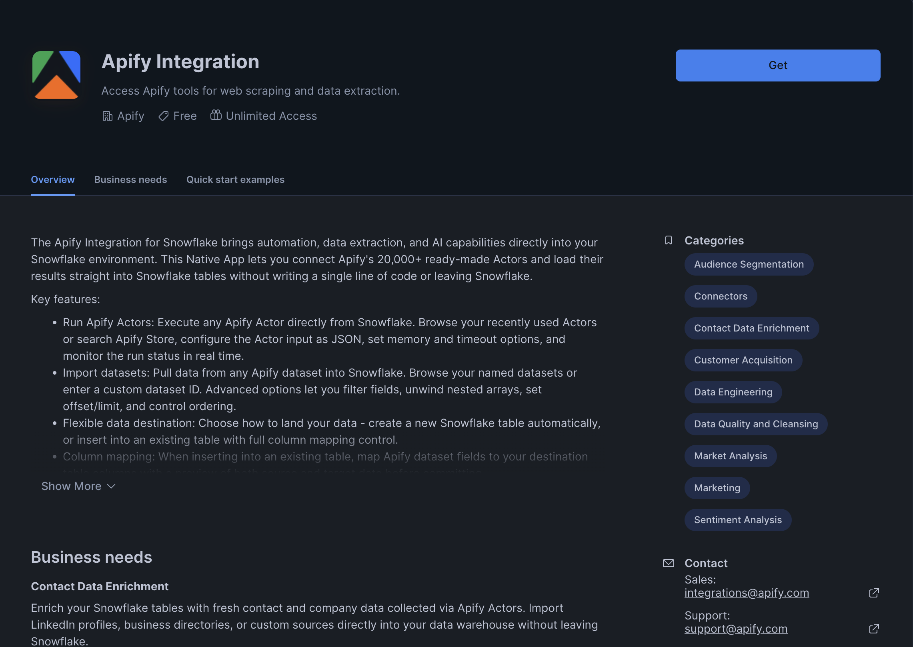

### Step 2: Set up External Access Integration

During installation, the app prompts you to create a `Network Rule` and an `External Access Integration` so the app can reach the Apify API.

Follow the instructions shown in the setup screen to create the External Access Integration. On the same screen, click **Configure** next to **Apify API Token** and bind a Snowflake secret of type Generic String containing your [Apify API token](https://console.apify.com/settings/integrations).

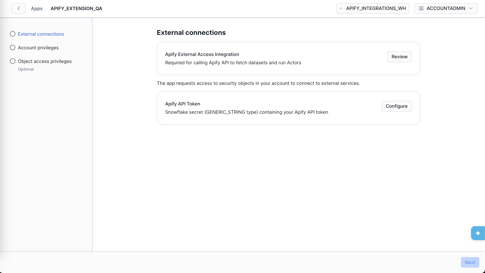

:::note Required privileges

The role setting up the app must be able to create an External Access Integration and a Network Rule, and must grant the app the `READ SESSION` account-level privilege.

:::

### Step 3: Grant required privileges

After the External Access Integration is in place, grant the app the remaining privilege it needs. Click the **Grant** button to allow the app to read the current Snowflake user session:

- `READ SESSION` - lets the app associate Apify API tokens with individual Snowflake users.

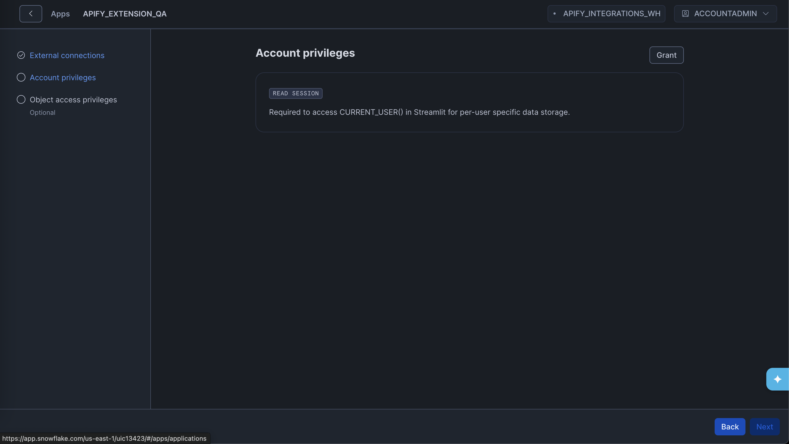

### Step 4: Verify the connection

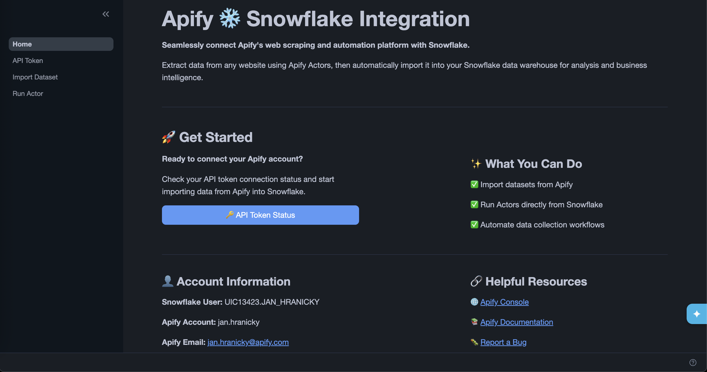

Once installation is complete, open the app and go to the **API Token** page to verify the connection is working. If the token secret was configured correctly during setup, the page shows your Apify username and email.

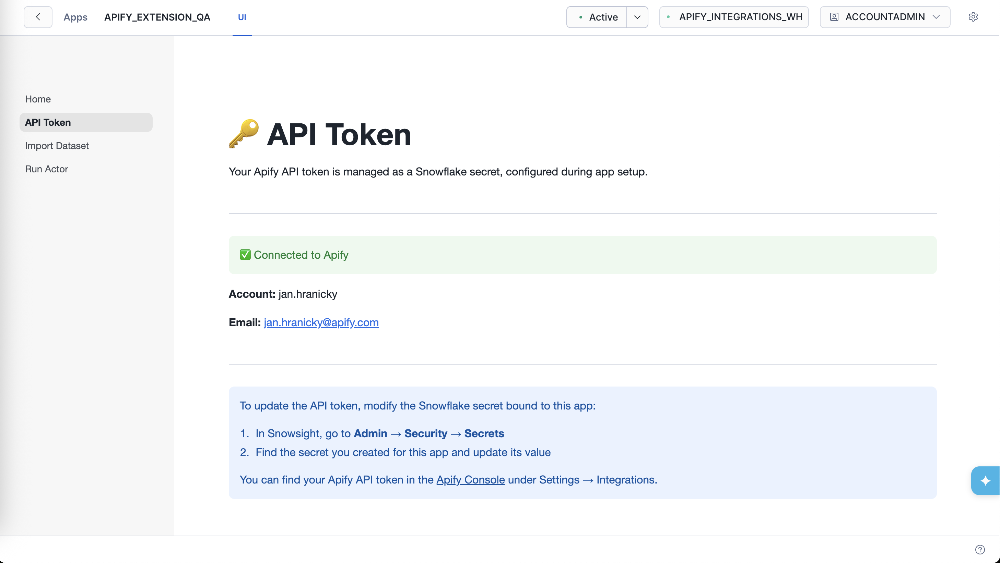

To update your Apify API token later, go to **Configurations** > **Credentials** in App settings, find the secret bound to this app, and update its value.

## Run an Actor

The **Run Actor** page lets you trigger an Apify Actor run from within Snowflake and then import its results directly:

1. [Select an Actor](#step-1-select-an-actor) - choose from recently used Actors or Apify Store.
1. [Configure and run](#step-2-configure-and-run) - provide input and start the run.
1. [Monitor the run](#step-3-monitor-the-run) - track progress with live status updates.
1. [Import results](#step-4-import-results) - load the run's dataset into Snowflake.

### Step 1: Select an Actor

Choose an Actor from two sources:

- **Recently used Actors** - lists Actors from your Apify account.
- **Apify Store** - browses publicly available Actors.

You can also type a custom Actor ID (for example, `E2jjCZBezvAZnX8Rb`) directly into the input.

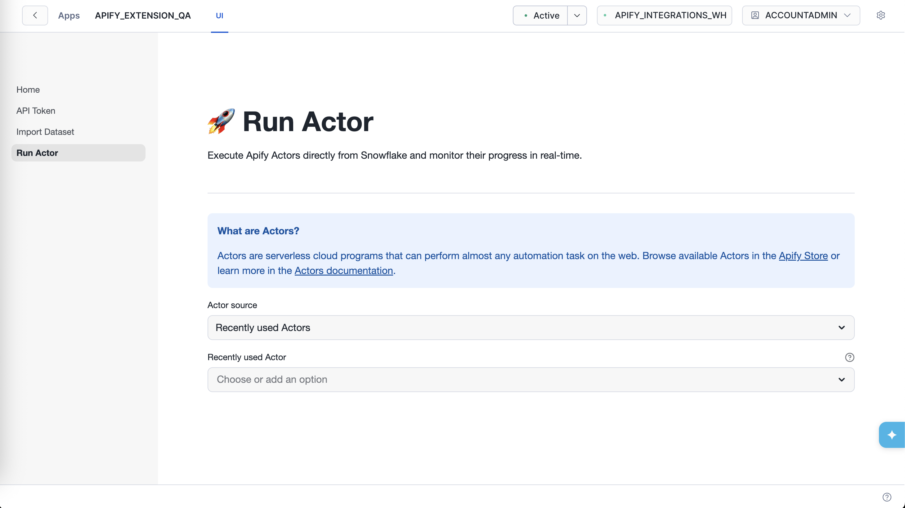

### Step 2: Configure and run

Provide the Actor input as a JSON object. You can copy the input from the Actor's page in [Apify Console](https://console.apify.com/store).

Expand **Advanced Run Options** to set:

- **Timeout** - maximum run duration in seconds (default 3600). Set to `0` for no timeout.
- **Memory** - RAM allocated to the run in MB (default 4096 MB). More memory means more CPU.

Click **Next: Run Actor** to start the run.

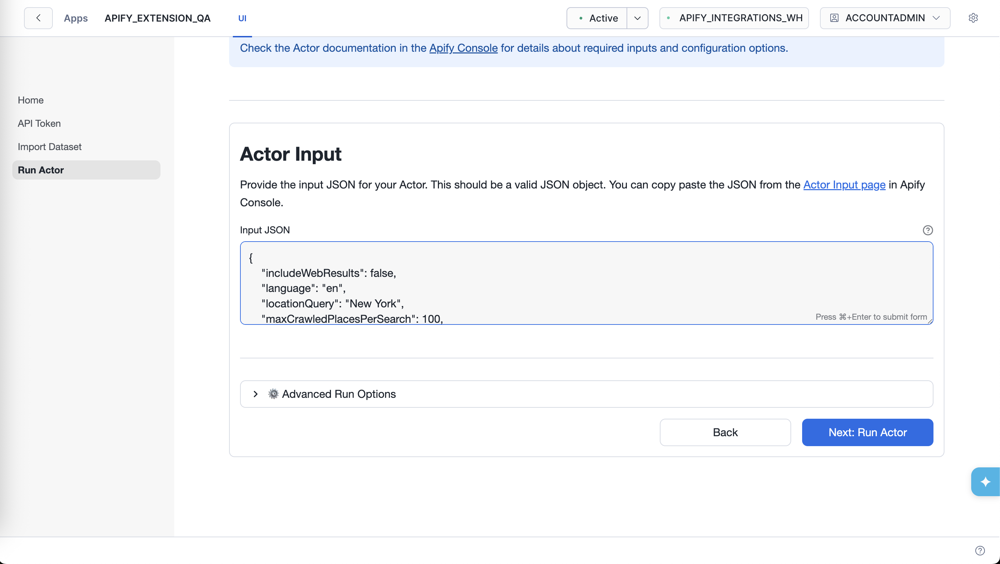

### Step 3: Monitor the run

The app polls the run status every five seconds and shows live updates. You can also follow the link to **View run in Apify Console** for full logs.

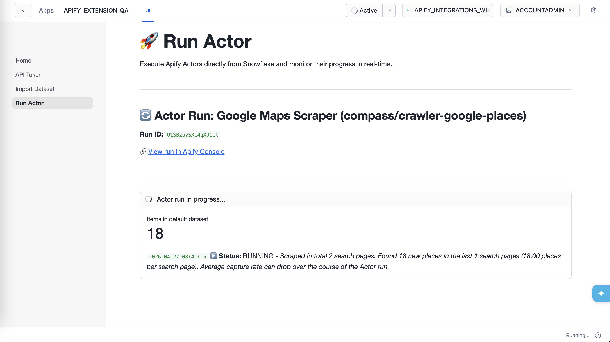

Use the **Abort Actor run** button to stop the run at any time.

### Step 4: Import results

When the run completes, click **Next: Import dataset** to go straight to the **Import Data from Dataset** page with the run's default dataset pre-filled. Follow the [import steps](#import-a-dataset) to load the results into Snowflake.

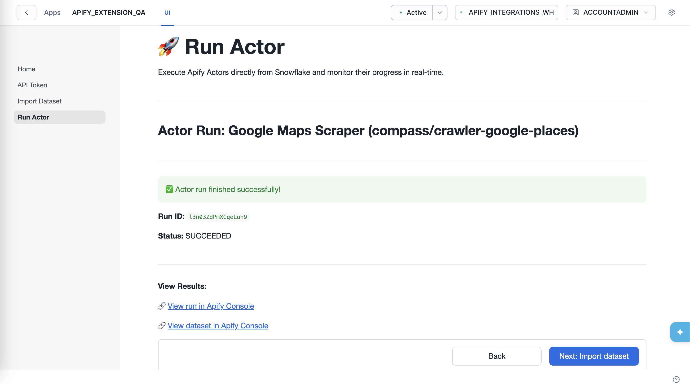

## Import a dataset

The **Import Data from Dataset** page lets you fetch items from an Apify dataset and load them into a Snowflake table.

### Step 1: Select a dataset

Choose one of your named datasets from the dropdown or enter a custom dataset ID. You can find dataset IDs in [Apify Console](https://console.apify.com/storage/datasets) under **Storage** > **Datasets**.

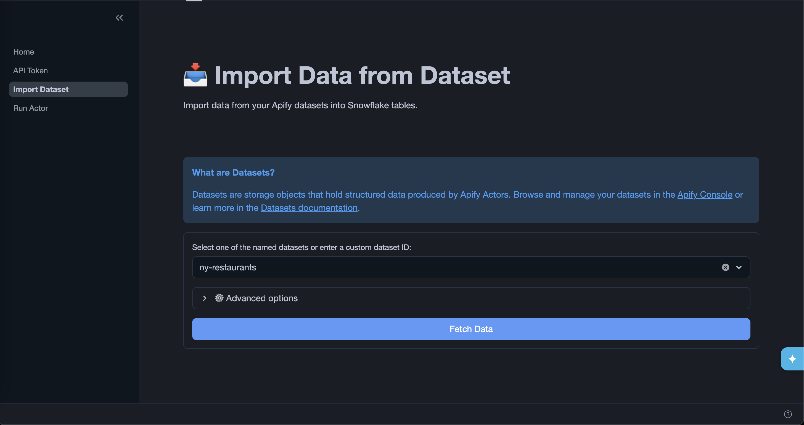

Expand **Advanced options** to refine what data is fetched:

| Option               | Description                                                                                |
| -------------------- | ------------------------------------------------------------------------------------------ |
| **Select fields**    | Comma-separated list of fields to include. The fields are exported in the order specified. |
| **Omit fields**      | Comma-separated list of fields to exclude.                                                 |
| **Unwind**           | Comma-separated list of array or object fields to flatten into separate rows.              |
| **Offset**           | Number of items to skip from the beginning of the dataset.                                 |
| **Limit**            | Maximum number of items to fetch.                                                          |
| **Clean**            | Excludes empty items and fields starting with `#`.                                         |
| **Descending order** | Returns items in reverse order.                                                            |

Click **Fetch Data** to retrieve a preview of the dataset.

### Step 2: Choose an export mode

After fetching data, select how you want to load it into Snowflake. You can either [create a new table](#create-new-table) or [insert into an existing table](#insert-into-existing-table).

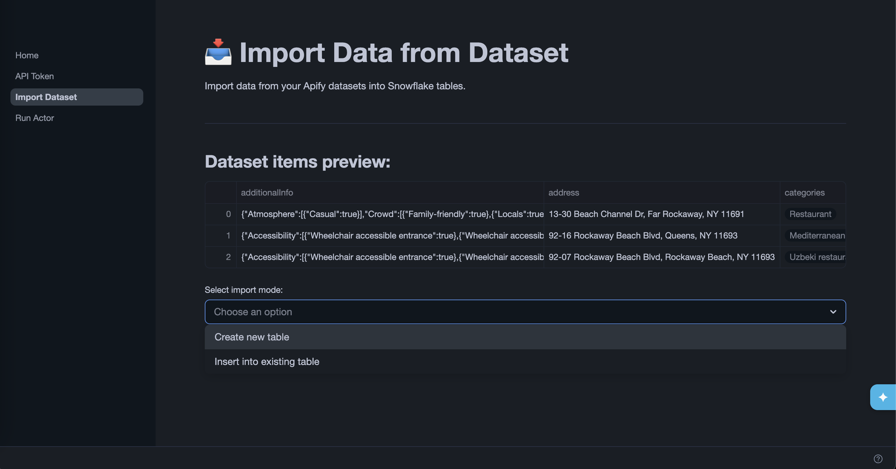

#### Create new table

The app creates a new table in the `APIFY.DATASETS_EXPORTS` schema in a dedicated database. Select which columns to include, then click **Next: Export**.

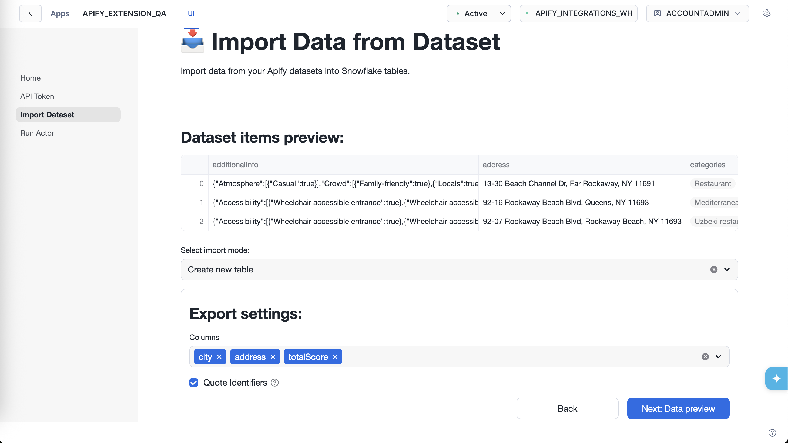

Tables created by the app are only visible to `ACCOUNTADMIN` by default. To grant access to other roles, see [Manage table visibility](#manage-table-visibility).

#### Insert into existing table

Reference an existing table in your account. The app prompts you to grant it access to your table, then lets you map dataset columns to destination columns before inserting. Click **Next: Export** to write the data to Snowflake.

## Manage table visibility

Tables created by the app are only visible to `ACCOUNTADMIN` by default. The app grants access to exported tables via its `app_public` application role. To make the tables visible to other roles, grant that role in a Snowsight worksheet:

```sql
GRANT APPLICATION ROLE <app_name>.app_public TO ROLE <your_role>;
```

Alternatively, open the app in Snowsight, go to the **Access management** tab, and click **Add** to assign the `app_public` role to any account role.

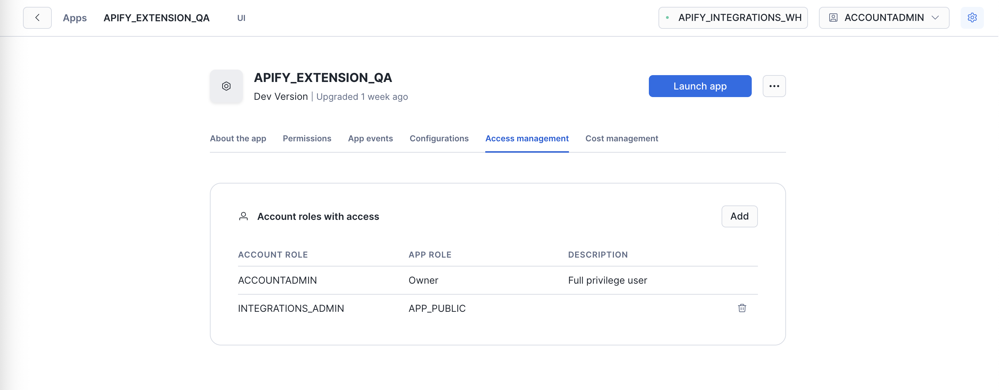

## Next steps

With Apify data in Snowflake, you can query it with standard SQL, join it with your existing tables, and connect it to business intelligence (BI) tools like Tableau, Looker, or Snowflake's own data-sharing features.

For questions or help, contact the Apify team at [integrations@apify.com](mailto:integrations@apify.com), through the live chat, or in the [developer community on Discord](https://discord.com/invite/jyEM2PRvMU).
