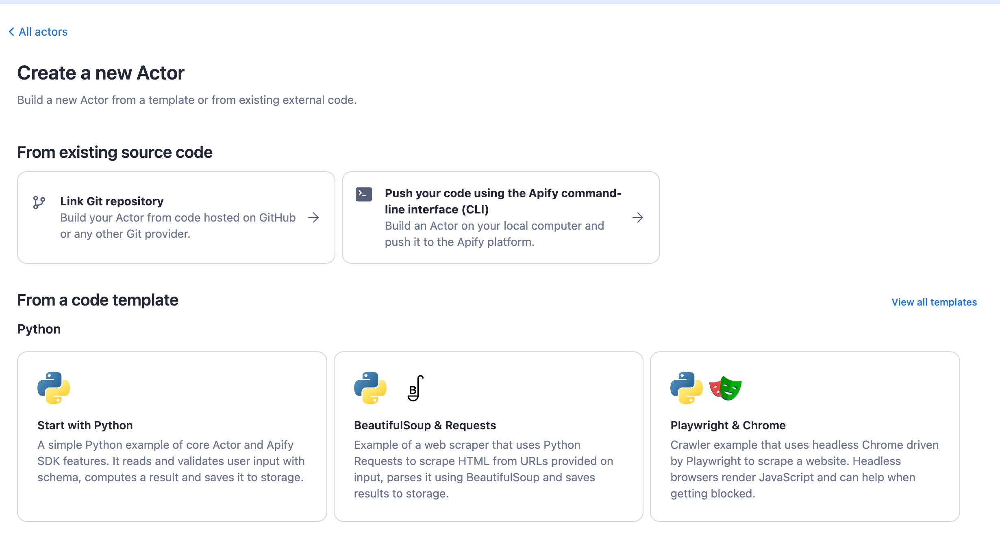
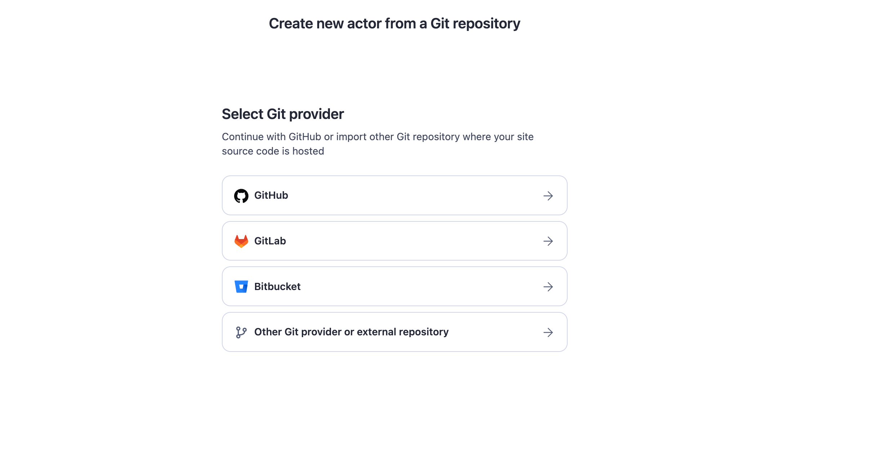

# GitHub integration

**Learn how to integrate your Apify Actors with GitHub. This article shows you several possible integrations.**

---

## Get started

To use the Apify integration for GitHub, you will need:

- An [Apify account](https://console.apify.com/).
- A GitHub repository.

### Create an Actor from a GitHub repository

Learn how to create an Actor from a GitHub repository. This is useful if you want to use the GitHub integration to automatically deploy your code to Apify.

Selecting _Link Git repository_ will open a new modal to select a provider to use.
Selecting _GitHub_ will open a new window with GitHub authentication and selecting GitHub repository.

### Deploy changes automatically

<iframe width="560" height="315" src="https://www.youtube-nocookie.com/embed/j2I3DM8Nvu1M" title="YouTube video player" frameborder="0" allow="accelerometer; autoplay; clipboard-write; encrypted-media; gyroscope; picture-in-picture; web-share" allowfullscreen></iframe>

### Create an issue when a run fails

<iframe width="560" height="315" src="https://www.youtube-nocookie.com/embed/jZUp-rRbayc" title="YouTube video player" frameborder="0" allow="accelerometer; autoplay; clipboard-write; encrypted-media; gyroscope; picture-in-picture; web-share" allowfullscreen></iframe>
