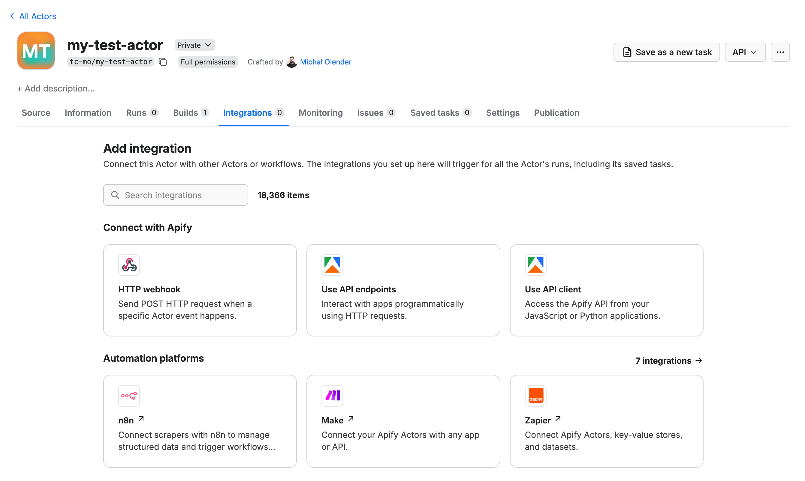
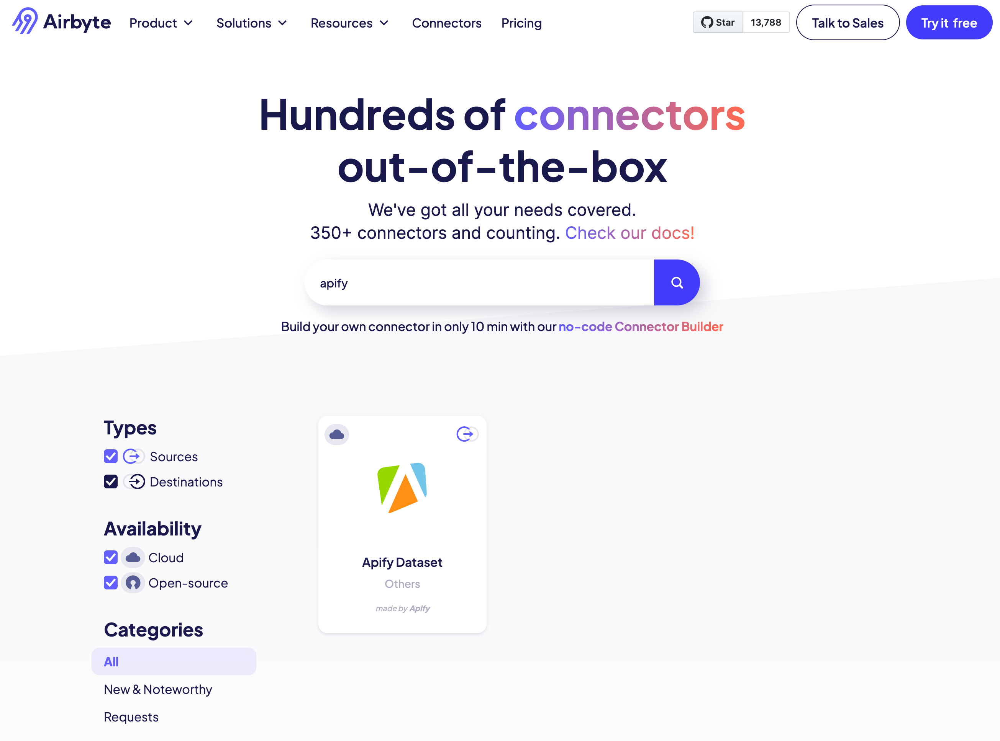

If you are building a service and your users could benefit from integrating with Apify or vice versa, we would love to hear from you! Contact us at [partners@apify.com](mailto:partners@apify.com) to discuss potential collaboration. We are always looking for ways to make our platform more useful and powerful for our users.

## Why integrate with Apify

Apify is the leading platform for web scraping, AI agents, and automation tools. By integrating Apify into your platform, you enable users to incorporate real-time, structured data from the web with zero scraping infrastructure on your side.

The [Apify Store](https://apify.com/store) contains thousands of pre-built Actors, ready-made tools for webscraping and automations.

## Integration types

An Apify integration can be _general_, allowing users to integrate any Actor from the Apify Store into their workflows (or their own Actors), or _Actor-specific_, enabling targeted automation like integrating the [Instagram Scraper](https://apify.com/apify/instagram-scraper) for use cases like social media monitoring.

### General integrations

General integrations allow users to easily automate workflows by connecting Apify with other platforms. Examples include:

- [Zapier](./workflows-and-notifications/zapier.md) integration allows Zapier users to enrich their automation workflows with data from the web or to add additional Actions performed by [Apify Actors](https://apify.com/store).
- [Make](https://www.make.com/en/integrations/apify) integration enables workflow automation by connecting Apify with thousands of other apps.
- [Keboola](/platform/integrations/keboola) integration enables Keboola users to easily pull data crawled from the web into their data pipelines.

### Actor-specific integrations

Actor-specific integrations enable integrating specific Actors for targeted use cases. While they offer similar functionality to general integrations, they make it easier for users searching for specific use cases to discover Apify's tools and enjoy a more streamlined experience.

Examples include:

- [Make Instagram Scraper integration](https://www.make.com/en/integrations/apify-instagram-scraper)
- [Lindy.ai Instagram integration](https://www.lindy.ai/integrations/instagram)

For more examples, see [integrations](./index.mdx).

## Integrating with Apify

To integrate your service with Apify, you have two options:

- Build an [Apify Actor](https://docs.apify.com/platform/actors) that will be used as integration within the [Apify Console](https://console.apify.com)
- Build an external integration using the [Apify API](https://docs.apify.com/api/v2)

### Building an integration Actor

The best way to reach out to Apify users is directly within [Apify Console](https://console.apify.com). To do that, you need to build an integrable Actor that can be piped into other Actors to upload existing data into a database. This can then be easily configured within Apify Console. Follow the [guide on building integration-ready Actors](./actors/integration_ready_actors.md).

### Building an external integration

Alternatively, you can let your users manage the connection directly on your side using [Apify API](https://docs.apify.com/api/v2) and our API clients for [JavaScript](/api/client/js/) or [Python](/api/client/python/). This way, your users can manage the connection directly from your service.

### Authentication methods

Apify supports two main authentication methods for secure API access.

_OAuth 2.0_ - Use OAuth 2.0 to allow users to authorize your integration without sharing their credentials.
<!-- TODO expand section possibly? -->

_API token_ - Apify user generates personal API token from Apify account settings page. For more information, see [API Token documentation](https://docs.apify.com/platform/integrations/api#api-token).

### API implementation

To build an integration, core API endpoints can be mapped as **actions and triggers** inside your platform.

#### Action endpoints

##### Run an Actor

Triggers the execution of any Apify Actor by ID, allowing users to start custom or public web scraping and automation Actors with specified input parameters.

Recommended features:

- Select Actor: The Actor list will be pre-populated with Actors that the user created or used, using the [List of Actors API](https://docs.apify.com/api/v2/acts-get) and enriched with Actors from the store, which the user has not run already using [API](https://docs.apify.com/api/v2/store-get).
- Synchronous vs. asynchronous run: flow will wait until the run/task will finish (consider timeout on your platform side)
- Input UI: upon selecting an Actor, dynamically display specific Actor input and preload default example values based on Actor Input schema. Alternatively, allow users to insert a JSON input for the Actor.
- Additionally, it should include option to choose [Actor build](https://docs.apify.com/platform/actors/running/runs-and-builds), [memory](https://docs.apify.com/platform/actors/running/usage-and-resources#memory) and [timeout](https://docs.apify.com/platform/actors/running/usage-and-resources#memory).
- Field mapping: allowing users to map fields to data acquired in previous steps of the workflow

##### Run a task

Starts a predefined task (a saved Actor configuration), making it easy for users to run recurring or templated workflows without redefining inputs each time.

Recommended features:

- Select task: The task list will be pre-populated with tasks that the user created, using the [List of tasks](https://docs.apify.com/api/v2/actor-tasks-get) API.
- Synchronous vs. asynchronous run: flow will wait until the run/task will finish (considering timeout on your platform side)
- JSON input field: possibility to add JSON input to override the task input.

##### Get dataset items

Fetches structured results (JSON, CSV, etc.) generated by a previously run Actor or task, which can be used as input for further workflow steps.

Recommended features:

- Dataset: Dropdown (user's datasets) or ID/String input. Populated via [Datasets API](https://docs.apify.com/api/v2/datasets-get).
- Limit (optional): The maximum number of dataset items to fetch. If empty, the default limit will be used.
- Offset (optional): The offset in the dataset from where to start fetching the items. If empty, it will be from the beginning.

##### Get key-value store item

Retrieves a specific item from a key-value store, commonly used to access metadata, snapshots, logs, or one-off results generated during Actor execution.

Recommended features:

- Key-value store: Dropdown (user's KV stores) or ID/String input. Populated via [Key-value Stores API](https://docs.apify.com/api/v2/key-value-stores-get).
- Record key: value (string)

##### Scrape single URL

Runs Apify's [Website Content Crawler](https://apify.com/apify/website-content-crawler) Actor in synchronous mode to extract structured data from a single web page—ideal for on-demand URL scraping inside agents or automation flows.

Recommended features:

- URL: that you intend to scraper (string)
- Crawler type: Dropdown menu, allowing users to choose from the following options:
  - Headless web browser - Useful for modern websites with anti-scraping protections and JavaScript rendering. It recognizes common blocking patterns like CAPTCHAs and automatically retries blocked requests through new sessions.
  - Stealthy web browser (default) - Another headless web browser with anti-blocking measures enabled. Try this if you encounter anti-bot protections while scraping.
  - Raw HTTP client - High-performance crawling mode that uses raw HTTP requests to fetch the pages. It is faster and cheaper, but it might not work on all websites.

##### Universal API call

A node to send API requests to Apify, allowing advanced users to configure or query Actors, tasks, datasets, or other API endpoints programmatically.

#### Trigger endpoints

##### Watch Actor runs

Monitors the status of an Actor run by ID, useful for triggering follow-up steps once a job has completed. Triggered when a specific Actor run reaches a terminal status (succeeded, failed, timed out, aborted).

Recommended features:

- Select Actor runs to watch: Dropdown (list of user's Actors). Populated via [List Actors API](https://docs.apify.com/api/v2/acts-get)

##### Watch task runs

Similar to watching Actor runs, this tracks the progress and completion status of a specific task run to allow event-driven actions in a workflow.

Recommended features:

- Select Actor tasks to watch: Dropdown (list of user's tasks). Populated via [List tasks API](https://docs.apify.com/api/v2/actor-tasks-get).

### Pricing options

Choose between two pricing models based on your integration setup.

#### Direct user billing

Users create their own Apify accounts and are billed directly by Apify for their usage. This model gives users full control over their Apify usage and billing.

#### Whitelabel access

Users access Apify through your platform without needing an Apify account. Apify bills you based on consumption, and you factor costs into your pricing.

### Monitoring and tracking

To help Apify monitor and support your integration, every API request should identify your platform. You can do this in one of two ways:

- Preferred:
  - Use the `x-apify-integration-platform` header with your platform name (e.g., make.com, zapier).
  - If your platform has multiple Apify apps, also include the `x-apify-integration-app-id` header with the unique app ID.
- Alternative:
  - Set a custom `User-Agent` header that identifies your platform.

These identifiers enable better analytics and support for your integration.

## Technical resources

### Apify API

[Apify API](https://docs.apify.com/api) provides extensive REST API, which covers all of the features of the Apify platform. You can download the complete OpenAPI schema of Apify API in the [YAML](https://docs.apify.com/api/openapi.yaml) or [JSON](https://docs.apify.com/api/openapi.json) formats. Apify provides official libraries for JavaScript and Python to access API.

- [Apify API Reference](https://docs.apify.com/api/v2)
- Client Libraries
  - [JavaScript/TypeScript/Node.js](https://docs.apify.com/api/client/js/)
  - [Python](https://docs.apify.com/api/client/python/)

### Reference implementations

For inspiration, take a look at the public repositories of our existing external integrations:

- Zapier
  - [Zapier integration documentation](https://docs.apify.com/platform/integrations/zapier)
  - [Source code on Github](https://github.com/apify/apify-zapier-integration)
- Make.com
  - [Make.com integration documentation](https://docs.apify.com/platform/integrations/make)
- Keboola
  - [Keboola integration documentation](https://docs.apify.com/platform/integrations/keboola)  
  - [Source code on Github](https://github.com/apify/keboola-ex-apify/) (JavaScript)
  - [Google Maps Reviews Scraper integration](https://github.com/apify/keboola-gmrs/) (Actor-specific)
- Airbyte
  - [Source code on Github](https://github.com/airbytehq/airbyte/tree/master/airbyte-integrations/connectors/source-apify-dataset) (Python)
- Pipedream
  - [Source code on Github](https://github.com/PipedreamHQ/pipedream/tree/65e79d1d66cf0f2fca5ad20a18acd001f5eea069/components/apify)

For technical support, contact us at [integrations@apify.com](mailto:integrations@apify.com).
