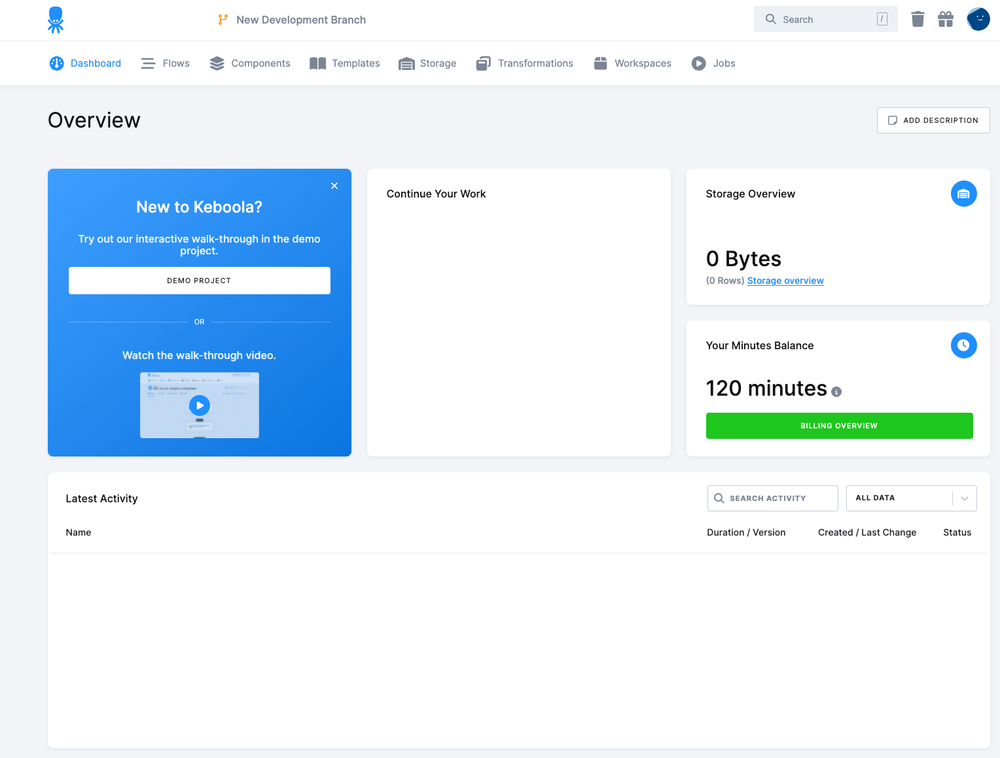
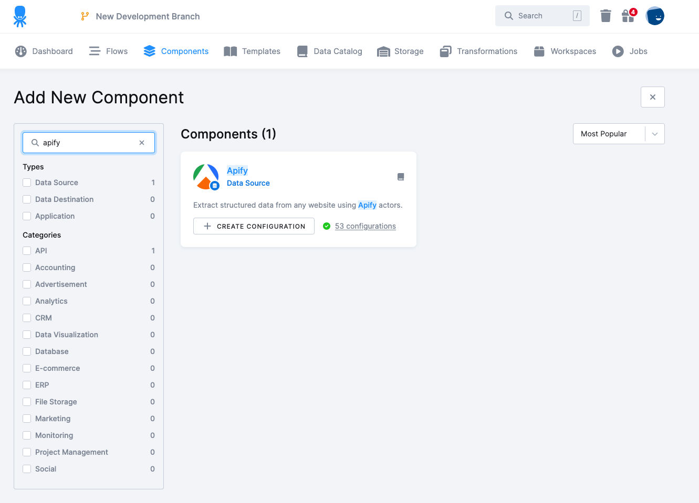
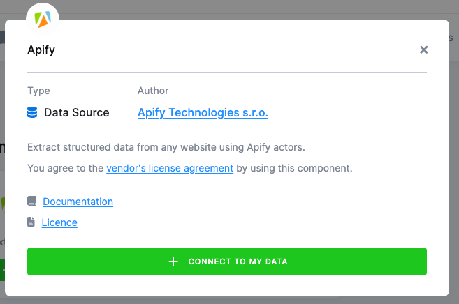
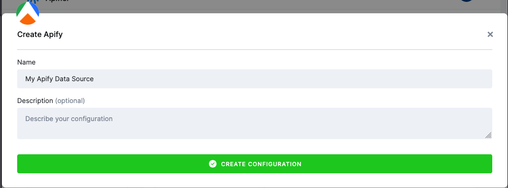
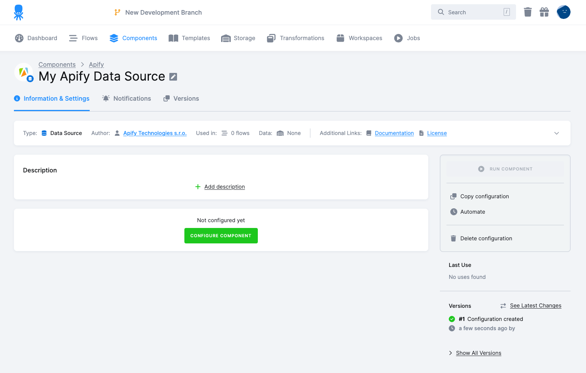
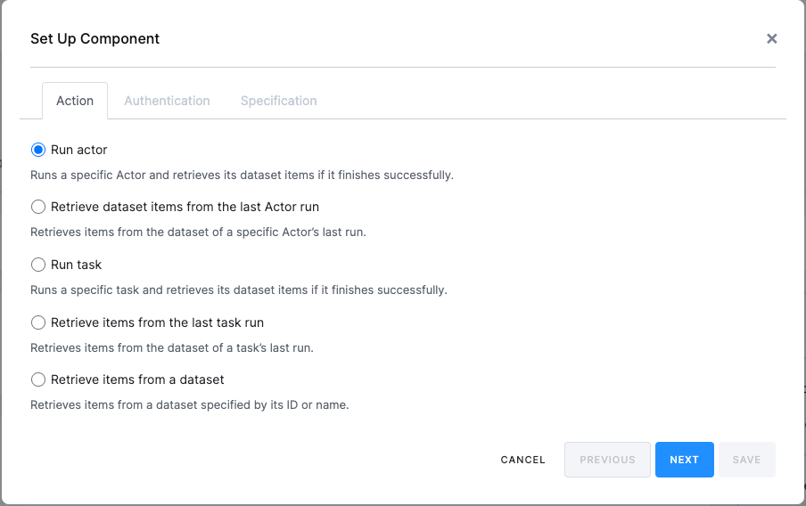
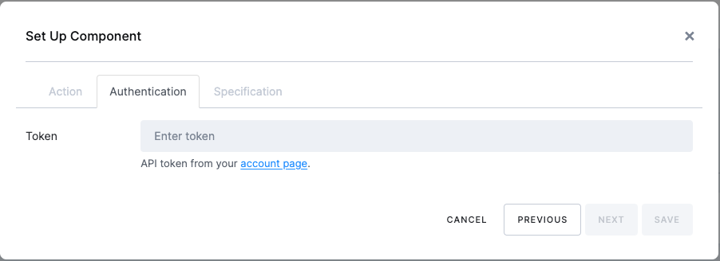
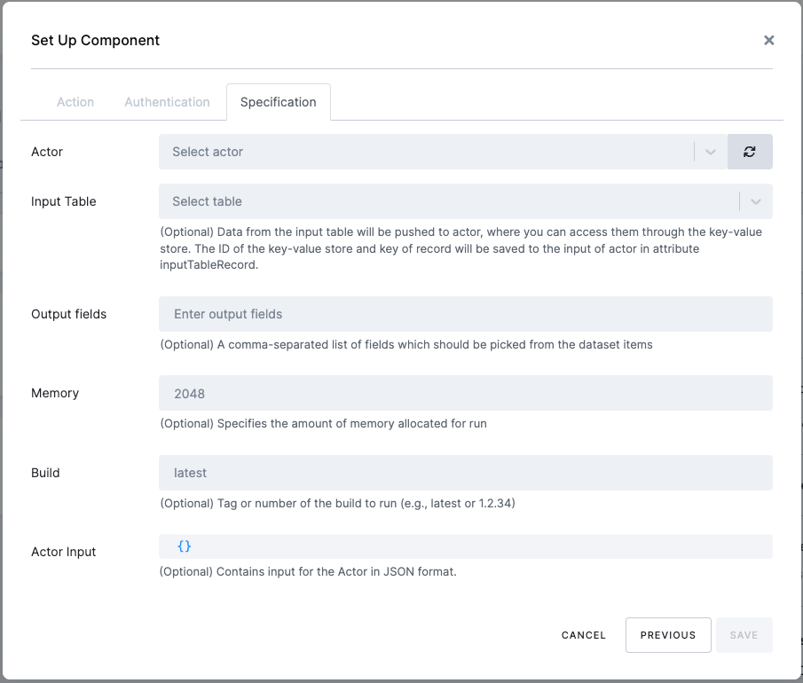
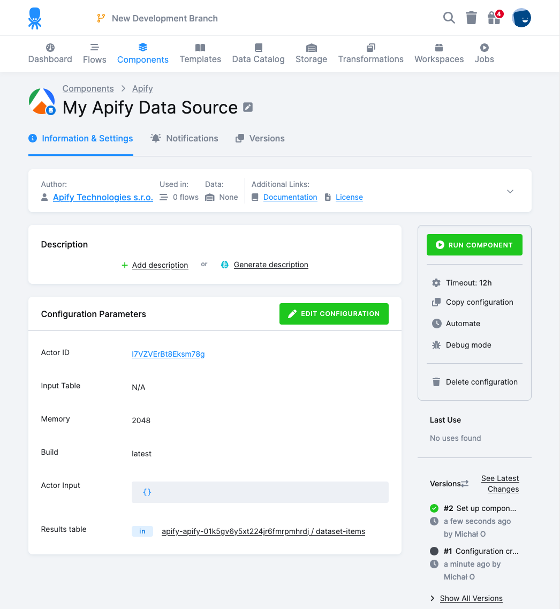

**Integrate your Apify Actors with Keboola.**

---

With Apify integration for [Keboola](https://www.keboola.com/), you can extract data from various sources using your Apify Actors and load it into Keboola for further processing, transformation, and integration with other platforms.

The Keboola integration allows you to run your Actors, fetch items from datasets, and retrieve results, all within the Keboola platform.

## Connect Apify with Keboola

To use the Apify integration on Keboola, you will need to:

- Have an [Apify account](https://console.apify.com/).
- Have a [Keboola account](https://www.keboola.com/).

### Step 1: Create a New Data Source in Keboola

Once your Keboola account is ready and you are logged in, navigate to the **Components** section in the top menu and click the **Add Component** button.

In the list of available Components, find and select the **Apify** from Data Sources and click on the **Add Component** button.

On the new window, click **Connect** to my data**

Provide a name and description for your configuration, and then click on the **Create Configuration** button.

### Step 2: Configure the Apify Data Source

With the new configuration created, you can now configure the data source to retrieve the needed data. Click on the **Configure Component** button to begin the setup process.

#### Choose an Action

In the next step, you can choose the action you want to perform:

- **Run Actor**: This action runs the selected Actor, waits until it finishes, and then pushes all items from the default dataset to Keboola Storage.
- **Retrieve dataset items from the last Actor run** - This action takes the dataset of a specific Actor's last run.
- **Run Task** - This action runs the selected task, waits until it finishes, and then pushes all items from the default dataset to Keboola Storage.
- **Retrieve items from the last task run** - This action takes the dataset of a specific task last run.
- **Retrieve items from Dataset**: This action takes the dataset ID or dataset name and retrieves all items from that dataset.

#### Authentication

After selecting the action, you will need to provide your Apify API credentials. You can find these credentials on your Apify account page by navigating to **Settings > Integrations** and copying them into the provided form.

#### Specifications

In the specifications step, you can set up various options for your Actor run:

- **Actor**: Select the Actor you want to run from your Apify account.
- **Input Table**: Choose a table from the Keboola platform to be sent to the Actor as input data.
- **Output field**:  Comma-separated list of fields to be picked from the dataset.
- **Memory**: Adjust the memory settings if needed (the default values can be kept).
- **Build**: Adjust if you want to run a specific build of an Actor. Tag or number of the build to run.
- **Actor Input**: Pass any JSON data as input to the Actor.

Once you have filled in all the necessary options, click the **Save** button to save your configuration.

### Step 4: Run the Configured Data Source

After your data source has been configured, you can run it by clicking the **Run** button in the upper-right corner of your configuration.

You can monitor the progress of your run in the job detail section on the right-hand side of the page.

Once the run finishes successfully, you can find the results by following the link in the Storage Stats section of the job detail page.

## Next Steps

With your data now in Keboola, you can integrate it with dozens of other services that Keboola supports. Check out the [full list of integrations](https://www.keboola.com/integrations) to explore your options.

You can set up a writer for a selected service using Keboola Writer or create orchestrations to transform, merge, or split your data as needed.

If you have any questions or need assistance, feel free to contact us at [info@apify.com](mailto:info@apify.com), through our live chat, or in our [developer community on Discord](https://discord.com/invite/jyEM2PRvMU).
