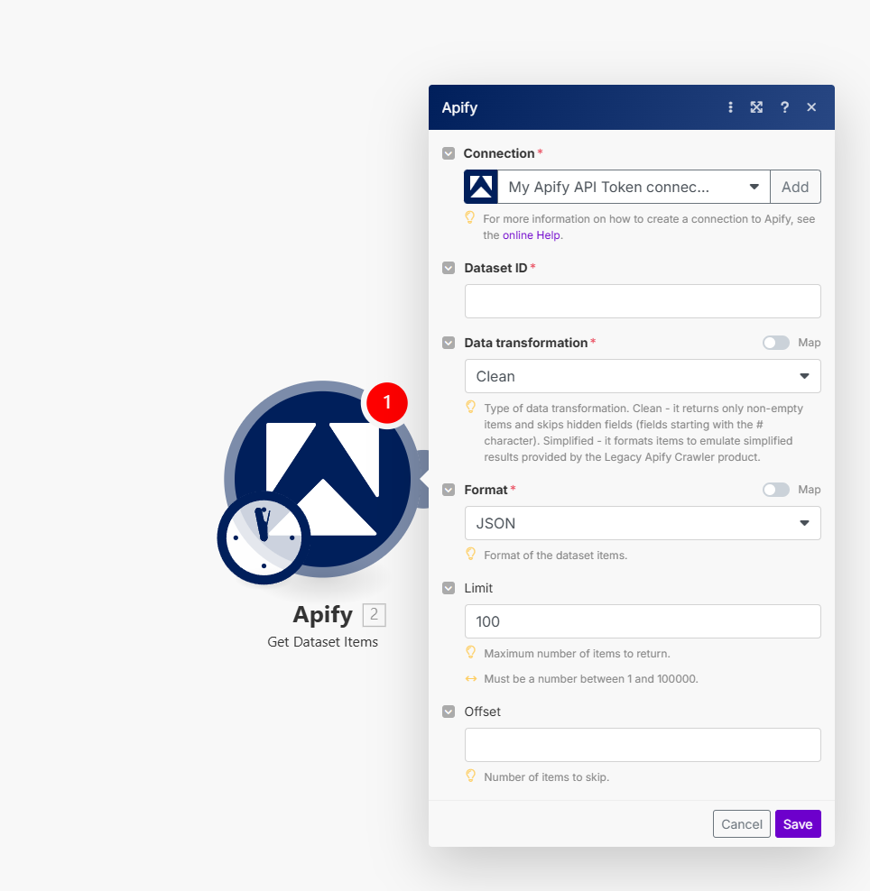
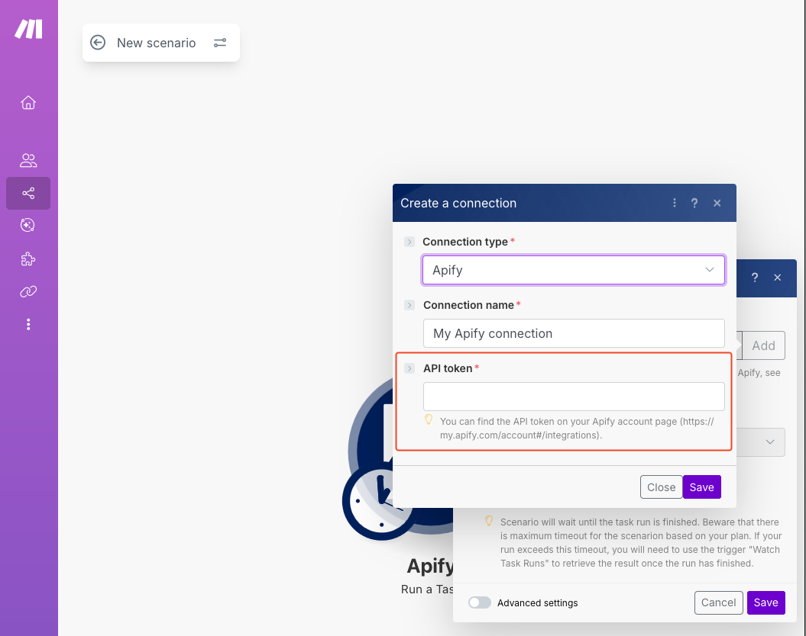
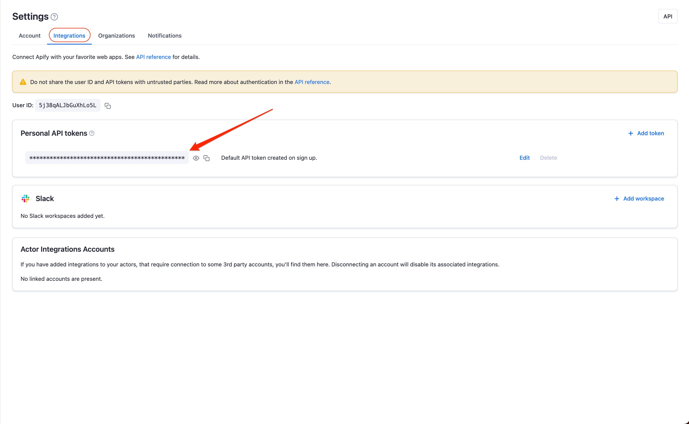

# Make integration

**Learn how to integrate your Apify actors with Make.**

---

[Make](https://make.com/) *(formerly Integromat)* allows you to create scenarios where you can integrate various services (modules) to automate and centralize jobs. Apify has its own module you can use to run Apify Actors, get notified about run statuses, and receive Actor results directly in your Make scenario.

## Connect Apify to Make

To use the Apify integration on Make, you will need:

- An [Apify account](https://console.apify.com/).
- A Make account (and a [scenario](https://www.make.com/en/help/scenarios/creating-a-scenario)).

## Step 1: Add the Apify module to your Make scenario

Add the Apify module to your scenario. You can find this module by searching for "Apify" in the module search bar.

Next, select one of the available options under Triggers, Actions and Searches, then click on the Apify module to open its configuration window.

## Step 2: Create a connection to your Apify account

In the Connection configuration window, you will need to provide your Apify API token.

You can find the token in the Apify Console by navigating to **Settings > Integrations**.

Finally, copy your API token to the Make module and save it to create a connection.

Congratulations! You have successfully connected the Apify app and can now use it in your scenarios.

## Triggers

### Watch Actor Runs

> Triggers when a selected actor run is finished.

| Input        | Description                                                            |
| :----------- | :--------------------------------------------------------------------- |
| Webhook name | Enter the desired name for the webhook. E.g. Finished Web Scraper Run. |
| Connection   | [Create an Apify connection](#connect-apify-to-make).                  |
| Actor        | Select the Actor you want to monitor for finished runs.                |

### Watch Task Runs

> Triggers when a selected task run is finished.

| Input        | Description                                                            |
| :----------- | :--------------------------------------------------------------------- |
| Webhook name | Enter the desired name for the webhook. E.g. Finished Web Scraper Run. |
| Connection   | [Create an Apify connection](#connect-apify-to-make).                  |
| Actor        | Select the Actor you want to monitor for finished runs.                |

## Actions

### Run a task

> Runs a selected actor task.

| Input                | Description                                                                                                                                              |
| :------------------- | :------------------------------------------------------------------------------------------------------------------------------------------------------- |
| Task                 | Select or map the task you want to run.                                                                                                                  |
| Run synchronously    | Make will wait until the task run is finished. Beware that the maximum timeout for the run is 120 seconds.                                               |
| Input JSON overrides | Here you can enter a JSON object to override the task input configuration. Only the provided fields will be overridden, the rest will be left unchanged. |

### Run an actor

> Runs a selected actor.

| Input                | Description                                                                                                                                                                                     |
| :------------------- | :---------------------------------------------------------------------------------------------------------------------------------------------------------------------------------------------- |
| Actor                | Select or map the ID of the actor you want to run.                                                                                                                                              |
| Run synchronously    | Make will wait until the task run is finished. Beware that the maximum timeout for the run is 120 seconds.                                                                                      |
| Input JSON overrides | Here you can enter a JSON object to override the task input configuration. Only the provided fields will be overridden, the rest will be left unchanged.                                        |
| Build                | Specify the actor build to run. It can be either a build tag or build number. By default, the run uses the build specified in the default run configuration for the actor (typically 'latest'). |
| Timeout              | Enter the timeout for the run in seconds. By default, the run uses a timeout specified in the default run configuration for the actor.                                                          |
| Memory               | Select or enter memory limit for the run, in megabytes. By default, the run uses a memory limit specified in the default run configuration for the actor.                                       |

## Searches

### Get Dataset Items

> Retrieves items from a [dataset](/platform/storage/dataset).

| Input               | Description                                                                                                                                                                                                                   |
| :------------------ | :---------------------------------------------------------------------------------------------------------------------------------------------------------------------------------------------------------------------------- |
| Connection          | [Create an Apify connection](#connect-apify-to-make).                                                                                                                                                                         |
| Dataset ID          | Enter the ID of the dataset you want to retrieve items from.                                                                                                                                                                  |
| Data transformation | **Clean** - it returns only non-empty items and skips hidden fields (fields starting with the # character). **Simplified** - it formats items to emulate simplified results provided by the Legacy Apify Crawler product. |
| Format              | Select the format of the dataset items.                                                                                                                                                                                       |
| Limit               | Set the maximum number of items Make will return during one execution cycle.                                                                                                                                                  |
| Offset              | Enter the number of items to skip.                                                                                                                                                                                            |

If you have any questions or need help, feel free to reach out to us on our [developer community on Discord](https://discord.com/invite/jyEM2PRvMU).
