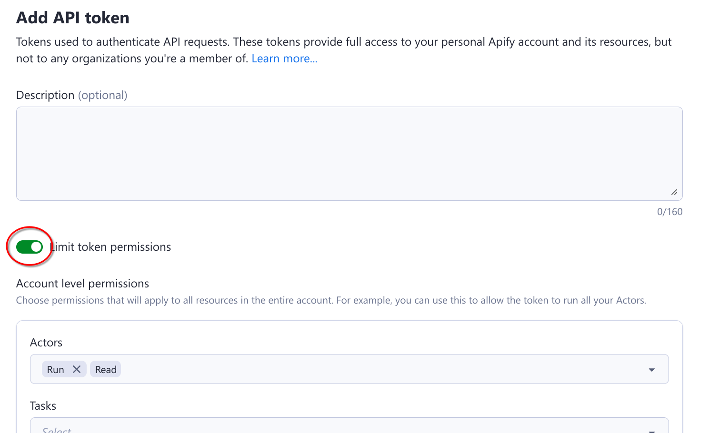
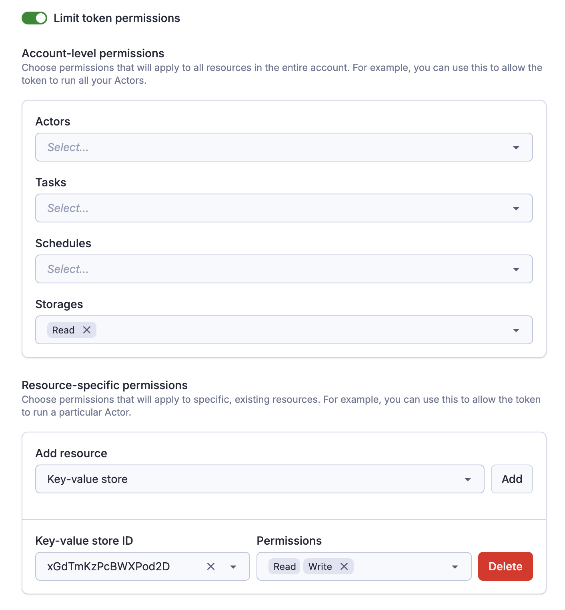
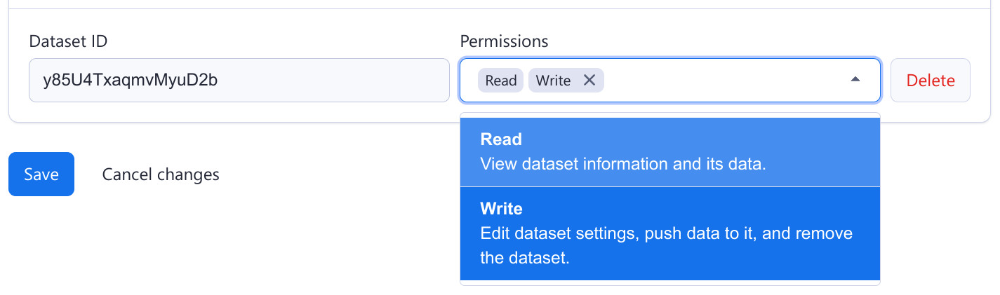

**Learn how to integrate with Apify using the REST API.**

---

All aspects of the Apify platform can be controlled via a REST API, which is described in detail in the [**API Reference**](/api/v2).
If you want to use the Apify API from JavaScript/Node.js or Python, we strongly recommend to use one of our API clients:

- [**apify-client**](/api/client/js/) NPM package for JavaScript, supporting both browser and server
- [**apify-client**](/api/client/python/) PyPI package for Python.

You are not required to those packages—the REST API works with any HTTP client—but the official API clients implement best practices such as exponential backoff and rate limiting.

## API token

To access the Apify API in your integrations, you need to authenticate using your secret API token. You can find it on the [Integrations](https://console.apify.com/settings/integrations) page in Apify Console. Give your token a reasonable description, and never use one token for several services, much like you shouldn't use the same password for different accounts.

:::caution

Do not share the API token with untrusted parties, or use it directly from client-side code,
unless you fully understand the consequences! You can also consider  [limiting the permission scope](#limited-permissions) of the token, so that it can only access what it really needs.

:::

## Authentication

You can authenticate the Apify API in two ways. You can either pass the token via the `Authorization` HTTP header or the URL `token` query parameter. We always recommend you use the authentication via the HTTP header as this method is more secure.

Note that some API endpoints, such as [Get list of keys](/api/v2#/reference/key-value-stores/key-collection/get-list-of-keys),
do not require an authentication token because they contain a hard-to-guess identifier that effectively serves as an authentication key.

## Organization accounts

When working under an organization account, you will see two types of API tokens on the Integrations page.

The Personal API tokens are different from your own Personal API tokens mentioned above. If you use this token in an integration, it will have the same permissions that you have within the organization, and all the operations you use it for will be ascribed to you.

On the other hand the Organization API tokens (only visible if you are the owner or have Manage access tokens permission) have full permissions and are not tied to a specific member of the organization.

## API tokens with limited permissions {#limited-permissions}

By default, tokens can access all data in your account. If that is not desirable, you can choose to limit the permissions of your token, so that it can only access data needed for the particular use case. We call these tokens **scoped**.

**A scoped token can access only those resources that you'll explicitly allow it to.**

### How to create a scoped token

Scoped tokens behave like standard API tokens and are managed through the [Integrations](https://console.apify.com/settings/integrations) page in Apify Console. When creating a token (or updating an existing one), simply toggle "Limit token permissions" to make the token scoped.

Once the token is scoped, you can specify the token's permissions.

### Account-level vs resource-specific permissions

We support two different types of permissions for tokens:

- **Account-level permissions**: These will apply to all resources in the entire account. For example, you can use these to allow the token to run _all_ your Actors.

- **Resource-specific permissions**: These will apply only to specific, existing resources. For example, you can use these to allow the token to read from a particular dataset.

:::tip

A single token can combine both types. You can create a token that can _read_ any data storage, but _write_ only to one specific key-value store.

:::

### Allowing tokens to create resources

If you need to create new resources with the token (for example, create a new Task, or storage), you need to explicitly allow that as well.

Once you create a new resource with the token, _the token will gain full access to that resource_, regardless of other permissions. It is not possible to create a token that can create a dataset, but not write to it.

:::tip

This is useful if you want to for example create a token that can dynamically create & populate datasets, but without the need to access other datasets in your account.

:::

### Permission dependencies

Some permissions require other permissions to be granted alongside them. These are called _permission dependencies_.

#### Automatic dependencies

The form enforces certain dependencies automatically. For example, when you grant the _Write_ permission for a dataset, the _Read_ permission is automatically selected. This ensures that you can write to a dataset if you can also read from it.

#### Manual dependencies

Other dependencies are more complicated, and **it is your responsibility that the token is set up correctly**. Specifically:

- To create or update a Schedule, the token needs access not only to the Schedule itself, but also to the Actor or task that is being scheduled.
- Similarly, to create or update a task, the token needs the additional permission to access the task's Actor itself.

:::tip

Let's say that you have an Actor and you want to programmatically create schedules for that Actor. Then you can create a token that has the account level _Create_ permission on schedules, but only the resource-specific _Run_ permission on the Actor. Such a token has exactly the permissions it needs, and nothing more.

:::

### Actor execution and scheduling

When you run an Actor with a scoped token (or schedule one), Apify will inject a new, _unscoped_ token to the Actor. This means that **the Actor will have full access to all resources in your account**.

This way you can be sure that once you give a token the permission to run an Actor, it will just work, and you don't have to worry
about the exact permissions the Actor might need. However, this also means that you need to trust the Actor.

:::note

This is why **we currently do not allow scoped tokens to create or modify Actors**. With those permissions it would be easy for the token to upload malicious code and gain access to your full account. If you do need to create or modify Actors via Apify API, you need to use an unscoped token.

:::

### Webhoooks configuration

If you allow a token to run an Actor, it'll also be able to manage the Actor's webhooks (similarly for tasks).

If you set up a webhook pointing to the Apify API, the Apify platform will automatically inject a token when dispatching that webhook. However, if you set up such a webhook with a scoped token, **that webhook will be dispatched with a token with the same limited permissions**.

Therefore, you need to make sure the token has sufficient permissions not only to set up the webhook, but also to perform the actual operation.

:::tip

Let's say you want to create a webhook that pushes an item to a dataset every time an Actor successfully finishes. Then such a scoped token needs to be allowed to both run the Actor (to create the webhook), and write to that dataset.

:::
