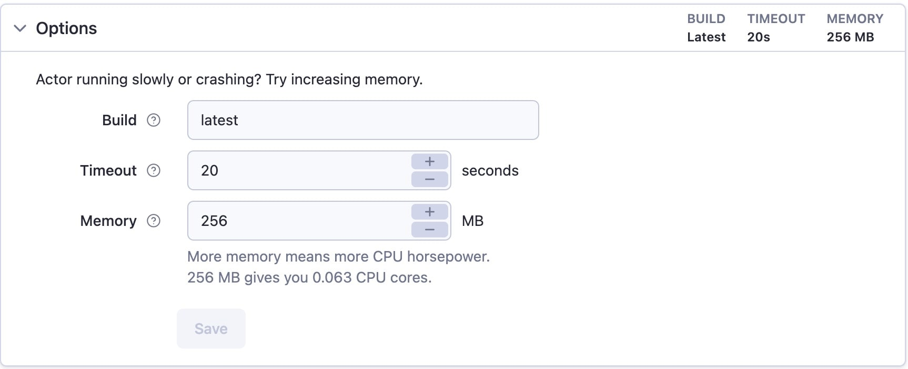

import Tabs from '@theme/Tabs';
import TabItem from '@theme/TabItem';

**Learn how to interact with the Apify API in your code using our official clients for JavaScript and Python.**

---

While you can interact with the Apify API through raw HTTP requests, the easiest way to get started is by using one of our official API clients. These packages are available for both JavaScript and Python and allow you to interact with the API in your code without needing to make manual GET or POST requests.

## Installation

You can install the client libraries from their respective package managers.

<Tabs groupId="main">
<TabItem value="Node.js" label="Node.js">

```shell
npm install apify-client
```

</TabItem>
<TabItem value="Python" label="Python">

```shell
pip install apify-client
```

</TabItem>
</Tabs>

## Initialization

After installing the package, you must import and initialize the client with your personal API token, which you can find in the [**Integrations**](https://console.apify.com/settings/integrations) section of the Apify Console.

<Tabs groupId="main">
<TabItem value="Node.js" label="Node.js">

```javascript
import { ApifyClient } from 'apify-client';

const client = new ApifyClient({
    token: 'YOUR_API_TOKEN',
});
```

</TabItem>
<TabItem value="Python" label="Python">

```python
from apify_client import ApifyClient

client = ApifyClient(token='YOUR_API_TOKEN')
```

</TabItem>
</Tabs>

> If you are planning on publishing your code to a public repository, be sure to set your API token as an environment variable rather than hardcoding it into your script.

## Usage examples

The following examples demonstrate how to perform common actions using the API clients.

### Running an Actor and getting results

This example shows how to run an Actor and retrieve its results. We will use a simple "number adder" Actor that takes two numbers as input and outputs their sum.

First, we get a client for the specific Actor and then run it using the `.call()` method.

<Tabs groupId="main">
<TabItem value="Node.js" label="Node.js">

```javascript
// Get a client for the 'apify/example-add-numbers' Actor
const actorClient = client.actor('apify/example-add-numbers');

// Run the Actor and wait for it to finish
const run = await actorClient.call({
    num1: 4,
    num2: 2,
});
```

</TabItem>
<TabItem value="Python" label="Python">

```python
# Get a client for the 'apify/example-add-numbers' Actor
actor_client = client.actor('apify/example-add-numbers')

# Run the Actor and wait for it to finish
run = actor_client.call(run_input={
    'num1': 4,
    'num2': 2
})
```

</TabItem>
</Tabs>

Once an Actor run has completed, it will return a **run info** object that contains details about the execution, including the ID of the default dataset where the results are stored.


You can then use this `defaultDatasetId` to get a client for the dataset and fetch its items.

<Tabs groupId="main">
<TabItem value="Node.js" label="Node.js">

```javascript
// Get a client for the run's default dataset
const datasetClient = client.dataset(run.defaultDatasetId);

// Get the items from the dataset
const { items } = await datasetClient.listItems();
console.log(items);
```

</TabItem>
<TabItem value="Python" label="Python">

```python
# Get a client for the run's default dataset
dataset_client = client.dataset(run['defaultDatasetId'])

# Get the items from the dataset
items = dataset_client.list_items().items
print(items)
```

</TabItem>
</Tabs>

### Updating an Actor's settings

You can also use the client to programmatically update an Actor's settings. For example, let's change the default memory and timeout for our "number adder" Actor.

First, we'll get a client for our Actor.

<Tabs groupId="main">
<TabItem value="Node.js" label="Node.js">

```javascript
const actorClient = client.actor('YOUR_USERNAME/YOUR_ACTOR_NAME');
```

</TabItem>
<TabItem value="Python" label="Python">

```python
actor_client = client.actor('YOUR_USERNAME/YOUR_ACTOR_NAME')
```

</TabItem>
</Tabs>

Then, we'll call the `.update()` method on the client and pass in our new **default run options**.

<Tabs groupId="main">
<TabItem value="Node.js" label="Node.js">

```javascript
await actorClient.update({
    defaultRunOptions: {
        build: 'latest',
        memoryMbytes: 256,
        timeoutSecs: 20,
    },
});
```

</TabItem>
<TabItem value="Python" label="Python">

```python
actor_client.update(default_run_build='latest', default_run_memory_mbytes=256, default_run_timeout_secs=20)
```

</TabItem>
</Tabs>

After running the code, the Actor's default settings in the Apify Console will be updated.



## Further reading

This guide only scratches the surface of what the API clients can do. For a more in-depth understanding, please refer to the full API client documentation:

- [API client for JavaScript](/api/client/js)
- [API client for Python](/api/client/python)
