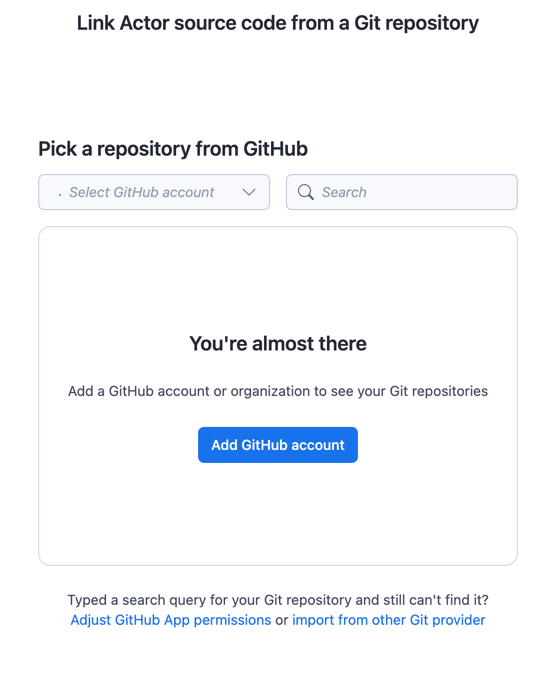
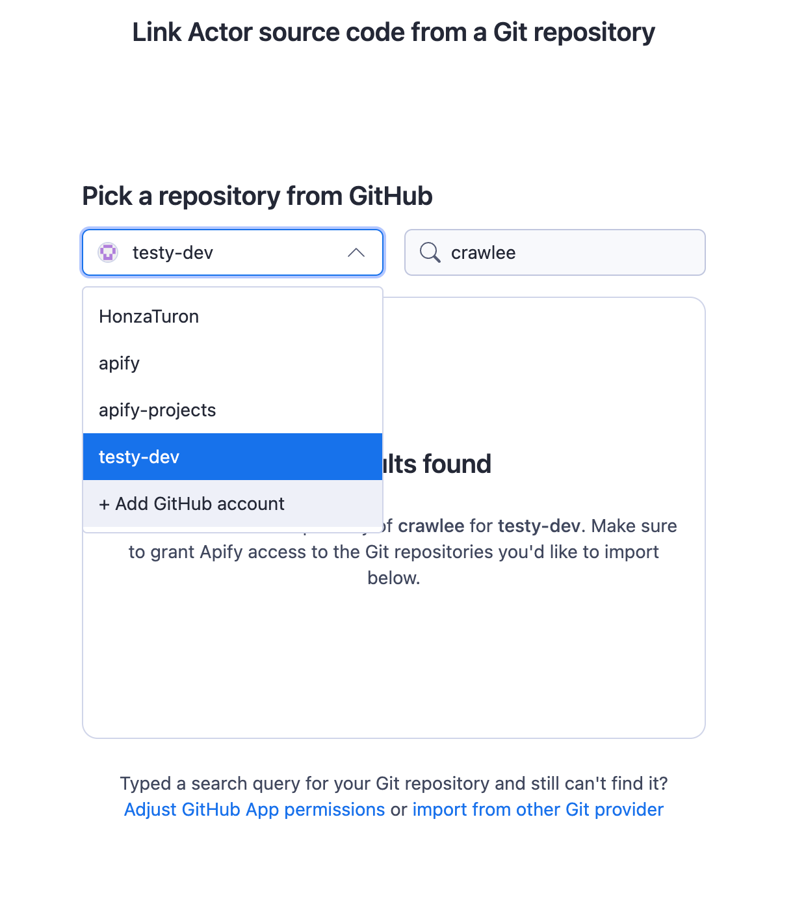
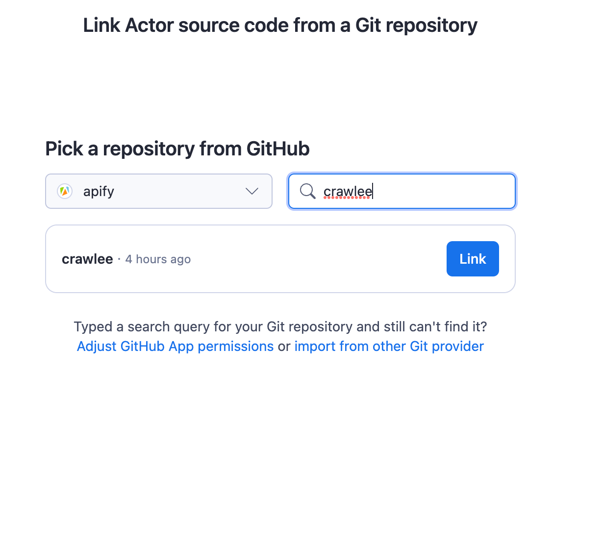

**Learn how to integrate your Apify Actors with GitHub. This article shows you several possible integrations.**

---

## Get started

To use the Apify integration for GitHub, you will need:

- An [Apify account](https://console.apify.com/).
- A GitHub repository.

### Create an Actor from a GitHub repository

Learn how to create an Actor from a GitHub repository. This is useful if you want to automatically deploy and build your code or push to your GitHub repository.

Selecting _Link Git repository_ will open a new modal to select a provider to use.
Selecting _GitHub_ will open a new window with GitHub authentication and select a GitHub repository.

To link an account, click on _Add GitHub account_ and follow the instructions on github.com. Certain organizations or users can be selected.

You can switch among all authorized users and organizations.

If the required repository is missing, try finding it with _Search_.

An Actor is created immediately from the selected repository.

### Deploy changes automatically

<iframe src="https://www.youtube-nocookie.com/embed/8QJetr-BYdQ" title="YouTube video player" frameborder="0" allow="accelerometer; autoplay; clipboard-write; encrypted-media; gyroscope; picture-in-picture; web-share" allowfullscreen></iframe>

### Create an issue when a run fails

<iframe src="https://www.youtube-nocookie.com/embed/jZUp-rRbayc" title="YouTube video player" frameborder="0" allow="accelerometer; autoplay; clipboard-write; encrypted-media; gyroscope; picture-in-picture; web-share" allowfullscreen></iframe>

